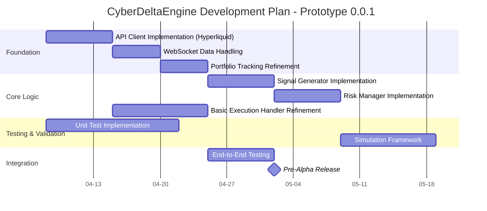
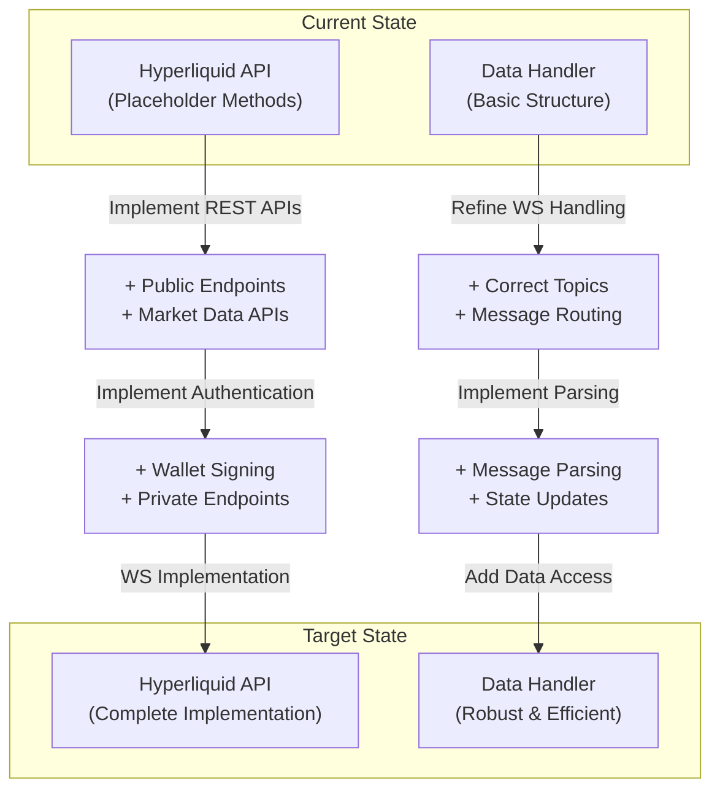
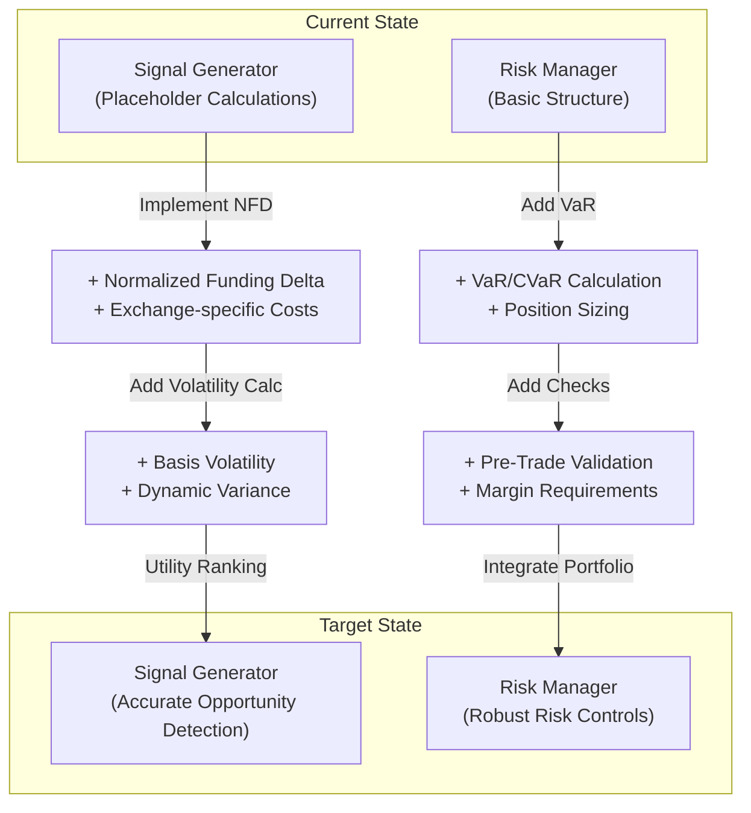
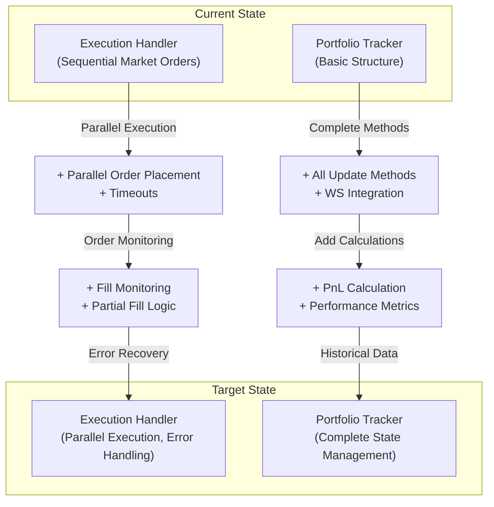
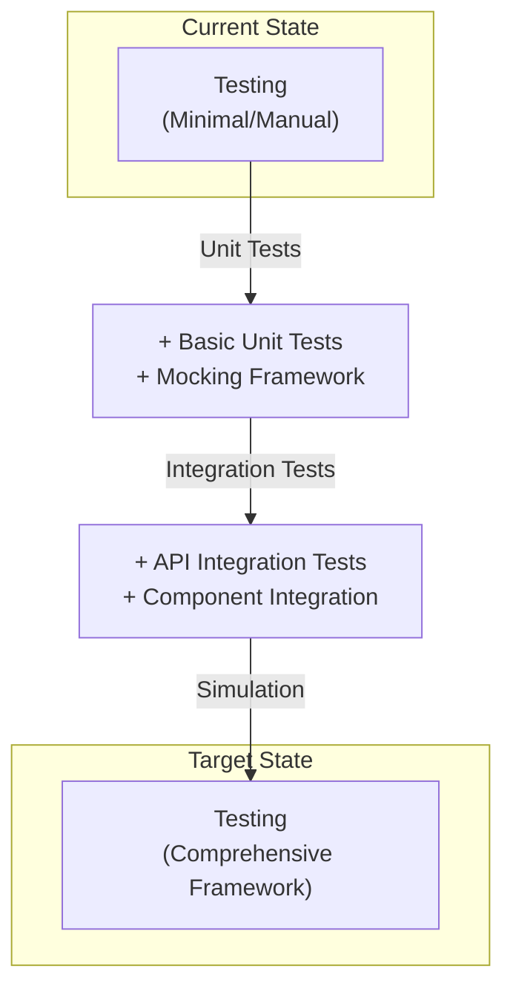

# CyberDeltaEngine - Prototype 0.0.1 Workflow Plan

This document outlines the next steps for developing the CyberDeltaEngine from its current prototype state to a functional minimum viable product (MVP). It includes prioritized tasks, implementation details, and visualizations of both current and target states.

## Current State Assessment (Enhanced)

The project has established a solid foundation with:
- Core component architecture defined and prototyped
- Basic orchestration in `main.py` 
- Data models in `core/models.py`
- Hyperliquid API client (partial implementation)
- Core components with placeholder functionality

### Component Status Details

- **Configuration (`config/settings.py`)**: **Implemented.** Loads configuration from `config.yaml` and secrets from `.env`. Provides access methods (`get_strategy_params`, `get_secret`, etc.) and basic error handling for missing files/keys.
- **Logging (`utils/logging_config.py`)**: **Implemented.** `setup_logging` function configures Python's logging based on settings. Supports console and rotating file output. Basic suppression for noisy libraries included.
- **Core Data Models (`core/models.py`)**: **Implemented.** Essential dataclasses defined (e.g., `Ticker`, `OrderBook`, `Order`, `Position`, `Balance`, `ArbitrageOpportunity`). May need refinement as exchange-specific details emerge.
- **API Base Class (`apis/base.py`)**: **Implemented.** `ExchangeAPI` ABC provides structure for REST requests (`_request`), WebSocket handling (connect, listen, route), and defines the required interface for specific clients. Includes basic `aiohttp` session management.
- **Hyperliquid API Client (`apis/hyperliquid.py`)**: **Partial Prototype.** Inherits `ExchangeAPI`. WS routing structure exists. `fetch_funding_rate` has a *placeholder* implementation using the assumed `/info` POST endpoint and assumed response structure. **TODO:** Implement actual REST/WS logic, parsing for all endpoints, and robust wallet signing (`_sign_request`).
- **Data Handler (`core/data_handler.py`)**: **Prototype.** `DataHandler` class structure exists. `subscribe_to_streams` attempts subscriptions using *example* topic names. Message handlers (`_handle_ticker_message`) have *placeholder parsing logic*. **TODO:** Implement correct topic names per exchange, implement robust parsing logic for WS messages, integrate tightly with API client WebSocket routing, potentially add caching/data access improvements.
- **Portfolio Tracker (`core/portfolio_tracker.py`)**: **Prototype.** Holds state dictionaries. `update_*` methods exist with basic locking. `load_initial_state` calls API client methods which are currently *not implemented*. **TODO:** Implement actual state updates from WS user streams (ideal) or reliable polling, add PnL calculation logic and history.
- **Signal Generator (`core/signal_generator.py`)**: **Prototype.** `SignalGenerator` calculates `ArbitrageOpportunity` objects periodically. Uses *placeholder calculations* for NFD, costs, volatility, and Utility. Fetches data via *direct, suboptimal, unsafe API calls*. **TODO:** Implement correct mathematical formulas from docs, use `DataHandler` for efficient data access, estimate costs/slippage properly.
- **Risk Manager (`core/risk_manager.py`)**: **Prototype.** `RiskManager` structure exists. Performs checks using *placeholder logic* for dynamic VaR, Kelly sizing, margin constraints, and pre-trade risk. **TODO:** Implement actual VaR/CVaR calculations, portfolio Kelly sizing, margin requirement estimation, collateral transfer constraint checks.
- **Execution Handler (`core/execution_handler.py`)**: **Basic Prototype.** `ExecutionHandler` takes opportunities and places orders sequentially using *basic market orders*. **High legging risk.** **TODO:** Implement robust, near-atomic execution (parallel placement, limit orders, IOC/FOK), partial fill handling, slippage checks, error compensation logic.
- **Adaptation Loop (`core/adaptation_loop.py`)**: **Stub.** `AdaptationLoop` class structure exists. Runs periodically but uses *placeholder logic* for performance metric calculation and parameter adjustment. **TODO:** Implement actual performance metric calculation (requires PnL history from `PortfolioTracker`), implement mechanism to safely modify parameters in relevant live components (e.g., `RiskManager`).
- **Main Application (`main.py`)**: **Implemented.** Initializes components, handles startup/shutdown, runs component tasks (`DataHandler`, `PortfolioTracker`, `StrategyLoop`, `AdaptationLoop`), orchestrates the basic Signal -> Risk -> Execute flow. Error handling for component failures needs refinement.

### Critical Gaps and Challenges

- API clients need complete implementation with proper exchange-specific details
- Data handling needs robust WebSocket support and proper parsing
- Signal generation uses placeholder calculations instead of actual formulas
- Risk management lacks proper VaR/CVaR and position sizing implementation
- Execution handling is sequential with high legging risk
- No automated collateral management is implemented
- Limited testing infrastructure

### Open Questions & Challenges (Critical)

- **API Specifics:** *Critical priority.* Need exact WS topic names, auth methods (HL/PX signing details, BP timestamp/window rules), rate limit details per endpoint, specific error code meanings, order placement parameter nuances (e.g., time-in-force options, post-only), withdrawal parameters (networks, fees, memos).
- **Wallet Interaction:** Secure storage and use of private keys. Choosing appropriate libraries (`eth_account` for EVM, StarkNet libraries for Paradex). Handling nonce management for DEX transactions.
- **Data Synchronization/Latency:** Measuring and potentially mitigating latency differences between exchanges. Handling stale data during NFD calculation. Impact of clock skew.
- **Execution Atomicity:** Designing robust execution logic (e.g., using check-then-execute pattern, timeouts, rapid cancellation) to minimize risk of getting only one leg filled, especially during high volatility.
- **Error Handling & Recovery:** Defining specific recovery procedures for different failures (API errors, disconnects, failed orders, stuck transfers, calculation errors). Implementing state persistence/recovery on restart.
- **Resource Management:** Monitoring memory/CPU usage, managing number of concurrent `asyncio` tasks, optimizing `aiohttp` session usage.

## Prioritized Development Workflow



## Development Tracks

### Track 1: API Client & Data Handler Refinement

**Priority: HIGH**



**Key Tasks:**
1. **Hyperliquid API Client**
   - Implement wallet signing using eth_account (`apis/hyperliquid.py`)
   - Complete public market data endpoints (`fetch_ticker`, `fetch_orderbook`, etc.)
   - Implement private account endpoints (`get_balances`, `get_positions`, etc.)
   - Implement WebSocket connection, message parsing and routing
   - Add robust error handling and rate limiting

2. **Data Handler**
   - Implement correct topic subscription for each exchange
   - Develop robust message parsing for various WebSocket data types
   - Create efficient internal data structures for quick access
   - Add methods for components to safely access latest data
   - Implement proper thread-safe state updates

**Success Criteria:**
- Hyperliquid API client can fetch all needed data and execute orders
- Data Handler successfully maintains up-to-date internal state
- Components can access latest market data efficiently

### Track 2: Signal Generation & Risk Management

**Priority: HIGH**



**Key Tasks:**
1. **Signal Generator**
   - Implement correct Normalized Funding Delta (NFD) calculation
   - Add exchange-specific cost modeling and slippage estimation
   - Implement basis volatility calculation
   - Create utility ranking function for opportunity prioritization
   - Refactor to use Data Handler for efficient data access

2. **Risk Manager** 
   - Implement portfolio VaR calculation with covariance matrix
   - Develop position sizing logic using fractional Kelly criterion
   - Add margin requirement estimation for each exchange
   - Implement pre-trade validation checks
   - Design integration with Portfolio Tracker for up-to-date state

**Success Criteria:**
- Signal Generator correctly identifies and ranks arbitrage opportunities
- Risk Manager appropriately sizes and filters opportunities based on portfolio state
- Integration between components is efficient and robust

### Track 3: Execution Handler & Portfolio Tracking

**Priority: MEDIUM-HIGH**



**Key Tasks:**
1. **Execution Handler**
   - Implement parallel leg placement for cross-exchange trades
   - Use limit orders with appropriate timeouts and parameters
   - Add monitoring of order status via WebSocket/polling
   - Implement partial fill handling logic
   - Develop robust error handling and compensation strategies

2. **Portfolio Tracker**
   - Complete all state update methods
   - Integrate WebSocket feeds for real-time position/balance updates
   - Implement PnL calculation (realized/unrealized)
   - Store historical state data
   - Add performance metrics calculation

**Success Criteria:**
- Execution Handler can place orders on multiple exchanges with minimal time difference
- Portfolio Tracker maintains accurate and complete state information
- System can recover gracefully from partial fills and other execution anomalies

### Track 4: Testing Infrastructure

**Priority: HIGH**



**Key Tasks:**
1. **Unit Testing**
   - Set up pytest infrastructure with fixtures
   - Implement mocking framework for API responses
   - Create unit tests for core algorithms and calculations
   - Add parametrized tests for different market conditions

2. **Integration Testing**
   - Develop tests that verify component interactions
   - Create API integration tests with controlled responses
   - Implement WebSocket simulation for testing data flow
   - Test full signal -> risk -> execution flow

3. **Simulation Framework**
   - Design market data replay mechanism
   - Create simulated exchange environment
   - Implement execution simulation with configurable latency/slippage
   - Test with historical scenarios

**Success Criteria:**
- Comprehensive test suite with >80% code coverage
- Ability to simulate various market conditions and edge cases
- CI/CD pipeline for automated testing

## Current Workflow Diagram (From Progress Report)

```mermaid
flowchart TD
    subgraph Main Orchestration [main.py: TradingBot]
        direction LR
        Init(Initialize Components) --> RunTasks(Run Async Tasks)
        RunTasks --> StrategyLoopTask[(Strategy Loop Task)]
        RunTasks --> DataHandlerTask[(Data Handler Task)]
        RunTasks --> PortfolioTrackerTask[(Portfolio Tracker Task)]
        RunTasks --> AdaptationLoopTask[(Adaptation Loop Task)]
        SignalHandler[Signal Handler (Ctrl+C)] -.-> StopBot(Stop Method)
        StrategyLoopTask -- Failure --> StopBot
        StopBot --> CancelTasks(Cancel Tasks)
        StopBot --> CloseAPIs(Close API Clients)
    end

    subgraph Strategy Loop [TaskSL: _strategy_loop]
       direction TB
       SL_Start{Start Cycle} --> SG_Run(Call SignalGenerator.run)
       SG_Run -- Yields List<Opp> --> Assess(Assess Opportunities?)
       Assess -- Yes --> RM_Assess(Call RiskManager.assess_and_filter)
       RM_Assess -- Returns ViableOpp[] --> ExecuteCheck{Any Viable?}
       ExecuteCheck -- Yes --> EH_Exec(Call ExecutionHandler.execute)
       EH_Exec --> Cooldown(Wait Cooldown)
       Cooldown --> SL_Start
       ExecuteCheck -- No --> SL_Start
       Assess -- No --> SL_Start
    end

    subgraph Data Handling [TaskDH: DataHandler]
        direction TB
        DH_Run(Run Method) --> DH_Sub(Subscribe to Streams)
        DH_Sub --> API_Sub(Call APIClient.subscribe)
        API_Sub --> WS_Listen(API Client WS Listener)
        WS_Listen -- WS Msg --> DH_Route(Call DH Message Handler)
        DH_Route -- Parses --> UpdateState(Update Internal State e.g., self.tickers)
        DH_Run -. Waits .-> StopEventDH(Stop Event)
    end

    subgraph State Tracking [TaskPT: PortfolioTracker]
         direction TB
         PT_Run(Run Method) --> PT_Load(Load Initial State)
         PT_Load --> API_Fetch(Call APIClient.get_balances etc.)
         API_Fetch --> PT_UpdateInitial(Update Internal State)
         PT_Run -. Waits .-> StopEventPT(Stop Event)
         # Ideal future: WS_UserStream --> PT_UpdateLive(Live Update State)
    end

    # Component Interactions
    SG_Run --> DataHandlerTask # Reads data
    RM_Assess --> PortfolioTrackerTask # Reads state
    EH_Exec --> PortfolioTrackerTask # Updates order state
    EH_Exec --> API_Clients # Places orders
    AdaptationLoopTask --> PortfolioTrackerTask # Reads state (for PnL)
    AdaptationLoopTask -.-> RM_Assess # Modifies params (future)

    API_Clients[API Clients] <--> Exchanges[(Exchanges HL, BP, PX)]

    style Init fill:#f9f
    style RunTasks fill:#f9f
    style StrategyLoopTask fill:#fff
    style DataHandlerTask fill:#ccf
    style PortfolioTrackerTask fill:#eee
    style AdaptationLoopTask fill:#ddf
```

## Target Architecture (Refined)

```mermaid
graph TD
    subgraph Core Engine
        Orchestrator[main.py Orchestrator]
        
        subgraph Data Processing
            DH[Data Handler]
            PT[Portfolio Tracker]
        end
        
        subgraph Strategy Logic
            SG[Signal Generator]
            RM[Risk Manager]
        end
        
        subgraph Execution
            EH[Execution Handler]
            CM[Collateral Manager]
        end
        
        AL[Adaptation Loop]
    end
    
    subgraph Exchange APIs
        HL[Hyperliquid API]
        BP[Backpack API]
        PD[Paradex API]
    end
    
    subgraph External Tools
        Tests[Test Suite]
        CLI[CLI Monitor]
    end
    
    % Core Component Relationships
    Orchestrator --> DH
    Orchestrator --> SG
    Orchestrator --> RM
    Orchestrator --> EH
    Orchestrator --> PT
    Orchestrator --> AL
    
    % Data Flow
    DH --> SG
    DH --> RM
    DH --> PT
    
    SG --> Orchestrator
    RM --> Orchestrator
    EH --> Orchestrator
    
    % Exchange Interactions
    DH <--> HL
    DH <--> BP
    DH <--> PD
    
    EH <--> HL
    EH <--> BP
    EH <--> PD
    
    PT <--> HL
    PT <--> BP
    PT <--> PD
    
    % External Interactions
    Tests --> Orchestrator
    CLI --> Orchestrator
    
    style Orchestrator fill:#f9f,stroke:#333,stroke-width:2px
    style DH fill:#ccf,stroke:#333,stroke-width:1px
    style SG fill:#cfc,stroke:#333,stroke-width:1px
    style RM fill:#fcc,stroke:#333,stroke-width:1px
    style EH fill:#cff,stroke:#333,stroke-width:1px
    style PT fill:#eee,stroke:#333,stroke-width:1px
    style AL fill:#ddf,stroke:#333,stroke-width:1px
```

## Implementation Milestones

### Milestone 1: Single Exchange Functionality
**Target Date: 2025-04-22**
- Complete Hyperliquid API client
- Implement robust Data Handler for Hyperliquid
- Develop accurate Signal Generator for single-exchange funding opportunities
- Basic risk controls and position sizing
- Sequential execution with proper monitoring
- Basic Portfolio Tracker functionality

### Milestone 2: Multi-Exchange Integration
**Target Date: 2025-05-06**
- Implement secondary exchange API client (Backpack)
- Extend Data Handler for multi-exchange support
- Enhance Signal Generator for cross-exchange opportunities
- Implement parallel execution with error handling
- Add robust risk controls including VaR/CVaR

### Milestone 3: Complete MVP
**Target Date: 2025-05-20**
- Implement Paradex API client
- Add collateral management logic
- Develop adaptation loop metrics
- Complete test suite
- Basic monitoring interface
- Documentation for deployment

## Technical Challenges & Decisions

### 1. WebSocket Management
**Challenge:** Maintaining robust WebSocket connections to multiple exchanges with different protocols.
**Decision:** 
- Use a common base class with exchange-specific handlers
- Implement automatic reconnection with exponential backoff
- Add circuit breakers for repeated failures

### 2. Execution Atomicity
**Challenge:** Minimizing legging risk in cross-exchange trades.
**Decision:**
- Implement parallel order placement
- Use appropriate order types (IOC, FOK where available)
- Add pre-execution risk checks for market volatility
- Develop robust compensation strategies for partial fills

### 3. State Management
**Challenge:** Maintaining accurate portfolio state across exchanges.
**Decision:**
- Start with in-memory state in the Portfolio Tracker
- Consider Redis integration for persistence in Phase 2
- Implement reconciliation with exchange APIs on restart

### 4. Testing Strategy
**Challenge:** Testing exchange interactions without live trading.
**Decision:**
- Create robust mocking framework for API responses
- Develop a market simulator for end-to-end testing
- Implement exchange-specific edge cases in tests

## Next Meeting Agenda

1. **API Client Implementation**
   - Review Hyperliquid API details
   - Discuss authentication and signing approach
   - Plan WebSocket implementation

2. **Core Logic Refinement**
   - Review mathematical formulas for NFD and utility ranking
   - Discuss risk management approach and VaR calculation
   - Plan execution handler improvements

3. **Testing Strategy**
   - Define unit test coverage goals
   - Plan integration testing approach
   - Discuss simulation requirements 