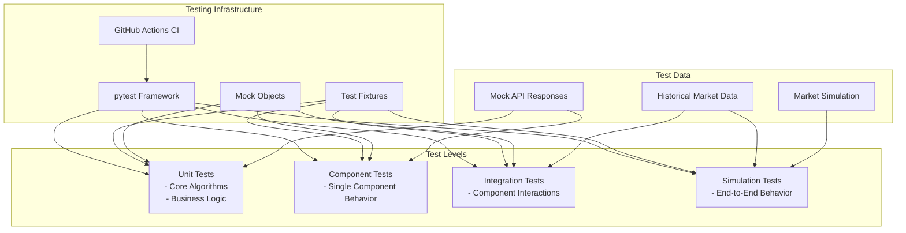

# Testing Strategy - Prototype 0.0.1

This document outlines the testing approach for the CyberDeltaEngine's initial prototype stage, focusing on establishing the right testing infrastructure and ensuring core logic is well-tested.

## Testing Goals

For prototype 0.0.1, our testing goals are:

1. **Verify Core Logic Correctness** - Ensure mathematical formulas, risk calculations, and business logic work as expected
2. **Validate API Integration** - Test that API clients correctly interact with exchange interfaces
3. **Establish Testing Infrastructure** - Set up the foundation for comprehensive testing as the system grows
4. **Enable Safe Iteration** - Allow developers to refactor and improve code with confidence

## Testing Architecture



## Testing Tools and Setup

### Core Tools

1. **pytest** - Primary testing framework
   - asyncio support via `pytest-asyncio`
   - Fixtures for common test setup
   - Parametrization for data-driven tests

2. **pytest-mock** - Mocking framework
   - Mock external dependencies
   - Control behavior of API responses
   - Simulate various scenarios

3. **pytest-cov** - Coverage reporting
   - Track test coverage per component
   - Identify untested code paths
   - Generate coverage reports in CI

### Directory Structure

```
tests/
  ├── conftest.py                  # Shared fixtures
  ├── fixtures/                    # Test data fixtures
  │    ├── api_responses/          # Mock API responses
  │    ├── market_data/            # Sample market data
  │    └── config_samples/         # Test configurations
  ├── unit/                        # Unit tests
  │    ├── apis/                   # API client tests
  │    └── core/                   # Core component tests
  ├── integration/                 # Integration tests
  │    ├── data_flow/              # Data propagation tests
  │    └── component_interaction/  # Multi-component tests
  └── simulation/                  # End-to-end simulation tests
      ├── exchange_simulator.py    # Mock exchange implementation
      ├── market_scenarios/        # Predefined market scenarios
      └── test_scenarios.py        # Scenario-based tests
```

## Unit Testing Approach

Unit tests will focus on testing individual functions and methods in isolation, with dependencies mocked. Key areas for unit testing include:

### API Client Testing

```python
# tests/unit/apis/test_hyperliquid_api.py

async def test_sign_request(mocker):
    """Test signing logic for Hyperliquid API requests."""
    # Arrange
    mock_private_key = "0x1234567890abcdef1234567890abcdef1234567890abcdef1234567890abcdef"
    api = HyperliquidAPI(api_config={"base_url": "https://api.hyperliquid.xyz"}, 
                         secrets={"HYPERLIQUID_WALLET_PRIVATE_KEY": mock_private_key})
    
    # Act
    signed_payload = api._sign_request("POST", "/exchange", {"action": "place_order"})
    
    # Assert
    assert "signature" in signed_payload
    assert "timestamp" in signed_payload
    # Additional validation of signature format

async def test_fetch_funding_rate(mocker):
    """Test fetching funding rates from Hyperliquid."""
    # Arrange
    mock_response = {"success": True, "data": {"funding": 0.0001}}
    mock_session = mocker.patch.object(aiohttp.ClientSession, "post")
    mock_session.return_value.__aenter__.return_value.json.return_value = mock_response
    
    api = HyperliquidAPI(api_config={"base_url": "https://api.hyperliquid.xyz"})
    
    # Act
    funding_rate = await api.fetch_funding_rate("BTC-PERP")
    
    # Assert
    assert funding_rate == 0.0001
    mock_session.assert_called_once()
```

### Core Logic Testing

```python
# tests/unit/core/test_signal_generator.py

def test_calculate_nfd(mocker):
    """Test NFD calculation with mock funding rates."""
    # Arrange
    data_handler = mocker.Mock()
    data_handler.get_funding_rate.side_effect = lambda exchange, symbol: {
        ("hyperliquid", "BTC-PERP"): 0.0001,  # 0.01% hourly
        ("backpack", "BTC-PERP"): -0.0002     # -0.02% hourly
    }.get((exchange, symbol))
    
    signal_gen = SignalGenerator(data_handler=data_handler, api_clients={})
    
    # Act
    nfd = signal_gen._calculate_nfd("hyperliquid", "backpack", "BTC-PERP")
    
    # Assert
    # NFD = (0.0001 - (-0.0002)) / (1/24) = 0.0003 * 24 = 0.0072 (0.72% daily)
    assert abs(nfd - 0.0072) < 0.0001

# tests/unit/core/test_risk_manager.py

def test_position_sizing_with_kelly(mocker):
    """Test position sizing with Kelly criterion."""
    # Arrange
    portfolio_tracker = mocker.Mock()
    portfolio_tracker.calculate_portfolio_value.return_value = 100000
    
    risk_manager = RiskManager(portfolio_tracker=portfolio_tracker)
    opportunity = ArbitrageOpportunity(
        opportunity_id="test",
        exchange1="hyperliquid",
        exchange2="backpack",
        symbol="BTC-PERP",
        nfd=0.0072,          # 0.72% daily
        cost_estimate=0.001, # 0.1%
        volatility=0.02,     # 2% daily vol
        utility=0.0062       # 0.62% expected profit
    )
    
    # Act
    size = risk_manager._calculate_position_size(opportunity)
    
    # Assert
    # Kelly formula with fractional (0.25) sizing
    expected_size = 0.25 * 100000 * (0.0062 / 0.02) # ~7750
    assert abs(size - expected_size) < 100
```

## Integration Testing Approach

Integration tests will verify how components work together, with minimal mocking. Key areas include:

### Data Flow Testing

```python
# tests/integration/data_flow/test_data_handler_to_signal_generator.py

async def test_data_flow_from_handler_to_signal_generator(mocker):
    """Test that data flows correctly from DataHandler to SignalGenerator."""
    # Arrange
    # Mock API client that returns predefined responses
    mock_api = MockHyperliquidAPI()
    mock_api.configure_responses({
        "funding_rate": 0.0001,
        "orderbook": sample_orderbook_data,
        "ticker": sample_ticker_data
    })
    
    # Create real components with mock API
    data_handler = DataHandler(api_clients={"hyperliquid": mock_api})
    signal_generator = SignalGenerator(data_handler=data_handler, api_clients={"hyperliquid": mock_api})
    
    # Act
    # Start data handler and wait for initial data
    await data_handler.subscribe_to_streams()
    await asyncio.sleep(0.1)  # Allow time for processing
    
    # Generate signals
    opportunities = await signal_generator.generate_opportunities()
    
    # Assert
    assert len(opportunities) > 0
    # Verify signal generator used data from data handler
    assert opportunities[0].nfd is not None
```

### Component Interaction Testing

```python
# tests/integration/component_interaction/test_signal_to_risk_to_execution.py

async def test_opportunity_flow_through_components(mocker):
    """Test opportunity flowing from signal generation through risk assessment to execution."""
    # Arrange
    mock_apis = {
        "hyperliquid": MockHyperliquidAPI(),
        "backpack": MockBackpackAPI()
    }
    
    # Configure mock APIs with test responses
    for api in mock_apis.values():
        api.configure_responses(...)
    
    # Create real components with mock APIs
    data_handler = DataHandler(api_clients=mock_apis)
    portfolio_tracker = PortfolioTracker(api_clients=mock_apis)
    signal_generator = SignalGenerator(data_handler=data_handler, api_clients=mock_apis)
    risk_manager = RiskManager(portfolio_tracker=portfolio_tracker)
    execution_handler = ExecutionHandler(api_clients=mock_apis, portfolio_tracker=portfolio_tracker)
    
    # Act
    # Initialize components
    await data_handler.subscribe_to_streams()
    await portfolio_tracker.load_initial_state()
    
    # Generate opportunities
    opportunities = await signal_generator.generate_opportunities()
    
    # Assess opportunities
    viable_opportunities = await risk_manager.assess_and_filter_opportunities(opportunities)
    
    # Execute top opportunity if any
    execution_result = None
    if viable_opportunities:
        execution_result = await execution_handler.execute_opportunity(viable_opportunities[0])
    
    # Assert
    assert len(opportunities) > 0
    assert len(viable_opportunities) > 0
    assert execution_result is not None
    assert execution_result.success
    # Verify portfolio was updated
    assert portfolio_tracker.get_position("hyperliquid", "BTC-PERP") is not None
```

## Simulation Testing Approach

Simulation tests will create a controlled environment to test complete system behavior:

```python
# tests/simulation/test_scenarios.py

async def test_funding_arbitrage_scenario():
    """Test complete system behavior with a simulated funding arbitrage opportunity."""
    # Arrange
    # Create simulated exchanges
    exchanges = {
        "hyperliquid": ExchangeSimulator(
            initial_funding_rates={"BTC-PERP": 0.0001},
            initial_balances={"USDC": 50000},
            orderbook_depth={"BTC-PERP": moderate_liquidity_orderbook}
        ),
        "backpack": ExchangeSimulator(
            initial_funding_rates={"BTC-PERP": -0.0002},
            initial_balances={"USDC": 50000},
            orderbook_depth={"BTC-PERP": moderate_liquidity_orderbook}
        )
    }
    
    # Configure API clients to use simulators
    api_clients = {
        name: simulator.get_api_client() 
        for name, simulator in exchanges.items()
    }
    
    # Create real system components
    trading_bot = TradingBot()
    trading_bot.api_clients = api_clients
    
    # Act
    # Initialize and start the bot
    await trading_bot.initialize()
    start_task = asyncio.create_task(trading_bot.start())
    
    # Run for a simulated period (e.g., 1 hour)
    await asyncio.sleep(0.5)  # Simulated time
    
    # Stop the bot
    await trading_bot.stop()
    await start_task
    
    # Assert
    # Check if positions were taken
    hyperliquid_position = trading_bot.portfolio_tracker.get_position("hyperliquid", "BTC-PERP")
    backpack_position = trading_bot.portfolio_tracker.get_position("backpack", "BTC-PERP")
    
    assert hyperliquid_position is not None
    assert backpack_position is not None
    # Verify positions are in opposite directions
    assert (hyperliquid_position.size > 0 and backpack_position.size < 0) or \
           (hyperliquid_position.size < 0 and backpack_position.size > 0)
```

## Test Fixtures

Key fixtures will include:

1. **API Response Fixtures**
   - Sample responses for each API endpoint
   - Different market conditions (normal, volatile, extreme)
   - Error responses

2. **Mock API Clients**
   - Configurable behavior for testing different scenarios
   - Response timing control (latency simulation)
   - Error injection capability

3. **Market Data Fixtures**
   - Orderbook snapshots with different liquidity profiles
   - Funding rate scenarios
   - Historical price data

## CI/CD Integration

We will use GitHub Actions for continuous integration:

```yaml
# .github/workflows/tests.yml
name: Tests

on:
  push:
    branches: [ main ]
  pull_request:
    branches: [ main ]

jobs:
  test:
    runs-on: ubuntu-latest
    
    steps:
    - uses: actions/checkout@v3
    
    - name: Set up Python
      uses: actions/setup-python@v4
      with:
        python-version: '3.10'
        
    - name: Install dependencies
      run: |
        python -m pip install --upgrade pip
        pip install -r requirements.txt
        pip install -r requirements-dev.txt
        
    - name: Run tests
      run: |
        pytest --cov=cyberdelta tests/
        
    - name: Upload coverage report
      uses: codecov/codecov-action@v3
```

## Implementation Plan - Testing

### Phase 1: Basic Structure (Week 1)
- Set up pytest configuration
- Create initial fixtures
- Implement basic unit tests for core calculations
- Set up GitHub Actions CI

### Phase 2: Unit Test Coverage (Weeks 1-3)
- Implement unit tests for all mathematical formulas
- Test API client request formatting and parsing
- Test core business logic in each component

### Phase 3: Integration Tests (Weeks 3-4)
- Implement tests for component interactions
- Test data flow between components
- Verify state management

### Phase 4: Simulation Framework (Weeks 4-5)
- Develop exchange simulator
- Create market scenario generator
- Implement end-to-end simulation tests

## Success Criteria - Testing

1. **Coverage Targets**
   - Core logic: >90% line coverage
   - API clients: >80% line coverage
   - Overall: >75% line coverage

2. **Test Suite Performance**
   - Unit tests run in <30 seconds
   - Full test suite runs in <3 minutes

3. **Quality Metrics**
   - No flaky tests (tests with inconsistent results)
   - Clear test names and documentation
   - Comprehensive assertions 