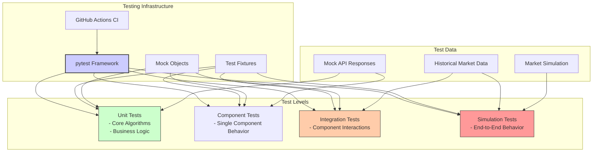
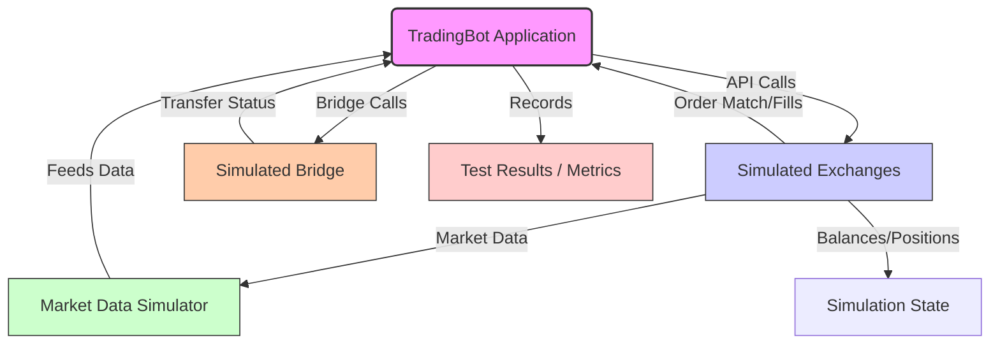
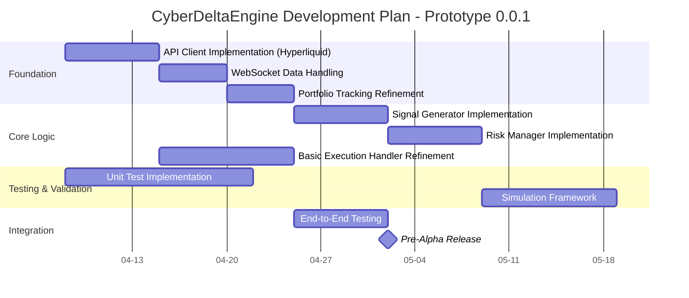

# CyberDeltaEngine - Workflow Diagrams

This document contains visual representations of the CyberDeltaEngine's architecture, workflow, and interactions between components, illustrating both the current state and the target state for Prototype 0.0.1.

## Current Application Workflow

This diagram represents the current state of the application based on the existing implementation:

```mermaid
flowchart TD
    subgraph Main Orchestration [main.py: TradingBot]
        direction LR
        Init(Initialize Components) --> RunTasks(Run Async Tasks)
        RunTasks --> StrategyLoopTask[(Strategy Loop Task)]
        RunTasks --> DataHandlerTask[(Data Handler Task)]
        RunTasks --> PortfolioTrackerTask[(Portfolio Tracker Task)]
        RunTasks --> AdaptationLoopTask[(Adaptation Loop Task)]
        SignalHandler[Signal Handler (Ctrl+C)] -.-> StopBot(Stop Method)
        StrategyLoopTask -- Failure --> StopBot
        StopBot --> CancelTasks(Cancel Tasks)
        StopBot --> CloseAPIs(Close API Clients)
    end

    subgraph Strategy Loop [TaskSL: _strategy_loop]
       direction TB
       SL_Start{Start Cycle} --> SG_Run(Call SignalGenerator.run)
       SG_Run -- Yields List<Opp> --> Assess(Assess Opportunities?)
       Assess -- Yes --> RM_Assess(Call RiskManager.assess_and_filter)
       RM_Assess -- Returns ViableOpp[] --> ExecuteCheck{Any Viable?}
       ExecuteCheck -- Yes --> EH_Exec(Call ExecutionHandler.execute)
       EH_Exec --> Cooldown(Wait Cooldown)
       Cooldown --> SL_Start
       ExecuteCheck -- No --> SL_Start
       Assess -- No --> SL_Start
    end

    subgraph Data Handling [TaskDH: DataHandler]
        direction TB
        DH_Run(Run Method) --> DH_Sub(Subscribe to Streams)
        DH_Sub --> API_Sub(Call APIClient.subscribe)
        API_Sub --> WS_Listen(API Client WS Listener)
        WS_Listen -- WS Msg --> DH_Route(Call DH Message Handler)
        DH_Route -- Parses --> UpdateState(Update Internal State e.g., self.tickers)
        DH_Run -. Waits .-> StopEventDH(Stop Event)
    end

    subgraph State Tracking [TaskPT: PortfolioTracker]
         direction TB
         PT_Run(Run Method) --> PT_Load(Load Initial State)
         PT_Load --> API_Fetch(Call APIClient.get_balances etc.)
         API_Fetch --> PT_UpdateInitial(Update Internal State)
         PT_Run -. Waits .-> StopEventPT(Stop Event)
         # Ideal future: WS_UserStream --> PT_UpdateLive(Live Update State)
    end

    # Component Interactions
    SG_Run --> DataHandlerTask # Reads data
    RM_Assess --> PortfolioTrackerTask # Reads state
    EH_Exec --> PortfolioTrackerTask # Updates order state
    EH_Exec --> API_Clients # Places orders
    AdaptationLoopTask --> PortfolioTrackerTask # Reads state (for PnL)
    AdaptationLoopTask -.-> RM_Assess # Modifies params (future)

    API_Clients[API Clients] <--> Exchanges[(Exchanges HL, BP, PX)]

    style Init fill:#f9f
    style RunTasks fill:#f9f
    style StrategyLoopTask fill:#fff
    style DataHandlerTask fill:#ccf
    style PortfolioTrackerTask fill:#eee
    style AdaptationLoopTask fill:#ddf
```

## Target Component Architecture

This diagram shows the target architecture for Prototype 0.0.1, illustrating the relationships between core components:

```mermaid
graph TD
    subgraph Core Engine
        Orchestrator[main.py Orchestrator]
        
        subgraph Data Processing
            DH[Data Handler]
            PT[Portfolio Tracker]
        end
        
        subgraph Strategy Logic
            SG[Signal Generator]
            RM[Risk Manager]
        end
        
        subgraph Execution
            EH[Execution Handler]
            CM[Collateral Manager]
        end
        
        AL[Adaptation Loop]
    end
    
    subgraph Exchange APIs
        HL[Hyperliquid API]
        BP[Backpack API]
        PD[Paradex API]
    end
    
    subgraph External Tools
        Tests[Test Suite]
        CLI[CLI Monitor]
    end
    
    % Core Component Relationships
    Orchestrator --> DH
    Orchestrator --> SG
    Orchestrator --> RM
    Orchestrator --> EH
    Orchestrator --> PT
    Orchestrator --> AL
    
    % Data Flow
    DH --> SG
    DH --> RM
    DH --> PT
    
    SG --> Orchestrator
    RM --> Orchestrator
    EH --> Orchestrator
    
    % Exchange Interactions
    DH <--> HL
    DH <--> BP
    DH <--> PD
    
    EH <--> HL
    EH <--> BP
    EH <--> PD
    
    PT <--> HL
    PT <--> BP
    PT <--> PD
    
    % External Interactions
    Tests --> Orchestrator
    CLI --> Orchestrator
    
    style Orchestrator fill:#f9f,stroke:#333,stroke-width:2px
    style DH fill:#ccf,stroke:#333,stroke-width:1px
    style SG fill:#cfc,stroke:#333,stroke-width:1px
    style RM fill:#fcc,stroke:#333,stroke-width:1px
    style EH fill:#cff,stroke:#333,stroke-width:1px
    style PT fill:#eee,stroke:#333,stroke-width:1px
    style AL fill:#ddf,stroke:#333,stroke-width:1px
```

## Detailed Component Architecture

This diagram provides a more detailed view of the internal structure and interactions of core components:

```mermaid
graph TD
    subgraph Core Engine [Python/Asyncio]
        Orchestrator(main.py Orchestrator) -- Manages --> DataHandler
        Orchestrator -- Manages --> SignalGenerator
        Orchestrator -- Manages --> RiskManager
        Orchestrator -- Manages --> CollateralManager
        Orchestrator -- Manages --> ExecutionHandler
        Orchestrator -- Manages --> PortfolioTracker
        Orchestrator -- Manages --> AdaptationLoop

        DataHandler(Data Handler) -- Feeds --> SignalGenerator
        DataHandler -- Feeds --> RiskManager
        DataHandler -- Feeds --> PortfolioTracker
        DataHandler -- Uses --> APIs

        SignalGenerator(Signal Generator) -- Generates Signals --> Orchestrator
        SignalGenerator -- Uses --> CoreModels[Data Models]

        RiskManager(Risk Manager) -- Provides Limits/Sizing --> Orchestrator
        RiskManager -- Requests Checks --> PortfolioTracker
        RiskManager -- Triggers --> CollateralManager
        RiskManager -- Uses --> CoreModels

        CollateralManager(Collateral Manager) -- Executes Transfers --> APIs
        CollateralManager -- Updates --> PortfolioTracker
        CollateralManager -- Uses --> APIs
        CollateralManager -- Uses --> CoreModels

        ExecutionHandler(Execution Handler) -- Executes Orders --> APIs
        ExecutionHandler -- Updates --> PortfolioTracker
        ExecutionHandler -- Uses --> APIs
        ExecutionHandler -- Uses --> CoreModels

        PortfolioTracker(Portfolio Tracker) -- Stores State --> StateDB[(In-Memory State)]
        PortfolioTracker -- Uses --> CoreModels

        AdaptationLoop(Adaptation Loop) -- Reads State --> PortfolioTracker
        AdaptationLoop -- Updates Params --> SignalGenerator
        AdaptationLoop -- Updates Params --> RiskManager
    end

    subgraph External Services
        APIs(Exchange & Bridge APIs) -- HTTP/WS --> HAPI[Hyperliquid API]
        APIs -- HTTP/WS --> BAPI[Backpack API]
        APIs -- HTTP/WS --> PAPI[Paradex API]
        APIs -- HTTP --> BridgeAPI[Bridge APIs]
    end

    subgraph Supporting Tools
        Config[YAML Config File]
        Env[\.env File (API Keys)]
        Logger[Logging Service]
    end

    Orchestrator -- Reads --> Config
    Orchestrator -- Reads --> Env
    Orchestrator -- Writes --> Logger
    DataHandler -- Writes --> Logger
    SignalGenerator -- Writes --> Logger
    RiskManager -- Writes --> Logger
    CollateralManager -- Writes --> Logger
    ExecutionHandler -- Writes --> Logger
    PortfolioTracker -- Writes --> Logger
    AdaptationLoop -- Writes --> Logger

    style Orchestrator fill:#f9f,stroke:#333,stroke-width:2px
    style DataHandler fill:#ccf,stroke:#333,stroke-width:1px
    style SignalGenerator fill:#cfc,stroke:#333,stroke-width:1px
    style RiskManager fill:#fcc,stroke:#333,stroke-width:1px
    style CollateralManager fill:#fec,stroke:#333,stroke-width:1px
    style ExecutionHandler fill:#cff,stroke:#333,stroke-width:1px
    style PortfolioTracker fill:#eee,stroke:#333,stroke-width:1px
    style AdaptationLoop fill:#ddf,stroke:#333,stroke-width:1px
    style APIs fill:#bbb,stroke:#333,stroke-width:1px
```

## Testing Infrastructure

This diagram illustrates the testing architecture and relationships between different test levels:



## Simulation Framework

This diagram shows the structure of the simulation framework for end-to-end testing:



## Development Tracks

This diagram illustrates the evolutionary path for key components in Prototype 0.0.1:

```mermaid
flowchart TB
    subgraph "Track 1: API & Data"
        subgraph "Current State 1"
            HL_API_Current["Hyperliquid API<br>(Placeholder Methods)"]
            DH_Current["Data Handler<br>(Basic Structure)"]
        end
        
        subgraph "Target State 1"
            HL_API_Target["Hyperliquid API<br>(Complete Implementation)"]
            DH_Target["Data Handler<br>(Robust & Efficient)"]
        end
        
        HL_API_Current -->|Implement REST APIs| HL_API_Mid1["+ Public Endpoints<br>+ Market Data APIs"]
        HL_API_Mid1 -->|Implement Authentication| HL_API_Mid2["+ Wallet Signing<br>+ Private Endpoints"]
        HL_API_Mid2 -->|WS Implementation| HL_API_Target
        
        DH_Current -->|Refine WS Handling| DH_Mid1["+ Correct Topics<br>+ Message Routing"]
        DH_Mid1 -->|Implement Parsing| DH_Mid2["+ Message Parsing<br>+ State Updates"]
        DH_Mid2 -->|Add Data Access| DH_Target
    end
    
    subgraph "Track 2: Strategy Logic"
        subgraph "Current State 2"
            SG_Current["Signal Generator<br>(Placeholder Calculations)"]
            RM_Current["Risk Manager<br>(Basic Structure)"]
        end
        
        subgraph "Target State 2"
            SG_Target["Signal Generator<br>(Accurate Opportunity Detection)"]
            RM_Target["Risk Manager<br>(Robust Risk Controls)"]
        end
        
        SG_Current -->|Implement NFD| SG_Mid1["+ Normalized Funding Delta<br>+ Exchange-specific Costs"]
        SG_Mid1 -->|Add Volatility Calc| SG_Mid2["+ Basis Volatility<br>+ Dynamic Variance"]
        SG_Mid2 -->|Utility Ranking| SG_Target
        
        RM_Current -->|Add VaR| RM_Mid1["+ VaR/CVaR Calculation<br>+ Position Sizing"]
        RM_Mid1 -->|Add Checks| RM_Mid2["+ Pre-Trade Validation<br>+ Margin Requirements"]
        RM_Mid2 -->|Integrate Portfolio| RM_Target
    end
    
    subgraph "Track 3: Execution & State"
        subgraph "Current State 3"
            EH_Current["Execution Handler<br>(Sequential Market Orders)"]
            PT_Current["Portfolio Tracker<br>(Basic Structure)"]
        end
        
        subgraph "Target State 3"
            EH_Target["Execution Handler<br>(Parallel Execution, Error Handling)"]
            PT_Target["Portfolio Tracker<br>(Complete State Management)"]
        end
        
        EH_Current -->|Parallel Execution| EH_Mid1["+ Parallel Order Placement<br>+ Timeouts"]
        EH_Mid1 -->|Order Monitoring| EH_Mid2["+ Fill Monitoring<br>+ Partial Fill Logic"]
        EH_Mid2 -->|Error Recovery| EH_Target
        
        PT_Current -->|Complete Methods| PT_Mid1["+ All Update Methods<br>+ WS Integration"]
        PT_Mid1 -->|Add Calculations| PT_Mid2["+ PnL Calculation<br>+ Performance Metrics"]
        PT_Mid2 -->|Historical Data| PT_Target
    end
```



## Development Timeline

This Gantt chart illustrates the planned development timeline for Prototype 0.0.1:

