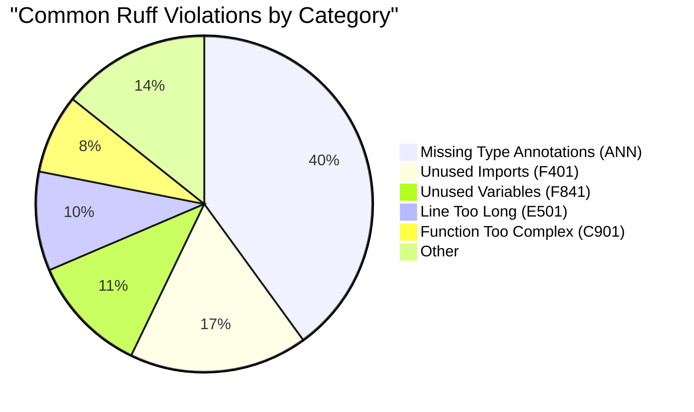
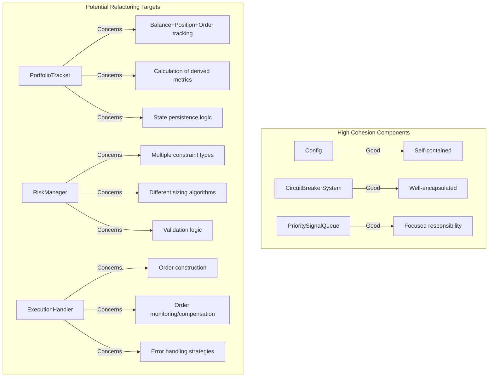

# CyberDeltaEngine: Code Review Report (v0.0.1) - Code Quality and Style

This section assesses the adherence to the project's code quality standards, including formatting, typing, documentation, naming, and modularity, with specific examples and improvement recommendations.

## 1. Formatting (Ruff Format)

*   **Adherence:** Generally good. The use of `ruff format` is enforced by project rules (`codeformatting.mdc`, `python_file_validation.mdc`).
*   **Configuration:** `pyproject.toml` defines `line-length = 100` and targets `py313`.

```toml
# pyproject.toml configuration for Ruff formatting
[tool.ruff.format]
line-length = 100
indent-style = "space"
skip-magic-trailing-comma = false
docstring-code-format = true
docstring-code-line-length = 80
target-version = "py313"
```

*   **Example Implementation:** The following snippet demonstrates well-formatted code adhering to Ruff standards:

```python
# cyberdelta/core/signal_queue.py
async def add_signal(self, signal: TradeSignal) -> bool:
    """
    Add a TradeSignal to the priority queue, maintaining order by utility score.
    
    Args:
        signal: The TradeSignal to add
        
    Returns:
        bool: True if the signal was added, False otherwise (e.g., queue full with higher priority signals)
    """
    if not self._check_circuit_breakers_pre_add(signal):
        self.logger.warning(
            f"Circuit breaker prevented adding signal {signal.signal_id} for {signal.symbol}"
        )
        return False
        
    # Calculate expiration if not set
    if signal.expiration is None:
        signal.expiration = self._calculate_expiration(signal)
        
    # Check if signal is still valid
    if not signal.is_valid():
        self.logger.info(f"Signal {signal.signal_id} already expired, not adding to queue")
        return False
        
    async with self._lock:
        # Clean expired signals and ensure we have space
        await self._clean_expired_signals()
```

*   **Recommendations:** 
    *   **Continuous Enforcement:** Continue rigorous application of `ruff format .` before committing changes.
    *   **IDE Integration:** Configure editors (VSCode, PyCharm) to run Ruff on save for immediate feedback.
    *   **Pre-commit Hook:** Consider implementing a Git pre-commit hook to enforce Ruff formatting:

```yaml
# .pre-commit-config.yaml example
repos:
-   repo: https://github.com/charliermarsh/ruff-pre-commit
    rev: 'v0.3.0'
    hooks:
    -   id: ruff-format
```

## 2. Linting & Style Checks (Ruff Check)

*   **Adherence:** Improving, but requires ongoing attention. Ruff checks are mandated (`python_file_validation.mdc`).
*   **Configuration:** `pyproject.toml` selects a good baseline set of rules:

```toml
# pyproject.toml configuration for Ruff linting
[tool.ruff.lint]
select = [
    "E",   # pycodestyle errors
    "F",   # pyflakes
    "I",   # isort
    "B",   # flake8-bugbear
    "UP",  # pyupgrade
    "ANN", # flake8-annotations
]
ignore = [
    # "ANN101",  # Missing type annotation for `self`
]
# Add fixed target versions
target-version = "py313"
```

*   **Common Issues Identified:**
    *   **Unused Imports (`F401`):** 
        ```python
        # Before
        from decimal import Decimal
        import asyncio
        import time  # Unused import
        
        # After
        from decimal import Decimal
        import asyncio
        ```
    
    *   **Unused Variables (`F841`):**
        ```python
        # Before
        async def fetch_data():
            response = await api_client.get_ticker()
            parsed = parse_ticker(response)  # Variable never used
            return True
            
        # After
        async def fetch_data():
            response = await api_client.get_ticker()
            return True
        ```
    
    *   **Missing Type Annotations (`ANN`):**
        ```python
        # Before
        def calculate_pnl(entry_price, exit_price, size, side):
            # ...
            
        # After
        def calculate_pnl(
            entry_price: Decimal,
            exit_price: Decimal,
            size: Decimal,
            side: OrderSide
        ) -> Decimal:
            # ...
        ```
    
    *   **Complexity Issues (`C901`):**
        ```python
        # Before - Complex function with multiple responsibilities
        def process_order_update(self, update):
            # 30+ lines with nested conditionals
            
        # After - Refactored into multiple smaller functions
        def process_order_update(self, update: dict) -> None:
            if self._is_fill_update(update):
                self._handle_fill(update)
            elif self._is_cancel_update(update):
                self._handle_cancellation(update)
            elif self._is_status_change(update):
                self._handle_status_change(update)
        
        def _is_fill_update(self, update: dict) -> bool:
            # Simple check logic
            
        def _handle_fill(self, update: dict) -> None:
            # Focused logic for handling fills
        ```

*   **Violation Distribution Visualization:**



*   **Recommendations:** 
    *   **Automated Fixes:** Continue running `ruff check --fix .` frequently to automatically resolve issues like unused imports and some formatting violations.
    *   **Complexity Detection:** Pay special attention to complexity warnings (`C901`) as indicators for potential refactoring needs. The `RiskManager`, `ExecutionHandler`, and `PortfolioTracker` classes likely contain methods exceeding recommended complexity.
    *   **Rule Customization:** Consider enabling additional rule sets as the codebase matures:
        ```toml
        # Future enhancement to pyproject.toml
        select = [
            "E", "F", "I", "B", "UP", "ANN",
            "C90",  # McCabe complexity
            "N",    # pep8-naming
            "SIM",  # simplify
            "ERA",  # eradicate commented-out code
            "RUF",  # Ruff-specific rules
        ]
        ```
    *   **CI Integration:** Implement continuous integration checks for Ruff violations with specific maximum thresholds.

## 3. Type Hinting (Mypy)

*   **Adherence:** Significant progress has been made, driven by strict Mypy configuration, but still incomplete.
*   **Configuration:** `pyproject.toml` enables many strict checks:

```toml
# pyproject.toml configuration for Mypy
[tool.mypy]
python_version = "3.13"
warn_return_any = true
warn_unused_configs = true
disallow_untyped_defs = true
disallow_incomplete_defs = true
check_untyped_defs = true
disallow_untyped_decorators = true
no_implicit_optional = true
strict_optional = true
warn_redundant_casts = true
warn_unused_ignores = true
warn_no_return = true
warn_unreachable = true
strict_equality = true
```

*   **Type Hint Implementation Examples:**
    *   **Effective Type Annotations:**
        ```python
        # cyberdelta/core/models.py
        @dataclass
        class TradeSignal:
            signal_id: str
            symbol: str
            signal_type: SignalType
            side: OrderSide
            price: Decimal  
            quantity: Optional[Decimal] = None
            expiration: Optional[datetime] = None
            confidence: float = 0.5
            metadata: Dict[str, Any] = field(default_factory=dict)
            
            def __post_init__(self) -> None:
                """Validate and convert numeric types to Decimal."""
                if isinstance(self.price, (int, float, str)):
                    self.price = Decimal(str(self.price))
                
                if self.quantity is not None and isinstance(self.quantity, (int, float, str)):
                    self.quantity = Decimal(str(self.quantity))
                    
                # Ensure expiration has timezone if set
                if self.expiration is not None and self.expiration.tzinfo is None:
                    self.expiration = self.expiration.replace(tzinfo=timezone.utc)
        ```
    
    *   **Handling Import Cycles with `TYPE_CHECKING`:**
        ```python
        # cyberdelta/core/execution_handler.py
        from typing import Dict, List, Optional, TYPE_CHECKING, Tuple, Any

        if TYPE_CHECKING:
            from cyberdelta.core.portfolio_tracker import PortfolioTracker
            from cyberdelta.core.risk_manager import RiskManager
            from cyberdelta.apis.base import BaseExchangeAPI

        class ExecutionHandler:
            def __init__(
                self,
                config: 'Config',
                portfolio_tracker: 'PortfolioTracker',
                risk_manager: 'RiskManager',
                api_clients: Dict[str, 'BaseExchangeAPI'],
                circuit_breakers: Optional['CircuitBreakerSystem'] = None
            ) -> None:
                # ...
        ```
    
    *   **Areas Using `Any` (Opportunities for Improvement):**
        ```python
        # Example 1: StateManager state dictionary
        class StateManager:
            def save_state(self, component_id: str, state: Any) -> bool:
                # ...
                
        # Improvement with TypedDict:
        class PortfolioState(TypedDict):
            balances: Dict[str, Dict[str, Balance]]
            positions: Dict[str, Dict[str, Position]]
            open_orders: Dict[str, Dict[str, List[Order]]]
            
        class StateManager:
            def save_state(self, component_id: str, state: Union[PortfolioState, Dict[str, Any]]) -> bool:
                # ...
        
        # Example 2: OrderBook storage in DataHandler
        class DataHandler:
            def __init__(self) -> None:
                self._orderbooks: Dict[str, Dict[str, Any]] = {}  # exchange -> symbol -> orderbook
                
        # Improvement with dedicated type:
        class OrderBook:
            bids: List[PriceLevel]
            asks: List[PriceLevel]
            timestamp: datetime
            
        class DataHandler:
            def __init__(self) -> None:
                self._orderbooks: Dict[str, Dict[str, OrderBook]] = {}
        ```

*   **Common Type Hint Issues:**
    *   **Delayed `Decimal` Conversion:** Code receiving numeric inputs (especially from APIs/config) often receives values as `float`/`str` but treats them as `Decimal` in annotations, deferring conversion.
    *   **Optional Handling:** Some methods don't correctly handle `Optional` return types, risking `None` dereference.
    *   **WS Message Typing:** WebSocket message parsing still largely works with `dict`/`Any` rather than more specific types.

*   **Mypy Errors Visualization:**

```mermaid
bar
    title "Remaining Mypy Errors by Component"
    "APIs" : 28
    "Core Components" : 21
    "Strategies" : 12
    "Validation" : 8
    "Utilities" : 5
```

*   **Recommendations:**
    *   **Reduce `Any` Usage:** Create specific types (classes, `TypedDict`, type aliases) for common structures:
        ```python
        # Example: API response typing
        class TickerResponse(TypedDict):
            symbol: str
            price: str  # Raw API value as string, will be converted
            volume: str
            timestamp: int
            
        def parse_ticker(response: TickerResponse) -> Ticker:
            # Type-safe parsing with known fields
        ```
    
    *   **Union Types for Mixed Inputs:** When a function accepts multiple input types but converts them:
        ```python
        def set_position_size(
            self, 
            symbol: str, 
            size: Union[Decimal, str, float]
        ) -> None:
            # Convert to Decimal if not already
            if not isinstance(size, Decimal):
                size = Decimal(str(size))
            # ...proceed with Decimal
        ```
    
    *   **Protocol Classes:** Consider using `Protocol` for interface definitions where appropriate:
        ```python
        from typing import Protocol
        
        class ExchangeAPI(Protocol):
            async def get_ticker(self, symbol: str) -> Ticker: ...
            async def create_order(self, order: Order) -> OrderResponse: ...
            # Other required methods
        ```
    
    *   **Address Remaining Errors:** Systematically work through the remaining Mypy errors. Focus first on the API clients (highest count) and core components.

## 4. Commenting & Docstrings

*   **Adherence:** Generally good, following the `comments.mdc` rule.
*   **Standards:** The project follows a Google-style docstring format with Args, Returns, and Raises sections.

*   **Exemplary Docstring:**
```python
def _calculate_expiration(self, signal: TradeSignal) -> datetime:
    """
    Calculate an appropriate expiration time for a signal based on its confidence and other factors.
    
    The expiration time is dynamically calculated considering:
    1. The base expiration time from configuration
    2. Signal confidence score (higher confidence = longer expiration)
    3. Market volatility (if provided in signal metadata)
    
    Args:
        signal: The trade signal requiring an expiration time
        
    Returns:
        datetime: A timezone-aware expiration timestamp
        
    Note:
        Returned expiration is always UTC-aware to prevent timezone ambiguity
    """
    base_seconds = self.default_expiration_seconds
    
    # Adjust based on confidence (0.5 = default, 1.0 = 50% longer, 0.0 = 50% shorter)
    confidence_multiplier = 0.5 + signal.confidence
    adjusted_seconds = base_seconds * confidence_multiplier
    
    # Further adjust based on volatility if available in metadata
    volatility = signal.metadata.get('basis_volatility')
    if volatility is not None:
        vol_factor = 1.0 - min(0.5, float(volatility) * 100)  # Higher volatility = shorter expiration
        adjusted_seconds *= vol_factor
    
    # Create datetime with UTC timezone
    expiration = datetime.now(timezone.utc) + timedelta(seconds=adjusted_seconds)
    return expiration
```

*   **Inline Comments for Complex Logic:**
```python
def get_next_signal(self) -> Optional[TradeSignal]:
    """Get and remove the highest priority unexpired signal from the queue."""
    async with self._lock:
        # Clean expired signals first to avoid returning one that just expired
        await self._clean_expired_signals()
        
        # Exit early if queue is empty after cleaning
        if not self._queue:
            return None
            
        # Check if circuit breakers would block the next signal
        # We do this inside the lock to prevent race conditions
        if not await self._check_circuit_breakers_post_get():
            self.logger.warning("Circuit breaker active, not returning signals")
            return None
            
        try:
            # Take the highest priority signal (negated score makes this a max-heap)
            # This pops the item with the LOWEST negated score, which is our HIGHEST actual score
            neg_score, timestamp, signal = heapq.heappop(self._queue)
            
            # Verify the signal hasn't expired since our earlier check
            # This is a safety check in case _clean_expired_signals missed something
            if not signal.is_valid():
                self.logger.info(f"Signal {signal.signal_id} expired after queue check, discarding")
                # Recursively try to get the next valid signal
                return await self.get_next_signal()
                
            self.logger.info(
                f"Retrieved signal: {signal.signal_id} for {signal.symbol} with "
                f"score: {-neg_score:,.6f}, type: {signal.signal_type.name}"
            )
            return signal
            
        except IndexError:
            # This shouldn't happen with our empty check above, but as a safety measure
            return None
```

*   **Module-Level Documentation:**
```python
"""
Portfolio Tracker Module

This module provides the PortfolioTracker class, which is responsible for:
1. Maintaining an accurate record of assets, positions, and orders across exchanges
2. Calculating exposure, margins, and other portfolio metrics
3. Processing trade fills and order updates
4. Managing position lifecycle (entry, adjustment, exit)
5. Providing a queryable interface for risk management and execution components

The state is kept in memory but can be persisted via the StateManager for recovery.
"""

import asyncio
from decimal import Decimal
from datetime import datetime, timezone
from typing import Dict, List, Optional, Set, Tuple, Any
import logging

from cyberdelta.core.models import Balance, Position, Order, OrderStatus, OrderSide
# ...rest of imports...
```

*   **TODOs with Ownership/Tickets:**
```python
# TODO(issue-127): Replace polling with WebSocket order update handling
async def _poll_for_fill(self, order_id: str, exchange: str) -> bool:
    """Temporary polling mechanism until WS implementation is complete."""
    # ...polling implementation...
```

*   **Recommendations:**
    *   **Documentation Auditing:** Schedule a specific task to review and update docstrings for all public methods across the codebase, especially focusing on parameters that might have changed during development.
    *   **Add Architecture Diagrams:** Include ASCII or reference to Mermaid diagrams for complex component interactions (e.g., trade flow, data handling) directly in module docstrings.
    *   **Enforce Consistent Style:** Ensure all new docstrings follow the Google style format with consistent sections (Args, Returns, Raises, Examples where relevant).
    *   **Context in Complex Methods:** Add concise comments explaining the "why" not just the "what" for complex logic blocks, particularly in `RiskManager`, `ExecutionHandler`, and API parsing logic.

## 5. Naming Conventions

*   **Adherence:** Good. Follows standard Python PEP 8 conventions.
*   **Examples:**
    *   **Classes (PascalCase):** `PortfolioTracker`, `CircuitBreakerSystem`, `FundingRateArbitrageStrategy`
    *   **Functions/Methods (snake_case):** `calculate_pnl`, `get_next_signal`, `_clean_expired_signals`
    *   **Variables (snake_case):** `order_id`, `exchange_name`, `funding_rate`
    *   **Constants (UPPER_SNAKE_CASE):** `MAX_RECONNECT_ATTEMPTS`, `DEFAULT_TIMEOUT_SECONDS`
    *   **Protected Methods/Attributes (leading underscore):** `_lock`, `_queue`, `_calculate_expiration`

*   **Meaningful Naming Examples:**
    *   **Descriptive Function Names:** 
        ```python
        # Clearly communicates purpose
        def record_websocket_disconnect(self, exchange: str) -> None: ...
        
        # vs. too generic
        def record_event(self, exchange: str, event_type: str) -> None: ...
        ```
    
    *   **Self-Documenting Variables:**
        ```python
        # Clear purpose
        max_position_size_usd = Decimal("10000.00")
        
        # vs. ambiguous
        max_size = Decimal("10000.00")  # Unclear units/purpose
        ```

*   **Recommendations:**
    *   **Consistent Prefixing:** For related methods, consistently use prefixes to indicate grouping:
        ```python
        # Consistent "get_" prefix for retrieval methods
        async def get_position(self, symbol: str, exchange: str) -> Optional[Position]: ...
        async def get_balance(self, asset: str, exchange: str) -> Optional[Balance]: ...
        async def get_order(self, order_id: str, exchange: str) -> Optional[Order]: ...
        ```
    
    *   **Units in Names:** Continue including units in variable names where relevant:
        ```python
        retry_delay_seconds = 3.0  # Clear time unit
        max_order_size_usd = Decimal("5000")  # Clear monetary unit and currency
        ```
    
    *   **Boolean Clarity:** Ensure boolean variables/functions have names that imply their boolean nature:
        ```python
        # Good: is_*, has_*, should_*, can_*
        if is_valid and can_execute and has_sufficient_balance:
            # ...
        ```

## 6. Modularity & Structure

*   **Adherence:** Reasonable. Components are generally separated into appropriate files and modules.
*   **Project Structure:**

```
cyberdelta/
├── __init__.py
├── core/              # Core engine components
│   ├── __init__.py
│   ├── engine.py      # Main engine orchestrator
│   ├── data_handler.py # Market data management
│   ├── execution_handler.py # Order execution (large)
│   ├── models.py      # Data models & enums
│   ├── portfolio_tracker.py # Position/balance tracking (large) 
│   ├── risk_manager.py # Risk sizing & constraints (large)
│   └── signal_queue.py # Signal prioritization
├── apis/              # Exchange API clients
│   ├── __init__.py
│   ├── base.py        # API base class
│   ├── hyperliquid.py # Hyperliquid REST+WS (large)
│   └── backpack.py    # Backpack REST+WS (large)
├── strategies/        # Trading strategies
│   ├── __init__.py
│   ├── base.py        # Strategy base class
│   └── funding_rate_arbitrage.py # Funding rate strategy
├── validation/        # Safety & validation systems
│   ├── __init__.py
│   ├── circuit_breaker.py # Circuit breaker system
│   ├── position_reconciliation.py # Position verification
│   └── funding_rate_validator.py # Funding rate accuracy
└── utils/             # Shared utilities
    ├── __init__.py
    ├── config.py      # Configuration handling
    ├── state_manager.py # State persistence
    └── symbol_mapper.py # Symbol normalization
```

*   **Large File Concerns:**
    *   **Large Component Files:**
        
        | File | Lines | Complexity | Concerns |
        |------|-------|------------|----------|
        | `portfolio_tracker.py` | ~1100 | High | Multiple responsibilities (balances, positions, orders) |
        | `execution_handler.py` | ~850 | High | Order placement, monitoring, compensation logic |
        | `hyperliquid.py` | ~820 | Medium | REST, WS handling, parsing, authentication |
        | `risk_manager.py` | ~780 | High | Multiple constraint types, sizing algorithms |

*   **Cohesion & Coupling Analysis:**



*   **Recommendations for Large Files:**
    *   **`PortfolioTracker` Refactoring:**
        ```python
        # Potential splitting:
        # 1. cyberdelta/core/portfolio/tracker.py (main class)
        # 2. cyberdelta/core/portfolio/balance_manager.py 
        # 3. cyberdelta/core/portfolio/position_manager.py
        # 4. cyberdelta/core/portfolio/order_manager.py

        # Example refactored approach:
        class PortfolioTracker:
            def __init__(self, config, state_manager, symbol_mapper):
                self._balance_manager = BalanceManager(config)
                self._position_manager = PositionManager(config) 
                self._order_manager = OrderManager(config)
                # Core logic remains here, delegates to specialized managers
        ```
    
    *   **`RiskManager` Refactoring:**
        ```python
        # Potential splitting:
        # 1. cyberdelta/core/risk/manager.py (main class)
        # 2. cyberdelta/core/risk/constraints.py (constraint classes)
        # 3. cyberdelta/core/risk/sizing.py (sizing algorithms)
        
        # Example refactored approach:
        class ExposureConstraint:
            def check(self, exposure, new_size): ... 
            
        class DrawdownConstraint:
            def check(self, drawdown, new_size): ...
            
        class KellySizer:
            def calculate_size(self, opportunity): ...
            
        class RiskManager:
            def __init__(self, config, portfolio_tracker):
                self._constraints = [
                    ExposureConstraint(config),
                    DrawdownConstraint(config),
                    # ...
                ]
                self._sizer = self._create_sizer(config)
        ```
    
    *   **`ExecutionHandler` Refactoring:**
        ```python
        # Potential splitting:
        # 1. cyberdelta/core/execution/handler.py (main class)
        # 2. cyberdelta/core/execution/order_factory.py (order creation)
        # 3. cyberdelta/core/execution/compensation.py (fill management)
        # 4. cyberdelta/core/execution/monitoring.py (order status tracking)
        
        # Example refactored approach:
        class OrderFactory:
            def create_order(self, signal, sizing): ...
            
        class OrderMonitor:
            async def monitor_order(self, order, exchange): ...
            
        class ExecutionHandler:
            def __init__(self, config, portfolio_tracker, api_clients):
                self._order_factory = OrderFactory(config)
                self._order_monitor = OrderMonitor(config)
                # Delegate to specialized components
        ```
    
    *   **API Client Refactoring:**
        ```python
        # Potential splitting:
        # 1. cyberdelta/apis/hyperliquid/client.py (main class)
        # 2. cyberdelta/apis/hyperliquid/rest.py (REST methods)
        # 3. cyberdelta/apis/hyperliquid/websocket.py (WS handling) 
        # 4. cyberdelta/apis/hyperliquid/auth.py (Authentication)
        # 5. cyberdelta/apis/hyperliquid/parsing.py (Response parsing)
        
        # Example refactored approach:
        class HyperliquidREST:
            async def get_ticker(self, symbol): ...
            
        class HyperliquidWebSocket:
            async def subscribe(self, channels): ...
            
        class HyperliquidAPI:
            def __init__(self, config, secrets):
                self._rest = HyperliquidREST(config, secrets)
                self._ws = HyperliquidWebSocket(config, secrets)
                # Main class now delegates to specialized components
        ```

*   **Overall Structure Recommendations:**
    *   **Phase 1 Refactoring:** Focus first on the highest risk components: 
        1. Split `PortfolioTracker` balance/position/order logic.
        2. Extract `RiskManager` constraint classes.
        3. Separate `ExecutionHandler` order monitoring.
    *   **Package Organization:** Consider reorganizing into more focused subpackages that group related functionality (as shown in refactoring examples).
    *   **Architectural Clarity:** Document component relationships with diagram(s) in README or dedicated architecture documentation.

