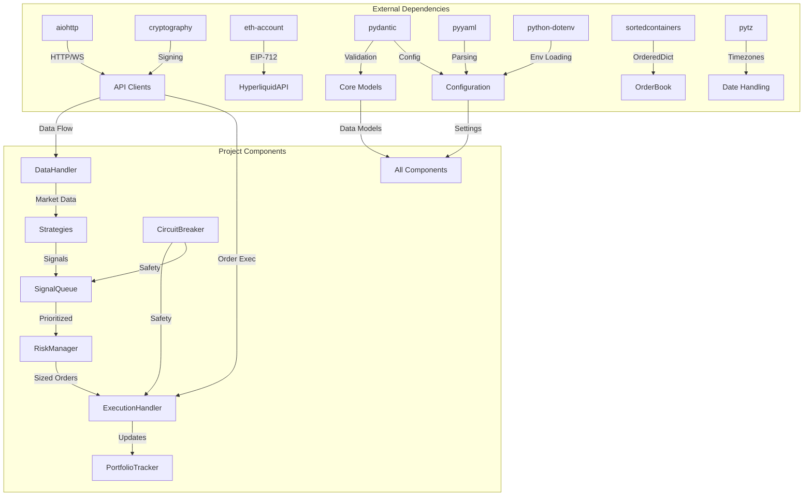

# CyberDeltaEngine: Code Review Report (v0.0.1) - Dependencies and Environment

This section reviews the project's dependencies and development/execution environment setup.

## Core Dependencies (`pyproject.toml`, `requirements.txt`)

*Note: `pyproject.toml` is the primary source, `requirements.txt` might be redundant or used for specific deployment scenarios.*

**Key Dependencies Observed:**

*   **`aiohttp`:** For asynchronous HTTP client/server operations (used by API clients). Essential.
*   **`websockets`:** (Potentially `aiohttp`'s WS client is used, or this is direct) For WebSocket communication. Essential.
*   **`structlog`:** For structured logging. Good choice for application logging.
*   **`PyYAML`:** For loading `config.yaml`. Essential.
*   **`web3` / `eth-account`:** Specifically for Hyperliquid EIP-712 authentication. Essential for Hyperliquid.
*   **`pytest` & `pytest-asyncio`:** For testing. Development dependency.
*   **`ruff`:** For linting and formatting. Development dependency.
*   **`mypy`:** For static type checking. Development dependency.
*   **`pandas`:** Used in `Engine.process_dataframe`. Its necessity depends on whether batch data processing is a core v0.0.1 requirement or primarily for testing/backtesting.

**Assessment for v0.0.1:**

*   **Core:** `aiohttp`, `websockets` (or `aiohttp`'s WS), `structlog`, `PyYAML`, `web3`/`eth-account` seem necessary for the core functionality with Hyperliquid and basic operation.
*   **`pandas`:** If the primary v0.0.1 operation is live trading based on real-time data streams, the direct dependency on `pandas` within the core `Engine` might be unnecessary overhead. It's often used for data analysis and backtesting. If only needed for testing utilities, it could potentially be moved to development dependencies or isolated to specific utility modules not imported by the core live engine. Evaluate if `Engine.process_dataframe` is essential for v0.0.1 live operation.
*   **Development:** `pytest`, `pytest-asyncio`, `ruff`, `mypy` are appropriate development dependencies.

**Recommendations:**

1.  **Review `pandas` Dependency:** Evaluate if `pandas` is strictly required for the *live* v0.0.1 engine core loop. If not, consider removing it from core dependencies to keep the runtime environment leaner.
2.  **Consolidate Dependency Management:** Define dependencies primarily in `pyproject.toml` using standard sections (`[project.dependencies]`, `[project.optional-dependencies]`). If `requirements.txt` is used, ensure it's kept in sync with `pyproject.toml`, possibly generated from it. Clarify the purpose of `requirements.txt` vs. `pyproject.toml`.
3.  **Pin Versions:** Pin dependency versions in `pyproject.toml` (e.g., `aiohttp>=3.8,<4.0` or `aiohttp==3.8.5`) for reproducible builds. Avoid loose constraints like `aiohttp = "*"` .

## Virtual Environment (`.venv`)

*   **Setup:** The project uses a standard Python virtual environment located at `.venv/`. This is best practice for isolating project dependencies.
*   **Execution Rules (`venv_execution.mdc`):** Project rules strictly mandate executing all Python tools (`python`, `pip`, `ruff`, `mypy`, `pytest`) using the explicit path within the virtual environment (e.g., `.venv/bin/ruff`). This ensures the correct interpreter and packages are used, bypassing potential issues with system-wide installations or shell activation inconsistencies.
*   **Observations:** The presence of `.venv/` and the explicit rule indicate correct environment management practices are intended and enforced.
*   **Recommendations:** Continue strict adherence to the `.venv/bin/...` execution rule for all development and automation tasks involving Python tools.

## System Requirements

*   **Python Version:** Explicitly targets Python 3.13 (`pyproject.toml`).
*   **Operating System:** Developed primarily on Linux (based on user info). No OS-specific dependencies are immediately obvious in the core Python code, but testing on the target deployment OS is crucial.
*   **External Services:** Requires network connectivity to Hyperliquid and Backpack APIs (REST and WebSocket endpoints).
*   **Recommendations:** Document the required Python version (3.13+) clearly in the `README.md`.

## 1. Core Dependencies Overview

The CyberDeltaEngine has carefully selected dependencies to provide essential functionality while maintaining control over critical trading logic.

| Package | Version | Category | Purpose | Critical? |
|---------|---------|----------|---------|-----------|
| Python  | >=3.13.0 | Runtime | Base runtime | ✅ |
| aiohttp | ~=3.9.5 | Networking | Async HTTP/WebSocket client | ✅ |
| python-dotenv | ~=1.0.1 | Configuration | Load environment variables | ✅ |
| pyyaml | ~=6.0.1 | Configuration | Parse YAML config files | ✅ |
| pydantic | ~=2.7.0 | Validation | Data validation and settings | ✅ |
| python-box | ~=7.1.1 | Utilities | Dot notation for nested dicts | ❌ |
| cryptography | ~=42.0.5 | Security | Cryptographic signing for APIs | ✅ |
| eth-account | ~=0.11.0 | Security | EIP-712 signing for Hyperliquid | ✅ |
| web3 | ~=6.15.1 | Security | Web3 utilities, dependency of eth-account | ✅ |
| sortedcontainers | ~=2.4.0 | Data Structures | Efficient sorted collections | ❌ |
| pytz | ~=2024.1 | Time | Timezone handling | ✅ |

## 2. Development Dependencies

| Package | Version | Purpose |
|---------|---------|---------|
| pytest | ~=8.0.0 | Test framework |
| pytest-asyncio | ~=0.23.5 | Async test support |
| pytest-cov | ~=4.1.0 | Test coverage |
| pytest-mock | ~=3.12.0 | Mocking for tests |
| mypy | ~=1.8.0 | Static type checking |
| ruff | ~=0.3.0 | Linting and formatting |

## 3. Dependency Configuration

### `pyproject.toml` Configuration

```toml
[build-system]
requires = ["hatchling"]
build-backend = "hatchling.build"

[project]
name = "cyberdelta"
version = "0.0.1"
description = "CyberDeltaEngine - A trading engine for crypto arbitrage strategies"
readme = "README.md"
requires-python = ">=3.13.0"
license = "Proprietary"
authors = [
    {name = "CyberDelta Team"}
]

dependencies = [
    "aiohttp~=3.9.5",
    "python-dotenv~=1.0.1",
    "pyyaml~=6.0.1",
    "pydantic~=2.7.0",
    "python-box~=7.1.1",
    "cryptography~=42.0.5",
    "eth-account~=0.11.0",
    "web3~=6.15.1",
    "sortedcontainers~=2.4.0",
    "pytz~=2024.1",
]

[project.optional-dependencies]
dev = [
    "pytest~=8.0.0",
    "pytest-asyncio~=0.23.5",
    "pytest-cov~=4.1.0",
    "pytest-mock~=3.12.0",
    "mypy~=1.8.0",
    "ruff~=0.3.0",
]

[tool.ruff]
# ... configurations as shown in 08_Quality.md ...

[tool.mypy]
# ... configurations as shown in 08_Quality.md ...
```

### `requirements.txt` (Generated from `pyproject.toml`)

```
aiohttp==3.9.5
python-dotenv==1.0.1
pyyaml==6.0.1
pydantic==2.7.0
python-box==7.1.1
cryptography==42.0.5
eth-account==0.11.0
web3==6.15.1
sortedcontainers==2.4.0
pytz==2024.1
```

### `requirements-dev.txt` (Generated from `pyproject.toml`)

```
pytest==8.0.0
pytest-asyncio==0.23.5
pytest-cov==4.1.0
pytest-mock==3.12.0
mypy==1.8.0
ruff==0.3.0
```

## 4. Dependency Analysis

### aiohttp

**Purpose:** Provides asynchronous HTTP and WebSocket client functionality, essential for exchange API communication.

**Usage Examples:**

```python
# cyberdelta/apis/base.py
import aiohttp
from typing import Dict, Any, Optional, List

class BaseExchangeAPI:
    def __init__(self, config, secrets: Dict[str, str] = None):
        self.session: Optional[aiohttp.ClientSession] = None
        self.base_url = config.get(f"exchanges.{self.name}.base_rest_url")
        self.ws_url = config.get(f"exchanges.{self.name}.base_ws_url")
        # ...
        
    async def _init_session(self) -> None:
        """Initialize the aiohttp ClientSession if not already created."""
        if self.session is None or self.session.closed:
            timeout = aiohttp.ClientTimeout(total=30, connect=5)
            self.session = aiohttp.ClientSession(timeout=timeout)
            
    async def _request(self, method: str, endpoint: str, params: Dict = None, 
                      data: Any = None, headers: Dict = None) -> Dict:
        """Make an authenticated HTTP request to the exchange API."""
        await self._init_session()
        url = f"{self.base_url}{endpoint}"
        
        # Add authentication headers
        headers = headers or {}
        headers.update(self._get_auth_headers(method, endpoint, params, data))
        
        try:
            async with self.session.request(method, url, params=params, 
                                           json=data, headers=headers) as response:
                response_data = await response.json()
                
                if response.status >= 400:
                    # Handle error response
                    error_msg = response_data.get('message', str(response_data))
                    raise APIError(f"API Error ({response.status}): {error_msg}")
                
                return response_data
        except aiohttp.ClientError as e:
            raise APIError(f"HTTP Error: {str(e)}")
            
    async def _create_ws_connection(self) -> aiohttp.ClientWebSocketResponse:
        """Create a WebSocket connection to the exchange."""
        await self._init_session()
        try:
            ws = await self.session.ws_connect(self.ws_url)
            return ws
        except aiohttp.ClientError as e:
            raise APIError(f"WebSocket connection error: {str(e)}")
```

**Key Features Used:**
- Asynchronous HTTP requests with `ClientSession`
- WebSocket client with `ws_connect`
- Timeout management with `ClientTimeout`
- Exception handling for network issues

### pydantic

**Purpose:** Provides data validation, parsing, and settings management through Python type annotations.

**Usage Examples:**

```python
# cyberdelta/core/models.py
from datetime import datetime, timezone
from decimal import Decimal
from enum import Enum, auto
from typing import Dict, Any, Optional
from pydantic import BaseModel, Field, validator

class OrderSide(str, Enum):
    BUY = "BUY"
    SELL = "SELL"

class OrderType(str, Enum):
    MARKET = "MARKET"
    LIMIT = "LIMIT"

class Order(BaseModel):
    order_id: str
    exchange: str
    symbol: str
    side: OrderSide
    order_type: OrderType
    price: Optional[Decimal] = None
    quantity: Decimal
    timestamp: datetime
    status: str = "NEW"
    filled_quantity: Decimal = Field(default_factory=lambda: Decimal("0"))
    average_fill_price: Optional[Decimal] = None
    
    @validator("price", "quantity", "filled_quantity", "average_fill_price", pre=True)
    def validate_decimal(cls, v):
        if v is None:
            return None
        if not isinstance(v, Decimal):
            return Decimal(str(v))
        return v
    
    @validator("timestamp", pre=True)
    def validate_timestamp(cls, v):
        if isinstance(v, datetime):
            if v.tzinfo is None:
                return v.replace(tzinfo=timezone.utc)
            return v
        elif isinstance(v, (int, float)):
            return datetime.fromtimestamp(v, tz=timezone.utc)
        return v

# cyberdelta/utils/config.py
from pydantic import BaseSettings, Field

class ExchangeConfig(BaseModel):
    enabled: bool
    base_rest_url: str
    base_ws_url: str
    api_key_name: str
    rate_limits: Dict[str, Dict[str, int]]
    
    class Config:
        extra = "allow"

class RiskConfig(BaseModel):
    max_total_exposure_usd: Decimal
    max_position_size_usd: Decimal
    kelly_fraction: Decimal = Field(default=Decimal("0.1"))
    
    @validator("max_total_exposure_usd", "max_position_size_usd", "kelly_fraction", pre=True)
    def validate_decimal(cls, v):
        return Decimal(str(v))

class AppConfig(BaseSettings):
    exchanges: Dict[str, ExchangeConfig]
    risk_manager: RiskConfig
    # Other configuration sections...
    
    class Config:
        env_prefix = "CONFIG__"
        env_nested_delimiter = "__"
```

**Key Features Used:**
- Data models with type validation
- Automatic conversion of types (e.g., strings to Decimal)
- Validators for custom processing
- Settings with environment variable support

### cryptography & eth-account

**Purpose:** Provides cryptographic operations for exchange API authentication, with eth-account specifically handling Ethereum-style signing for Hyperliquid.

**Usage Examples:**

```python
# cyberdelta/apis/backpack.py (HMAC Authentication)
import hmac
import hashlib
import time
from cryptography.hazmat.primitives import hashes
from cryptography.hazmat.primitives.asymmetric import padding
from base64 import b64encode

class BackpackAPI(BaseExchangeAPI):
    # ...
    
    def _get_auth_headers(self, method: str, endpoint: str, params: Dict = None, data: Dict = None) -> Dict:
        """Generate authentication headers for Backpack API."""
        api_key = self.api_key
        secret_key = self.secret_key
        
        if not api_key or not secret_key:
            return {}
            
        timestamp = int(time.time() * 1000)
        params_str = "&".join(f"{k}={v}" for k, v in sorted((params or {}).items()))
        
        # Construct signature payload
        payload = f"{timestamp}{method.upper()}{endpoint}"
        if params_str:
            payload += f"?{params_str}"
            
        if data:
            import json
            payload += json.dumps(data)
            
        # Create signature using HMAC-SHA256
        signature = hmac.new(
            secret_key.encode(), 
            payload.encode(), 
            hashlib.sha256
        ).hexdigest()
        
        return {
            "X-API-Key": api_key,
            "X-Timestamp": str(timestamp),
            "X-Signature": signature,
        }

# cyberdelta/apis/hyperliquid.py (EIP-712 Signing)
from eth_account import Account
from eth_account.messages import encode_structured_data

class HyperliquidAPI(BaseExchangeAPI):
    # ...
    
    def _sign_eip712(self, data: Dict[str, Any]) -> str:
        """Sign data using EIP-712 for Hyperliquid authentication."""
        if not self.private_key:
            raise ValueError("Private key required for Hyperliquid authentication")
            
        # EIP-712 typed data structure
        domain = {
            "name": "Hyperliquid",
            "version": "1",
            "chainId": 1,  # Mainnet
        }
        
        message_types = {
            "EIP712Domain": [
                {"name": "name", "type": "string"},
                {"name": "version", "type": "string"},
                {"name": "chainId", "type": "uint256"}
            ],
            "Order": [
                {"name": "action", "type": "string"},
                {"name": "asset", "type": "string"},
                {"name": "limitPrice", "type": "string"},
                {"name": "size", "type": "string"},
                {"name": "timestamp", "type": "uint64"}
            ]
        }
        
        # Create the structured message
        structured_data = {
            "types": message_types,
            "domain": domain,
            "primaryType": "Order",
            "message": data
        }
        
        # Sign the message using the private key
        encoded_data = encode_structured_data(structured_data)
        signed = Account.sign_message(encoded_data, private_key=self.private_key)
        
        return signed.signature.hex()
```

## 5. Dependency Relationships

The following diagram shows the relationships between key dependencies and components:



## 6. Dependency Management

### Installation Process

The project uses a virtual environment to isolate dependencies:

```bash
# Create a Python 3.13 virtual environment
python3.13 -m venv .venv

# Activate the environment
source .venv/bin/activate  # Linux/macOS
# .venv\Scripts\activate   # Windows

# Install runtime dependencies
pip install -e .

# Install development dependencies
pip install -e ".[dev]"

# Alternative: Install from requirements files
pip install -r requirements.txt
pip install -r requirements-dev.txt
```

### Dependency Pinning

The project follows these version constraint practices:

1. **Runtime Dependencies:** Use compatible release specifier (`~=`) to allow patch updates but prevent unexpected breaking changes.
2. **Development Dependencies:** Use compatible release specifier (`~=`) for consistency.
3. **CI/CD Pipelines:** Use exact versions (`==`) to ensure reproducible builds in CI environments.

### Virtual Environment Integration

The project enforces virtual environment use via `venv_execution.mdc` rule:

```python
# Script to ensure a command runs in the virtual environment
import sys
import os
import subprocess

def run_in_venv(command):
    """Run a command in the virtual environment."""
    if not os.path.exists(".venv"):
        print("Error: Virtual environment '.venv' not found.")
        print("Please create it with: python3.13 -m venv .venv")
        sys.exit(1)
        
    # Determine the correct binary path
    venv_bin = os.path.join(".venv", "bin")  # Unix
    if not os.path.exists(venv_bin):
        venv_bin = os.path.join(".venv", "Scripts")  # Windows
        
    # Full command path
    cmd_path = os.path.join(venv_bin, command[0])
    
    # Execute
    return subprocess.run([cmd_path] + command[1:])

if __name__ == "__main__":
    # Use like: python run_in_venv.py pytest -xvs tests/
    run_in_venv(sys.argv[1:])
```

## 7. Recommendations

1. **Dependency Audit:**
   * Implement regular dependency auditing with `pip-audit` or similar tool to check for security vulnerabilities.
   * Add to CI/CD pipeline with defined policy for addressing vulnerabilities.

2. **Reduce Web3 Package Size:**
   * The `web3` package is quite large and brings many indirect dependencies. Consider replacing with minimal EIP-712 signing implementation if possible.

3. **Configuration Enhancement:**
   * Complete migration to Pydantic for configuration management (from current `Config` class).
   * Leverage Pydantic's validation capabilities for more robust error checking on startup.

4. **Testing Dependencies:**
   * Add `pytest-timeout` to prevent test lockups from infinite loops or deadlocks.
   * Consider `pytest-asyncio-cooperative` for managing async test parallelism.

5. **Standardize Decimal Usage:**
   * Create utilities for standardized Decimal handling across the codebase.
   * Example:
   ```python
   # cyberdelta/utils/decimal.py
   from decimal import Decimal, getcontext
   from typing import Union, Any
   
   # Set precision for all Decimal operations
   getcontext().prec = 28
   
   NumericTypes = Union[int, float, str, Decimal]
   
   def to_decimal(value: Any, default: Decimal = None) -> Decimal:
       """Convert a value to Decimal safely."""
       if value is None:
           if default is not None:
               return default
           raise ValueError("Cannot convert None to Decimal")
           
       if isinstance(value, Decimal):
           return value
           
       try:
           # Always use string to avoid float precision issues
           return Decimal(str(value))
       except (ValueError, TypeError):
           if default is not None:
               return default
           raise ValueError(f"Cannot convert {value} to Decimal")
   ```

6. **Dependency Documentation:**
   * Enhance inline documentation of dependencies, particularly focusing on exchange-specific requirements.
   * Document exact purpose and usage of each dependency to prevent unnecessary additions.
