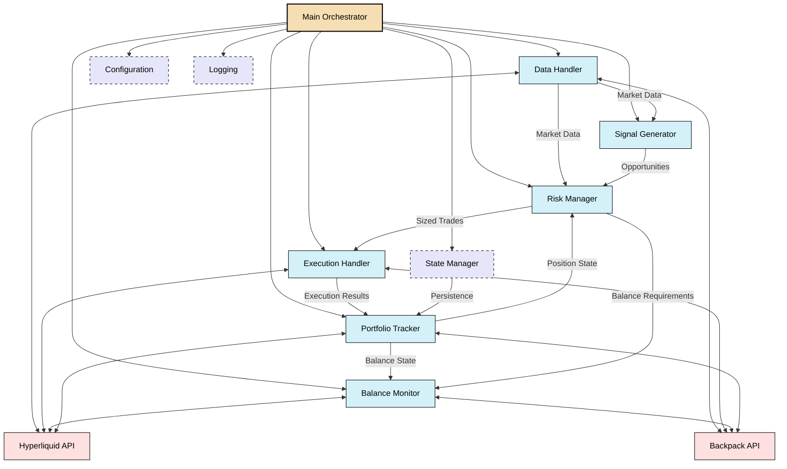

# Core Architecture - CyberDeltaEngine Prototype 0.0.1

This document defines the core architecture for the CyberDeltaEngine Prototype 0.0.1, implementing a funding rate arbitrage strategy between Hyperliquid and Backpack exchanges.

## 1. Architectural Principles

1. **Simplicity First**: Core functionality with minimal complexity
2. **Robustness**: Prioritize error handling and recovery
3. **Separation of Concerns**: Clear component responsibilities
4. **Thread Safety**: Properly managed shared state 
5. **Explicit Data Flow**: Well-defined paths for data movement
6. **Fail-Safe Design**: Assume APIs will fail and design accordingly

## 2. Core Components

## 3. Component Responsibilities

### 3.1 Main Orchestrator

**Purpose**: Central control system for initialization, coordination, and shutdown.

**Key Responsibilities**:
- Initialize all components in the correct order
- Start and monitor asynchronous tasks
- Handle signals for graceful shutdown
- Coordinate the strategy execution cycle
- Manage error handling and recovery
- Implement circuit breakers for system-wide protection

### 3.2 Data Handler

**Purpose**: Centralized market data collection and management.

**Key Responsibilities**:
- Establish and maintain connections to exchange APIs
- Process market data streams (WebSocket, REST)
- Store and manage latest market data (tickers, funding rates, orderbooks)
- Validate and normalize data from different sources
- Track data freshness and handle stale data conditions (data timestamping)
- Provide clean, consistent data access for other components
- Implement reconnection logic for WebSocket connections (with exponential backoff)

### 3.3 Portfolio Tracker

**Purpose**: Track and manage the current state of the portfolio.

**Key Responsibilities**:
- Track balances across exchanges
- Monitor open positions and their P&L
- Track and reconcile order status
- Calculate exposure metrics
- Maintain portfolio state for risk assessment
- Support snapshot/restore for state persistence
- Perform regular reconciliation with exchange data (every N minutes)
- Detect and log discrepancies between local and exchange state

### 3.4 Signal Generator

**Purpose**: Identify funding rate arbitrage opportunities.

**Key Responsibilities**:
- Monitor funding rates across exchanges
- Calculate Net Funding Differentials (NFD)
- Apply funding fee adjustments
- Calculate basis volatility metrics
- Compute expected profit metrics
- Generate and rank arbitrage opportunities
- Apply basic filtering on opportunities
- Validate signal quality (reject abnormal/outlier signals)

### 3.5 Risk Manager

**Purpose**: Assess and size trades based on risk parameters.

**Key Responsibilities**:
- Validate incoming opportunities against risk constraints
- Apply position sizing logic (simplified Kelly)
- Calculate portfolio-level risk metrics 
- Enforce hard position size limits per asset (absolute USD cap)
- Enforce total exposure limits across all positions (% of total capital)
- Enforce per-exchange exposure limits (% of total capital)
- Calculate and monitor liquidation risk on leveraged positions
- Reject trades that would exceed maximum allowed leverage
- Prioritize viable opportunities

**Concrete Risk Parameters (0.0.1)**:
- Maximum position size: Fixed USD cap per position
- Maximum total exposure: % of total capital
- Maximum leverage: Per-position leverage cap
- Maximum exchange concentration: % of capital per exchange
- Kelly fraction: Fixed conservative multiplier (0.3-0.5)

### 3.6 Execution Handler

**Purpose**: Execute trades on exchanges reliably.

**Key Responsibilities**:
- Place orders on exchanges
- Monitor order status and fills
- Handle partial fills and cancellations
- Implement sequenced execution for multi-leg strategies with failure handling:
  - Attempt to reverse leg 1 if leg 2 fails (compensation approach)
  - Maintain detailed state of execution progress
  - Log critical alerts for manual intervention when atomicity fails
- Apply retry logic for temporary failures (with exponential backoff)
- Implement circuit breakers for critical failures
- Log detailed execution information

### 3.7 Balance Monitor

**Purpose**: Monitor exchange balances and alert when manual transfers are needed.

**Key Responsibilities**:
- Monitor balances across exchanges
- Calculate if balances are sufficient for planned operations
- Generate alerts when balances fall below thresholds
- Log balance changes and reconcile with expected changes
- Provide balance status information to other components
- Track minimum required balances for each exchange

### 3.8 Exchange API Clients

**Purpose**: Provide standardized interface to exchanges.

**Key Responsibilities**:
- Implement exchange-specific authentication
- Manage API rate limits
- Handle connection lifecycle
- Standardize data formats
- Implement retry logic
- Provide detailed error information
- Map specific API error codes to appropriate actions

### 3.9 State Manager

**Purpose**: Provide reliable state persistence.

**Key Responsibilities**:
- Implement atomic file writes for state snapshots:
  - Write to temporary file first
  - Validate write success
  - Rename to target file (atomic operation)
- Calculate and verify checksums for state integrity
- Implement state validation on load
- Keep backup copies of previous states (last N states)
- Log state operations with checksums for verification
- Handle corrupted state recovery

## 4. Implementation Strategy

1. **Minimal Viable Product**: Focus on core funding rate arbitrage between Hyperliquid and Backpack
2. **Sequential Execution**: Implement sequential order execution with comprehensive failure handling
3. **Robust State Persistence**: Use atomic file operations and validation for state snapshots
4. **Comprehensive Error Handling**: Error handling at all levels with specific recovery strategies
5. **Detailed Logging**: Extensive logging for debugging, monitoring, and recovery
6. **Balance Monitoring**: Implement monitoring with alerts rather than automated transfers for 0.0.1

## 5. Scope Boundaries for Prototype 0.0.1

### 5.1 In Scope

- Hyperliquid exchange integration (complete)
- Backpack exchange integration for orderbook/execution
- Hyperliquid funding rate strategy (primary)
- Backup strategy: Hyperliquid vs Backpack spot if funding rate access is limited
- Concrete risk management with fixed limits and checks
- Sequential execution with comprehensive error handling
- Robust JSON file-based state persistence with validation
- Command-line monitoring interface
- Comprehensive logging

### 5.2 Out of Scope

- Automated cross-exchange transfers (manual transfers with alerts instead)
- Complex database integration (Redis, TSDB)
- Advanced risk models beyond simple Kelly and fixed caps
- Parallel execution
- Web dashboard
- Multiple strategy types
- Machine learning components
- Complex statistical models 