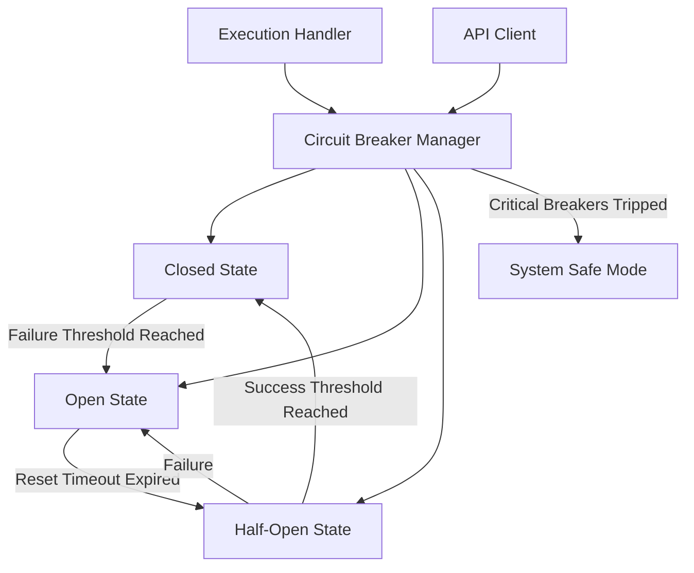

# Enhanced Circuit Breaker Implementation

## Overview

Based on the Gemini critic feedback, we're implementing a robust circuit breaker system with proper state management, metrics collection, and integration with the rest of the system. This document outlines the enhanced implementation.

## Architecture



## Enhanced Circuit Breaker Class

```python
class CircuitBreaker:
    """
    Enhanced circuit breaker pattern implementation with proper state management,
    metrics tracking, and adaptive parameters.
    """
    
    # Circuit breaker states
    CLOSED = "CLOSED"
    OPEN = "OPEN"
    HALF_OPEN = "HALF_OPEN"
    
    def __init__(self, 
                 name: str,
                 failure_threshold: int = 3, 
                 reset_timeout: int = 300,
                 half_open_max_calls: int = 3,
                 success_threshold: int = 2):
        """
        Initialize circuit breaker
        
        Args:
            name: Name of this circuit breaker for identification
            failure_threshold: Number of failures before opening circuit
            reset_timeout: Seconds to wait before attempting reset (half-open)
            half_open_max_calls: Maximum calls allowed in half-open state
            success_threshold: Consecutive successes needed to close circuit
        """
        self.name = name
        self.failure_threshold = failure_threshold
        self.reset_timeout = reset_timeout
        self.half_open_max_calls = half_open_max_calls
        self.success_threshold = success_threshold
        
        # State tracking
        self.state = self.CLOSED
        self.failures = 0
        self.successes = 0
        self.last_failure_time = 0
        self.last_state_change_time = time.time()
        self.half_open_calls = 0
        
        # Metrics
        self.total_failures = 0
        self.total_successes = 0
        self.trip_count = 0
        self.last_trip_reason = None
        
        self.logger = logging.getLogger(__name__)
    
    def record_success(self):
        """Record a successful operation"""
        self.total_successes += 1
        
        if self.state == self.CLOSED:
            # Reset failure counter in closed state
            self.failures = 0
        
        elif self.state == self.HALF_OPEN:
            # In half-open state, track consecutive successes
            self.successes += 1
            self.half_open_calls += 1
            
            # Check if we've had enough successes to close the circuit
            if self.successes >= self.success_threshold:
                self._transition_to_closed("Success threshold reached")
            
            # If we've hit the max calls for half-open but didn't reach success threshold,
            # go back to open state
            elif self.half_open_calls >= self.half_open_max_calls:
                self._transition_to_open("Max half-open calls reached without success threshold")
    
    def record_failure(self, reason: str = "Unknown failure"):
        """
        Record a failed operation
        
        Args:
            reason: Reason for the failure
        """
        self.total_failures += 1
        self.failures += 1
        self.last_failure_time = time.time()
        
        if self.state == self.CLOSED:
            # Check if we've hit the failure threshold
            if self.failures >= self.failure_threshold:
                self._transition_to_open(reason)
        
        elif self.state == self.HALF_OPEN:
            # Any failure in half-open state sends us back to open
            self._transition_to_open(reason)
            
    def allow_request(self) -> bool:
        """
        Check if a request should be allowed
        
        Returns:
            True if request should be allowed, False otherwise
        """
        if self.state == self.CLOSED:
            return True
        
        elif self.state == self.OPEN:
            # Check if it's time to transition to half-open
            if time.time() - self.last_failure_time > self.reset_timeout:
                self._transition_to_half_open("Reset timeout expired")
                return True
            return False
        
        elif self.state == self.HALF_OPEN:
            # Allow limited number of requests in half-open state
            return self.half_open_calls < self.half_open_max_calls
            
        return False
    
    def get_state(self) -> str:
        """Get current circuit breaker state"""
        return self.state
    
    def get_metrics(self) -> Dict[str, Any]:
        """Get circuit breaker metrics"""
        return {
            "name": self.name,
            "state": self.state,
            "failures": self.failures,
            "successes": self.successes,
            "total_failures": self.total_failures,
            "total_successes": self.total_successes,
            "trip_count": self.trip_count,
            "last_failure_time": self.last_failure_time,
            "last_state_change_time": self.last_state_change_time,
            "last_trip_reason": self.last_trip_reason,
            "time_in_current_state": time.time() - self.last_state_change_time
        }
    
    def reset(self):
        """Force reset the circuit breaker to closed state"""
        self._transition_to_closed("Manual reset")
    
    def _transition_to_open(self, reason: str):
        """Transition to open state"""
        if self.state != self.OPEN:
            self.logger.warning(f"Circuit breaker '{self.name}' tripped: {reason}")
            self.state = self.OPEN
            self.last_state_change_time = time.time()
            self.successes = 0
            self.half_open_calls = 0
            self.trip_count += 1
            self.last_trip_reason = reason
    
    def _transition_to_half_open(self, reason: str):
        """Transition to half-open state"""
        if self.state != self.HALF_OPEN:
            self.logger.info(f"Circuit breaker '{self.name}' entering half-open state: {reason}")
            self.state = self.HALF_OPEN
            self.last_state_change_time = time.time()
            self.successes = 0
            self.half_open_calls = 0
    
    def _transition_to_closed(self, reason: str):
        """Transition to closed state"""
        if self.state != self.CLOSED:
            self.logger.info(f"Circuit breaker '{self.name}' closed: {reason}")
            self.state = self.CLOSED
            self.last_state_change_time = time.time()
            self.failures = 0
            self.successes = 0
            self.half_open_calls = 0
```

## Circuit Breaker Manager

```python
class CircuitBreakerManager:
    """
    Manages multiple circuit breakers for different services, exchanges,
    or endpoints. Provides a centralized interface for circuit breaker logic.
    """
    
    def __init__(self, config: Config):
        """
        Initialize circuit breaker manager
        
        Args:
            config: Application configuration
        """
        self.config = config
        self.circuit_breakers: Dict[str, CircuitBreaker] = {}
        self.logger = logging.getLogger(__name__)
        
        # Default parameters
        self.default_failure_threshold = config.get("circuit_breaker.failure_threshold", 3)
        self.default_reset_timeout = config.get("circuit_breaker.reset_timeout", 300)  # 5 minutes
        self.default_half_open_max_calls = config.get("circuit_breaker.half_open_max_calls", 3)
        self.default_success_threshold = config.get("circuit_breaker.success_threshold", 2)
        
        # Load exchange-specific parameters
        self.exchange_params = {}
        for exchange in ['hyperliquid', 'backpack']:
            if config.get(f'exchanges.{exchange}.enabled', False):
                self.exchange_params[exchange] = {
                    'failure_threshold': config.get(f'circuit_breaker.{exchange}.failure_threshold', 
                                                self.default_failure_threshold),
                    'reset_timeout': config.get(f'circuit_breaker.{exchange}.reset_timeout', 
                                             self.default_reset_timeout),
                    'half_open_max_calls': config.get(f'circuit_breaker.{exchange}.half_open_max_calls', 
                                                   self.default_half_open_max_calls),
                    'success_threshold': config.get(f'circuit_breaker.{exchange}.success_threshold', 
                                                 self.default_success_threshold)
                }
    
    def get_circuit_breaker(self, name: str) -> CircuitBreaker:
        """
        Get or create a circuit breaker by name
        
        Args:
            name: Circuit breaker name (e.g., 'hyperliquid.order_placement')
            
        Returns:
            CircuitBreaker instance
        """
        if name not in self.circuit_breakers:
            # Parse name to extract exchange if applicable
            parts = name.split('.')
            exchange = parts[0] if len(parts) > 0 and parts[0] in self.exchange_params else None
            
            # Use exchange-specific parameters if available
            if exchange and exchange in self.exchange_params:
                params = self.exchange_params[exchange]
                self.circuit_breakers[name] = CircuitBreaker(
                    name=name,
                    failure_threshold=params['failure_threshold'],
                    reset_timeout=params['reset_timeout'],
                    half_open_max_calls=params['half_open_max_calls'],
                    success_threshold=params['success_threshold']
                )
            else:
                # Use default parameters
                self.circuit_breakers[name] = CircuitBreaker(
                    name=name,
                    failure_threshold=self.default_failure_threshold,
                    reset_timeout=self.default_reset_timeout,
                    half_open_max_calls=self.default_half_open_max_calls,
                    success_threshold=self.default_success_threshold
                )
            
            self.logger.info(f"Created circuit breaker: {name}")
        
        return self.circuit_breakers[name]
    
    def allow_request(self, name: str) -> bool:
        """
        Check if a request should be allowed
        
        Args:
            name: Circuit breaker name
            
        Returns:
            True if request should be allowed, False otherwise
        """
        cb = self.get_circuit_breaker(name)
        return cb.allow_request()
    
    def record_success(self, name: str):
        """
        Record a successful operation
        
        Args:
            name: Circuit breaker name
        """
        cb = self.get_circuit_breaker(name)
        cb.record_success()
    
    def record_failure(self, name: str, reason: str = "Unknown failure"):
        """
        Record a failed operation
        
        Args:
            name: Circuit breaker name
            reason: Failure reason
        """
        cb = self.get_circuit_breaker(name)
        cb.record_failure(reason)
    
    def reset_circuit_breaker(self, name: str):
        """
        Force reset a circuit breaker to closed state
        
        Args:
            name: Circuit breaker name
        """
        cb = self.get_circuit_breaker(name)
        cb.reset()
    
    def get_all_metrics(self) -> Dict[str, Dict[str, Any]]:
        """
        Get metrics for all circuit breakers
        
        Returns:
            Dictionary of metrics by circuit breaker name
        """
        return {name: cb.get_metrics() for name, cb in self.circuit_breakers.items()}
    
    def get_tripped_breakers(self) -> List[str]:
        """
        Get list of currently tripped circuit breakers
        
        Returns:
            List of circuit breaker names in OPEN state
        """
        return [name for name, cb in self.circuit_breakers.items() 
                if cb.get_state() == CircuitBreaker.OPEN]
    
    def is_critical_function_impaired(self) -> bool:
        """
        Check if any critical functions are impaired by tripped breakers
        
        Returns:
            True if any critical circuit breakers are tripped
        """
        critical_prefixes = [
            "hyperliquid.order", 
            "backpack.order",
            "hyperliquid.position",
            "backpack.position"
        ]
        
        tripped = self.get_tripped_breakers()
        
        for breaker in tripped:
            for prefix in critical_prefixes:
                if breaker.startswith(prefix):
                    return True
                    
        return False
```

## Integration with API Clients

```python
class HyperLiquidAPI(ExchangeAPI):
    """
    HyperLiquid API client implementation with circuit breaker integration.
    """
    
    def __init__(self, config: Config, secrets: Dict[str, Any], 
                circuit_breaker_manager: CircuitBreakerManager):
        super().__init__(config, secrets)
        self.exchange_name = "hyperliquid"
        self.base_url = "https://api.hyperliquid.xyz"
        self.ws_url = "wss://api.hyperliquid.xyz/ws"
        
        # Circuit breaker integration
        self.circuit_breaker_manager = circuit_breaker_manager
        
        # Initialize HTTP session
        self._session = aiohttp.ClientSession()
    
    async def _request(self, method: str, endpoint: str, 
                     params: Dict[str, Any] = None, 
                     data: Dict[str, Any] = None,
                     auth_required: bool = False) -> Dict[str, Any]:
        """
        Make HTTP request to API with circuit breaker protection
        """
        # Categorize request for circuit breaker
        category = "auth" if auth_required else "public"
        if "order" in endpoint:
            category += ".order"
        elif "position" in endpoint:
            category += ".position"
        elif "account" in endpoint:
            category += ".account"
        elif "funding" in endpoint:
            category += ".funding"
        
        cb_name = f"{self.exchange_name}.{category}"
        
        # Check if request is allowed by circuit breaker
        if not self.circuit_breaker_manager.allow_request(cb_name):
            raise CircuitBreakerOpenError(f"Circuit breaker open for {cb_name}")
        
        try:
            # Prepare the request
            url = f"{self.base_url}{endpoint}"
            
            # Add authentication if required
            headers = {}
            if auth_required and self.api_key and self.api_secret:
                # Add auth headers (implementation specific to HyperLiquid)
                pass
            
            # Execute the request
            async with self._session.request(
                method, 
                url, 
                params=params,
                json=data,
                headers=headers
            ) as response:
                if response.status != 200:
                    error_text = await response.text()
                    self.circuit_breaker_manager.record_failure(
                        cb_name, 
                        f"HTTP {response.status}: {error_text}"
                    )
                    raise APIError(f"HTTP {response.status}: {error_text}")
                
                result = await response.json()
                
                # Record success
                self.circuit_breaker_manager.record_success(cb_name)
                
                return result
                
        except Exception as e:
            # Record failure
            self.circuit_breaker_manager.record_failure(cb_name, str(e))
            raise
```

## Integration with Execution Handler

```python
class ExecutionHandler:
    """
    Handles the execution of trades on exchanges with circuit breaker integration.
    """
    
    def __init__(self, config: Config, api_clients: Dict[str, ExchangeAPI], 
                portfolio_tracker: PortfolioTracker, 
                circuit_breaker_manager: CircuitBreakerManager):
        self.config = config
        self.api_clients = api_clients
        self.portfolio_tracker = portfolio_tracker
        self.circuit_breaker_manager = circuit_breaker_manager
        self.logger = logging.getLogger(__name__)
        
        # Track executions
        self.executions: List[TradeExecution] = []
        self.active_executions: Dict[str, TradeExecution] = {}
    
    async def execute_arbitrage(self, opportunity: SizedOpportunity) -> TradeExecution:
        """
        Execute an arbitrage opportunity by placing trades on both exchanges
        
        Args:
            opportunity: Sized arbitrage opportunity
            
        Returns:
            TradeExecution object with results
        """
        self.logger.info(f"Executing arbitrage: {opportunity}")
        
        execution = TradeExecution(opportunity)
        execution_id = execution.execution_id
        self.active_executions[execution_id] = execution
        
        # Check circuit breakers before execution
        perp_cb_name = f"{opportunity.perp_exchange}.order_placement"
        
        # For dual-perp strategy
        if hasattr(opportunity, 'perp_exchange2') and opportunity.perp_exchange2:
            perp2_cb_name = f"{opportunity.perp_exchange2}.order_placement"
            
            # Check both circuit breakers
            if not self.circuit_breaker_manager.allow_request(perp_cb_name):
                self.logger.warning(f"Circuit breaker tripped for {perp_cb_name}, aborting execution")
                execution.set_status(ExecutionStatus.REJECTED)
                execution.add_error(f"Circuit breaker tripped for {perp_cb_name}")
                return execution
                
            if not self.circuit_breaker_manager.allow_request(perp2_cb_name):
                self.logger.warning(f"Circuit breaker tripped for {perp2_cb_name}, aborting execution")
                execution.set_status(ExecutionStatus.REJECTED)
                execution.add_error(f"Circuit breaker tripped for {perp2_cb_name}")
                return execution
                
            # Proceed with dual-perp execution...
            
        else:  # For perp-spot strategy
            spot_cb_name = f"{opportunity.spot_exchange}.order_placement"
            
            # Check both circuit breakers
            if not self.circuit_breaker_manager.allow_request(perp_cb_name):
                self.logger.warning(f"Circuit breaker tripped for {perp_cb_name}, aborting execution")
                execution.set_status(ExecutionStatus.REJECTED)
                execution.add_error(f"Circuit breaker tripped for {perp_cb_name}")
                return execution
                
            if not self.circuit_breaker_manager.allow_request(spot_cb_name):
                self.logger.warning(f"Circuit breaker tripped for {spot_cb_name}, aborting execution")
                execution.set_status(ExecutionStatus.REJECTED)
                execution.add_error(f"Circuit breaker tripped for {spot_cb_name}")
                return execution
                
            # Proceed with perp-spot execution...
        
        # Implementation continues with order placement using circuit breaker protection...
        return execution
    
    async def _place_order_with_retry(self, order: Order, max_retries: int = 3) -> Dict[str, Any]:
        """
        Place an order with retry logic and circuit breaker protection
        
        Args:
            order: Order to place
            max_retries: Maximum number of retries
            
        Returns:
            Order result
        """
        cb_name = f"{order.exchange}.order_placement"
        
        for attempt in range(max_retries):
            try:
                # Check circuit breaker
                if not self.circuit_breaker_manager.allow_request(cb_name):
                    return {"error": "Circuit breaker tripped", "status": "rejected"}
                
                result = await self.api_clients[order.exchange].place_order(order)
                
                # Record success
                self.circuit_breaker_manager.record_success(cb_name)
                
                return result
            except Exception as e:
                self.logger.warning(f"Order placement attempt {attempt+1} failed: {e}")
                
                # Record failure
                self.circuit_breaker_manager.record_failure(cb_name, str(e))
                
                # Last attempt failed
                if attempt == max_retries - 1:
                    return {"error": str(e), "status": "failed"}
                
                # Exponential backoff
                await asyncio.sleep(2 ** attempt)
```

## Safe Mode Integration

```python
class TradingEngine:
    """
    Main trading engine with circuit breaker and safe mode integration.
    """
    
    def __init__(self, config: Config, api_clients: Dict[str, ExchangeAPI],
                portfolio_tracker: PortfolioTracker,
                risk_manager: RiskManager):
        self.config = config
        self.api_clients = api_clients
        self.portfolio_tracker = portfolio_tracker
        self.risk_manager = risk_manager
        self.logger = logging.getLogger(__name__)
        
        # Initialize circuit breaker manager
        self.circuit_breaker_manager = CircuitBreakerManager(config)
        
        # Initialize execution handler with circuit breaker manager
        self.execution_handler = ExecutionHandler(
            config, 
            api_clients, 
            portfolio_tracker, 
            self.circuit_breaker_manager
        )
        
        # Safe mode flag
        self.safe_mode = False
        
        # Initialize API clients with circuit breaker manager
        for client in self.api_clients.values():
            if hasattr(client, 'set_circuit_breaker_manager'):
                client.set_circuit_breaker_manager(self.circuit_breaker_manager)
    
    async def run(self):
        """Main trading engine run loop"""
        while True:
            try:
                # Check for system health issues
                await self._check_system_health()
                
                # If in safe mode, limit operations
                if self.safe_mode:
                    await self._handle_safe_mode()
                    await asyncio.sleep(60)  # Sleep longer in safe mode
                    continue
                
                # Normal operation
                await self._run_normal_operation()
                
                await asyncio.sleep(10)  # Short sleep during normal operation
                
            except Exception as e:
                self.logger.error(f"Error in trading engine loop: {e}")
                await asyncio.sleep(30)  # Sleep on error
    
    async def _check_system_health(self):
        """Check system health and enter safe mode if necessary"""
        
        # Check if any critical circuit breakers are tripped
        if self.circuit_breaker_manager.is_critical_function_impaired():
            self.logger.warning("Critical circuit breakers tripped, entering safe mode")
            self._enter_safe_mode("Critical circuit breakers tripped")
    
    def _enter_safe_mode(self, reason: str):
        """Enter safe mode, limiting operations"""
        if not self.safe_mode:
            self.logger.warning(f"Entering safe mode: {reason}")
            self.safe_mode = True
    
    def _exit_safe_mode(self):
        """Exit safe mode, resuming normal operations"""
        if self.safe_mode:
            self.logger.info("Exiting safe mode")
            self.safe_mode = False
```

## Testing the Circuit Breaker System

```python
class TestCircuitBreaker(unittest.TestCase):
    def setUp(self):
        self.cb = CircuitBreaker(name="test_cb", failure_threshold=3, reset_timeout=1)
    
    def test_initial_state(self):
        self.assertEqual(self.cb.state, CircuitBreaker.CLOSED)
        self.assertTrue(self.cb.allow_request())
    
    def test_failure_threshold(self):
        # Record two failures - should still be closed
        self.cb.record_failure("test failure")
        self.cb.record_failure("test failure")
        self.assertEqual(self.cb.state, CircuitBreaker.CLOSED)
        self.assertTrue(self.cb.allow_request())
        
        # Third failure should trip the breaker
        self.cb.record_failure("test failure")
        self.assertEqual(self.cb.state, CircuitBreaker.OPEN)
        self.assertFalse(self.cb.allow_request())
    
    def test_reset_timeout(self):
        # Trip the breaker
        self.cb.record_failure("test failure")
        self.cb.record_failure("test failure")
        self.cb.record_failure("test failure")
        
        # Should be open
        self.assertEqual(self.cb.state, CircuitBreaker.OPEN)
        self.assertFalse(self.cb.allow_request())
        
        # Wait for reset timeout
        time.sleep(1.1)
        
        # Should transition to half-open on next check
        self.assertTrue(self.cb.allow_request())
        self.assertEqual(self.cb.state, CircuitBreaker.HALF_OPEN)
    
    def test_half_open_state(self):
        # Trip the breaker and wait for timeout
        self.cb.record_failure("test failure")
        self.cb.record_failure("test failure")
        self.cb.record_failure("test failure")
        time.sleep(1.1)
        
        # Should be half-open after allow_request call
        self.assertTrue(self.cb.allow_request())
        self.assertEqual(self.cb.state, CircuitBreaker.HALF_OPEN)
        
        # Success should not immediately close
        self.cb.record_success()
        self.assertEqual(self.cb.state, CircuitBreaker.HALF_OPEN)
        
        # Second success should close
        self.cb.record_success()
        self.assertEqual(self.cb.state, CircuitBreaker.CLOSED)
    
    def test_half_open_failure(self):
        # Trip the breaker and wait for timeout
        self.cb.record_failure("test failure")
        self.cb.record_failure("test failure")
        self.cb.record_failure("test failure")
        time.sleep(1.1)
        
        # Should be half-open after allow_request call
        self.assertTrue(self.cb.allow_request())
        self.assertEqual(self.cb.state, CircuitBreaker.HALF_OPEN)
        
        # Failure should trip breaker again
        self.cb.record_failure("test failure")
        self.assertEqual(self.cb.state, CircuitBreaker.OPEN)
        self.assertFalse(self.cb.allow_request())
```

## Next Steps

1. **Implementation Priority**:
   - Implement the `CircuitBreaker` class with full state management
   - Implement the `CircuitBreakerManager` for granular control
   - Integrate with API clients and execution handler
   - Add safe mode integration
   - Implement comprehensive testing

2. **Key Integration Points**:
   - API client request methods
   - Order placement operations
   - Validation operations
   - System health checks
   - Safe mode triggers

3. **Performance Considerations**:
   - Minimize overhead in allow_request checks
   - Use lightweight metric collection
   - Consider thread-safety for concurrent operations 