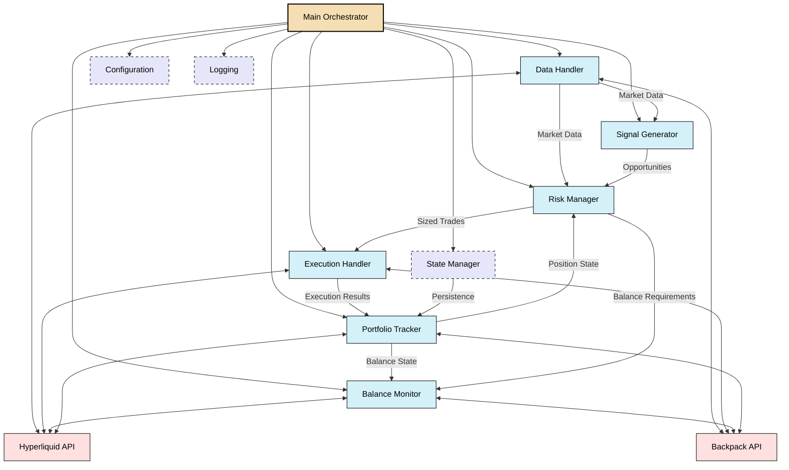
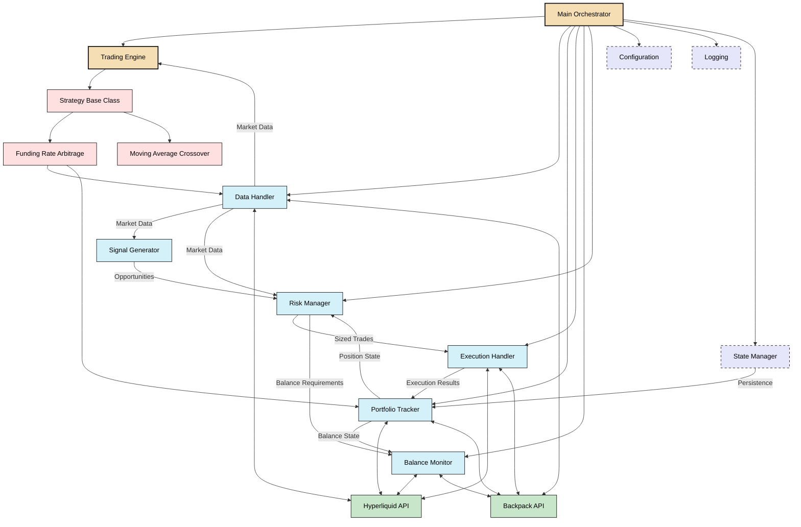

# Architecture Comparison: Implementation vs Specification

This document compares the current implementation architecture with the architecture specified in the prototype documentation, highlighting alignments and deviations.

## System Architecture Overview

### Specified Architecture (from `1_core_architecture.md`)



### Current Implementation Architecture

The current implementation largely follows the specified architecture with some additions and modifications:



## Key Architectural Differences

1. **Addition of Trading Engine**:
   - The current implementation adds a `Trading Engine` component that wasn't explicitly defined in the prototype architecture.
   - The Engine serves as a central coordinator for strategies and market data processing.

2. **Strategy Class Hierarchy**:
   - The implementation introduces a more formal strategy class hierarchy with a base `Strategy` class and concrete implementations.
   - In the prototype, strategies were mentioned but their integration into the architecture wasn't fully detailed.

3. **Missing Validation Components**:
   - The prototype documentation specifies validation systems for funding rate calculations and position reconciliation.
   - These dedicated validation components are missing in the current implementation.

4. **Circuit Breaker Pattern**:
   - The prototype documentation specifies a Circuit Breaker pattern for fault tolerance.
   - While there is basic error handling, the full Circuit Breaker pattern is not fully implemented.

## Component-by-Component Comparison

### Main Orchestrator

**Specification**: Central control system for initialization, coordination, and shutdown.

**Implementation**: Implemented as `main.py` with additional `Engine` class that:
- Initializes all components
- Manages strategies
- Processes market data through strategies
- Handles signals
- Manages positions and P&L calculation

```python
# Current implementation in main.py
async def main() -> None:
    """Main application entry point"""
    # Parse command line arguments
    parser = argparse.ArgumentParser(description="CyberDeltaEngine - Funding Rate Arbitrage Bot")
    # ...
    
    # Initialize application state
    app_state: Dict[str, Any] = {}
    
    try:
        # Set up state manager, API clients, and core components
        # ...
        
        # Initialize engine
        engine = Engine()
        app_state['engine'] = engine
        
        # Initialize strategies
        for symbol in symbols:
            # Create and add strategies
            # ...
        
        # Start the engine
        engine.start()
        
        # Main run loop
        while True:
            # Periodic operations
            # ...
            await asyncio.sleep(config.get("general.check_interval", 60))
    
    except Exception as e:
        logger.error(f"Error: {e}")
    finally:
        # Ensure proper shutdown
        await shutdown(app_state)
```

### Data Handler

**Specification**: Centralized market data collection and management.

**Implementation**: Implemented largely as specified with:
- WebSocket connections to exchanges
- Market data storage and normalization
- Data freshness tracking

Missing from implementation:
- Detailed data validation mechanisms
- Stale data detection and handling

### Portfolio Tracker

**Specification**: Track and manage the current state of the portfolio.

**Implementation**: Implemented largely as specified with:
- Balance tracking across exchanges
- Position tracking with P&L
- Order status tracking

Missing from implementation:
- Regular reconciliation with exchange data
- Multi-source position verification

### Signal Generator

**Specification**: Identify funding rate arbitrage opportunities.

**Implementation**: Implemented with basic functionality:
- NFD calculation
- Expected profit calculation
- Opportunity ranking

Missing from implementation:
- Advanced filtering mechanisms
- Detailed signal validation
- Funding rate prediction validation

### Risk Manager

**Specification**: Assess and size trades based on risk parameters.

**Implementation**: Implemented with basic functionality:
- Position size constraints
- Exposure limits
- Basic Kelly-based sizing

Missing from implementation:
- Dynamic VaR calculation
- Market volatility adjustments

### Execution Handler

**Specification**: Execute trades on exchanges reliably.

**Implementation**: Implemented with basic functionality:
- Order placement with retries
- Order status monitoring
- Error handling

Missing from implementation:
- Full circuit breaker implementation
- Detailed execution state tracking
- Comprehensive compensation strategies

### Balance Monitor

**Specification**: Monitor exchange balances and alert when manual transfers are needed.

**Implementation**: Implemented largely as specified with:
- Balance checking with alerts
- Threshold monitoring

Missing from implementation:
- Balance change verification
- Safe mode triggers for balance discrepancies

## Data Flow Comparison

### Specified Data Flow

1. **Initialization**:
   - Load configuration and secrets
   - Connect to exchange APIs
   - Initialize exchange adapters
   - Establish WebSocket connections

2. **Market Data Ingestion**:
   - Poll funding rates from all exchanges 
   - Subscribe to price updates via WebSockets
   - Collect historical data for analysis
   - Maintain time-series data with proper timestamp handling

3. **Strategy Execution**:
   - Identify arbitrage opportunities
   - Calculate position sizes and expected returns
   - Execute trades with appropriate risk controls
   - Implement circuit breakers for safety

4. **Position Monitoring**:
   - Track position performance
   - Apply stop-loss or take-profit rules
   - Close positions when conditions change
   - Multi-source position verification

### Current Implementation Data Flow

The current implementation largely follows the specified data flow with some differences:

1. **Initialization**: Implemented as specified

2. **Market Data Ingestion**:
   - Implemented basic data collection
   - Missing proper time-series management and historical data analysis

3. **Strategy Execution**:
   - Managed through the Engine class
   - Missing full circuit breaker implementation
   - Missing proper handling of partial execution

4. **Position Monitoring**:
   - Basic position tracking implemented
   - Missing multi-source verification
   - Missing advanced stop-loss and take-profit rules

## Design Pattern Implementation

### Specified Design Patterns

1. **Adapter Pattern** for exchange-specific implementations
2. **Strategy Pattern** for various trading algorithms
3. **Repository Pattern** for data access
4. **Factory Pattern** for creating exchange-specific components
5. **Circuit Breaker Pattern** for fault tolerance

### Current Implementation Patterns

1. **Adapter Pattern**: Implemented for exchange APIs
2. **Strategy Pattern**: Implemented with base Strategy class and specific strategies
3. **Repository Pattern**: Partially implemented for data access
4. **Factory Pattern**: Not fully implemented
5. **Circuit Breaker Pattern**: Basic implementation only, missing key features

## Overall Architecture Assessment

The current implementation follows the core architecture outlined in the prototype documentation, but with several missing components and incomplete features. The basic structure is sound, but the implementation lacks some of the robustness, validation mechanisms, and error handling specified in the prototype documentation.

Key areas that need completion:
1. Validation systems for funding rate calculations
2. Multi-source reconciliation for position data
3. Full circuit breaker implementation
4. Comprehensive error handling and recovery mechanisms 