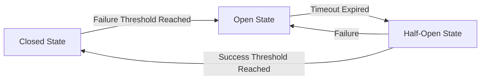

# Circuit Breaker Implementation Status

## Overview

The CyberDeltaEngine system requires robust error handling and fault tolerance mechanisms to ensure reliable operation in the face of network issues, API failures, and other unexpected events. Circuit breakers are a critical component of this error handling strategy. This document examines the current state of circuit breaker implementation, what is missing, and how it should be implemented.

## Circuit Breaker Pattern

The circuit breaker pattern is a design pattern used to detect failures and prevent cascade failures in distributed systems. It works by "tripping" (opening the circuit) when a certain threshold of failures is detected, preventing further calls that are likely to fail. After a configured timeout, the circuit breaker allows a limited number of test calls through to determine if the problem has been resolved. If successful, the circuit is closed; if not, it remains open.



## Current Implementation Status

Based on the project status documentation, the circuit breaker implementation is incomplete. There is a basic implementation in the `ExecutionHandler` class:

```python
class CircuitBreaker:
    """
    Circuit breaker pattern implementation for preventing excessive trading
    during failing conditions.
    """
    
    def __init__(self, failure_threshold: int = 3, reset_timeout: int = 300):
        self.failure_threshold = failure_threshold
        self.reset_timeout = reset_timeout  # seconds
        self.failures = 0
        self.last_failure_time = 0
        self.tripped = False
    
    def record_success(self):
        """Record a successful operation"""
        self.failures = 0
        self.tripped = False
    
    def record_failure(self):
        """Record a failed operation"""
        self.failures += 1
        self.last_failure_time = time.time()
        
        if self.failures >= self.failure_threshold:
            self.tripped = True
    
    def is_tripped(self) -> bool:
        """Check if circuit breaker is tripped"""
        # Reset if timeout has elapsed
        if self.tripped and time.time() - self.last_failure_time > self.reset_timeout:
            self.tripped = False
            self.failures = 0
        
        return self.tripped
```

However, this implementation is missing several key features:

1. **Half-Open State**: The current implementation doesn't properly implement the half-open state where a limited number of test calls are allowed.

2. **Granular Circuit Breakers**: The implementation doesn't provide separate circuit breakers for different exchanges or API endpoints.

3. **Adaptive Parameters**: There's no mechanism to adjust circuit breaker parameters based on observed performance.

4. **Metrics Collection**: The implementation doesn't collect detailed metrics about failures and success rates.

5. **Integration with Logging**: Limited integration with the logging system for tracking circuit breaker state changes.

6. **Recovery Strategies**: No defined strategies for recovering from tripped circuit breakers.

## Proposed Implementation

### 1. Enhanced Circuit Breaker Class

```python
class CircuitBreaker:
    """
    Enhanced circuit breaker pattern implementation with proper state management,
    metrics tracking, and adaptive parameters.
    """
    
    # Circuit breaker states
    CLOSED = "CLOSED"
    OPEN = "OPEN"
    HALF_OPEN = "HALF_OPEN"
    
    def __init__(self, 
                 name: str,
                 failure_threshold: int = 3, 
                 reset_timeout: int = 300,
                 half_open_max_calls: int = 3,
                 success_threshold: int = 2):
        """
        Initialize circuit breaker
        
        Args:
            name: Name of this circuit breaker for identification
            failure_threshold: Number of failures before opening circuit
            reset_timeout: Seconds to wait before attempting reset (half-open)
            half_open_max_calls: Maximum calls allowed in half-open state
            success_threshold: Consecutive successes needed to close circuit
        """
        self.name = name
        self.failure_threshold = failure_threshold
        self.reset_timeout = reset_timeout
        self.half_open_max_calls = half_open_max_calls
        self.success_threshold = success_threshold
        
        # State tracking
        self.state = self.CLOSED
        self.failures = 0
        self.successes = 0
        self.last_failure_time = 0
        self.last_state_change_time = time.time()
        self.half_open_calls = 0
        
        # Metrics
        self.total_failures = 0
        self.total_successes = 0
        self.trip_count = 0
        self.last_trip_reason = None
        
        self.logger = logging.getLogger(__name__)
    
    def record_success(self):
        """Record a successful operation"""
        self.total_successes += 1
        
        if self.state == self.CLOSED:
            # Reset failure counter in closed state
            self.failures = 0
        
        elif self.state == self.HALF_OPEN:
            # In half-open state, track consecutive successes
            self.successes += 1
            self.half_open_calls += 1
            
            # Check if we've had enough successes to close the circuit
            if self.successes >= self.success_threshold:
                self._transition_to_closed("Success threshold reached")
            
            # If we've hit the max calls for half-open but didn't reach success threshold,
            # go back to open state
            elif self.half_open_calls >= self.half_open_max_calls:
                self._transition_to_open("Max half-open calls reached without success threshold")
    
    def record_failure(self, reason: str = "Unknown failure"):
        """
        Record a failed operation
        
        Args:
            reason: Reason for the failure
        """
        self.total_failures += 1
        self.failures += 1
        self.last_failure_time = time.time()
        
        if self.state == self.CLOSED:
            # Check if we've hit the failure threshold
            if self.failures >= self.failure_threshold:
                self._transition_to_open(reason)
        
        elif self.state == self.HALF_OPEN:
            # Any failure in half-open state sends us back to open
            self._transition_to_open(reason)
            
    def allow_request(self) -> bool:
        """
        Check if a request should be allowed
        
        Returns:
            True if request should be allowed, False otherwise
        """
        if self.state == self.CLOSED:
            return True
        
        elif self.state == self.OPEN:
            # Check if it's time to transition to half-open
            if time.time() - self.last_failure_time > self.reset_timeout:
                self._transition_to_half_open("Reset timeout expired")
                return True
            return False
        
        elif self.state == self.HALF_OPEN:
            # Allow limited number of requests in half-open state
            return self.half_open_calls < self.half_open_max_calls
            
        return False
    
    def get_state(self) -> str:
        """Get current circuit breaker state"""
        return self.state
    
    def get_metrics(self) -> Dict[str, Any]:
        """Get circuit breaker metrics"""
        return {
            "name": self.name,
            "state": self.state,
            "failures": self.failures,
            "successes": self.successes,
            "total_failures": self.total_failures,
            "total_successes": self.total_successes,
            "trip_count": self.trip_count,
            "last_failure_time": self.last_failure_time,
            "last_state_change_time": self.last_state_change_time,
            "last_trip_reason": self.last_trip_reason,
            "time_in_current_state": time.time() - self.last_state_change_time
        }
    
    def reset(self):
        """Force reset the circuit breaker to closed state"""
        self._transition_to_closed("Manual reset")
    
    def _transition_to_open(self, reason: str):
        """Transition to open state"""
        if self.state != self.OPEN:
            self.logger.warning(f"Circuit breaker '{self.name}' tripped: {reason}")
            self.state = self.OPEN
            self.last_state_change_time = time.time()
            self.successes = 0
            self.half_open_calls = 0
            self.trip_count += 1
            self.last_trip_reason = reason
    
    def _transition_to_half_open(self, reason: str):
        """Transition to half-open state"""
        if self.state != self.HALF_OPEN:
            self.logger.info(f"Circuit breaker '{self.name}' entering half-open state: {reason}")
            self.state = self.HALF_OPEN
            self.last_state_change_time = time.time()
            self.successes = 0
            self.half_open_calls = 0
    
    def _transition_to_closed(self, reason: str):
        """Transition to closed state"""
        if self.state != self.CLOSED:
            self.logger.info(f"Circuit breaker '{self.name}' closed: {reason}")
            self.state = self.CLOSED
            self.last_state_change_time = time.time()
            self.failures = 0
            self.successes = 0
            self.half_open_calls = 0
```

### 2. Circuit Breaker Manager

```python
class CircuitBreakerManager:
    """
    Manages multiple circuit breakers for different services, exchanges,
    or endpoints. Provides a centralized interface for circuit breaker logic.
    """
    
    def __init__(self, config: Config):
        """
        Initialize circuit breaker manager
        
        Args:
            config: Application configuration
        """
        self.config = config
        self.circuit_breakers: Dict[str, CircuitBreaker] = {}
        self.logger = logging.getLogger(__name__)
        
        # Default parameters
        self.default_failure_threshold = config.get("circuit_breaker.failure_threshold", 3)
        self.default_reset_timeout = config.get("circuit_breaker.reset_timeout", 300)
        self.default_half_open_max_calls = config.get("circuit_breaker.half_open_max_calls", 3)
        self.default_success_threshold = config.get("circuit_breaker.success_threshold", 2)
        
        # Load exchange-specific parameters
        self.exchange_params = {}
        for exchange in ['hyperliquid', 'backpack']:
            if config.get(f'exchanges.{exchange}.enabled', False):
                self.exchange_params[exchange] = {
                    'failure_threshold': config.get(f'circuit_breaker.{exchange}.failure_threshold', 
                                                self.default_failure_threshold),
                    'reset_timeout': config.get(f'circuit_breaker.{exchange}.reset_timeout', 
                                             self.default_reset_timeout),
                    'half_open_max_calls': config.get(f'circuit_breaker.{exchange}.half_open_max_calls', 
                                                   self.default_half_open_max_calls),
                    'success_threshold': config.get(f'circuit_breaker.{exchange}.success_threshold', 
                                                 self.default_success_threshold)
                }
    
    def get_circuit_breaker(self, name: str) -> CircuitBreaker:
        """
        Get or create a circuit breaker by name
        
        Args:
            name: Circuit breaker name (e.g., 'hyperliquid.order_placement')
            
        Returns:
            CircuitBreaker instance
        """
        if name not in self.circuit_breakers:
            # Parse name to extract exchange if applicable
            parts = name.split('.')
            exchange = parts[0] if len(parts) > 0 and parts[0] in self.exchange_params else None
            
            # Use exchange-specific parameters if available
            if exchange and exchange in self.exchange_params:
                params = self.exchange_params[exchange]
                self.circuit_breakers[name] = CircuitBreaker(
                    name=name,
                    failure_threshold=params['failure_threshold'],
                    reset_timeout=params['reset_timeout'],
                    half_open_max_calls=params['half_open_max_calls'],
                    success_threshold=params['success_threshold']
                )
            else:
                # Use default parameters
                self.circuit_breakers[name] = CircuitBreaker(
                    name=name,
                    failure_threshold=self.default_failure_threshold,
                    reset_timeout=self.default_reset_timeout,
                    half_open_max_calls=self.default_half_open_max_calls,
                    success_threshold=self.default_success_threshold
                )
            
            self.logger.info(f"Created circuit breaker: {name}")
        
        return self.circuit_breakers[name]
    
    def allow_request(self, name: str) -> bool:
        """
        Check if a request should be allowed
        
        Args:
            name: Circuit breaker name
            
        Returns:
            True if request should be allowed, False otherwise
        """
        cb = self.get_circuit_breaker(name)
        return cb.allow_request()
    
    def record_success(self, name: str):
        """
        Record a successful operation
        
        Args:
            name: Circuit breaker name
        """
        cb = self.get_circuit_breaker(name)
        cb.record_success()
    
    def record_failure(self, name: str, reason: str = "Unknown failure"):
        """
        Record a failed operation
        
        Args:
            name: Circuit breaker name
            reason: Failure reason
        """
        cb = self.get_circuit_breaker(name)
        cb.record_failure(reason)
    
    def reset_circuit_breaker(self, name: str):
        """
        Force reset a circuit breaker to closed state
        
        Args:
            name: Circuit breaker name
        """
        cb = self.get_circuit_breaker(name)
        cb.reset()
    
    def get_all_metrics(self) -> Dict[str, Dict[str, Any]]:
        """
        Get metrics for all circuit breakers
        
        Returns:
            Dictionary of metrics by circuit breaker name
        """
        return {name: cb.get_metrics() for name, cb in self.circuit_breakers.items()}
    
    def get_tripped_breakers(self) -> List[str]:
        """
        Get list of currently tripped circuit breakers
        
        Returns:
            List of circuit breaker names in OPEN state
        """
        return [name for name, cb in self.circuit_breakers.items() 
                if cb.get_state() == CircuitBreaker.OPEN]
```

### 3. Integration with ExecutionHandler

```python
class ExecutionHandler:
    """
    Handles the execution of trades on exchanges.
    """
    
    def __init__(self, config: Config, api_clients: Dict[str, ExchangeAPI], 
                 portfolio_tracker: PortfolioTracker):
        """
        Initialize the execution handler
        
        Args:
            config: Application configuration
            api_clients: Dictionary of exchange API clients
            portfolio_tracker: Portfolio tracker instance
        """
        self.config = config
        self.api_clients = api_clients
        self.portfolio_tracker = portfolio_tracker
        self.logger = logging.getLogger(__name__)
        
        # Initialize circuit breaker manager
        self.circuit_breaker_manager = CircuitBreakerManager(config)
        
        # Track executions
        self.executions: List[TradeExecution] = []
        self.active_executions: Dict[str, TradeExecution] = {}
    
    async def execute_arbitrage(self, opportunity: SizedOpportunity) -> TradeExecution:
        """
        Execute an arbitrage opportunity by placing trades on both exchanges
        
        Args:
            opportunity: Sized arbitrage opportunity
            
        Returns:
            TradeExecution object with results
        """
        self.logger.info(f"Executing arbitrage: {opportunity}")
        
        execution = TradeExecution(opportunity)
        execution_id = execution.execution_id
        self.active_executions[execution_id] = execution
        
        # Check circuit breakers before execution
        perp_cb_name = f"{opportunity.perp_exchange}.order_placement"
        spot_cb_name = f"{opportunity.spot_exchange}.order_placement"
        
        if not self.circuit_breaker_manager.allow_request(perp_cb_name):
            self.logger.warning(f"Circuit breaker tripped for {perp_cb_name}, aborting execution")
            execution.set_status(ExecutionStatus.REJECTED)
            execution.add_error(f"Circuit breaker tripped for {perp_cb_name}")
            return execution
            
        if not self.circuit_breaker_manager.allow_request(spot_cb_name):
            self.logger.warning(f"Circuit breaker tripped for {spot_cb_name}, aborting execution")
            execution.set_status(ExecutionStatus.REJECTED)
            execution.add_error(f"Circuit breaker tripped for {spot_cb_name}")
            return execution
        
        try:
            # Step 1: Place perpetual futures order
            perp_order = Order(
                exchange=opportunity.perp_exchange,
                symbol=opportunity.perp_symbol,
                side=opportunity.perp_side,
                quantity=opportunity.perp_size,
                order_type=OrderType.MARKET,
                price=0.0,  # Market order
                client_order_id=f"{execution_id}_perp"
            )
            
            perp_result = await self._place_order_with_retry(perp_order)
            execution.perp_order_id = perp_result.get("orderId")
            
            if not execution.perp_order_id:
                # Failed to place perp order
                self.logger.error(f"Failed to place perp order: {perp_result}")
                execution.set_status(ExecutionStatus.FAILED)
                execution.add_error(f"Perp order placement failed: {perp_result}")
                self.circuit_breaker_manager.record_failure(perp_cb_name, "Failed to place order")
                return execution
            
            self.circuit_breaker_manager.record_success(perp_cb_name)
            
            # Step 2: Place spot order
            spot_order = Order(
                exchange=opportunity.spot_exchange,
                symbol=opportunity.spot_symbol,
                side=opportunity.spot_side,
                quantity=opportunity.spot_size,
                order_type=OrderType.MARKET,
                price=0.0,  # Market order
                client_order_id=f"{execution_id}_spot"
            )
            
            spot_result = await self._place_order_with_retry(spot_order)
            execution.spot_order_id = spot_result.get("orderId")
            
            if not execution.spot_order_id:
                # Failed to place spot order, need to compensate perp order
                self.logger.error(f"Failed to place spot order: {spot_result}")
                execution.set_status(ExecutionStatus.COMPENSATING)
                execution.add_error(f"Spot order placement failed: {spot_result}")
                
                # Record failure
                self.circuit_breaker_manager.record_failure(spot_cb_name, "Failed to place order")
                
                # Compensate by closing perp position
                await self._compensate_failed_execution(execution)
                return execution
            
            self.circuit_breaker_manager.record_success(spot_cb_name)
            
            # Both orders placed successfully
            execution.set_status(ExecutionStatus.EXECUTING)
            
            # Start monitoring order status
            asyncio.create_task(self._monitor_execution(execution_id))
            
            return execution
            
        except Exception as e:
            self.logger.error(f"Error executing arbitrage: {e}")
            execution.set_status(ExecutionStatus.FAILED)
            execution.add_error(f"Execution error: {str(e)}")
            
            # Record failures
            self.circuit_breaker_manager.record_failure(perp_cb_name, str(e))
            self.circuit_breaker_manager.record_failure(spot_cb_name, str(e))
            
            return execution
    
    async def _place_order_with_retry(self, order: Order, max_retries: int = 3) -> Dict[str, Any]:
        """
        Place an order with retry logic
        
        Args:
            order: Order to place
            max_retries: Maximum number of retries
            
        Returns:
            Order result
        """
        cb_name = f"{order.exchange}.order_placement"
        
        for attempt in range(max_retries):
            try:
                # Check circuit breaker
                if not self.circuit_breaker_manager.allow_request(cb_name):
                    return {"error": "Circuit breaker tripped", "status": "rejected"}
                
                result = await self.api_clients[order.exchange].place_order(order)
                
                # Record success
                self.circuit_breaker_manager.record_success(cb_name)
                
                return result
            except Exception as e:
                self.logger.warning(f"Order placement attempt {attempt+1} failed: {e}")
                
                # Record failure
                self.circuit_breaker_manager.record_failure(cb_name, str(e))
                
                # Last attempt failed
                if attempt == max_retries - 1:
                    return {"error": str(e), "status": "failed"}
                
                # Exponential backoff
                await asyncio.sleep(2 ** attempt)
```

## Integration with Other Components

The circuit breaker system should be integrated with several other components:

### 1. API Clients

Each exchange API client should use circuit breakers for different categories of API calls:

```python
class HyperLiquidAPI(ExchangeAPI):
    """
    HyperLiquid API client implementation.
    """
    
    def __init__(self, config: Config, secrets: Dict[str, Any], 
                 circuit_breaker_manager: CircuitBreakerManager):
        super().__init__(config, secrets)
        self.exchange_name = "hyperliquid"
        self.base_url = "https://api.hyperliquid.xyz"
        self.ws_url = "wss://api.hyperliquid.xyz/ws"
        
        # Circuit breaker integration
        self.circuit_breaker_manager = circuit_breaker_manager
        
        # API credentials
        if "hyperliquid" in secrets:
            self.api_key = secrets["hyperliquid"].get("api_key")
            self.api_secret = secrets["hyperliquid"].get("api_secret")
        
        # Initialize HTTP session
        self._session = aiohttp.ClientSession()
    
    async def _request(self, method: str, endpoint: str, 
                      params: Dict[str, Any] = None, 
                      data: Dict[str, Any] = None,
                      auth_required: bool = False) -> Dict[str, Any]:
        """
        Make HTTP request to API with circuit breaker protection
        """
        # Categorize request for circuit breaker
        category = "auth" if auth_required else "public"
        # Further categorize by endpoint type
        if "order" in endpoint:
            category += ".order"
        elif "position" in endpoint:
            category += ".position"
        elif "account" in endpoint:
            category += ".account"
        
        cb_name = f"{self.exchange_name}.{category}"
        
        # Check if request is allowed by circuit breaker
        if not self.circuit_breaker_manager.allow_request(cb_name):
            raise CircuitBreakerOpenError(f"Circuit breaker open for {cb_name}")
        
        try:
            # Request implementation...
            
            # Record success
            self.circuit_breaker_manager.record_success(cb_name)
            
            return response_data
            
        except Exception as e:
            # Record failure
            self.circuit_breaker_manager.record_failure(cb_name, str(e))
            raise
```

### 2. Main Application

The main application should initialize the circuit breaker manager and use it for health checking:

```python
async def main():
    """Main application entry point"""
    
    # Parse command line arguments...
    
    # Initialize configuration...
    
    # Initialize circuit breaker manager
    circuit_breaker_manager = CircuitBreakerManager(config)
    
    # Initialize API clients with circuit breaker manager
    api_clients = {
        "hyperliquid": HyperLiquidAPI(config, secrets, circuit_breaker_manager),
        "backpack": BackpackAPI(config, secrets, circuit_breaker_manager)
    }
    
    # Initialize execution handler with circuit breaker manager
    execution_handler = ExecutionHandler(config, api_clients, portfolio_tracker)
    
    # Main run loop
    while True:
        # Check circuit breaker status
        tripped_breakers = circuit_breaker_manager.get_tripped_breakers()
        if tripped_breakers:
            logger.warning(f"Circuit breakers tripped: {', '.join(tripped_breakers)}")
            
            # If critical circuit breakers are tripped, enter safe mode
            critical_breakers = [b for b in tripped_breakers if "order" in b]
            if critical_breakers:
                logger.error("Critical circuit breakers tripped, entering safe mode")
                # Enter safe mode logic...
        
        # Rest of main loop...
```

## Testing Circuit Breakers

To ensure the circuit breaker implementation works correctly, comprehensive tests should be implemented:

1. **Unit Tests**:
   - Test circuit breaker state transitions
   - Verify retry and backoff logic
   - Test circuit breaker manager operations

2. **Integration Tests**:
   - Test with simulated API failures
   - Verify proper handling of partial executions
   - Test backoff and recovery behavior

3. **Edge Case Tests**:
   - Test concurrent operations
   - Test high-frequency operations
   - Test with various timeout configurations

## Next Steps

1. **Week 1**: Implement enhanced `CircuitBreaker` class
   - Add proper state management
   - Implement metrics collection
   - Add comprehensive logging

2. **Week 2**: Implement `CircuitBreakerManager`
   - Create manager with configuration integration
   - Add exchange-specific circuit breaker configuration
   - Implement granular circuit breakers for different operations

3. **Week 3**: Integrate with other components
   - Update `ExecutionHandler` to use circuit breakers
   - Integrate with API clients
   - Add circuit breaker status to system health monitoring

## Conclusion

The circuit breaker pattern is essential for reliable operation of the CyberDeltaEngine system, especially when dealing with potentially unreliable external APIs. By implementing a comprehensive circuit breaker system, the application will gain:

1. Protection against cascading failures
2. Graceful degradation of service
3. Automatic recovery from transient issues
4. Detailed metrics about API reliability
5. Enhanced system stability during network issues

While the current implementation has basic circuit breaker functionality, enhancing it with proper state management, granular control, and comprehensive integration will significantly improve the system's fault tolerance. 