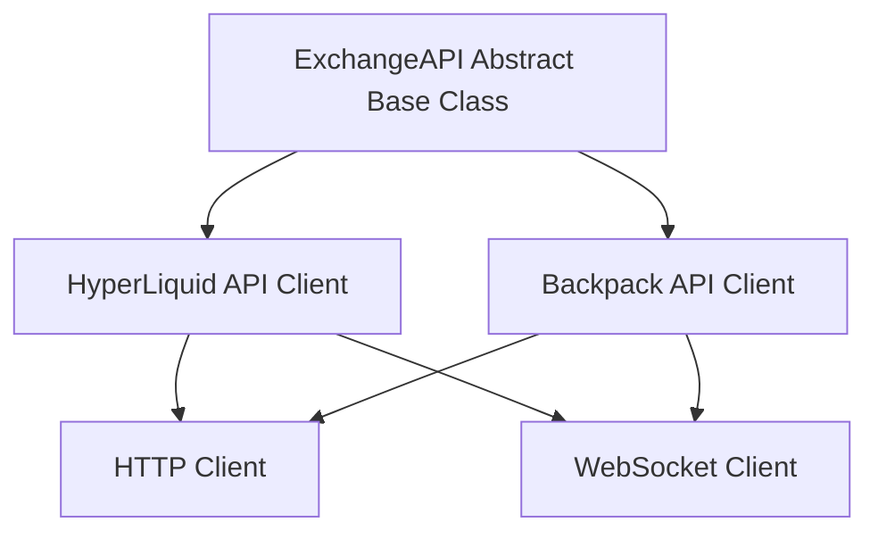

# Exchange API Implementation Status

## Overview

The CyberDeltaEngine system interfaces with cryptocurrency exchanges through a set of exchange-specific API clients. These clients are responsible for market data retrieval, order placement, position management, and balance queries. This document examines the current implementation status of the exchange API components, focusing on the two primary exchanges: HyperLiquid and Backpack.

## Architecture

The exchange API layer follows an adapter pattern with a base abstract class and exchange-specific implementations:



## ExchangeAPI Base Class

The `ExchangeAPI` abstract base class defines the interface that all exchange-specific implementations must follow:

```python
class ExchangeAPI(ABC):
    """
    Abstract base class for exchange API clients.
    Defines the interface that all exchange implementations must follow.
    """
    
    def __init__(self, config: Config, secrets: Dict[str, Any]):
        self.config = config
        self.exchange_name = ""  # Set by subclasses
        self.base_url = ""  # Set by subclasses
        self.ws_url = ""  # Set by subclasses
        self.api_key = None
        self.api_secret = None
        self._session = None
        self._ws_client = None
    
    @abstractmethod
    async def get_ticker(self, symbol: str) -> Dict[str, Any]:
        """Get current ticker data for a symbol"""
        pass
    
    @abstractmethod
    async def get_orderbook(self, symbol: str, depth: int = 10) -> Dict[str, Any]:
        """Get orderbook for a symbol"""
        pass
    
    @abstractmethod
    async def get_funding_rate(self, symbol: str) -> Dict[str, Any]:
        """Get current funding rate for a perpetual contract"""
        pass
    
    @abstractmethod
    async def get_balances(self) -> Dict[str, Dict[str, float]]:
        """Get account balances"""
        pass
    
    @abstractmethod
    async def get_positions(self) -> List[Dict[str, Any]]:
        """Get current positions"""
        pass
    
    @abstractmethod
    async def place_order(self, order: Order) -> Dict[str, Any]:
        """Place an order"""
        pass
    
    # Additional abstract methods...
```

## HyperLiquid API Implementation

HyperLiquid is a perpetual futures exchange that provides both HTTP and WebSocket APIs. The implementation includes:

### Key Features Implemented

1. **Authentication**: 
   - Implementation of the HyperLiquid signature generation for authenticated requests
   - Support for both API key and signature-based authentication

2. **Market Data Retrieval**:
   - Ticker data retrieval with proper normalization
   - Orderbook data with configurable depth
   - Funding rate retrieval

3. **Trading Operations**:
   - Order placement with support for all order types (market, limit)
   - Position management (open, close, modify)
   - Balance queries

4. **WebSocket Support**:
   - Market data streaming through WebSockets
   - Position and order update notifications

### Example Implementation

```python
class HyperLiquidAPI(ExchangeAPI):
    """
    HyperLiquid API client implementation.
    """
    
    def __init__(self, config: Config, secrets: Dict[str, Any]):
        super().__init__(config, secrets)
        self.exchange_name = "hyperliquid"
        self.base_url = "https://api.hyperliquid.xyz"
        self.ws_url = "wss://api.hyperliquid.xyz/ws"
        
        # Extract API credentials
        if "hyperliquid" in secrets:
            self.api_key = secrets["hyperliquid"].get("api_key")
            self.api_secret = secrets["hyperliquid"].get("api_secret")
        
        # Initialize HTTP session
        self._session = aiohttp.ClientSession()
    
    async def get_ticker(self, symbol: str) -> Dict[str, Any]:
        """
        Get current ticker data for a symbol
        
        Args:
            symbol: Trading symbol (e.g., "BTC-PERP")
            
        Returns:
            Normalized ticker data
        """
        endpoint = "/api/v1/ticker"
        params = {"symbol": symbol}
        
        response = await self._request("GET", endpoint, params=params)
        
        # Normalize response to common format
        return {
            "symbol": symbol,
            "price": float(response["price"]),
            "volume_24h": float(response["volume"]),
            "high_24h": float(response["high"]),
            "low_24h": float(response["low"]),
            "timestamp": int(response["timestamp"])
        }
```

## Backpack API Implementation

Backpack is a spot exchange with a RESTful API and WebSocket support. The implementation includes:

### Key Features Implemented

1. **Authentication**:
   - Implementation of the ED25519 signing mechanism
   - Management of API keys and secrets

2. **Market Data Retrieval**:
   - Asset list retrieval
   - Market data normalization
   - Order book data retrieval

3. **Trading Operations**:
   - Support for spot trading operations
   - Balance management
   - Order status tracking

4. **WebSocket Implementation**:
   - Market data streaming
   - Order update notifications

### Example Implementation

```python
class BackpackAPI(ExchangeAPI):
    """
    Backpack Exchange API client implementation.
    """
    
    def __init__(self, config: Config, secrets: Dict[str, Any]):
        super().__init__(config, secrets)
        self.exchange_name = "backpack"
        self.base_url = "https://api.backpack.exchange"
        self.ws_url = "wss://ws.backpack.exchange"
        
        # Extract API credentials
        if "backpack" in secrets:
            self.api_key = secrets["backpack"].get("api_key")
            self.api_secret = secrets["backpack"].get("api_secret")
        
        # Initialize HTTP session
        self._session = aiohttp.ClientSession()
    
    async def get_ticker(self, symbol: str) -> Dict[str, Any]:
        """
        Get current ticker data for a symbol
        
        Args:
            symbol: Trading symbol (e.g., "BTC_USDC")
            
        Returns:
            Normalized ticker data
        """
        endpoint = "/api/v1/ticker"
        params = {"symbol": symbol}
        
        response = await self._request("GET", endpoint, params=params)
        
        # Normalize response to common format
        return {
            "symbol": symbol,
            "price": float(response["lastPrice"]),
            "volume_24h": float(response["volume"]),
            "high_24h": float(response["highPrice"]),
            "low_24h": float(response["lowPrice"]),
            "timestamp": int(response["time"])
        }
```

## Integration with Other Components

The Exchange API components integrate with several other system components:

1. **Data Handler**: Uses exchange APIs to retrieve and normalize market data.
2. **Portfolio Tracker**: Queries balances and positions through exchange APIs.
3. **Execution Handler**: Places and manages orders through exchange APIs.
4. **Balance Monitor**: Monitors balance status through exchange APIs.

## Strengths of Current Implementation

1. **Consistent Interface**: Common interface across different exchanges simplifies integration.
2. **Data Normalization**: Exchange-specific data formats are normalized to a common format.
3. **Error Handling**: Basic error handling for connection issues and API errors.
4. **Asynchronous Design**: Full async/await implementation for efficient I/O operations.

## Limitations and Areas for Improvement

Based on the project status reports and documentation, the following areas need improvement:

1. **Rate Limiting**: 
   - Missing comprehensive rate limit tracking
   - No adaptive throttling based on rate limit headers

2. **Circuit Breaker Integration**:
   - Missing integration with circuit breaker system
   - Limited fallback mechanisms for API failures

3. **WebSocket Management**:
   - Basic WebSocket reconnection logic
   - Missing comprehensive connection health monitoring

4. **Error Recovery**:
   - Limited advanced error recovery mechanisms
   - Missing detailed error categorization

5. **Testing Coverage**:
   - Limited testing of edge cases and error conditions
   - Insufficient mocking of exchange responses for testing

## Next Steps

1. **Enhance Rate Limiting**:
   - Implement per-endpoint rate limit tracking
   - Add adaptive throttling based on rate limit headers

2. **Improve Circuit Breaker Integration**:
   - Implement circuit breaker pattern for API calls
   - Add fallback mechanisms for critical operations

3. **Enhance WebSocket Management**:
   - Improve reconnection logic with exponential backoff
   - Add comprehensive connection health monitoring

4. **Implement Advanced Error Recovery**:
   - Add detailed error categorization
   - Implement advanced recovery strategies for different error types

5. **Expand Testing Coverage**:
   - Add comprehensive tests for edge cases
   - Implement detailed mocking of exchange responses

## Exchange-Specific Considerations

### HyperLiquid Considerations

Based on the documentation provided:

1. **Oracle Manipulation Risk**:
   - HyperLiquid relies on price oracles maintained by validators.
   - Implementation needs to handle potential oracle manipulation.

2. **Open Interest Caps**:
   - HyperLiquid has open interest caps based on liquidity, basis, and leverage.
   - API implementation should check and handle these caps.

3. **L1 Risk**:
   - HyperLiquid runs on its own L1 which may experience downtime.
   - Implementation should include robust error handling for consensus issues.

### Backpack Considerations

Based on the documentation provided:

1. **ED25519 Authentication**:
   - Backpack uses ED25519 keypairs for authentication.
   - Implementation must correctly handle this signing mechanism.

2. **Instruction Types**:
   - Backpack API requires specific instruction types for different operations.
   - Implementation must use the correct instruction for each API call.

3. **Window Headers**:
   - Requests require X-Window headers with timestamp validation.
   - Implementation must handle time synchronization and window validation.

## Conclusion

The exchange API implementations for HyperLiquid and Backpack provide a solid foundation for the CyberDeltaEngine system. While there are areas for improvement, particularly in error handling, rate limiting, and circuit breaker integration, the current implementation successfully supports the core functionality required for funding rate arbitrage operations. 