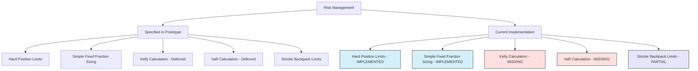

# Risk Management Implementation Status

## Overview

Risk management is a critical component of the CyberDeltaEngine system, responsible for ensuring that trading operations remain within acceptable risk parameters. This document examines the current state of risk management implementation compared to what was specified in the prototype documentation.

## Risk Management in Prototype Documentation

According to the `1_core_architecture.md` file, the Risk Manager should:

```
**Purpose**: Assess and size trades based on risk parameters.

**Key Responsibilities**:
- Validate incoming opportunities against risk constraints
- Apply Kelly-based position sizing:
  ```
  f* = ExpectedProfit / (VarianceRisk * Price)
  ```
  where VarianceRisk is the basis volatility squared (σ[B]²)
- Apply fractional Kelly for conservative sizing:
  ```
  f_actual = α * f*
  ```
  where α is typically 0.3-0.5 for conservative sizing
- Apply position size constraints:
  ```
  SizeLimit = Min(MaxPositionSize, f_actual * PortfolioValue)
  ```
- Calculate portfolio-level risk metrics 
- Enforce hard position size limits per asset (absolute USD cap)
- Enforce total exposure limits across all positions (% of total capital)
- Enforce per-exchange exposure limits (% of total capital)
- Calculate and monitor liquidation risk on leveraged positions
- Calculate Value-at-Risk (VaR) for the portfolio:
  ```
  VaR_α = μ * Δt + σ * √Δt * Φ⁻¹(α)
  ```
  where α is the confidence level (e.g., 0.95)
- Adjust VaR dynamically based on market volatility:
  ```
  VaR_t = VaR_0 * (σ_mkt,t / σ_mkt,0)
  ```
- Reject trades that would exceed maximum allowed leverage
- Prioritize viable opportunities by Utility score
```

However, the `3_implementation_guide.md` file specifically called for a simplified approach for v0.0.1:

```
**Simplified for 0.0.1**:
- Focus on implementing hard caps first:
  - Maximum USD per position
  - Maximum total exposure percentage
  - Maximum leverage limits
  - Maximum exchange concentration limits
- Use simple fixed fraction sizing (e.g., 5% of capital)
- Defer complex Kelly criterion and VaR calculations
- Implement stricter limits for Backpack specifically
```

## Current Implementation Status

### What Has Been Implemented

The current implementation includes:

```python
class RiskManager:
    """
    Risk management component responsible for:
    - Position sizing based on risk parameters
    - Portfolio-level risk control
    - Exposure monitoring
    - Leverage limits enforcement
    """
    
    def __init__(self, config: Config, portfolio_tracker: PortfolioTracker):
        self.config = config
        self.portfolio_tracker = portfolio_tracker
        
        # Load risk parameters from config
        self.max_position_size = config.get('risk.max_position_size', 1000.0)  # USD
        self.max_total_exposure = config.get('risk.max_total_exposure', 5000.0)  # USD
        self.kelly_fraction = config.get('risk.kelly_fraction', 0.5)  # Conservative Kelly
        self.max_collateral_per_exchange = config.get('risk.max_collateral_per_exchange', 0.8)  # 80% max on any exchange
        self.max_leverage = config.get('risk.max_leverage', 5.0)  # Maximum allowed leverage
        
        # Exchange-specific parameters
        self.exchange_params = {}
        for exchange in ['hyperliquid', 'backpack']:
            if config.get(f'exchanges.{exchange}.enabled', False):
                self.exchange_params[exchange] = {
                    'max_position_size': config.get(f'risk.{exchange}.max_position_size', self.max_position_size),
                    'max_leverage': config.get(f'risk.{exchange}.max_leverage', self.max_leverage)
                }
```

Key features implemented:

1. **Hard Position Limits**:
   - Maximum USD per position (global and per-exchange)
   - Maximum total exposure percentage
   - Maximum leverage limits
   - Exchange concentration limits

2. **Basic Position Sizing**:
   - Simple fixed fraction sizing:
   ```python
   def size_opportunity(self, opportunity: ArbitrageOpportunity) -> float:
       """
       Determine appropriate position size for an opportunity based on risk parameters
       
       Args:
           opportunity: Trading opportunity to size
           
       Returns:
           Position size in USD
       """
       # Get available capital
       total_capital = self.portfolio_tracker.get_total_capital()
       
       # Apply simple fixed fraction sizing (5% of capital)
       base_size = total_capital * 0.05
       
       # Apply position size constraints
       max_size = min(
           self.max_position_size,
           self.exchange_params.get(opportunity.exchange, {}).get('max_position_size', self.max_position_size)
       )
       
       # Apply maximum position size limit
       position_size = min(base_size, max_size)
       
       # Check if this would exceed max total exposure
       current_exposure = self.portfolio_tracker.get_total_exposure()
       if current_exposure + position_size > self.max_total_exposure:
           # Reduce position size to stay within exposure limits
           position_size = max(0, self.max_total_exposure - current_exposure)
       
       return position_size
   ```

3. **Exposure Checks**:
   ```python
   def check_exposure_limits(self, exchange: str, symbol: str, size: float) -> bool:
       """
       Check if a proposed trade would exceed exposure limits
       
       Args:
           exchange: Exchange name
           symbol: Trading symbol
           size: Position size in USD
           
       Returns:
           True if within limits, False otherwise
       """
       # Check against max position size
       exchange_max = self.exchange_params.get(exchange, {}).get('max_position_size', self.max_position_size)
       if size > exchange_max:
           logger.warning(f"Position size {size} exceeds exchange max {exchange_max} for {exchange}")
           return False
       
       # Check against total exposure
       current_exposure = self.portfolio_tracker.get_total_exposure()
       if current_exposure + size > self.max_total_exposure:
           logger.warning(f"Total exposure {current_exposure + size} would exceed max {self.max_total_exposure}")
           return False
       
       # Check against exchange concentration
       exchange_exposure = self.portfolio_tracker.get_exchange_exposure(exchange)
       total_capital = self.portfolio_tracker.get_total_capital()
       max_exchange_allocation = total_capital * self.max_collateral_per_exchange
       
       if exchange_exposure + size > max_exchange_allocation:
           logger.warning(f"Exchange allocation {exchange_exposure + size} would exceed max {max_exchange_allocation} for {exchange}")
           return False
       
       return True
   ```

### What Is Missing

Compared to the prototype documentation, the following features are missing or incomplete:

1. **Kelly Criterion Implementation**:
   - The current implementation uses a fixed fraction (5%) rather than even a simplified Kelly calculation
   - Missing the calculation based on expected profit and risk

2. **Advanced Risk Metrics**:
   - No Value-at-Risk (VaR) calculation
   - No dynamic adjustment based on market volatility
   - Missing portfolio-level risk metrics

3. **Liquidation Risk Assessment**:
   - No explicit calculation of liquidation risk for leveraged positions
   - Missing margin monitoring for open positions

4. **Opportunity Ranking**:
   - Limited implementation of the utility function for ranking opportunities
   - Missing comprehensive opportunity comparison

5. **Exchange-Specific Parameters**:
   - While there's structure for exchange-specific parameters, they're not fully utilized
   - Missing stricter limits for Backpack as specified in the documentation

6. **Risk Alert System**:
   - Missing risk alert generation for approaching limits
   - No integration with notification systems

## Implementation Comparison



## Code Snippets for Missing Components

### 1. Simple Kelly Criterion Implementation

```python
def kelly_position_sizing(self, opportunity: ArbitrageOpportunity) -> float:
    """
    Calculate position size using simplified Kelly criterion
    
    Args:
        opportunity: Trading opportunity to size
        
    Returns:
        Position size in USD
    """
    # Extract key metrics from opportunity
    expected_return = opportunity.expected_profit / opportunity.position_size  # Normalize to percentage
    risk = opportunity.basis_volatility ** 2  # Variance as risk measure
    
    # Simple Kelly formula: f* = expected_return / risk
    if risk == 0:
        # Avoid division by zero
        kelly_fraction = 1.0
    else:
        kelly_fraction = expected_return / risk
    
    # Apply conservative multiplier (typically 0.3-0.5)
    conservative_kelly = kelly_fraction * self.kelly_fraction
    
    # Apply to capital
    total_capital = self.portfolio_tracker.get_total_capital()
    return min(conservative_kelly * total_capital, self.max_position_size)
```

### 2. Basic VaR Calculation

```python
def calculate_var(self, confidence_level: float = 0.95, time_horizon: int = 1) -> float:
    """
    Calculate Value-at-Risk for the current portfolio
    
    Args:
        confidence_level: Confidence level (e.g., 0.95 for 95%)
        time_horizon: Time horizon in days
        
    Returns:
        VaR value in USD
    """
    import scipy.stats as stats
    
    # Get portfolio metrics
    portfolio_value = self.portfolio_tracker.get_total_capital()
    
    # Get portfolio volatility (simplified)
    # In a full implementation, this would use historical returns
    portfolio_volatility = 0.02  # 2% daily volatility as a placeholder
    
    # Calculate VaR
    # VaR_α = μ * Δt + σ * √Δt * Φ⁻¹(α)
    # Simplifying with μ = 0 (conservative)
    z_score = stats.norm.ppf(1 - confidence_level)
    var = portfolio_value * portfolio_volatility * math.sqrt(time_horizon) * z_score
    
    return var
```

### 3. Stricter Backpack Limits

```python
def _load_exchange_specific_limits(self):
    """Load exchange-specific risk parameters"""
    # Default limits
    for exchange in ['hyperliquid', 'backpack']:
        if not self.config.get(f'exchanges.{exchange}.enabled', False):
            continue
            
        self.exchange_params[exchange] = {
            'max_position_size': self.config.get(f'risk.{exchange}.max_position_size', self.max_position_size),
            'max_leverage': self.config.get(f'risk.{exchange}.max_leverage', self.max_leverage),
            'max_allocation': self.config.get(f'risk.{exchange}.max_allocation', self.max_collateral_per_exchange)
        }
    
    # Apply stricter limits for Backpack as specified in documentation
    if 'backpack' in self.exchange_params:
        # Reduce position size by 50% for Backpack if not explicitly configured
        if not self.config.has('risk.backpack.max_position_size'):
            self.exchange_params['backpack']['max_position_size'] *= 0.5
            
        # Reduce leverage by 20% for Backpack if not explicitly configured
        if not self.config.has('risk.backpack.max_leverage'):
            self.exchange_params['backpack']['max_leverage'] *= 0.8
            
        # Reduce allocation by 30% for Backpack if not explicitly configured
        if not self.config.has('risk.backpack.max_allocation'):
            self.exchange_params['backpack']['max_allocation'] *= 0.7
```

## Next Steps

Based on the prototype documentation and current implementation status, the following steps are recommended:

1. **Add Simple Kelly Implementation**:
   - Implement a simplified Kelly criterion calculation based on expected return and risk
   - Add conservative Kelly fraction adjustment

2. **Enhance Exchange-Specific Parameters**:
   - Implement stricter limits for Backpack as specified
   - Add explicit verification for exchange-specific limits

3. **Add Basic Risk Alerting**:
   - Implement alerts for approaching risk limits
   - Add integration with notification system

4. **Improve Opportunity Ranking**:
   - Enhance utility function implementation
   - Add more comprehensive opportunity comparison

5. **Add Simple Liquidation Risk Assessment**:
   - Calculate distance to liquidation for leveraged positions
   - Implement minimum buffer requirements

These enhancements should align with the simplified approach specified for v0.0.1 while laying the groundwork for more advanced risk management in future versions. 