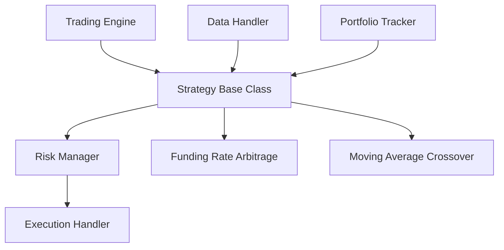

# Strategy Base Class Analysis

## Overview

The Strategy base class is a fundamental component of the CyberDeltaEngine architecture, providing the foundation for all trading algorithms in the system. This document examines the current implementation, how it integrates with other components, and how it supports the primary use case of funding rate arbitrage.

## Implementation Status

The Strategy base class is fully implemented in `cyberdelta/core/strategy.py` as an abstract base class (ABC) that defines the interface and common functionality for all trading strategies.

### Core Features Implemented

```python
class Strategy(ABC):
    """
    Abstract base class for all trading strategies.
    Strategies receive market data and generate trade signals.
    """
    
    def __init__(self, 
                 name: str, 
                 symbol: str, 
                 params: Optional[Dict[str, Any]] = None):
        """
        Initialize a strategy
        
        Args:
            name: Unique name for the strategy
            symbol: Trading symbol this strategy operates on
            params: Dictionary of strategy parameters
        """
        self.name = name
        self.symbol = symbol
        self.params = params or {}
        self.enabled = False
        self.last_signal_time: Optional[datetime] = None
        self.signals_generated = 0
        self._historical_data: List[MarketData] = []
```

1. **Abstract Interface**: Defines the contract that all strategies must implement.
2. **Data Processing Framework**: Provides methods for handling market data and generating signals.
3. **Parameter Management**: Includes flexible parameter handling for strategy configuration.
4. **Historical Data Management**: Maintains a rolling window of historical data for analysis.
5. **Strategy State Tracking**: Monitors strategy status, signal generation, and timing.

### Key Methods

1. **`process_data`** (abstract): Core method for market data processing, must be implemented by subclasses.
2. **`update_historical_data`**: Manages historical data with configurable window size.
3. **`enable/disable`**: Controls whether the strategy is active.
4. **`on_start/on_stop`**: Lifecycle hooks for strategy initialization and cleanup.
5. **`get_param/set_param`**: Parameter access and modification with logging.
6. **`get_strategy_info`**: Returns information about the strategy's current state.

## Integration with Architecture

The Strategy base class is a central component in the system architecture:



### Data Flow

1. The Trading Engine initializes and manages Strategy instances
2. The Data Handler provides market data to Strategy instances
3. Strategy instances process data and generate trading signals
4. Signals are passed to the Risk Manager for sizing
5. Sized trades are passed to the Execution Handler
6. Execution results update the Portfolio Tracker

## Strategy Implementations

The Strategy base class supports multiple strategy implementations:

### 1. FundingRateArbitrageStrategy

The primary strategy for the CyberDeltaEngine system, implementing funding rate arbitrage between exchanges:

```python
class FundingRateArbitrageStrategy(Strategy):
    """
    Implementation of a funding rate arbitrage strategy between exchanges.
    
    Primary approach for v0.0.1: Hyperliquid-Perp vs Backpack-Spot strategy
    This strategy:
    - Takes a position on Hyperliquid perpetual contracts
    - Hedges with opposite position in Backpack spot markets
    - Profits from funding rate payments while maintaining delta neutrality
    """
```

### 2. MovingAverageCrossoverStrategy

A simple example strategy that demonstrates the flexibility of the Strategy base class:

```python
class MovingAverageCrossoverStrategy(Strategy):
    """
    Simple moving average crossover strategy.
    Generates buy signals when short MA crosses above long MA,
    and sell signals when short MA crosses below long MA.
    """
```

## Strengths of Current Implementation

1. **Clean Abstraction**: Well-defined interface that enforces a consistent contract across strategies
2. **Flexibility**: Supports diverse strategy types through the same base interface
3. **Parameter Management**: Robust handling of strategy parameters with defaults and logging
4. **State Management**: Tracks strategy state and signal generation statistics
5. **Historical Data**: Maintains a configurable window of historical data for analysis

## Limitations and Areas for Improvement

1. **Performance Metrics**: No built-in tracking of strategy performance metrics
2. **Backtest Integration**: No direct methods for backtesting or historical simulation
3. **Parameter Optimization**: No framework for automatic parameter optimization
4. **Multi-Symbol Support**: Limited support for strategies that operate on multiple symbols
5. **Signal Quality Analysis**: No methods for analyzing the quality of generated signals

## Next Steps

1. **Add Performance Tracking**: Implement basic performance metrics collection
2. **Develop Backtesting Framework**: Create integration points for backtesting
3. **Add Parameter Optimization**: Implement a framework for parameter optimization
4. **Enhance Multi-Symbol Support**: Extend the Strategy class to better support multi-symbol strategies
5. **Implement Signal Quality Analysis**: Add methods to evaluate signal quality

## Conclusion

The Strategy base class provides a solid foundation for the trading strategies in the CyberDeltaEngine system. While there are areas for improvement, the current implementation successfully supports the core use case of funding rate arbitrage between exchanges. The modular design allows for easy extension with new strategy types and gradual enhancement of capabilities. 