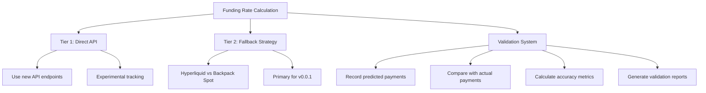

# Funding Rate Arbitrage Strategy Implementation Status

## Overview

The `FundingRateArbitrageStrategy` is the core strategy of the CyberDeltaEngine project, implementing a cross-exchange delta-neutral approach focusing on funding rate arbitrage between Hyperliquid (perpetual futures) and Backpack (spot markets).

## Current Implementation

The strategy has been implemented with the following key components:

```python
class FundingRateArbitrageStrategy(Strategy):
    """
    Implementation of a funding rate arbitrage strategy between exchanges.
    
    Primary approach for v0.0.1: Hyperliquid-Perp vs Backpack-Spot strategy
    This strategy:
    - Takes a position on Hyperliquid perpetual contracts
    - Hedges with opposite position in Backpack spot markets
    - Profits from funding rate payments while maintaining delta neutrality
    """
```

### Implemented Features

1. **Core Strategy Logic**:
   - Net Funding Differential (NFD) calculation
   - Basis volatility calculation
   - Expected profit calculation with transaction costs
   - Opportunity ranking via utility function
   - Position generation and rebalancing signals

2. **Risk Management**:
   - Basic position sizing
   - Simplified slippage estimation
   - Pre-trade verification

3. **Execution Flow**:
   - Asynchronous opportunity checking
   - Signal generation for entry and rebalancing
   - Metadata tracking for signal context

### Implementation Details

```python
async def _check_opportunity(self) -> Optional[ArbitrageOpportunity]:
    """
    Check for funding rate arbitrage opportunity between perp and spot markets.
    
    Returns:
        ArbitrageOpportunity if found, None otherwise
    """
    # Get funding rate from perp exchange
    funding_rate = await self.data_handler.get_funding_rate(self.perp_exchange, self.symbol)
    
    # Calculate basis and volatility
    basis = perp_ticker.close - spot_ticker.close
    basis_volatility = self._calculate_basis_volatility(self.symbol)
    
    # Calculate Net Funding Differential (NFD)
    # For the perp vs spot strategy, this is just the funding rate
    nfd = funding_rate.funding_rate
    
    # Calculate expected profit
    position_size = 1000.0  # Default position size
    expected_profit = (position_size * (nfd / 100)) - total_costs
    
    # Calculate utility score
    utility_score = expected_profit - (self.risk_aversion * (basis_volatility ** 2))
```

## Missing Components

Based on the prototype documentation, the following components are missing or incomplete:

### 1. Multi-Tiered Funding Rate Calculation

As specified in `backpack_implementation_approach.md`, the strategy should implement:



The current implementation lacks:
- The explicit tiered approach for funding rate calculation
- Tracking predicted vs actual funding rates
- Validation metrics calculation (RMSE, MAE)
- Validation reporting system

### 2. Enhanced Error Handling

The prototype documentation specifies more robust error handling:

```python
# Missing robust error handling for exchange API failures
try:
    opportunity = await self._check_opportunity()
    if opportunity:
        self.active_opportunities.append(opportunity)
        return self._generate_entry_signal(opportunity)
except ConnectionError as e:
    # Current implementation lacks detailed error handling
    logger.error(f"Error checking opportunities: {e}")
    # Missing: Specific handling for different error types
    # Missing: Circuit breaker activation
    # Missing: Retry logic with exponential backoff
```

### 3. Insufficient Validation Metrics

The prototype documentation calls for extensive validation:

```python
# Example validation routine (missing from current implementation)
def validate_funding_predictions(historical_data, prediction_model, days=30):
    """
    Validate funding rate prediction accuracy against historical data.
    """
    predictions = []
    actuals = []
    
    # Collect predictions and actual values
    # Calculate error metrics
    rmse = calculate_rmse(predictions, actuals)
    mae = calculate_mae(predictions, actuals)
    
    return {
        "rmse": rmse,
        "mae": mae,
        "predictions": predictions,
        "actuals": actuals
    }
```

### 4. Position Verification and Reconciliation

The prototype documentation calls for more robust position verification:

```python
# Missing multi-source position verification
def verify_positions(self):
    """Verify positions across multiple data sources"""
    # Current implementation lacks this verification step
    
    # 1. Get position from portfolio tracker
    perp_position = self.portfolio_tracker.get_position(self.perp_exchange, self.symbol)
    
    # 2. Get position directly from exchange API
    api_position = await self.data_handler.get_exchange_position(self.perp_exchange, self.symbol)
    
    # 3. Calculate position from fill history
    fill_position = await self._calculate_position_from_fills(self.perp_exchange, self.symbol)
    
    # 4. Compare sources and flag discrepancies
    # 5. Trigger safe mode if significant discrepancies found
```

## Action Items

1. **Implement Multi-Tiered Funding Rate Calculation**:
   - Add explicit tiered approach with fallback mechanisms
   - Implement validation system for funding rate accuracy

2. **Enhance Error Handling**:
   - Add specific handling for different error types
   - Implement circuit breakers with proper activation logic
   - Add retry mechanisms with exponential backoff

3. **Add Validation Metrics**:
   - Implement prediction vs actual comparison
   - Add error metric calculations (RMSE, MAE)
   - Create validation reporting system

4. **Implement Position Verification**:
   - Add multi-source position verification
   - Implement reconciliation mechanisms
   - Add safe mode triggers for inconsistencies

5. **Fix Test Implementation**:
   - Correct the logical error in the testing code
   - Expand test coverage to include all major functionality 

# Strategy Implementation Status

## Overview

The Strategy component is a core part of the CyberDeltaEngine system, responsible for analyzing market data and generating trading signals. This document examines the current state of the Strategy implementation compared to what was specified in the prototype documentation.

## Strategy Class in Prototype Documentation

According to the prototype documentation, the Strategy class was specified to:

1. Act as an abstract base class for all trading strategy implementations
2. Provide a framework for processing market data
3. Generate trading signals when opportunities are identified
4. Support parameter configuration and optimization
5. Include specific implementations for funding rate arbitrage

## Current Implementation

The current implementation includes a well-defined `Strategy` abstract base class that serves as the foundation for all trading strategies in the system. The class is implemented in `cyberdelta/core/strategy.py`.

### Key Components Implemented

1. **Abstract Base Class Structure**:
   ```python
   class Strategy(ABC):
       """
       Abstract base class for all trading strategies.
       Strategies receive market data and generate trade signals.
       """
   ```

2. **Core Data Processing Method**:
   ```python
   @abstractmethod
   def process_data(self, data: MarketData) -> Optional[TradeSignal]:
       """
       Process new market data and optionally generate a trading signal
       
       Args:
           data: Market data to process
           
       Returns:
           Optional TradeSignal if a trade should be executed, None otherwise
       """
       pass
   ```

3. **Parameter Management**:
   ```python
   def get_param(self, name: str, default: Any = None) -> Any:
       """
       Get a strategy parameter
       
       Args:
           name: Parameter name
           default: Default value if parameter doesn't exist
           
       Returns:
           Parameter value or default
       """
       return self.params.get(name, default)
   
   def set_param(self, name: str, value: Any) -> None:
       """
       Set a strategy parameter
       
       Args:
           name: Parameter name
           value: Parameter value
       """
       self.params[name] = value
       logger.info(f"Strategy '{self.name}' parameter '{name}' set to {value}")
   ```

4. **Historical Data Management**:
   ```python
   def update_historical_data(self, data: MarketData, max_bars: int = 1000) -> None:
       """
       Update the strategy's historical data cache
       
       Args:
           data: New market data to add
           max_bars: Maximum number of data points to keep
       """
       # Only store data for the symbol this strategy is configured for
       if data.symbol != self.symbol:
           return
           
       self._historical_data.append(data)
       
       # Trim historical data if it exceeds max_bars
       if len(self._historical_data) > max_bars:
           self._historical_data = self._historical_data[-max_bars:]
   ```

5. **Strategy Lifecycle Management**:
   ```python
   def enable(self) -> None:
       """Enable the strategy"""
       self.enabled = True
       logger.info(f"Enabled strategy '{self.name}'")
   
   def disable(self) -> None:
       """Disable the strategy"""
       self.enabled = False
       logger.info(f"Disabled strategy '{self.name}'")
   
   def on_start(self) -> None:
       """Called when the strategy is started"""
       logger.info(f"Strategy '{self.name}' started")
   
   def on_stop(self) -> None:
       """Called when the strategy is stopped"""
       logger.info(f"Strategy '{self.name}' stopped")
   ```

6. **Strategy State Information**:
   ```python
   def get_strategy_info(self) -> Dict[str, Any]:
       """
       Get information about the strategy's current state
       
       Returns:
           Dictionary with strategy information
       """
       return {
           "name": self.name,
           "symbol": self.symbol,
           "enabled": self.enabled,
           "params": self.params,
           "signals_generated": self.signals_generated,
           "last_signal_time": self.last_signal_time,
           "historical_data_points": len(self._historical_data)
       }
   ```

## Strategy Implementations

### FundingRateArbitrageStrategy

The primary strategy implementation is the `FundingRateArbitrageStrategy`, which implements funding rate arbitrage between exchanges. The class extends the base `Strategy` class to detect funding rate differentials and generate arbitrage trade signals.

```python
class FundingRateArbitrageStrategy(Strategy):
    """
    Strategy that identifies and exploits funding rate differentials 
    between different exchanges for the same asset.
    """
    
    def __init__(self, 
                 name: str,
                 symbol: str,
                 exchanges: List[str],
                 funding_threshold: float = 0.0001,  # 0.01% minimum threshold
                 min_profit_threshold: float = 0.0005,  # 0.05% minimum profit
                 params: Optional[Dict[str, Any]] = None):
        """
        Initialize the funding rate arbitrage strategy
        
        Args:
            name: Strategy name
            symbol: Trading symbol
            exchanges: List of exchanges to monitor
            funding_threshold: Minimum funding rate differential to consider
            min_profit_threshold: Minimum expected profit threshold
            params: Additional strategy parameters
        """
        super().__init__(name, symbol, params)
        self.exchanges = exchanges
        self.funding_threshold = funding_threshold
        self.min_profit_threshold = min_profit_threshold
        self.funding_rates: Dict[str, float] = {}
        self.last_funding_time: Dict[str, datetime] = {}
```

## Assessment Against Prototype Documentation

### Alignment with Prototype

The current Strategy implementation aligns well with the prototype documentation in several areas:

1. ✅ **Abstract Base Class**: Implemented as specified, providing a foundation for all strategies
2. ✅ **Core Interfaces**: The `process_data` method is provided as an abstract method
3. ✅ **Parameter Management**: Includes methods for getting and setting parameters
4. ✅ **Historical Data**: Manages a rolling window of historical data for analysis
5. ✅ **Lifecycle Management**: Includes enable/disable functionality and lifecycle hooks

### Missing Components

Compared to the prototype documentation, the following components are missing or incomplete:

1. ❌ **Performance Metrics**: No implementation of strategy performance tracking or metrics
2. ❌ **Backtest Integration**: No direct methods for backtesting or historical simulation
3. ❌ **Parameter Optimization**: No framework for automatic parameter optimization
4. ❌ **Signal Quality Analysis**: No methods for analyzing the quality of generated signals
5. ❌ **Multi-Symbol Support**: Limited support for strategies that operate on multiple symbols

## Implementation Comparison

```mermaid
graph TD
    A[Strategy Class] --> B[Specified in Prototype]
    A --> C[Current Implementation]
    
    B --> B1[Abstract Base Class]
    B --> B2[Market Data Processing]
    B --> B3[Trading Signal Generation]
    B --> B4[Parameter Management]
    B --> B5[Performance Metrics]
    B --> B6[Backtest Integration]
    B --> B7[Parameter Optimization]
    
    C --> C1[Abstract Base Class - IMPLEMENTED]
    C --> C2[Market Data Processing - IMPLEMENTED]
    C --> C3[Trading Signal Generation - IMPLEMENTED]
    C --> C4[Parameter Management - IMPLEMENTED]
    C --> C5[Performance Metrics - MISSING]
    C --> C6[Backtest Integration - MISSING]
    C --> C7[Parameter Optimization - MISSING]
    
    style C1 fill:#d4f1f9,stroke:#000
    style C2 fill:#d4f1f9,stroke:#000
    style C3 fill:#d4f1f9,stroke:#000
    style C4 fill:#d4f1f9,stroke:#000
    style C5 fill:#ffe0e0,stroke:#000
    style C6 fill:#ffe0e0,stroke:#000
    style C7 fill:#ffe0e0,stroke:#000
```



## Code Snippets for Missing Components

### 1. Strategy Performance Metrics

```python
class Strategy(ABC):
    # Existing code...
    
    def __init__(self, name: str, symbol: str, params: Optional[Dict[str, Any]] = None):
        # Existing initialization...
        
        # Performance tracking
        self.performance_metrics = {
            "total_signals": 0,
            "successful_signals": 0,
            "failed_signals": 0,
            "total_profit": 0.0,
            "max_drawdown": 0.0,
            "win_rate": 0.0,
            "avg_profit_per_trade": 0.0,
            "sharpe_ratio": 0.0,
        }
    
    def update_performance_metrics(self, signal_result: Dict[str, Any]) -> None:
        """
        Update strategy performance metrics based on signal results
        
        Args:
            signal_result: Dictionary containing signal execution results
        """
        self.performance_metrics["total_signals"] += 1
        
        if signal_result.get("success", False):
            self.performance_metrics["successful_signals"] += 1
            self.performance_metrics["total_profit"] += signal_result.get("profit", 0.0)
        else:
            self.performance_metrics["failed_signals"] += 1
            
        # Update win rate
        if self.performance_metrics["total_signals"] > 0:
            self.performance_metrics["win_rate"] = (
                self.performance_metrics["successful_signals"] / 
                self.performance_metrics["total_signals"]
            )
            
        # Update average profit per trade
        if self.performance_metrics["successful_signals"] > 0:
            self.performance_metrics["avg_profit_per_trade"] = (
                self.performance_metrics["total_profit"] / 
                self.performance_metrics["successful_signals"]
            )
            
        # Note: Sharpe ratio and max drawdown would require more complex calculations
    
    def get_performance_metrics(self) -> Dict[str, Any]:
        """
        Get the strategy's performance metrics
        
        Returns:
            Dictionary with performance metrics
        """
        return self.performance_metrics
```

### 2. Backtest Integration

```python
class Strategy(ABC):
    # Existing code...
    
    def backtest(self, historical_data: List[MarketData]) -> Dict[str, Any]:
        """
        Run a backtest of the strategy on historical data
        
        Args:
            historical_data: List of historical market data
            
        Returns:
            Dictionary with backtest results
        """
        # Reset performance metrics for backtest
        self._reset_performance_metrics()
        
        # Track simulated trades
        trades = []
        positions = {}
        pnl_history = []
        current_equity = 10000.0  # Starting equity
        
        # Process each data point
        for data in historical_data:
            # Process data with strategy
            signal = self.process_data(data)
            
            # If signal generated, simulate trade
            if signal:
                trade_result = self._simulate_trade(signal, data, positions, current_equity)
                trades.append(trade_result)
                
                # Update equity
                current_equity += trade_result.get("profit", 0.0)
                pnl_history.append((data.timestamp, current_equity))
                
                # Update performance metrics
                self.update_performance_metrics(trade_result)
        
        # Calculate final metrics
        return {
            "trades": trades,
            "pnl_history": pnl_history,
            "final_equity": current_equity,
            "performance_metrics": self.get_performance_metrics()
        }
    
    def _simulate_trade(self, signal: TradeSignal, data: MarketData, positions: Dict, equity: float) -> Dict[str, Any]:
        """
        Simulate a trade based on a signal
        
        Args:
            signal: Trade signal to simulate
            data: Current market data
            positions: Current positions
            equity: Current equity
            
        Returns:
            Dictionary with trade result
        """
        # Simplified simulation logic
        # Real implementation would need to account for:
        # - Entry and exit prices
        # - Spread/slippage
        # - Fees
        # - Position management
        # - Etc.
        
        # This is a placeholder for the actual implementation
        return {
            "success": True,
            "profit": signal.expected_profit,
            "entry_price": data.price,
            "exit_price": data.price * (1 + signal.expected_profit),
            "timestamp": data.timestamp,
            "symbol": signal.symbol,
            "direction": signal.direction
        }
        
    def _reset_performance_metrics(self) -> None:
        """Reset performance metrics for new backtest"""
        self.performance_metrics = {
            "total_signals": 0,
            "successful_signals": 0,
            "failed_signals": 0,
            "total_profit": 0.0,
            "max_drawdown": 0.0,
            "win_rate": 0.0,
            "avg_profit_per_trade": 0.0,
            "sharpe_ratio": 0.0,
        }
```

### 3. Parameter Optimization

```python
class Strategy(ABC):
    # Existing code...
    
    def optimize_parameters(self, 
                           param_ranges: Dict[str, List[Any]], 
                           historical_data: List[MarketData],
                           optimization_metric: str = "total_profit") -> Dict[str, Any]:
        """
        Optimize strategy parameters using grid search
        
        Args:
            param_ranges: Dictionary of parameter names and possible values
            historical_data: Historical data for backtesting
            optimization_metric: Metric to optimize for
            
        Returns:
            Dictionary with optimal parameters and results
        """
        import itertools
        
        # Generate all parameter combinations
        param_names = list(param_ranges.keys())
        param_values = list(param_ranges.values())
        param_combinations = list(itertools.product(*param_values))
        
        # Track best result
        best_result = None
        best_params = None
        best_score = float('-inf')
        
        # Evaluate each parameter combination
        for params in param_combinations:
            # Set parameters
            current_params = {param_names[i]: params[i] for i in range(len(params))}
            for name, value in current_params.items():
                self.set_param(name, value)
            
            # Run backtest
            result = self.backtest(historical_data)
            
            # Extract optimization metric
            score = result.get("performance_metrics", {}).get(optimization_metric, 0.0)
            
            # Check if this is better than current best
            if score > best_score:
                best_score = score
                best_params = current_params.copy()
                best_result = result
        
        # Set strategy to best parameters
        if best_params:
            for name, value in best_params.items():
                self.set_param(name, value)
        
        return {
            "best_params": best_params,
            "best_score": best_score,
            "best_result": best_result
        }
```

## Next Steps

Based on the comparison between the prototype documentation and current implementation, the following steps are recommended:

1. **Add Performance Metrics**:
   - Implement basic performance tracking for strategies
   - Add methods to analyze signal quality and success rate

2. **Develop Backtest Integration**:
   - Create simple backtesting framework integrated with the Strategy class
   - Implement position tracking and P&L calculation for backtests

3. **Add Parameter Optimization**:
   - Implement grid search for parameter optimization
   - Add evaluation metrics for comparing parameter sets

4. **Enhance Multi-Symbol Support**:
   - Extend the Strategy class to better support strategies operating on multiple symbols
   - Add correlation analysis between symbols

5. **Improve Signal Quality Analysis**:
   - Add methods to analyze and score signal quality
   - Implement signal filtering based on quality metrics

These enhancements would bring the Strategy implementation closer to the vision outlined in the prototype documentation while maintaining the solid foundation already established. 