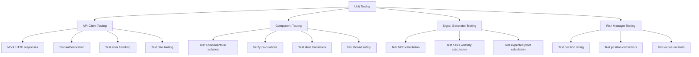
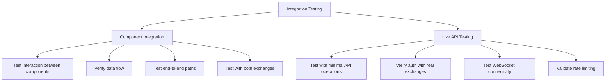
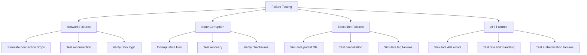
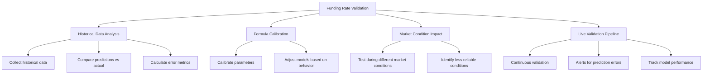

# Testing Status Report

## Overview

This document outlines the current state of testing in the CyberDeltaEngine project, comparing the existing test implementation against what was specified in the prototype documentation.

## Current Testing Implementation

### Existing Tests

1. **Strategy Tests**:
   - Basic unit tests for `FundingRateArbitrageStrategy`
   - Simple verification of initialization parameters
   - Tests for utility functions like volatility calculation and slippage estimation
   - Mock-based tests for opportunity checking

```python
# Example from current test implementation
class TestFundingRateArbitrageStrategy(unittest.TestCase):
    """Test case for the FundingRateArbitrageStrategy class"""
    
    def setUp(self):
        """Set up test fixtures"""
        self.data_handler = MagicMock()
        self.portfolio_tracker = MagicMock()
        
        # Create the strategy
        self.strategy = FundingRateArbitrageStrategy(
            name="test_funding_arb",
            symbol="BTC-PERP",
            data_handler=self.data_handler,
            portfolio_tracker=self.portfolio_tracker,
            params={
                "min_funding_differential": 0.01,  # 0.01% minimum
                "min_profit_threshold": 1.0,  # $1 minimum expected profit for testing
                "risk_aversion": 0.5,
                "perp_exchange": "hyperliquid",
                "spot_exchange": "backpack",
                "symbol_mapping": {"BTC-PERP": "BTC_USDC"}
            }
        )
```

2. **API Client Tests**:
   - Limited tests for authentication mechanisms
   - Basic data parsing tests
   - Limited coverage of error handling

### Issues with Current Tests

1. **Logical Errors**:
   - In `test_funding_rate_arbitrage.py`, there's a critical logical error where futures are referenced before they're defined:

```python
# Problematic code from test implementation
self.data_handler.get_ticker.side_effect = lambda exchange, symbol: {
    ("hyperliquid", "BTC-PERP"): perp_ticker_future,  # Error: perp_ticker_future not defined yet
    ("backpack", "BTC_USDC"): spot_ticker_future      # Error: spot_ticker_future not defined yet
}.get((exchange, symbol))

# These are defined after they're referenced above
perp_ticker_future = asyncio.Future()
perp_ticker_future.set_result(perp_ticker)

spot_ticker_future = asyncio.Future()
spot_ticker_future.set_result(spot_ticker)
```

2. **Limited Coverage**:
   - Core components like `PortfolioTracker`, `ExecutionHandler`, and `BalanceMonitor` lack comprehensive tests
   - Limited edge case testing
   - No robustness testing for network failures or API errors

3. **Missing Integration Tests**:
   - No tests for interactions between components
   - No end-to-end test scenarios

## Testing Approach Specified in Prototype

According to `3_implementation_guide.md`, the project should have:

### 1. Unit Testing



### 2. Integration Testing



### 3. Failure Testing



### 4. Funding Rate Model Validation



## Missing Test Components

Based on the comparison, the following test components are missing:

1. **API Client Testing**:
   - Comprehensive authentication testing
   - Detailed error handling tests
   - Rate limiting tests
   - WebSocket connection and reconnection tests

2. **Component Testing**:
   - Tests for all core components
   - Thread safety tests
   - State transition tests

3. **Integration Testing**:
   - Tests for component interactions
   - End-to-end execution flow tests
   - Multi-exchange operational tests

4. **Failure Testing**:
   - Network failure simulations
   - State corruption tests
   - Execution failure tests
   - API error tests

5. **Funding Rate Validation**:
   - Historical data analysis tests
   - Formula calibration tests
   - Market condition impact tests
   - Live validation pipeline tests

## Examples of Missing Tests

### API Error Handling Tests

```python
@pytest.mark.asyncio
async def test_api_error_handling():
    """Test error handling for API failures"""
    api_client = HyperliquidAPI(config, secrets)
    
    # Mock a connection failure
    with patch('aiohttp.ClientSession.request', side_effect=aiohttp.ClientError):
        with pytest.raises(ConnectionError):
            await api_client._request("GET", "/info")
            
    # Mock a 429 too many requests error
    mock_response = MagicMock()
    mock_response.status = 429
    mock_response.json.return_value = {"error": "Too many requests"}
    
    with patch('aiohttp.ClientSession.request', return_value=mock_response):
        with pytest.raises(RateLimitError):
            await api_client._request("GET", "/info")
```

### Multi-leg Execution Failure Test

```python
@pytest.mark.asyncio
async def test_partial_execution_failure():
    """Test handling of partial execution failures"""
    execution_handler = ExecutionHandler(config, api_clients, portfolio_tracker)
    
    # Mock successful execution of first leg
    api_clients["hyperliquid"].place_order.return_value = asyncio.Future()
    api_clients["hyperliquid"].place_order.return_value.set_result({"orderId": "123"})
    
    # Mock failure of second leg
    api_clients["backpack"].place_order.return_value = asyncio.Future()
    api_clients["backpack"].place_order.return_value.set_exception(ConnectionError("Failed to connect"))
    
    # Attempt multi-leg execution
    opportunity = create_test_opportunity()
    result = await execution_handler.execute_arbitrage(opportunity)
    
    # Verify that compensation was attempted
    api_clients["hyperliquid"].cancel_order.assert_called_once()
    assert result.status == ExecutionStatus.COMPENSATED
```

### Funding Rate Validation Test

```python
@pytest.mark.asyncio
async def test_funding_rate_prediction_accuracy():
    """Test the accuracy of funding rate predictions"""
    # Load historical data
    historical_data = load_test_data('funding_rate_history.json')
    
    # Initialize validation system
    validation = FundingRateValidation(config)
    
    # Run validation
    results = validation.validate_predictions(historical_data)
    
    # Check error metrics
    assert results["rmse"] < 0.001  # RMSE should be less than 0.1%
    assert results["mae"] < 0.0008  # MAE should be less than 0.08%
    
    # Check prediction bias
    assert abs(results["bias"]) < 0.0005  # Bias should be less than 0.05%
```

## Next Steps for Testing

1. **Fix Existing Test Issues**:
   - Correct the logical error in the strategy test
   - Fix any other implementation errors

2. **Complete Unit Test Coverage**:
   - Add tests for all core components
   - Test all key calculations and business logic
   - Add edge case and error handling tests

3. **Implement Integration Tests**:
   - Create tests for component interactions
   - Develop end-to-end execution flow tests
   - Test multi-exchange operations

4. **Add Failure Tests**:
   - Implement network failure simulations
   - Add state corruption tests
   - Develop execution failure tests

5. **Create Funding Rate Validation Tests**:
   - Implement historical data analysis tests
   - Add formula calibration tests
   - Develop market condition impact tests

## Test Implementation Priority

1. **Week 1**:
   - Fix existing test issues
   - Implement core component unit tests
   - Add basic integration tests

2. **Week 2**:
   - Implement failure scenario tests
   - Add funding rate validation tests
   - Develop end-to-end tests

3. **Week 3**:
   - Add comprehensive error handling tests
   - Implement performance tests
   - Create stress tests 