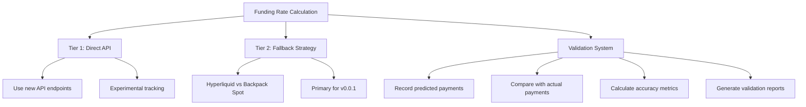
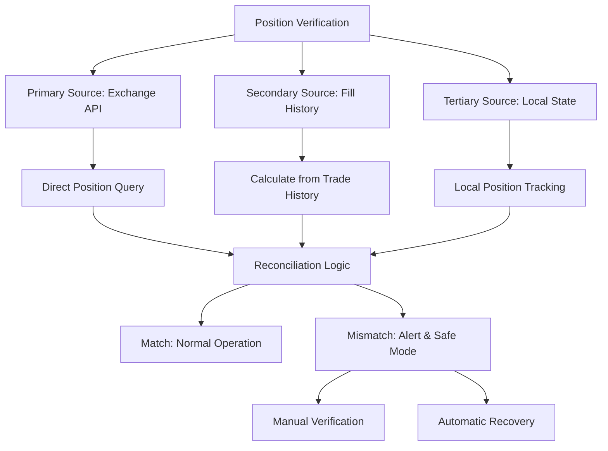
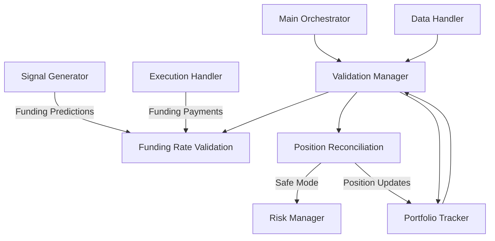

# Validation System Requirements

## Overview

Based on the prototype documentation, the CyberDeltaEngine system requires a comprehensive validation system to ensure the accuracy of funding rate calculations, position data, and overall system integrity. This document outlines the validation requirements specified in the prototype documentation, analyzes what is currently missing in the implementation, and provides recommendations for implementation.

## Funding Rate Validation Requirements

### Multi-Tiered Funding Rate Calculation

According to the prototype documentation, the system should implement a multi-tiered approach to funding rate calculation and validation:



### Key Validation Components

1. **Prediction Recording**:
   - System should record all funding rate predictions
   - Store both the predicted rates and the calculation method used

2. **Actual Payment Tracking**:
   - Record actual funding payments received/paid
   - Timestamp all payments for accurate comparison

3. **Accuracy Metrics Calculation**:
   - Calculate Root Mean Square Error (RMSE) between predicted and actual rates
   - Calculate Mean Absolute Error (MAE) for prediction accuracy
   - Track bias in predictions (systematic over/under-prediction)

4. **Validation Reporting**:
   - Generate periodic reports on prediction accuracy
   - Provide feedback to improve the prediction model
   - Alert on significant prediction errors

## Position Verification Requirements

The prototype documentation also specifies requirements for position verification:

### Multi-Source Position Reconciliation



### Key Position Verification Components

1. **Multi-Source Data Collection**:
   - Query positions directly from exchange APIs
   - Calculate positions from fill history
   - Maintain local position state

2. **Reconciliation Logic**:
   - Compare positions across all data sources
   - Identify and quantify discrepancies
   - Apply tolerance thresholds for minor differences

3. **Discrepancy Handling**:
   - Alert on significant position discrepancies
   - Enter safe mode when inconsistencies detected
   - Provide tools for manual verification
   - Implement automatic recovery where possible

4. **Periodic Verification**:
   - Schedule regular position verification
   - Increase frequency during high volatility
   - Maintain verification logs

## Current Implementation Status

Based on the project status documents, the current implementation is missing several critical validation components:

1. **Missing Funding Rate Validation**:
   - No explicit tiered approach for funding rate calculation
   - No tracking of predicted vs actual funding rates
   - No validation metrics calculation (RMSE, MAE)
   - No validation reporting system

2. **Missing Position Verification**:
   - Limited position tracking without multi-source verification
   - No reconciliation logic between different data sources
   - Missing discrepancy handling and alerting
   - No safe mode implementation for inconsistencies

3. **Missing System-Wide Validation**:
   - No validation of exchange data freshness
   - Missing consistency checks for market data
   - No validation of order execution accuracy

## Proposed Implementation

### 1. Funding Rate Validation System

```python
class FundingRateValidation:
    """
    System for validating funding rate predictions against actual payments.
    """
    
    def __init__(self, config: Config):
        self.config = config
        self.db_path = config.get("validation.db_path", "data/validation.db")
        self.prediction_records = []
        self.payment_records = []
        self.logger = logging.getLogger(__name__)
        
        # Initialize database
        self._init_db()
    
    def _init_db(self):
        """Initialize the validation database"""
        conn = sqlite3.connect(self.db_path)
        cursor = conn.cursor()
        
        # Create tables if they don't exist
        cursor.execute('''
        CREATE TABLE IF NOT EXISTS funding_predictions (
            id INTEGER PRIMARY KEY,
            timestamp INTEGER,
            exchange TEXT,
            symbol TEXT,
            predicted_rate REAL,
            prediction_method TEXT,
            confidence REAL
        )
        ''')
        
        cursor.execute('''
        CREATE TABLE IF NOT EXISTS funding_payments (
            id INTEGER PRIMARY KEY,
            timestamp INTEGER,
            exchange TEXT,
            symbol TEXT,
            actual_rate REAL,
            payment_amount REAL,
            position_size REAL
        )
        ''')
        
        conn.commit()
        conn.close()
    
    def record_prediction(self, exchange: str, symbol: str, 
                          predicted_rate: float, method: str, 
                          confidence: float = 1.0):
        """
        Record a funding rate prediction
        
        Args:
            exchange: Exchange name
            symbol: Trading symbol
            predicted_rate: Predicted funding rate
            method: Prediction method used
            confidence: Confidence level in prediction (0-1)
        """
        timestamp = int(time.time() * 1000)
        
        conn = sqlite3.connect(self.db_path)
        cursor = conn.cursor()
        
        cursor.execute(
            "INSERT INTO funding_predictions (timestamp, exchange, symbol, predicted_rate, prediction_method, confidence) "
            "VALUES (?, ?, ?, ?, ?, ?)",
            (timestamp, exchange, symbol, predicted_rate, method, confidence)
        )
        
        conn.commit()
        conn.close()
        
        self.logger.info(f"Recorded funding prediction: {exchange} {symbol} rate={predicted_rate} method={method}")
    
    def record_payment(self, exchange: str, symbol: str, 
                       actual_rate: float, payment_amount: float,
                       position_size: float):
        """
        Record an actual funding payment
        
        Args:
            exchange: Exchange name
            symbol: Trading symbol
            actual_rate: Actual funding rate applied
            payment_amount: Amount of funding paid/received
            position_size: Position size at time of payment
        """
        timestamp = int(time.time() * 1000)
        
        conn = sqlite3.connect(self.db_path)
        cursor = conn.cursor()
        
        cursor.execute(
            "INSERT INTO funding_payments (timestamp, exchange, symbol, actual_rate, payment_amount, position_size) "
            "VALUES (?, ?, ?, ?, ?, ?)",
            (timestamp, exchange, symbol, actual_rate, payment_amount, position_size)
        )
        
        conn.commit()
        conn.close()
        
        self.logger.info(f"Recorded funding payment: {exchange} {symbol} rate={actual_rate} amount={payment_amount}")
    
    def calculate_metrics(self, exchange: str, symbol: str, days: int = 7) -> Dict[str, float]:
        """
        Calculate prediction accuracy metrics
        
        Args:
            exchange: Exchange name
            symbol: Trading symbol
            days: Number of days to include in calculation
            
        Returns:
            Dictionary with accuracy metrics
        """
        # Calculate time threshold
        threshold = int((time.time() - (days * 86400)) * 1000)
        
        conn = sqlite3.connect(self.db_path)
        cursor = conn.cursor()
        
        # Get predictions and payments within time window
        cursor.execute(
            "SELECT p.timestamp, p.predicted_rate, a.actual_rate "
            "FROM funding_predictions p "
            "JOIN funding_payments a ON "
            "  (p.exchange = a.exchange AND p.symbol = a.symbol AND ABS(p.timestamp - a.timestamp) < 3600000) "
            "WHERE p.exchange = ? AND p.symbol = ? AND p.timestamp > ?",
            (exchange, symbol, threshold)
        )
        
        results = cursor.fetchall()
        conn.close()
        
        if not results:
            return {
                "rmse": 0.0,
                "mae": 0.0,
                "bias": 0.0,
                "count": 0
            }
        
        # Calculate metrics
        predictions = [row[1] for row in results]
        actuals = [row[2] for row in results]
        errors = [p - a for p, a in zip(predictions, actuals)]
        
        rmse = math.sqrt(sum(e**2 for e in errors) / len(errors))
        mae = sum(abs(e) for e in errors) / len(errors)
        bias = sum(errors) / len(errors)
        
        return {
            "rmse": rmse,
            "mae": mae,
            "bias": bias,
            "count": len(results)
        }
    
    def generate_report(self, exchange: str = None, symbol: str = None, days: int = 7) -> Dict[str, Any]:
        """
        Generate a validation report
        
        Args:
            exchange: Filter by exchange (optional)
            symbol: Filter by symbol (optional)
            days: Number of days to include
            
        Returns:
            Dictionary with validation report data
        """
        conn = sqlite3.connect(self.db_path)
        cursor = conn.cursor()
        
        # Get unique exchange/symbol combinations
        query = "SELECT DISTINCT exchange, symbol FROM funding_predictions"
        params = []
        
        if exchange:
            query += " WHERE exchange = ?"
            params.append(exchange)
            
            if symbol:
                query += " AND symbol = ?"
                params.append(symbol)
        elif symbol:
            query += " WHERE symbol = ?"
            params.append(symbol)
        
        cursor.execute(query, params)
        pairs = cursor.fetchall()
        conn.close()
        
        # Calculate metrics for each pair
        report = {
            "timestamp": int(time.time()),
            "days_included": days,
            "pairs": {}
        }
        
        for exch, sym in pairs:
            metrics = self.calculate_metrics(exch, sym, days)
            report["pairs"][f"{exch}:{sym}"] = metrics
        
        # Calculate overall metrics
        all_metrics = [m for p in report["pairs"].values() for m in [p["rmse"], p["mae"], p["bias"]] if p["count"] > 0]
        if all_metrics:
            report["overall"] = {
                "rmse": sum(m["rmse"] for m in report["pairs"].values() if m["count"] > 0) / len(report["pairs"]),
                "mae": sum(m["mae"] for m in report["pairs"].values() if m["count"] > 0) / len(report["pairs"]),
                "bias": sum(m["bias"] for m in report["pairs"].values() if m["count"] > 0) / len(report["pairs"]),
                "total_predictions": sum(m["count"] for m in report["pairs"].values())
            }
        
        return report
```

### 2. Position Reconciliation System

```python
class PositionReconciliation:
    """
    System for verifying and reconciling position data from multiple sources.
    """
    
    def __init__(self, config: Config, portfolio_tracker: PortfolioTracker, 
                 data_handler: DataHandler):
        self.config = config
        self.portfolio_tracker = portfolio_tracker
        self.data_handler = data_handler
        self.logger = logging.getLogger(__name__)
        
        # Reconciliation parameters
        self.safe_mode = False
        self.last_reconciliation = 0
        self.reconciliation_interval = config.get("validation.reconciliation_interval", 3600)  # 1 hour
        self.position_tolerance = config.get("validation.position_tolerance", 0.01)  # 1% tolerance
        
    async def verify_positions(self) -> Dict[str, Any]:
        """
        Verify positions across multiple data sources
        
        Returns:
            Dictionary with verification results
        """
        self.logger.info("Starting position verification")
        current_time = time.time()
        
        # Skip if we've verified recently
        if current_time - self.last_reconciliation < self.reconciliation_interval:
            return {"status": "skipped", "reason": "too_soon"}
        
        verification_results = {
            "timestamp": int(current_time),
            "exchanges": {},
            "discrepancies": [],
            "safe_mode_triggered": False
        }
        
        # Get list of exchanges with positions
        exchanges = self.portfolio_tracker.get_exchanges_with_positions()
        
        for exchange in exchanges:
            exchange_results = {
                "symbols": {},
                "status": "verified"
            }
            
            # Get positions for this exchange
            local_positions = self.portfolio_tracker.get_positions(exchange)
            
            try:
                # Get positions directly from exchange API
                api_positions = await self.data_handler.get_exchange_positions(exchange)
                
                # Get positions calculated from fill history
                fill_positions = await self._calculate_positions_from_fills(exchange)
                
                # Verify each position
                for symbol, local_pos in local_positions.items():
                    api_pos = next((p for p in api_positions if p["symbol"] == symbol), {}).get("size", 0)
                    fill_pos = fill_positions.get(symbol, 0)
                    
                    # Calculate discrepancies
                    api_discrepancy = abs(local_pos - api_pos) / max(abs(local_pos), 0.0001)
                    fill_discrepancy = abs(local_pos - fill_pos) / max(abs(local_pos), 0.0001)
                    
                    symbol_status = "verified"
                    
                    # Check if discrepancies exceed tolerance
                    if api_discrepancy > self.position_tolerance or fill_discrepancy > self.position_tolerance:
                        symbol_status = "discrepancy"
                        exchange_results["status"] = "discrepancy"
                        
                        discrepancy = {
                            "exchange": exchange,
                            "symbol": symbol,
                            "local_position": local_pos,
                            "api_position": api_pos,
                            "fill_position": fill_pos,
                            "api_discrepancy": api_discrepancy,
                            "fill_discrepancy": fill_discrepancy
                        }
                        
                        verification_results["discrepancies"].append(discrepancy)
                    
                    exchange_results["symbols"][symbol] = {
                        "local_position": local_pos,
                        "api_position": api_pos,
                        "fill_position": fill_pos,
                        "status": symbol_status
                    }
            
            except Exception as e:
                self.logger.error(f"Error verifying positions for {exchange}: {e}")
                exchange_results["status"] = "error"
                exchange_results["error"] = str(e)
            
            verification_results["exchanges"][exchange] = exchange_results
        
        # Check if we need to enter safe mode
        if verification_results["discrepancies"]:
            # Check if any major discrepancies
            major_discrepancies = [
                d for d in verification_results["discrepancies"]
                if d["api_discrepancy"] > self.position_tolerance * 3  # 3x tolerance is a major discrepancy
            ]
            
            if major_discrepancies:
                self.logger.warning(f"Major position discrepancies detected, entering safe mode")
                self.safe_mode = True
                verification_results["safe_mode_triggered"] = True
        
        self.last_reconciliation = current_time
        return verification_results
    
    async def _calculate_positions_from_fills(self, exchange: str) -> Dict[str, float]:
        """
        Calculate positions based on fill history
        
        Args:
            exchange: Exchange name
            
        Returns:
            Dictionary of positions by symbol
        """
        # Get fill history from the past week
        seven_days_ago = int((time.time() - 7 * 86400) * 1000)
        fills = await self.data_handler.get_fill_history(exchange, start_time=seven_days_ago)
        
        positions = {}
        
        for fill in fills:
            symbol = fill["symbol"]
            size = fill["size"]
            side = fill["side"]
            
            if symbol not in positions:
                positions[symbol] = 0.0
            
            # Add or subtract based on side
            if side == "buy":
                positions[symbol] += size
            else:
                positions[symbol] -= size
        
        return positions
    
    def is_safe_mode(self) -> bool:
        """Check if system is in safe mode due to position discrepancies"""
        return self.safe_mode
    
    def exit_safe_mode(self):
        """Manually exit safe mode after verification"""
        self.safe_mode = False
        self.logger.info("Manually exited safe mode")
    
    async def reconcile_position(self, exchange: str, symbol: str) -> Dict[str, Any]:
        """
        Attempt to reconcile a position discrepancy
        
        Args:
            exchange: Exchange name
            symbol: Symbol with discrepancy
            
        Returns:
            Result of reconciliation attempt
        """
        self.logger.info(f"Attempting to reconcile position for {exchange}:{symbol}")
        
        try:
            # Get position from API
            api_positions = await self.data_handler.get_exchange_positions(exchange)
            api_position = next((p for p in api_positions if p["symbol"] == symbol), {}).get("size", 0)
            
            # Update local position to match API
            self.portfolio_tracker.update_position(exchange, symbol, api_position)
            
            self.logger.info(f"Reconciled position for {exchange}:{symbol} to {api_position}")
            
            return {
                "status": "reconciled",
                "exchange": exchange,
                "symbol": symbol,
                "new_position": api_position
            }
        
        except Exception as e:
            self.logger.error(f"Error reconciling position for {exchange}:{symbol}: {e}")
            
            return {
                "status": "error",
                "exchange": exchange,
                "symbol": symbol,
                "error": str(e)
            }
```

### 3. System-Wide Validation Manager

```python
class ValidationManager:
    """
    Centralized manager for all validation systems.
    Coordinates funding rate validation, position reconciliation,
    and overall system validation.
    """
    
    def __init__(self, config: Config, portfolio_tracker: PortfolioTracker, 
                 data_handler: DataHandler):
        self.config = config
        self.logger = logging.getLogger(__name__)
        
        # Initialize subsystems
        self.funding_validation = FundingRateValidation(config)
        self.position_reconciliation = PositionReconciliation(
            config, portfolio_tracker, data_handler
        )
        
        # Validation schedules
        self.funding_validation_interval = config.get("validation.funding_interval", 3600)  # 1 hour
        self.position_verification_interval = config.get("validation.position_interval", 1800)  # 30 minutes
        self.data_freshness_interval = config.get("validation.freshness_interval", 300)  # 5 minutes
        
        self.last_funding_validation = 0
        self.last_position_verification = 0
        self.last_data_freshness_check = 0
        
        # Data validation thresholds
        self.max_data_age = config.get("validation.max_data_age", 60)  # 60 seconds
    
    async def run_scheduled_validations(self) -> Dict[str, Any]:
        """
        Run all scheduled validations based on intervals
        
        Returns:
            Dictionary with validation results
        """
        current_time = time.time()
        results = {
            "timestamp": int(current_time),
            "validations_run": []
        }
        
        # Check if each validation is due
        if current_time - self.last_funding_validation >= self.funding_validation_interval:
            funding_report = self.funding_validation.generate_report()
            results["funding_validation"] = funding_report
            results["validations_run"].append("funding")
            self.last_funding_validation = current_time
        
        if current_time - self.last_position_verification >= self.position_verification_interval:
            position_results = await self.position_reconciliation.verify_positions()
            results["position_verification"] = position_results
            results["validations_run"].append("positions")
            self.last_position_verification = current_time
        
        if current_time - self.last_data_freshness_check >= self.data_freshness_interval:
            freshness_results = await self._check_data_freshness()
            results["data_freshness"] = freshness_results
            results["validations_run"].append("freshness")
            self.last_data_freshness_check = current_time
        
        # Calculate overall system validation status
        results["overall_status"] = self._calculate_overall_status(results)
        
        return results
    
    async def _check_data_freshness(self) -> Dict[str, Any]:
        """
        Check freshness of market data
        
        Returns:
            Dictionary with freshness check results
        """
        # This would be implemented to verify that market data is recent
        # by checking timestamps against current time
        pass
    
    def _calculate_overall_status(self, validation_results: Dict[str, Any]) -> str:
        """
        Calculate overall system validation status
        
        Args:
            validation_results: Results from all validations
            
        Returns:
            Overall status string
        """
        # Check for any critical issues
        if (self.position_reconciliation.is_safe_mode() or
            (validation_results.get("data_freshness", {}).get("stale_data_count", 0) > 0)):
            return "critical"
        
        # Check for warnings
        if (validation_results.get("position_verification", {}).get("discrepancies", [])):
            return "warning"
            
        # Check funding validation
        if "funding_validation" in validation_results:
            funding = validation_results["funding_validation"]
            if (funding.get("overall", {}).get("rmse", 0) > 0.001):  # RMSE > 0.1%
                return "warning"
        
        return "healthy"
    
    def is_system_healthy(self) -> bool:
        """Check if the overall system is in a healthy state"""
        return not self.position_reconciliation.is_safe_mode()
    
    def get_validation_metrics(self) -> Dict[str, Any]:
        """Get current validation metrics for dashboard/monitoring"""
        return {
            "funding_last_validation": self.last_funding_validation,
            "position_last_verification": self.last_position_verification,
            "data_freshness_last_check": self.last_data_freshness_check,
            "safe_mode": self.position_reconciliation.is_safe_mode(),
            "validation_intervals": {
                "funding": self.funding_validation_interval,
                "position": self.position_verification_interval,
                "freshness": self.data_freshness_interval
            }
        }
```

## Integration into Existing Architecture

The validation system should be integrated as follows:



## Testing the Validation System

To ensure the validation system works correctly, comprehensive tests should be implemented:

1. **FundingRateValidation Tests**:
   - Test prediction recording and retrieval
   - Test metrics calculation with known data
   - Test report generation with various filters

2. **PositionReconciliation Tests**:
   - Test position verification with matching data
   - Test discrepancy detection with mismatched data
   - Test safe mode triggers and recovery

3. **ValidationManager Tests**:
   - Test scheduled validation execution
   - Test overall status calculation
   - Test integration with other components

## Implementation Priority

Given the importance of validation for trading system integrity, implementation should be prioritized as follows:

1. **Week 1**: Implement PositionReconciliation system
   - Focus on multi-source position verification
   - Implement safe mode logic
   - Add basic reconciliation capabilities

2. **Week 2**: Implement FundingRateValidation system
   - Create database structure for tracking predictions and payments
   - Implement metrics calculation
   - Add basic reporting functionality

3. **Week 3**: Implement ValidationManager and integration
   - Create central validation orchestration
   - Integrate with main application flow
   - Add data freshness validation

## Conclusion

The validation system is a critical component that is currently missing from the CyberDeltaEngine implementation. By implementing the proposed validation framework, the system will gain important safety features, including:

1. Accurate tracking of funding rate prediction performance
2. Multi-source position verification to prevent errors
3. Safe mode capabilities to halt trading when discrepancies are detected
4. Comprehensive validation reports for continuous improvement

These features will significantly enhance the reliability and safety of the trading system, reducing the risk of errors and financial losses. 