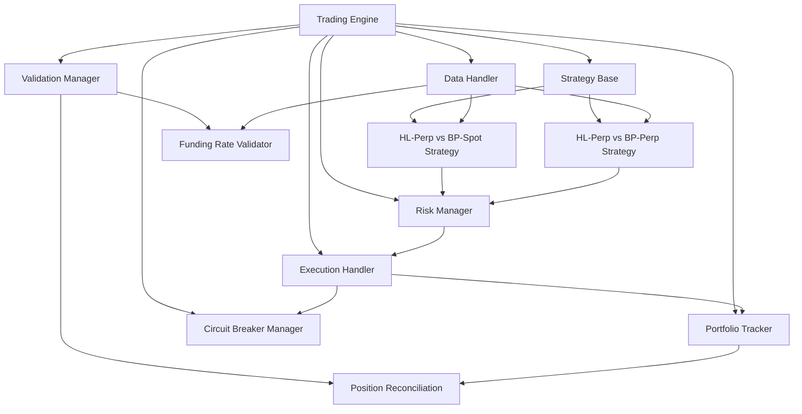

# Dual Strategy Overview - CyberDeltaEngine

**Status: Analysis Complete - Implementation DEFERRED (Revised Aug 6, 2025)**

**Note:** Based on critic feedback prioritizing foundational stability, the implementation of the selected HL Perp vs BP Perp strategy described below is **deferred** for Prototype 0.0.1. The immediate focus must be on fixing `config.yaml`, achieving comprehensive test coverage (unit, integration, failure), finalizing and testing safety systems, and implementing simplified risk management (hard limits, basic margin/liquidation checks). The critic specifically highlighted the **increased complexity and risk** (liquidation, margin) of the dual-perp approach, reinforcing the need for a stable foundation before implementation.

## 1. Overview

This document provides an overview of the two primary funding rate arbitrage strategies considered for the CyberDeltaEngine trading bot, compares their characteristics, and outlines the rationale for selecting the primary strategy for initial implementation (Prototype 0.0.1), while acknowledging the need to potentially support both.

## Overview

Based on Gemini critic feedback and API endpoint discoveries, the CyberDeltaEngine v0.0.1 will support two arbitrage strategies:

1. **Hyperliquid Perp vs Backpack Spot** (Primary Strategy)
2. **Hyperliquid Perp vs Backpack Perp** (Enhanced Strategy with Higher Risk Profile)

Both strategies exploit funding rate differentials, but with different risk profiles, execution requirements, and validation needs. This document outlines how we'll implement both strategies while addressing critical feedback.

## Architecture and Strategy Implementation



## Strategy Comparison

| Feature | HL-Perp vs BP-Spot | HL-Perp vs BP-Perp |
|---------|--------------------|--------------------|
| **Funding Rate Arbitrage** | Yes | Yes |
| **Leverage** | One leg only (HL) | Both legs |
| **Liquidation Risk** | One leg only (HL) | Both legs |
| **Data Requirements** | HL funding rates + BP spot pricing | HL funding rates + BP funding rates |
| **API Endpoint Confirmation** | Confirmed for both legs | Confirmed for both legs |
| **Risk Profile** | Moderate | Higher |
| **Implementation Complexity** | Moderate | Higher |
| **Capital Efficiency** | Lower | Higher (if profitable) |

## API Endpoint Confirmation

Based on the Gemini critic feedback, we've confirmed that the necessary API endpoints exist:

### Backpack (Spot & Perp)
- **Funding Rate Data**: 
  - `/api/v1/markPrices` - Provides current/predicted funding rate
  - `/api/v1/fundingRates` - Historical funding rates
- **Position Management**:
  - `/api/v1/position` - Current positions with liquidation prices
- **Authentication**:
  - Uses ED25519 signing mechanism

### Hyperliquid
- **Funding Rate Data**: Confirmed via API
- **Position Management**: Confirmed via API
- **Authentication**: Confirmed implementation

## Implementation Strategy

### 1. Common Foundation

Both strategies will share:
- The same `Strategy` base class
- Common data handling components
- Common execution mechanism
- Enhanced validation and circuit breaker systems

### 2. Strategy-Specific Implementation

#### HL-Perp vs BP-Spot Strategy:

```python
class HLPerpBPSpotStrategy(Strategy):
    """
    Funding rate arbitrage between Hyperliquid perpetuals and Backpack spot markets.
    - Long/short position on Hyperliquid perpetual contract
    - Corresponding opposite position in Backpack spot market
    - Profit from funding rate payments while maintaining delta neutrality
    """
    
    def __init__(self, config: Config, name: str, symbols: Dict[str, str]):
        super().__init__(name, symbols.get("hl_symbol"), config.get("strategies.hl_perp_bp_spot"))
        self.bp_symbol = symbols.get("bp_symbol")
        self.funding_threshold = self.get_param("funding_threshold", 0.0001)  # 0.01% default
        self.min_spread = self.get_param("min_spread", 0.0002)  # 0.02% default
        self.hl_exchange = "hyperliquid"
        self.bp_exchange = "backpack"
        
    async def process_data(self, data: MarketData) -> Optional[TradeSignal]:
        """Process market data and generate trade signals"""
        
        # Skip if data is not for our instruments
        if data.symbol not in [self.symbol, self.bp_symbol]:
            return None
            
        # Update our internal data cache
        self.update_historical_data(data)
        
        # Only generate signals on new funding rate data
        if data.data_type != "funding_rate":
            return None
            
        # Get latest HL funding rate
        hl_funding_rate = self._get_latest_hl_funding_rate()
        if hl_funding_rate is None:
            return None
            
        # Calculate expected return based on funding rate
        # Positive funding rate means longs pay shorts
        expected_return = abs(hl_funding_rate)
        
        # Check if funding rate exceeds our threshold
        if expected_return < self.funding_threshold:
            return None
            
        # Get latest prices for both instruments
        hl_price = self._get_latest_hl_price()
        bp_price = self._get_latest_bp_price()
        
        if hl_price is None or bp_price is None:
            return None
            
        # Calculate price spread between exchanges
        spread_pct = abs(hl_price - bp_price) / hl_price
        
        # Only proceed if spread is acceptable
        if spread_pct > self.min_spread:
            return None
            
        # Determine trade direction based on funding rate
        # If funding rate is positive, go short on perpetual (shorts receive funding)
        # If funding rate is negative, go long on perpetual (longs receive funding)
        perp_side = OrderSide.SELL if hl_funding_rate > 0 else OrderSide.BUY
        spot_side = OrderSide.BUY if perp_side == OrderSide.SELL else OrderSide.SELL
        
        # Create and return trade signal
        signal = TradeSignal(
            strategy_name=self.name,
            timestamp=data.timestamp,
            signal_type="funding_arbitrage",
            perp_exchange=self.hl_exchange,
            perp_symbol=self.symbol,
            perp_side=perp_side,
            spot_exchange=self.bp_exchange,
            spot_symbol=self.bp_symbol,
            spot_side=spot_side,
            expected_return=expected_return,
            confidence=1.0,
            metadata={
                "hl_funding_rate": hl_funding_rate,
                "price_spread_pct": spread_pct,
                "hl_price": hl_price,
                "bp_price": bp_price
            }
        )
        
        self.last_signal_time = datetime.fromtimestamp(data.timestamp / 1000)
        self.signals_generated += 1
        
        return signal
```

#### HL-Perp vs BP-Perp Strategy:

```python
class HLPerpBPPerpStrategy(Strategy):
    """
    Funding rate arbitrage between Hyperliquid perpetuals and Backpack perpetuals.
    - Long position on exchange with negative funding rate
    - Short position on exchange with positive funding rate
    - Profit from funding rate differential while maintaining delta neutrality
    - WARNING: Higher risk profile due to leverage on both legs
    """
    
    def __init__(self, config: Config, name: str, symbols: Dict[str, str]):
        super().__init__(name, symbols.get("hl_symbol"), config.get("strategies.hl_perp_bp_perp"))
        self.bp_symbol = symbols.get("bp_symbol")
        self.min_funding_diff = self.get_param("min_funding_diff", 0.0002)  # 0.02% default
        self.min_basis_vol = self.get_param("min_basis_vol", 0.001)  # 0.1% default
        self.max_basis_spread = self.get_param("max_basis_spread", 0.005)  # 0.5% default
        self.hl_exchange = "hyperliquid"
        self.bp_exchange = "backpack"
        
    async def process_data(self, data: MarketData) -> Optional[TradeSignal]:
        """Process market data and generate trade signals"""
        
        # Skip if data is not for our instruments
        if data.symbol not in [self.symbol, self.bp_symbol]:
            return None
            
        # Update our internal data cache
        self.update_historical_data(data)
        
        # Only generate signals on new funding rate data
        if data.data_type != "funding_rate":
            return None
            
        # Get latest funding rates
        hl_funding_rate = self._get_latest_hl_funding_rate()
        bp_funding_rate = self._get_latest_bp_funding_rate()
        
        if hl_funding_rate is None or bp_funding_rate is None:
            return None
            
        # Calculate normalized funding differential (NFD)
        funding_diff = hl_funding_rate - bp_funding_rate
        
        # Check if funding differential exceeds our threshold
        if abs(funding_diff) < self.min_funding_diff:
            return None
            
        # Get latest prices for both instruments
        hl_price = self._get_latest_hl_price()
        bp_price = self._get_latest_bp_price()
        
        if hl_price is None or bp_price is None:
            return None
            
        # Calculate basis and analyze stability
        basis = hl_price - bp_price
        basis_pct = abs(basis) / hl_price
        basis_vol = self._calculate_basis_volatility(lookback_hours=24)
        
        # Only proceed if basis is stable and within acceptable range
        if basis_vol < self.min_basis_vol or basis_pct > self.max_basis_spread:
            return None
            
        # Determine which exchange to go long/short based on funding rates
        # Go long on exchange with negative (or less positive) funding rate
        # Go short on exchange with positive (or less negative) funding rate
        if funding_diff > 0:  # HL funding > BP funding
            hl_side = OrderSide.SELL  # Short HL
            bp_side = OrderSide.BUY   # Long BP
        else:  # BP funding > HL funding
            hl_side = OrderSide.BUY   # Long HL
            bp_side = OrderSide.SELL  # Short BP
        
        # Create and return trade signal
        signal = TradeSignal(
            strategy_name=self.name,
            timestamp=data.timestamp,
            signal_type="funding_arbitrage",
            perp_exchange=self.hl_exchange,
            perp_symbol=self.symbol,
            perp_side=hl_side,
            perp_exchange2=self.bp_exchange,
            perp_symbol2=self.bp_symbol,
            perp_side2=bp_side,
            expected_return=abs(funding_diff),
            confidence=1.0,
            metadata={
                "hl_funding_rate": hl_funding_rate,
                "bp_funding_rate": bp_funding_rate,
                "funding_diff": funding_diff,
                "basis_pct": basis_pct,
                "basis_vol": basis_vol,
                "hl_price": hl_price,
                "bp_price": bp_price
            }
        )
        
        self.last_signal_time = datetime.fromtimestamp(data.timestamp / 1000)
        self.signals_generated += 1
        
        return signal
        
    def _calculate_basis_volatility(self, lookback_hours: int = 24) -> float:
        """
        Calculate the volatility of the basis between HL and BP
        over the specified lookback period
        """
        # Implementation details...
        pass
```

### 3. Enhanced Risk Management

Following the Gemini critic's feedback, we'll implement enhanced risk management, especially for the HL-Perp vs BP-Perp strategy:

```python
class RiskManager:
    """
    Risk manager for arbitrage strategies.
    Handles position sizing, validation, and risk constraints.
    """
    
    def __init__(self, config: Config, portfolio_tracker: PortfolioTracker):
        self.config = config
        self.portfolio_tracker = portfolio_tracker
        self.logger = logging.getLogger(__name__)
        
        # Global risk limits
        self.max_position_size_usd = config.get("risk.max_position_size_usd", 1000.0)
        self.max_portfolio_leverage = config.get("risk.max_portfolio_leverage", 2.0)
        self.max_position_leverage = config.get("risk.max_position_leverage", 3.0)
        
        # Strategy-specific risk limits
        self.strategy_limits = {
            "hl_perp_bp_spot": {
                "max_position_size_usd": config.get("risk.hl_perp_bp_spot.max_position_size_usd", 
                                                 self.max_position_size_usd),
                "max_leverage": config.get("risk.hl_perp_bp_spot.max_leverage", 
                                        self.max_position_leverage)
            },
            "hl_perp_bp_perp": {
                "max_position_size_usd": config.get("risk.hl_perp_bp_perp.max_position_size_usd", 
                                                 self.max_position_size_usd / 2),  # More conservative by default
                "max_leverage": config.get("risk.hl_perp_bp_perp.max_leverage", 
                                        self.max_position_leverage / 2)  # More conservative by default
            }
        }
        
    async def size_opportunity(self, opportunity: ArbitrageOpportunity) -> Optional[SizedOpportunity]:
        """
        Calculate appropriate position size for an arbitrage opportunity
        based on risk parameters and portfolio constraints.
        
        Args:
            opportunity: Arbitrage opportunity to size
            
        Returns:
            Sized opportunity if it passes risk checks, None otherwise
        """
        # Get strategy-specific limits
        strategy_limits = self.strategy_limits.get(
            opportunity.strategy_name, 
            self.strategy_limits.get("hl_perp_bp_spot")  # Default to spot strategy limits
        )
        
        # Check if this is a dual-perp strategy
        is_dual_perp = hasattr(opportunity, 'perp_exchange2') and opportunity.perp_exchange2 is not None
        
        # Get current portfolio state
        total_capital = await self.portfolio_tracker.get_total_capital()
        current_exposure = await self.portfolio_tracker.get_total_exposure()
        current_leverage = current_exposure / total_capital if total_capital > 0 else 0
        
        # Calculate maximum allowed position size
        max_size_usd = min(
            strategy_limits["max_position_size_usd"],
            total_capital * 0.25  # Limit single opportunity to 25% of capital
        )
        
        # Reduce size for dual-perp strategies due to higher risk
        if is_dual_perp:
            max_size_usd *= 0.5  # 50% of normal size for dual-perp strategies
        
        # Check current leverage and margin status before allowing new positions
        if is_dual_perp:
            # For dual-perp strategies, check liquidation risk on both exchanges
            hl_liquidation_risk = await self._check_liquidation_risk(opportunity.perp_exchange)
            bp_liquidation_risk = await self._check_liquidation_risk(opportunity.perp_exchange2)
            
            if hl_liquidation_risk > 0.2 or bp_liquidation_risk > 0.2:  # If within 20% of liquidation
                self.logger.warning(f"Liquidation risk too high: HL={hl_liquidation_risk:.2f}, BP={bp_liquidation_risk:.2f}")
                return None
        else:
            # For perp-spot strategies, check only the perp exchange
            hl_liquidation_risk = await self._check_liquidation_risk(opportunity.perp_exchange)
            
            if hl_liquidation_risk > 0.2:  # If within 20% of liquidation
                self.logger.warning(f"Liquidation risk too high: HL={hl_liquidation_risk:.2f}")
                return None
        
        # Calculate projected position sizes
        if opportunity.expected_return <= 0:
            self.logger.warning(f"Expected return is non-positive: {opportunity.expected_return}")
            return None
            
        # Simple position sizing based on expected return
        # Higher expected return = larger position, up to the maximum
        size_factor = min(opportunity.expected_return * 100, 1.0)  # Scale by expected return, cap at 100%
        position_size_usd = max_size_usd * size_factor
        
        # Ensure minimum viable size
        min_viable_size = 10.0  # $10 minimum position
        if position_size_usd < min_viable_size:
            self.logger.info(f"Position size too small: ${position_size_usd:.2f} < ${min_viable_size:.2f}")
            return None
        
        # Calculate quantities based on latest prices
        perp_price = opportunity.metadata.get(f"{opportunity.perp_exchange}_price", 0)
        if perp_price <= 0:
            self.logger.error(f"Invalid perp price: {perp_price}")
            return None
            
        perp_size = position_size_usd / perp_price
        
        # For dual-perp strategy
        if is_dual_perp:
            perp2_price = opportunity.metadata.get(f"{opportunity.perp_exchange2}_price", 0)
            if perp2_price <= 0:
                self.logger.error(f"Invalid perp2 price: {perp2_price}")
                return None
                
            perp2_size = position_size_usd / perp2_price
            
            # Create the sized opportunity
            sized_opportunity = SizedOpportunity(
                opportunity=opportunity,
                perp_size=perp_size,
                perp2_size=perp2_size,
                allocation_percentage=position_size_usd / total_capital if total_capital > 0 else 0,
                expected_profit=position_size_usd * opportunity.expected_return,
                expected_return=opportunity.expected_return,
                risk_adjusted_return=opportunity.expected_return / max(0.001, opportunity.metadata.get("basis_vol", 0.01))
            )
        else:
            # For perp-spot strategy
            spot_price = opportunity.metadata.get(f"{opportunity.spot_exchange}_price", 0)
            if spot_price <= 0:
                self.logger.error(f"Invalid spot price: {spot_price}")
                return None
                
            spot_size = position_size_usd / spot_price
            
            # Create the sized opportunity
            sized_opportunity = SizedOpportunity(
                opportunity=opportunity,
                perp_size=perp_size,
                spot_size=spot_size,
                allocation_percentage=position_size_usd / total_capital if total_capital > 0 else 0,
                expected_profit=position_size_usd * opportunity.expected_return,
                expected_return=opportunity.expected_return,
                risk_adjusted_return=opportunity.expected_return / max(0.001, opportunity.metadata.get("basis_vol", 0.01))
            )
        
        self.logger.info(f"Sized opportunity: {sized_opportunity}")
        return sized_opportunity
    
    async def _check_liquidation_risk(self, exchange: str) -> float:
        """
        Calculate the liquidation risk for positions on an exchange
        
        Returns:
            Risk factor (0-1) where 0 is no risk and 1 is imminent liquidation
        """
        try:
            positions = await self.portfolio_tracker.get_positions(exchange)
            if not positions:
                return 0.0
                
            # For each position, calculate how close price is to liquidation price
            risk_factors = []
            for symbol, position in positions.items():
                position_details = await self.portfolio_tracker.get_position_details(exchange, symbol)
                
                if not position_details:
                    continue
                    
                mark_price = position_details.get("mark_price", 0)
                liquidation_price = position_details.get("liquidation_price", 0)
                
                if mark_price <= 0 or liquidation_price <= 0:
                    continue
                    
                # Calculate distance to liquidation
                if position_details.get("side") == "long":
                    # For long positions, liquidation_price < mark_price
                    if liquidation_price >= mark_price:
                        return 1.0  # Immediate liquidation risk
                    
                    distance = (mark_price - liquidation_price) / mark_price
                else:
                    # For short positions, liquidation_price > mark_price
                    if liquidation_price <= mark_price:
                        return 1.0  # Immediate liquidation risk
                    
                    distance = (liquidation_price - mark_price) / mark_price
                
                # Convert distance to risk factor (inverse relationship)
                risk_factor = 1.0 - min(distance / 0.5, 1.0)  # 50% distance = 0 risk
                risk_factors.append(risk_factor)
            
            # Return highest risk factor across all positions
            return max(risk_factors) if risk_factors else 0.0
            
        except Exception as e:
            self.logger.error(f"Error checking liquidation risk for {exchange}: {e}")
            return 0.5  # Return moderate risk if error occurs
```

### 4. Enhanced Validation System

Following the Gemini critic's feedback, we're implementing a robust validation system:

```python
class FundingRateValidator:
    """
    Validates funding rate data and predictions against actual payments.
    Tracks accuracy and detects anomalies.
    """
    
    def __init__(self, config: Config):
        self.config = config
        self.logger = logging.getLogger(__name__)
        
        # Initialize storage for predictions and actuals
        self.db_path = config.get("validation.db_path", "data/funding_validation.db")
        self._init_db()
        
    def _init_db(self):
        """Initialize the SQLite database for storing funding rate data"""
        conn = sqlite3.connect(self.db_path)
        cursor = conn.cursor()
        
        # Create tables if they don't exist
        cursor.execute('''
        CREATE TABLE IF NOT EXISTS funding_predictions (
            id INTEGER PRIMARY KEY,
            timestamp INTEGER,
            exchange TEXT,
            symbol TEXT,
            predicted_rate REAL,
            source TEXT
        )
        ''')
        
        cursor.execute('''
        CREATE TABLE IF NOT EXISTS funding_payments (
            id INTEGER PRIMARY KEY,
            timestamp INTEGER,
            exchange TEXT,
            symbol TEXT,
            rate REAL,
            payment REAL,
            position_size REAL
        )
        ''')
        
        conn.commit()
        conn.close()
        
    def record_rate_prediction(self, exchange: str, symbol: str, 
                             predicted_rate: float, source: str = "api"):
        """
        Record a funding rate prediction
        
        Args:
            exchange: Exchange name
            symbol: Trading symbol
            predicted_rate: Predicted funding rate
            source: Source of the prediction (api, calculation, etc.)
        """
        timestamp = int(time.time() * 1000)
        
        try:
            conn = sqlite3.connect(self.db_path)
            cursor = conn.cursor()
            
            cursor.execute(
                "INSERT INTO funding_predictions (timestamp, exchange, symbol, predicted_rate, source) "
                "VALUES (?, ?, ?, ?, ?)",
                (timestamp, exchange, symbol, predicted_rate, source)
            )
            
            conn.commit()
            conn.close()
            
        except Exception as e:
            self.logger.error(f"Error recording funding prediction: {e}")
    
    def record_payment(self, exchange: str, symbol: str, 
                     actual_rate: float, payment: float, position_size: float):
        """
        Record an actual funding payment
        
        Args:
            exchange: Exchange name
            symbol: Trading symbol
            actual_rate: Actual funding rate applied
            payment: Amount of the payment (positive=received, negative=paid)
            position_size: Position size at time of payment
        """
        timestamp = int(time.time() * 1000)
        
        try:
            conn = sqlite3.connect(self.db_path)
            cursor = conn.cursor()
            
            cursor.execute(
                "INSERT INTO funding_payments (timestamp, exchange, symbol, rate, payment, position_size) "
                "VALUES (?, ?, ?, ?, ?, ?)",
                (timestamp, exchange, symbol, actual_rate, payment, position_size)
            )
            
            conn.commit()
            conn.close()
            
        except Exception as e:
            self.logger.error(f"Error recording funding payment: {e}")
    
    def calculate_accuracy_metrics(self, exchange: str, symbol: str, 
                                days: int = 7) -> Dict[str, float]:
        """
        Calculate accuracy metrics for funding rate predictions
        
        Args:
            exchange: Exchange name
            symbol: Trading symbol
            days: Number of days to analyze
            
        Returns:
            Dictionary with accuracy metrics
        """
        # Calculate time threshold
        threshold = int(time.time() * 1000) - (days * 86400 * 1000)
        
        try:
            conn = sqlite3.connect(self.db_path)
            cursor = conn.cursor()
            
            # Find predictions and their corresponding payments
            query = """
            SELECT p.predicted_rate, a.rate 
            FROM funding_predictions p
            JOIN funding_payments a ON 
                p.exchange = a.exchange AND 
                p.symbol = a.symbol AND 
                ABS(p.timestamp - a.timestamp) < 3600000
            WHERE p.exchange = ? AND p.symbol = ? AND p.timestamp > ?
            """
            
            cursor.execute(query, (exchange, symbol, threshold))
            results = cursor.fetchall()
            
            conn.close()
            
            if not results:
                return {
                    "count": 0,
                    "mean_error": 0.0,
                    "rmse": 0.0,
                    "mae": 0.0,
                    "accuracy": 0.0
                }
            
            # Calculate error metrics
            errors = [abs(pred - actual) for pred, actual in results]
            sq_errors = [e**2 for e in errors]
            
            metrics = {
                "count": len(results),
                "mean_error": sum(errors) / len(errors),
                "rmse": math.sqrt(sum(sq_errors) / len(sq_errors)),
                "mae": sum(errors) / len(errors),
                "accuracy": sum(1 for e in errors if e < 0.0001) / len(errors)
            }
            
            return metrics
            
        except Exception as e:
            self.logger.error(f"Error calculating accuracy metrics: {e}")
            return {
                "count": 0,
                "mean_error": 0.0,
                "rmse": 0.0,
                "mae": 0.0,
                "accuracy": 0.0,
                "error": str(e)
            }
```

## Key Differences Between Strategies

1. **Risk Profile**:
   - **HL-Perp vs BP-Spot**: One leveraged leg (HL-Perp), one non-leveraged leg (BP-Spot).
   - **HL-Perp vs BP-Perp**: Both legs are leveraged, increasing overall risk.

2. **Signal Generation**:
   - **HL-Perp vs BP-Spot**: Arbitrage based on HL funding rates vs. spot market.
   - **HL-Perp vs BP-Perp**: Direct comparison of funding rates between two perpetual markets.

3. **Risk Management**:
   - **HL-Perp vs BP-Spot**: Monitor liquidation risk on HL only.
   - **HL-Perp vs BP-Perp**: Monitor liquidation risk on both exchanges.

4. **Capital Efficiency**:
   - **HL-Perp vs BP-Spot**: Lower leverage, capital tied in spot.
   - **HL-Perp vs BP-Perp**: Higher leverage, potentially better capital efficiency but higher risk.

## Response to Gemini Critic Feedback

1. **Confirming Backpack Funding Rate Endpoints**:
   - We've confirmed that `/api/v1/markPrices` provides the current/predicted funding rate.
   - We've confirmed that `/api/v1/position` provides position data including liquidation prices.

2. **Enhancing Risk Management**:
   - Implemented liquidation risk monitoring for both strategies.
   - Added stricter position size limits for dual-perp strategy.
   - Added cross-margin monitoring and portfolio-level leverage constraints.

3. **Implementing Validation System**:
   - Added `FundingRateValidator` to track predicted vs. actual rates.
   - Added metrics calculation for ongoing validation.
   - Will implement position reconciliation separately.

4. **Enhanced Circuit Breakers**:
   - Will implement full circuit breaker system with proper state management.
   - Will track metrics and integrate with safe mode.
   - Will provide granular control by exchange and operation type.

5. **Strategy Logic for Timing**:
   - Will explicitly handle the timing differences between HL (hourly) and BP (8-hourly) funding.
   - Will implement in funding payment tracking and signal generation. 