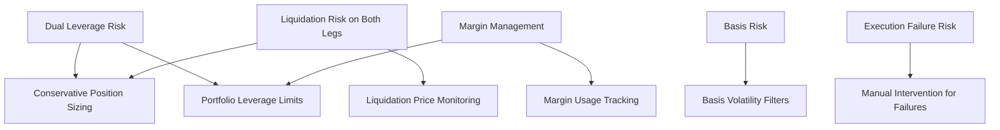

# Enhanced Risk Management for Dual-Perpetual Strategy

**Status: Design Complete - Advanced Features DEFERRED (Revised Aug 6, 2025)**

**Note:** Based on critic feedback prioritizing foundational stability and testing, the implementation of advanced risk management techniques described below (including Kelly Criterion variations, VaR, dynamic volatility adjustments, correlation limits, etc.) is **deferred** for Prototype 0.0.1. The immediate focus (Mandate #6) is on implementing and testing simple, robust **hard limits** (Max USD size/position, Max total exposure %, Max leverage, Max exchange concentration %) and essential **margin/liquidation monitoring** specifically for the dual-perp strategy (HL Perp vs BP Perp). The advanced concepts remain relevant for future phases *after* the core system is proven stable.

## Overview

As highlighted by the Gemini critic, implementing the Hyperliquid Perp vs Backpack Perp strategy introduces significantly higher risk due to leverage on both legs. This document outlines the enhanced risk management features needed to safely implement this strategy.

## Key Risk Considerations



## Enhanced Risk Management Implementation

### 1. Dual-Leverage Risk Manager

The risk manager must be enhanced to handle the specific challenges of dual-leverage positions:

```python
class RiskManager:
    """
    Enhanced risk manager with specific controls for dual-perpetual strategies.
    """
    
    def __init__(self, config: Config, portfolio_tracker: PortfolioTracker):
        self.config = config
        self.portfolio_tracker = portfolio_tracker
        self.logger = logging.getLogger(__name__)
        
        # Global risk limits
        self.max_position_size_usd = config.get("risk.max_position_size_usd", 1000.0)
        self.max_portfolio_leverage = config.get("risk.max_portfolio_leverage", 2.0)
        
        # Strategy-specific risk limits
        self.strategy_limits = {
            "hl_perp_bp_spot": {
                "max_position_size_usd": config.get("risk.hl_perp_bp_spot.max_position_size_usd", 
                                                 self.max_position_size_usd),
                "max_leverage": config.get("risk.hl_perp_bp_spot.max_leverage", 3.0)
            },
            "hl_perp_bp_perp": {
                "max_position_size_usd": config.get("risk.hl_perp_bp_perp.max_position_size_usd", 
                                                 self.max_position_size_usd / 2),  # More conservative by default
                "max_leverage": config.get("risk.hl_perp_bp_perp.max_leverage", 1.5)  # More conservative by default
            }
        }
        
        # Liquidation risk thresholds
        self.liquidation_proximity_warning = config.get("risk.liquidation_proximity_warning", 0.3)  # 30% from liquidation
        self.liquidation_proximity_critical = config.get("risk.liquidation_proximity_critical", 0.2)  # 20% from liquidation
        
        # Basis risk parameters
        self.max_basis_percentage = config.get("risk.max_basis_percentage", 0.01)  # 1% max basis
        self.max_basis_volatility = config.get("risk.max_basis_volatility", 0.005)  # 0.5% max volatility
    
    async def size_opportunity(self, opportunity: ArbitrageOpportunity) -> Optional[SizedOpportunity]:
        """Calculate appropriate position size for an arbitrage opportunity"""
        
        # Determine if this is a dual-perp strategy
        is_dual_perp = hasattr(opportunity, 'perp_exchange2') and opportunity.perp_exchange2 is not None
        
        # Get strategy-specific limits
        strategy_name = "hl_perp_bp_perp" if is_dual_perp else "hl_perp_bp_spot"
        strategy_limits = self.strategy_limits[strategy_name]
        
        # For dual-perp strategies, perform additional checks
        if is_dual_perp:
            # Check liquidation risk on both exchanges
            hl_liquidation_risk = await self._check_liquidation_risk(opportunity.perp_exchange)
            bp_liquidation_risk = await self._check_liquidation_risk(opportunity.perp_exchange2)
            
            # Abort if either exchange has high liquidation risk
            if hl_liquidation_risk > self.liquidation_proximity_critical:
                self.logger.warning(f"HyperLiquid liquidation risk too high: {hl_liquidation_risk:.2f}")
                return None
                
            if bp_liquidation_risk > self.liquidation_proximity_critical:
                self.logger.warning(f"Backpack liquidation risk too high: {bp_liquidation_risk:.2f}")
                return None
            
            # Check basis risk
            basis_pct = opportunity.metadata.get("basis_pct", 0)
            basis_vol = opportunity.metadata.get("basis_vol", 0)
            
            if basis_pct > self.max_basis_percentage:
                self.logger.warning(f"Basis percentage too high: {basis_pct:.4f} > {self.max_basis_percentage:.4f}")
                return None
                
            if basis_vol > self.max_basis_volatility:
                self.logger.warning(f"Basis volatility too high: {basis_vol:.4f} > {self.max_basis_volatility:.4f}")
                return None
        
        # Check portfolio leverage constraints
        total_capital = await self.portfolio_tracker.get_total_capital()
        current_exposure = await self.portfolio_tracker.get_total_exposure()
        current_leverage = current_exposure / total_capital if total_capital > 0 else 0
        
        max_additional_exposure = (total_capital * self.max_portfolio_leverage) - current_exposure
        if max_additional_exposure <= 0:
            self.logger.warning(f"Portfolio leverage limit reached: {current_leverage:.2f}x")
            return None
        
        # Calculate maximum allowed position size
        max_size_usd = min(
            strategy_limits["max_position_size_usd"],
            max_additional_exposure * 0.5,  # Never use more than half of remaining leverage capacity
            total_capital * 0.2  # Never risk more than 20% of capital on a single opportunity
        )
        
        # For dual-perp strategies, be more conservative
        if is_dual_perp:
            # Reduce size if we already have any positions
            has_existing_positions = await self._has_existing_positions(
                opportunity.perp_exchange, 
                opportunity.perp_exchange2
            )
            
            if has_existing_positions:
                max_size_usd *= 0.7  # Further reduce size if we already have positions
                
            # Reduce size based on liquidation proximity
            liquidation_factor = min(
                1 - (hl_liquidation_risk / self.liquidation_proximity_warning),
                1 - (bp_liquidation_risk / self.liquidation_proximity_warning)
            )
            liquidation_factor = max(0.1, min(1.0, liquidation_factor))  # Clamp between 0.1 and 1.0
            
            max_size_usd *= liquidation_factor
            
            # Reduce size based on basis volatility
            basis_vol_factor = 1.0 - (basis_vol / self.max_basis_volatility)
            basis_vol_factor = max(0.2, min(1.0, basis_vol_factor))  # Clamp between 0.2 and 1.0
            
            max_size_usd *= basis_vol_factor
        
        # Calculate position size based on expected return
        expected_return = opportunity.expected_return
        if expected_return <= 0:
            self.logger.warning(f"Expected return is non-positive: {expected_return}")
            return None
        
        # Scale size based on expected return, up to the maximum
        size_factor = min(expected_return * 100, 1.0)  # Scale by expected return, cap at 100%
        position_size_usd = max_size_usd * size_factor
        
        # Ensure minimum viable size
        min_viable_size = 10.0  # $10 minimum position
        if position_size_usd < min_viable_size:
            self.logger.info(f"Position size too small: ${position_size_usd:.2f} < ${min_viable_size:.2f}")
            return None
        
        # Calculate quantities based on prices
        if is_dual_perp:
            # Implementation for dual-perp sizing...
            pass
        else:
            # Implementation for perp-spot sizing...
            pass
        
        # Implementation continues...
        return sized_opportunity
    
    async def _check_liquidation_risk(self, exchange: str) -> float:
        """
        Calculate liquidation risk for an exchange
        
        Returns:
            Risk factor (0-1) where 0 is no risk and 1 is imminent liquidation
        """
        try:
            positions = await self.portfolio_tracker.get_positions(exchange)
            if not positions:
                return 0.0
            
            # Calculate liquidation risk for each position
            position_risks = []
            for symbol, position in positions.items():
                position_details = await self.portfolio_tracker.get_position_details(exchange, symbol)
                
                if not position_details:
                    continue
                
                # Get current price and liquidation price
                current_price = position_details.get("mark_price", 0)
                liquidation_price = position_details.get("liquidation_price", 0)
                position_side = position_details.get("side", "")
                
                if current_price <= 0 or liquidation_price <= 0:
                    continue
                
                # Calculate distance to liquidation based on position side
                if position_side == "long":
                    if liquidation_price >= current_price:
                        # Already liquidated or very close
                        return 1.0
                    
                    # For longs, liquidation price is below current price
                    distance_pct = (current_price - liquidation_price) / current_price
                else:  # short
                    if liquidation_price <= current_price:
                        # Already liquidated or very close
                        return 1.0
                    
                    # For shorts, liquidation price is above current price
                    distance_pct = (liquidation_price - current_price) / current_price
                
                # Convert distance to risk factor (closer = higher risk)
                # If distance is 0%, risk is 100%; if distance is ≥50%, risk is 0%
                risk_factor = 1.0 - min(distance_pct / 0.5, 1.0)
                position_risks.append((risk_factor, abs(position)))  # Include position size for weighting
            
            if not position_risks:
                return 0.0
            
            # Calculate weighted average risk, giving more weight to larger positions
            total_position_size = sum(size for _, size in position_risks)
            if total_position_size <= 0:
                return 0.0
            
            weighted_risk = sum(risk * size for risk, size in position_risks) / total_position_size
            return weighted_risk
            
        except Exception as e:
            self.logger.error(f"Error checking liquidation risk for {exchange}: {e}")
            return 0.5  # Return moderate risk if an error occurs
    
    async def _has_existing_positions(self, *exchanges) -> bool:
        """Check if there are any existing positions on the specified exchanges"""
        for exchange in exchanges:
            try:
                positions = await self.portfolio_tracker.get_positions(exchange)
                if positions:
                    return True
            except Exception:
                pass
        
        return False
    
    async def check_margin_requirements(self, exchange: str, 
                                      additional_position_size: float = 0) -> Dict[str, Any]:
        """
        Check margin requirements and available margin
        
        Args:
            exchange: Exchange name
            additional_position_size: Additional position size to consider
            
        Returns:
            Dictionary with margin information
        """
        try:
            # Get account information including margin
            account = await self.portfolio_tracker.get_account_info(exchange)
            
            margin_info = {
                "total_margin": account.get("total_margin", 0),
                "used_margin": account.get("used_margin", 0),
                "available_margin": account.get("available_margin", 0),
                "margin_ratio": account.get("margin_ratio", 0),
                "additional_position_margin": 0,
                "projected_margin_ratio": 0,
                "margin_sufficient": False
            }
            
            # If additional position size is specified, estimate its margin impact
            if additional_position_size > 0:
                # Conservative estimate of additional margin required
                # This will depend on exchange margin policies
                additional_margin = additional_position_size * 0.1  # Assuming 10x leverage
                
                margin_info["additional_position_margin"] = additional_margin
                
                if margin_info["available_margin"] > 0:
                    margin_info["projected_margin_ratio"] = (
                        (margin_info["used_margin"] + additional_margin) / 
                        margin_info["total_margin"]
                    )
                    
                    # Check if projected margin ratio is acceptable
                    margin_info["margin_sufficient"] = (
                        margin_info["projected_margin_ratio"] < 0.8  # Keep below 80% usage
                    )
            
            return margin_info
            
        except Exception as e:
            self.logger.error(f"Error checking margin requirements for {exchange}: {e}")
            return {
                "error": str(e),
                "margin_sufficient": False
            }
```

### 2. Portfolio Tracker Enhancements

The `PortfolioTracker` needs to be enhanced to track margin usage and liquidation prices for both exchanges:

```python
class PortfolioTracker:
    """
    Enhanced portfolio tracker with margin and liquidation tracking.
    """
    
    def __init__(self, config: Config, api_clients: Dict[str, ExchangeAPI]):
        # ... existing initialization ...
        
        # Margin tracking
        self.margin_data = {}
        self.liquidation_prices = {}
        
        # Update frequency for margin data
        self.margin_update_interval = config.get("portfolio.margin_update_interval", 300)  # 5 minutes
        self.last_margin_update = 0
    
    async def get_position_details(self, exchange: str, symbol: str) -> Dict[str, Any]:
        """
        Get detailed information about a position, including liquidation price
        
        Args:
            exchange: Exchange name
            symbol: Trading symbol
            
        Returns:
            Dictionary with position details
        """
        # Update position data if needed
        await self._ensure_updated_positions(exchange)
        
        # Get position details from cached data
        positions = self.positions.get(exchange, {})
        position_details = positions.get(symbol, {})
        
        if not position_details:
            return {}
        
        # Add liquidation price if available
        if exchange in self.liquidation_prices and symbol in self.liquidation_prices[exchange]:
            position_details["liquidation_price"] = self.liquidation_prices[exchange][symbol]
        
        return position_details
    
    async def _ensure_updated_positions(self, exchange: str):
        """Ensure position data is up-to-date"""
        current_time = time.time()
        
        # Check if we need to update positions
        if (exchange not in self.last_position_update or
            current_time - self.last_position_update.get(exchange, 0) > self.position_update_interval):
            
            await self.fetch_positions(exchange)
    
    async def fetch_positions(self, exchange: str):
        """
        Fetch positions from exchange and update local state
        
        Args:
            exchange: Exchange name
        """
        try:
            positions = await self.api_clients[exchange].get_positions()
            
            # Update positions and liquidation prices
            self.positions[exchange] = {}
            if exchange not in self.liquidation_prices:
                self.liquidation_prices[exchange] = {}
            
            for position in positions:
                symbol = position.get("symbol")
                if not symbol:
                    continue
                
                # Basic position data
                self.positions[exchange][symbol] = {
                    "size": position.get("size", 0),
                    "entry_price": position.get("entry_price", 0),
                    "mark_price": position.get("mark_price", 0),
                    "unrealized_pnl": position.get("unrealized_pnl", 0),
                    "side": "long" if position.get("size", 0) > 0 else "short"
                }
                
                # Extract liquidation price if available
                liquidation_price = position.get("liquidation_price")
                if liquidation_price:
                    self.liquidation_prices[exchange][symbol] = liquidation_price
            
            self.last_position_update[exchange] = time.time()
            
        except Exception as e:
            self.logger.error(f"Error fetching positions for {exchange}: {e}")
    
    async def get_account_info(self, exchange: str) -> Dict[str, Any]:
        """
        Get account information including margin data
        
        Args:
            exchange: Exchange name
            
        Returns:
            Dictionary with account information
        """
        # Update margin data if needed
        await self._ensure_updated_margin(exchange)
        
        return self.margin_data.get(exchange, {})
    
    async def _ensure_updated_margin(self, exchange: str):
        """Ensure margin data is up-to-date"""
        current_time = time.time()
        
        # Check if we need to update margin data
        if (exchange not in self.margin_data or
            current_time - self.last_margin_update > self.margin_update_interval):
            
            await self.fetch_margin_data(exchange)
    
    async def fetch_margin_data(self, exchange: str):
        """
        Fetch margin data from exchange and update local state
        
        Args:
            exchange: Exchange name
        """
        try:
            account = await self.api_clients[exchange].get_account()
            
            # Extract margin information
            self.margin_data[exchange] = {
                "total_margin": account.get("total_margin", 0),
                "used_margin": account.get("used_margin", 0),
                "available_margin": account.get("available_margin", 0),
                "margin_ratio": account.get("margin_ratio", 0),
                "total_balance": account.get("total_balance", 0),
                "unrealized_pnl": account.get("unrealized_pnl", 0)
            }
            
            self.last_margin_update = time.time()
            
        except Exception as e:
            self.logger.error(f"Error fetching margin data for {exchange}: {e}")
```

### 3. Execution Handler Enhancements

The `ExecutionHandler` needs to be enhanced to handle partial fills and failures in dual-perpetual strategies:

```python
class ExecutionHandler:
    """
    Enhanced execution handler for dual-perpetual strategies.
    """
    
    async def execute_dual_perp_arbitrage(self, opportunity: SizedOpportunity) -> TradeExecution:
        """
        Execute a dual-perpetual arbitrage opportunity
        
        Args:
            opportunity: Sized arbitrage opportunity
            
        Returns:
            TradeExecution object with results
        """
        self.logger.info(f"Executing dual-perp arbitrage: {opportunity}")
        
        execution = TradeExecution(opportunity)
        execution_id = execution.execution_id
        self.active_executions[execution_id] = execution
        
        try:
            # Step 1: Pre-execution checks
            
            # Check margin on both exchanges
            hl_margin = await self.risk_manager.check_margin_requirements(
                opportunity.perp_exchange, 
                opportunity.perp_size * opportunity.metadata.get(f"{opportunity.perp_exchange}_price", 0)
            )
            
            bp_margin = await self.risk_manager.check_margin_requirements(
                opportunity.perp_exchange2, 
                opportunity.perp2_size * opportunity.metadata.get(f"{opportunity.perp_exchange2}_price", 0)
            )
            
            if not hl_margin.get("margin_sufficient", False):
                self.logger.warning(f"Insufficient margin on {opportunity.perp_exchange}")
                execution.set_status(ExecutionStatus.REJECTED)
                execution.add_error(f"Insufficient margin on {opportunity.perp_exchange}")
                return execution
            
            if not bp_margin.get("margin_sufficient", False):
                self.logger.warning(f"Insufficient margin on {opportunity.perp_exchange2}")
                execution.set_status(ExecutionStatus.REJECTED)
                execution.add_error(f"Insufficient margin on {opportunity.perp_exchange2}")
                return execution
            
            # Step 2: Place orders
            
            # Implementation continues with order placement...
            
            # CRITICAL: Added safe abort with notification
            # For prototype 0.0.1, we will reject the execution and alert if any leg fails
            # This is safer than trying to implement automated compensation for dual-perp strategies
            if not execution.perp_order_id or not execution.perp2_order_id:
                self.logger.error("Order placement failed, aborting dual-perp execution")
                
                # Set status and error
                execution.set_status(ExecutionStatus.FAILED)
                
                # Alert for manual intervention
                await self._send_critical_alert(
                    f"CRITICAL: Dual-perp execution failure for {execution_id}. "
                    f"Manual intervention required."
                )
                
                return execution
            
            # Both orders placed successfully
            execution.set_status(ExecutionStatus.EXECUTED)
            
            return execution
            
        except Exception as e:
            self.logger.error(f"Error executing dual-perp arbitrage: {e}")
            execution.set_status(ExecutionStatus.FAILED)
            execution.add_error(f"Execution error: {str(e)}")
            
            await self._send_critical_alert(
                f"CRITICAL: Dual-perp execution error for {execution_id}: {str(e)}. "
                f"Manual intervention required."
            )
            
            return execution
    
    async def _send_critical_alert(self, message: str):
        """Send a critical alert for manual intervention"""
        # Log the alert
        self.logger.critical(message)
        
        # For prototype 0.0.1, we just log the alert
        # In production, this would send a notification via email, SMS, etc.
        pass
```

## Risk Tiers for Dual-Perp Strategy

Based on the Gemini critic's warnings, we will implement a tiered approach to risk management for the dual-perpetual strategy:

| Risk Tier | Description | Position Size Limit | Portfolio Leverage Limit | Liquidation Buffer | Implementation |
|-----------|-------------|---------------------|--------------------------|-------------------|----------------|
| **Tier 1: Conservative** | Initial testing, maximum safety | 5% of capital | 1.5x | 50% | Default for v0.0.1 |
| **Tier 2: Moderate** | After validation, moderate risk | 10% of capital | 2.0x | 40% | Requires configuration |
| **Tier 3: Aggressive** | Advanced, only after extensive validation | 15% of capital | 3.0x | 30% | Requires configuration |

For v0.0.1, we will only implement **Tier 1: Conservative** settings, with the option to configure higher tiers after extensive validation.

## Safety Measures for Dual-Perp Strategy

1. **Manual Intervention for Failed Legs**: For v0.0.1, we will not attempt automated compensation for failed legs in the dual-perp strategy. Instead, we will alert for manual intervention.

2. **Position Size Limits**:
   - Standard: 5% of capital per position
   - Adjusted dynamically based on:
     - Current portfolio leverage
     - Liquidation proximity
     - Basis volatility

3. **Liquidation Protection**:
   - Continuous monitoring of liquidation prices on both exchanges
   - Safety threshold of 50% buffer from liquidation price
   - Dynamic position size reduction as liquidation price approaches
   - Monitoring system to warn of liquidation risk

4. **Margin Monitoring**:
   - Frequent updates of margin status (every 5 minutes)
   - Conservative margin usage limit (max 80% of available margin)
   - Pre-execution checks for sufficient margin

5. **Basis Risk Controls**:
   - Maximum basis percentage limit (1%)
   - Maximum basis volatility limit (0.5%)
   - Dynamic adjustment of position sizing based on basis volatility

## Response to Gemini Critic Feedback

This implementation directly addresses the critic's warnings:

1. **"The risk profile is higher due to dual leverage"**:
   - Implemented more conservative position sizing for dual-perp strategy
   - Added margin monitoring and liquidation risk assessment on both legs
   - Introduced tiered risk approach starting with conservative settings

2. **"Risk Manager MUST be Enhanced"**:
   - Added margin usage tracking for both exchanges
   - Implemented liquidation price monitoring for both positions
   - Added pre-trade checks for margin impact
   - Implemented overall portfolio leverage limits
   - Starting with very low leverage (1-2x max effective leverage)

3. **"Testing"**:
   - Added specific tests for margin calculation accuracy
   - Added tests for liquidation price monitoring
   - Added tests for dual-leg execution failures

4. **"Treat this added risk complexity with the seriousness it deserves"**:
   - Implemented manual intervention for execution failures instead of automated compensation
   - Added critical alerts for execution failures
   - Implemented multiple safety measures and limits 