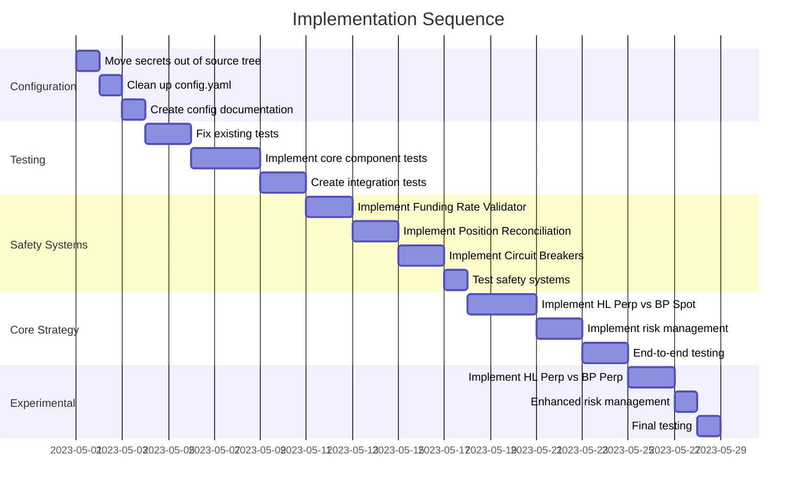

# Implementation Sequence: Addressing Critic's Feedback

## Overview

Based on the Gemini critic feedback, we need to tackle several fundamental issues before proceeding with feature implementation. This document outlines the exact sequence of implementation tasks required to address these concerns.

## Implementation Phases

### Phase 1: Configuration Security & Cleanup (Days 1-2)

**Goal**: Fix the configuration security issues and clean up the bloated configuration.

1. **Move `secrets.yaml` Out of Source Tree**
   - Create secure location outside of Git repository
   - Implement `SecretsManager` class for loading from external location
   - Update all code that accesses secrets
   - Add secrets path to `.gitignore`

2. **Clean Up `config.yaml`**
   - Remove duplicate sections and conflicting parameters
   - Strip out all parameters for out-of-scope features
   - Create clear, focused configuration hierarchy
   - Implement `ConfigManager` with validation

3. **Documentation & Examples**
   - Create documentation for configuration structure
   - Add example configuration files with comments
   - Document secrets management procedure

### Phase 2: Fix & Expand Test Suite (Days 3-7)

**Goal**: Create a solid foundation of tests for core components.

1. **Fix Existing Tests**
   - Correct logical errors in current tests
   - Ensure all existing tests pass

2. **Core Component Unit Tests**
   - API Client tests (HyperliquidAPI, BackpackAPI)
   - Data Handler tests
   - Portfolio Tracker tests
   - Risk Manager tests
   - Execution Handler tests

3. **Integration Tests**
   - Funding rate signal generation tests
   - Execution flow tests
   - End-to-end workflow tests

4. **Test Infrastructure**
   - Setup CI for automated test running
   - Generate coverage reports
   - Document test patterns and fixtures

### Phase 3: Implement Safety Systems (Days 8-12)

**Goal**: Build robust validation and circuit breaker systems.

1. **Funding Rate Validation**
   - Implement validator for funding rate predictions vs actuals
   - Add database schema for tracking prediction accuracy
   - Create metrics reporting for prediction errors

2. **Position Reconciliation**
   - Implement position comparison between local state and exchange
   - Add automated reconciliation with alerting
   - Create safe mode trigger for significant discrepancies

3. **Circuit Breaker System**
   - Implement circuit breaker pattern for API calls
   - Add hierarchical circuit breakers (per API, per exchange, global)
   - Implement metrics collection and state visualization

4. **Safety System Tests**
   - Create validation system tests
   - Implement circuit breaker tests
   - Add failure injection tests

### Phase 4: Core Strategy Implementation (Days 13-17)

**Goal**: Implement and thoroughly test the primary strategy.

1. **HL Perp vs BP Spot Strategy**
   - Implement funding rate calculation
   - Add signal generation logic
   - Implement execution sequence with proper error handling
   - Create comprehensive tests for all edge cases

2. **Risk Management for Primary Strategy**
   - Implement sizing algorithm
   - Add portfolio-level risk checks
   - Create exposure limit enforcement
   - Implement liquidation risk monitoring for perp positions

3. **End-to-End Testing**
   - Create integration tests for the entire strategy flow
   - Add simulated environment tests
   - Implement position monitoring tests

### Phase 5: Experimental Strategy & Additional Features (Days 18-21)

**Goal**: Add the more complex dual-perp strategy with appropriate safeguards.

1. **HL Perp vs BP Perp Strategy**
   - Implement as an experimental strategy with tighter limits
   - Add dual liquidation risk monitoring
   - Implement basis risk checks
   - Create detailed validation and metrics

2. **Enhanced Risk Management**
   - Add specific risk controls for dual-perp strategy
   - Implement basis volatility monitoring
   - Create margin requirement forecasting

3. **Thorough Testing**
   - Create comprehensive test suite for the experimental strategy
   - Add negative test cases for all scenarios
   - Implement comparative tests between strategies

## Key Milestones & Dependencies

## Critical Path & Prioritization

1. **Security First**: Move secrets out of repository immediately
2. **Foundation Before Features**: Fix configuration and tests before implementing new features
3. **Safety Systems Before Strategies**: Implement validation and circuit breakers before core strategy
4. **Primary Before Experimental**: Perfect the HL Perp vs BP Spot strategy before adding HL Perp vs BP Perp

## Risk Management During Implementation

1. **Configuration Phase**:
   - Risk: Configuration refactoring could break existing code
   - Mitigation: Create configuration compatibility layer initially

2. **Testing Phase**:
   - Risk: Fixing tests might reveal deeper logic issues
   - Mitigation: Be prepared to refactor core components as needed

3. **Safety Systems Phase**:
   - Risk: Adding safety systems might slow down execution
   - Mitigation: Profile and optimize critical paths

4. **Strategy Implementation Phase**:
   - Risk: Integrating all components might reveal unforeseen issues
   - Mitigation: Implement incrementally with integration tests at each step

## Final Review Checklist

Before considering the system ready for live testing:

- [  ] All tests passing with >90% coverage
- [  ] Configuration secured properly
- [  ] Validation systems fully implemented
- [  ] Circuit breakers tested with failure injection
- [  ] Primary strategy thoroughly tested
- [  ] Risk limits properly enforced
- [  ] Documentation complete and accurate
- [  ] Safe mode and monitoring fully functional 