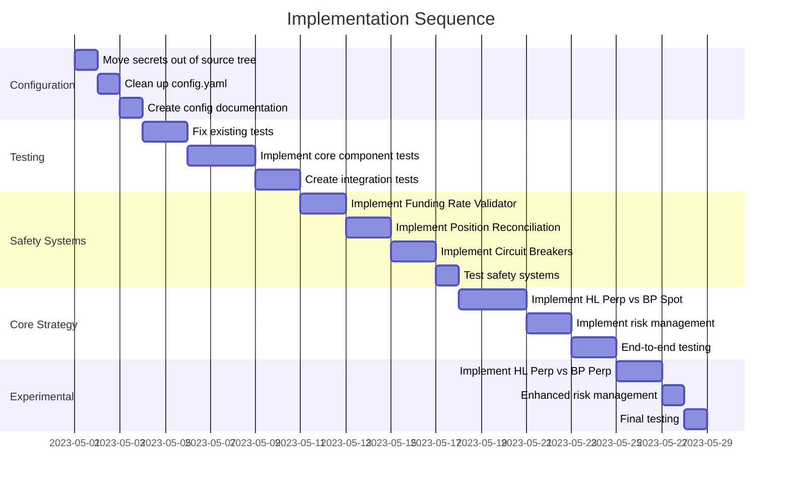

# Implementation Sequence - Revised Aug 6, 2025 (Post-Critic Feedback)

**Note:** The sequence outlined below has been **revised** based on critic feedback received on August 6, 2025. The immediate priority is now to complete the foundational work described in Phases 1-4 (specifically configuration cleanup, unit test completion, integration/failure testing, safety system completion, and risk management simplification) before proceeding with the originally planned Phase 4 strategy enhancements or Phase 5/6 features.

## Overview

This document outlines the planned sequence for implementing the core components and features of the CyberDeltaEngine (`DuskNetAI`) Prototype 0.0.1, incorporating the revised priorities from critic feedback.

## Phase 1: Setup & Foundational Infrastructure (Completed)

- ✅ **Project Setup**: Initialize Git repository, define project structure.
- ✅ **Configuration System**: Implement `ConfigManager` and `SecretsManager`.
    - **Mandate:** `config.yaml` file itself requires immediate refactoring (Phase 4 Priority 1).
- ✅ **Core Interfaces**: Define base classes/interfaces for `ExchangeAPI`, `DataHandler`, `Strategy`, `PortfolioTracker`, `ExecutionHandler`, `RiskManager`.
- ✅ **Basic Logging**: Set up initial logging configuration.
- ✅ **README & Initial Docs**: Create project README and initial workflow documentation.

## Phase 2: Core Component Implementation (Completed - Needs Unit Test Fixes)

- ✅ **API Clients**: Implement wrappers for Hyperliquid and Backpack APIs (REST/WebSocket).
- ✅ **Data Handler**: Implement logic for fetching, processing, and distributing market data (Funding rates, prices).
- ✅ **Portfolio Tracker**: Implement tracking for balances, positions, and orders.
- 🟡 **Unit Tests**: Implement initial unit tests for core components.
    - **Mandate:** Significant gaps/failures remain (~20 tests). Fixing these is Phase 4 Priority 2.

## Phase 3: Safety Systems & Basic Strategy (Completed - Needs Testing & Completion)

- 🟡 **Safety Systems**: Design and initial implementation of `FundingRateValidator`, `PositionReconciliationSystem`, `CircuitBreakerSystem`.
    - **Mandate:** Implementation needs finalization, and rigorous integration/failure testing is required (Phase 4 Priority 5).
- 🟡 **Risk Manager**: Basic implementation (structure exists).
    - **Mandate:** Needs simplification to hard limits only, removal of Kelly/VaR, and thorough testing (Phase 4 Priority 6).
- ✅ **Basic Strategy Loop**: Implement basic `FundingRateArbitrageStrategy` structure connecting components.

## Phase 4: Foundational Stability & Testing (REVISED - Current Focus: Aug 6-10)

- **Goal**: Achieve a stable, reliable, and well-tested core engine based on critic mandates.
- **[CRITICAL]** 1. **Fix `config.yaml`**: Refactor to be clean, lean, and consolidated.
- **[CRITICAL]** 2. **Fix Unit Tests**: Achieve 100% pass rate for v0.0.1 scope.
- **[CRITICAL]** 3. **Build Integration Test Framework**: Implement Mock Exchange.
- **[CRITICAL]** 4. **Implement Integration Tests**: Cover core workflow and safety systems (>70% target).
- **[CRITICAL]** 5. **Implement Failure Scenario Tests**: Cover basic API errors, network drops, state issues.
- **[CRITICAL]** 6. **Finalize & Test Safety Systems**: Complete implementation and test thoroughly (Unit, Integration, Failure).
- **[CRITICAL]** 7. **Simplify & Test Risk Manager**: Implement and test hard limits, margin checks.
- **[SUPPORTING]** 8. **Pin Dependencies & Basic Quality Checks**: Implement pre-commit hooks (ruff, mypy).
- **[SUPPORTING]** 9. **Documentation Sync**: Ensure workflow docs are consistent.

## Phase 5: Strategy Enhancement & Optimization (Deferred - Post Aug 10)

- **Original Goal**: Implement enhanced strategy features.
- **Revised Status**: **DEFERRED** until foundational stability (Phase 4) is achieved and verified.
- **Tasks (Deferred):**
    - [ ] Implement HL Perp vs BP Perp Strategy logic.
    - [ ] Implement Enhanced Position Sizing (Kelly, VaR) - *If* justified later.
    - [ ] Implement Multi-Tier Signal Verification - *If* justified later.
    - [ ] Performance Optimizations.

## Phase 6: Advanced Features & Deployment Prep (Deferred)

- **Revised Status**: **DEFERRED** significantly.
- **Tasks (Deferred):**
    - [ ] Refine Multi-Exchange Support.
    - [ ] Implement Full CI/CD Pipeline.
    - [ ] Enhance Logging/Monitoring.
    - [ ] Advanced Risk Models (if applicable).
    - [ ] Deployment Preparations.

## Rationale for Sequence

- **Foundation First (Revised)**: The revised sequence prioritizes addressing the critical configuration, testing, and safety system gaps identified by the critic *before* adding complexity. This ensures a stable base.
- **Core Components**: Implementing API clients, data handling, portfolio tracking, and basic execution provides the necessary building blocks.
- **Safety Critical**: Implementing and **testing** safety systems early is crucial for a trading bot.
- **Testing Integrated**: Unit tests are written alongside components, but **integration and failure testing are now mandated early** to verify interactions and resilience.
- **Iterative Refinement**: Strategy logic and advanced features are deferred until the core engine is proven stable and reliable through testing.

This revised sequence directly reflects the mandate to prioritize stability and robustness over feature velocity in the immediate term.

## Key Milestones & Dependencies

## Critical Path & Prioritization

1. **Security First**: Move secrets out of repository immediately
2. **Foundation Before Features**: Fix configuration and tests before implementing new features
3. **Safety Systems Before Strategies**: Implement validation and circuit breakers before core strategy
4. **Primary Before Experimental**: Perfect the HL Perp vs BP Spot strategy before adding HL Perp vs BP Perp

## Risk Management During Implementation

1. **Configuration Phase**:
   - Risk: Configuration refactoring could break existing code
   - Mitigation: Create configuration compatibility layer initially

2. **Testing Phase**:
   - Risk: Fixing tests might reveal deeper logic issues
   - Mitigation: Be prepared to refactor core components as needed

3. **Safety Systems Phase**:
   - Risk: Adding safety systems might slow down execution
   - Mitigation: Profile and optimize critical paths

4. **Strategy Implementation Phase**:
   - Risk: Integrating all components might reveal unforeseen issues
   - Mitigation: Implement incrementally with integration tests at each step

## Final Review Checklist

Before considering the system ready for live testing:

- [  ] All tests passing with >90% coverage
- [  ] Configuration secured properly
- [  ] Validation systems fully implemented
- [  ] Circuit breakers tested with failure injection
- [  ] Primary strategy thoroughly tested
- [  ] Risk limits properly enforced
- [  ] Documentation complete and accurate
- [  ] Safe mode and monitoring fully functional 