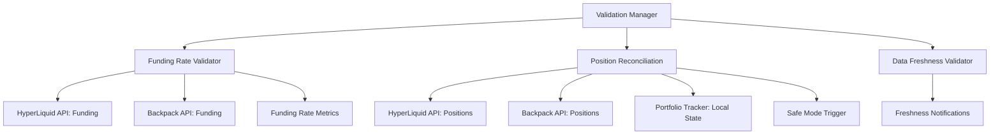

# Validation System Implementation Plan - CyberDeltaEngine

**Status: Design Complete - Implementation & Testing IN PROGRESS (Revised Aug 6, 2025)**

**Note:** While the design details for the Funding Rate Validator and Position Reconciliation system are outlined below, critic feedback mandates that **rigorous implementation completion, integration testing (with Strategy/Execution layers/APIs/PT), and failure scenario testing** are the critical next steps. These systems are not considered complete or reliable until proven through these tests.

## 1. Overview

This document details the implementation plan for the Validation System within the CyberDeltaEngine project. This system serves as a crucial safety net, ensuring the integrity of data and the consistency of state across different components and external exchanges. It comprises two main subsystems: the `FundingRateValidator` and the `PositionReconciliationSystem`.

## Architecture



## Funding Rate Validation

```python
class FundingRateValidator:
    """
    Validates funding rate data and predictions against actual payments.
    """
    
    def __init__(self, config: Config):
        self.config = config
        self.logger = logging.getLogger(__name__)
        
        # Database for tracking predictions and actuals
        self.db_path = config.get("validation.db_path", "data/validation.db")
        self._init_db()
    
    def _init_db(self):
        """Initialize the SQLite database for storing validation data"""
        conn = sqlite3.connect(self.db_path)
        cursor = conn.cursor()
        
        # Create tables if they don't exist
        cursor.execute('''
        CREATE TABLE IF NOT EXISTS funding_predictions (
            id INTEGER PRIMARY KEY,
            timestamp INTEGER,
            exchange TEXT,
            symbol TEXT,
            predicted_rate REAL,
            prediction_method TEXT
        )
        ''')
        
        cursor.execute('''
        CREATE TABLE IF NOT EXISTS funding_payments (
            id INTEGER PRIMARY KEY,
            timestamp INTEGER,
            exchange TEXT,
            symbol TEXT,
            actual_rate REAL,
            payment_amount REAL,
            position_size REAL
        )
        ''')
        
        conn.commit()
        conn.close()
    
    def record_prediction(self, exchange: str, symbol: str, 
                        predicted_rate: float, method: str = "api"):
        """Record a funding rate prediction"""
        timestamp = int(time.time() * 1000)
        
        try:
            conn = sqlite3.connect(self.db_path)
            cursor = conn.cursor()
            
            cursor.execute(
                "INSERT INTO funding_predictions (timestamp, exchange, symbol, predicted_rate, prediction_method) "
                "VALUES (?, ?, ?, ?, ?)",
                (timestamp, exchange, symbol, predicted_rate, method)
            )
            
            conn.commit()
            conn.close()
            
            self.logger.info(f"Recorded funding prediction: {exchange} {symbol} rate={predicted_rate:.6f}")
            
        except Exception as e:
            self.logger.error(f"Error recording funding prediction: {e}")
    
    def record_payment(self, exchange: str, symbol: str, 
                     actual_rate: float, payment_amount: float, position_size: float):
        """Record an actual funding payment"""
        timestamp = int(time.time() * 1000)
        
        try:
            conn = sqlite3.connect(self.db_path)
            cursor = conn.cursor()
            
            cursor.execute(
                "INSERT INTO funding_payments (timestamp, exchange, symbol, actual_rate, payment_amount, position_size) "
                "VALUES (?, ?, ?, ?, ?, ?)",
                (timestamp, exchange, symbol, actual_rate, payment_amount, position_size)
            )
            
            conn.commit()
            conn.close()
            
            self.logger.info(f"Recorded funding payment: {exchange} {symbol} rate={actual_rate:.6f} amount={payment_amount:.6f}")
            
        except Exception as e:
            self.logger.error(f"Error recording funding payment: {e}")
    
    def calculate_metrics(self, exchange: str, symbol: str, days: int = 7) -> Dict[str, float]:
        """Calculate accuracy metrics for funding rate predictions"""
        threshold = int(time.time() * 1000) - (days * 86400 * 1000)
        
        try:
            conn = sqlite3.connect(self.db_path)
            cursor = conn.cursor()
            
            cursor.execute(
                "SELECT p.predicted_rate, a.actual_rate "
                "FROM funding_predictions p "
                "JOIN funding_payments a ON "
                "  (p.exchange = a.exchange AND p.symbol = a.symbol AND ABS(p.timestamp - a.timestamp) < 3600000) "
                "WHERE p.exchange = ? AND p.symbol = ? AND p.timestamp > ?",
                (exchange, symbol, threshold)
            )
            
            results = cursor.fetchall()
            conn.close()
            
            if not results:
                return {"count": 0}
            
            # Calculate metrics
            errors = [pred - actual for pred, actual in results]
            sq_errors = [e ** 2 for e in errors]
            abs_errors = [abs(e) for e in errors]
            
            rmse = math.sqrt(sum(sq_errors) / len(errors))
            mae = sum(abs_errors) / len(errors)
            bias = sum(errors) / len(errors)
            
            return {
                "count": len(results),
                "rmse": rmse,
                "mae": mae,
                "bias": bias,
                "max_error": max(abs_errors),
                "min_error": min(abs_errors)
            }
            
        except Exception as e:
            self.logger.error(f"Error calculating metrics: {e}")
            return {"count": 0, "error": str(e)}
    
    def generate_report(self, days: int = 7) -> Dict[str, Any]:
        """Generate a validation report for all exchange/symbol pairs"""
        try:
            conn = sqlite3.connect(self.db_path)
            cursor = conn.cursor()
            
            # Get unique exchange/symbol pairs
            cursor.execute(
                "SELECT DISTINCT exchange, symbol FROM funding_predictions"
            )
            
            pairs = cursor.fetchall()
            conn.close()
            
            report = {
                "timestamp": int(time.time()),
                "days_included": days,
                "pairs": {}
            }
            
            overall_metrics = {
                "count": 0,
                "rmse": 0,
                "mae": 0,
                "bias": 0
            }
            
            # Calculate metrics for each pair
            for exchange, symbol in pairs:
                metrics = self.calculate_metrics(exchange, symbol, days)
                report["pairs"][f"{exchange}:{symbol}"] = metrics
                
                # Add to overall metrics if there's data
                if metrics.get("count", 0) > 0:
                    overall_metrics["count"] += metrics["count"]
                    overall_metrics["rmse"] += metrics["rmse"] * metrics["count"]
                    overall_metrics["mae"] += metrics["mae"] * metrics["count"]
                    overall_metrics["bias"] += metrics["bias"] * metrics["count"]
            
            # Calculate overall average metrics
            if overall_metrics["count"] > 0:
                overall_metrics["rmse"] /= overall_metrics["count"]
                overall_metrics["mae"] /= overall_metrics["count"]
                overall_metrics["bias"] /= overall_metrics["count"]
                
            report["overall"] = overall_metrics
            
            return report
            
        except Exception as e:
            self.logger.error(f"Error generating report: {e}")
            return {"error": str(e)}
```

## Position Reconciliation

```python
class PositionReconciliation:
    """
    System for verifying and reconciling position data from multiple sources.
    """
    
    def __init__(self, config: Config, portfolio_tracker: PortfolioTracker, 
                api_clients: Dict[str, ExchangeAPI]):
        self.config = config
        self.portfolio_tracker = portfolio_tracker
        self.api_clients = api_clients
        self.logger = logging.getLogger(__name__)
        
        # Reconciliation parameters
        self.safe_mode = False
        self.last_reconciliation = 0
        self.reconciliation_interval = config.get("validation.reconciliation_interval", 3600)  # 1 hour
        self.position_tolerance = config.get("validation.position_tolerance", 0.01)  # 1% tolerance
    
    async def verify_positions(self) -> Dict[str, Any]:
        """Verify positions across multiple data sources"""
        
        self.logger.info("Starting position verification")
        current_time = time.time()
        
        # Skip if we've verified recently
        if current_time - self.last_reconciliation < self.reconciliation_interval:
            return {"status": "skipped", "reason": "too_soon"}
        
        verification_results = {
            "timestamp": int(current_time),
            "exchanges": {},
            "discrepancies": [],
            "safe_mode_triggered": False
        }
        
        # Get list of exchanges with positions
        exchanges = self.portfolio_tracker.get_exchanges_with_positions()
        
        for exchange in exchanges:
            exchange_results = {
                "symbols": {},
                "status": "verified"
            }
            
            # Get positions for this exchange from our tracker
            local_positions = self.portfolio_tracker.get_positions(exchange)
            
            try:
                # Get positions directly from exchange API
                api_positions = await self.api_clients[exchange].get_positions()
                
                # Get positions calculated from fill history (tertiary source)
                fill_positions = await self._calculate_positions_from_fills(exchange)
                
                # Verify each position
                for symbol, local_pos in local_positions.items():
                    # Find position in API response
                    api_pos = next((p.get("size", 0) for p in api_positions if p.get("symbol") == symbol), 0)
                    
                    # Find position in fill history calculation
                    fill_pos = fill_positions.get(symbol, 0)
                    
                    # Calculate discrepancies as percentage
                    api_discrepancy = abs(local_pos - api_pos) / max(abs(local_pos), 0.0001)
                    fill_discrepancy = abs(local_pos - fill_pos) / max(abs(local_pos), 0.0001)
                    
                    symbol_status = "verified"
                    
                    # Check if discrepancies exceed tolerance
                    if api_discrepancy > self.position_tolerance:
                        symbol_status = "discrepancy"
                        exchange_results["status"] = "discrepancy"
                        
                        discrepancy = {
                            "exchange": exchange,
                            "symbol": symbol,
                            "local_position": local_pos,
                            "api_position": api_pos,
                            "fill_position": fill_pos,
                            "api_discrepancy": api_discrepancy,
                            "fill_discrepancy": fill_discrepancy
                        }
                        
                        verification_results["discrepancies"].append(discrepancy)
                    
                    exchange_results["symbols"][symbol] = {
                        "local_position": local_pos,
                        "api_position": api_pos,
                        "fill_position": fill_pos,
                        "status": symbol_status
                    }
            
            except Exception as e:
                self.logger.error(f"Error verifying positions for {exchange}: {e}")
                exchange_results["status"] = "error"
                exchange_results["error"] = str(e)
            
            verification_results["exchanges"][exchange] = exchange_results
        
        # Check if we need to enter safe mode
        if verification_results["discrepancies"]:
            # Check if any major discrepancies (3x tolerance)
            major_discrepancies = [
                d for d in verification_results["discrepancies"]
                if d["api_discrepancy"] > self.position_tolerance * 3
            ]
            
            if major_discrepancies:
                self.logger.warning(f"Major position discrepancies detected, entering safe mode")
                self.safe_mode = True
                verification_results["safe_mode_triggered"] = True
        
        self.last_reconciliation = current_time
        return verification_results
    
    async def _calculate_positions_from_fills(self, exchange: str) -> Dict[str, float]:
        """Calculate positions based on fill history"""
        # Get fill history from the past week
        seven_days_ago = int((time.time() - 7 * 86400) * 1000)
        fills = await self.api_clients[exchange].get_fill_history(start_time=seven_days_ago)
        
        positions = {}
        
        for fill in fills:
            symbol = fill.get("symbol")
            size = fill.get("size", 0)
            side = fill.get("side")
            
            if not symbol or not size:
                continue
                
            if symbol not in positions:
                positions[symbol] = 0.0
            
            # Add or subtract based on side
            if side == "buy":
                positions[symbol] += size
            else:
                positions[symbol] -= size
        
        return positions
    
    def is_safe_mode(self) -> bool:
        """Check if system is in safe mode due to position discrepancies"""
        return self.safe_mode
    
    def exit_safe_mode(self):
        """Manually exit safe mode after verification"""
        self.safe_mode = False
        self.logger.info("Manually exited safe mode")
    
    async def reconcile_position(self, exchange: str, symbol: str) -> Dict[str, Any]:
        """Attempt to reconcile a position discrepancy"""
        self.logger.info(f"Attempting to reconcile position for {exchange}:{symbol}")
        
        try:
            # Get position from API
            api_positions = await self.api_clients[exchange].get_positions()
            api_position = next((p.get("size", 0) for p in api_positions if p.get("symbol") == symbol), 0)
            
            # Update local position to match API
            self.portfolio_tracker.update_position(exchange, symbol, api_position)
            
            self.logger.info(f"Reconciled position for {exchange}:{symbol} to {api_position}")
            
            return {
                "status": "reconciled",
                "exchange": exchange,
                "symbol": symbol,
                "new_position": api_position
            }
        
        except Exception as e:
            self.logger.error(f"Error reconciling position for {exchange}:{symbol}: {e}")
            
            return {
                "status": "error",
                "exchange": exchange,
                "symbol": symbol,
                "error": str(e)
            }
```

## Validation Manager

```python
class ValidationManager:
    """
    Coordinates all validation systems and provides a unified interface.
    """
    
    def __init__(self, config: Config, portfolio_tracker: PortfolioTracker, 
                api_clients: Dict[str, ExchangeAPI]):
        self.config = config
        self.logger = logging.getLogger(__name__)
        
        # Initialize validation components
        self.funding_validator = FundingRateValidator(config)
        self.position_reconciliation = PositionReconciliation(
            config, portfolio_tracker, api_clients
        )
        
        # Validation schedules
        self.funding_validation_interval = config.get("validation.funding_interval", 3600)  # 1 hour
        self.position_verification_interval = config.get("validation.position_interval", 1800)  # 30 minutes
        self.data_freshness_interval = config.get("validation.freshness_interval", 300)  # 5 minutes
        
        self.last_funding_validation = 0
        self.last_position_verification = 0
        self.last_data_freshness_check = 0
    
    async def run_scheduled_validations(self) -> Dict[str, Any]:
        """Run all scheduled validations"""
        
        current_time = time.time()
        results = {
            "timestamp": int(current_time),
            "validations_run": []
        }
        
        # Check if funding validation is due
        if current_time - self.last_funding_validation >= self.funding_validation_interval:
            funding_report = self.funding_validator.generate_report()
            results["funding_validation"] = funding_report
            results["validations_run"].append("funding")
            self.last_funding_validation = current_time
        
        # Check if position verification is due
        if current_time - self.last_position_verification >= self.position_verification_interval:
            position_results = await self.position_reconciliation.verify_positions()
            results["position_verification"] = position_results
            results["validations_run"].append("positions")
            self.last_position_verification = current_time
        
        # Check if data freshness validation is due
        if current_time - self.last_data_freshness_check >= self.data_freshness_interval:
            freshness_results = await self._check_data_freshness()
            results["data_freshness"] = freshness_results
            results["validations_run"].append("freshness")
            self.last_data_freshness_check = current_time
        
        # Calculate overall validation status
        results["overall_status"] = self._calculate_overall_status(results)
        
        return results
    
    async def _check_data_freshness(self) -> Dict[str, Any]:
        """Check freshness of market data"""
        # Implementation to verify market data timestamps
        # are within acceptable thresholds
        pass
    
    def _calculate_overall_status(self, validation_results: Dict[str, Any]) -> str:
        """Calculate overall system validation status"""
        
        # Check for critical issues
        if self.position_reconciliation.is_safe_mode():
            return "critical"
            
        if validation_results.get("data_freshness", {}).get("stale_data_count", 0) > 0:
            return "critical"
        
        # Check for warnings
        if validation_results.get("position_verification", {}).get("discrepancies", []):
            return "warning"
            
        # Check funding validation
        if "funding_validation" in validation_results:
            funding = validation_results["funding_validation"]
            if funding.get("overall", {}).get("rmse", 0) > 0.001:  # RMSE > 0.1%
                return "warning"
        
        return "healthy"
    
    def is_system_healthy(self) -> bool:
        """Check if the overall system is in a healthy state"""
        return not self.position_reconciliation.is_safe_mode()
```

## Integration with Trading Engine

```python
class TradingEngine:
    """
    Main trading engine with validation integration.
    """
    
    def __init__(self, config: Config, api_clients: Dict[str, ExchangeAPI],
                portfolio_tracker: PortfolioTracker,
                risk_manager: RiskManager):
        # ... Other initialization ...
        
        # Initialize validation manager
        self.validation_manager = ValidationManager(
            config, portfolio_tracker, api_clients
        )
    
    async def run(self):
        """Main trading engine run loop"""
        while True:
            try:
                # Run scheduled validations
                validation_results = await self.validation_manager.run_scheduled_validations()
                
                # Check validation status
                if validation_results.get("overall_status") == "critical":
                    self._enter_safe_mode("Critical validation failure")
                
                # If in safe mode, limit operations
                if self.safe_mode:
                    await self._handle_safe_mode()
                else:
                    await self._run_normal_operation()
                
            except Exception as e:
                self.logger.error(f"Error in trading engine loop: {e}")
    
    async def _run_normal_operation(self):
        """Run normal trading operations"""
        
        # Record funding rate predictions for validation
        for exchange, client in self.api_clients.items():
            for symbol in self.active_symbols.get(exchange, []):
                try:
                    funding_data = await client.get_funding_rate(symbol)
                    
                    # Record prediction
                    self.validation_manager.funding_validator.record_prediction(
                        exchange, 
                        symbol, 
                        funding_data["rate"],
                        "api"
                    )
                except Exception as e:
                    self.logger.error(f"Error getting funding rate for {exchange}:{symbol}: {e}")
```

## Testing the Validation System

```python
class TestFundingRateValidator(unittest.TestCase):
    def setUp(self):
        config = Config()
        self.validator = FundingRateValidator(config)
        
        # Use in-memory database for testing
        self.validator.db_path = ":memory:"
        self.validator._init_db()
    
    def test_record_prediction(self):
        # Record a prediction
        self.validator.record_prediction("test_exchange", "BTC-USD", 0.001, "api")
        
        # Verify it was stored
        conn = sqlite3.connect(self.validator.db_path)
        cursor = conn.cursor()
        cursor.execute("SELECT COUNT(*) FROM funding_predictions")
        count = cursor.fetchone()[0]
        conn.close()
        
        self.assertEqual(count, 1)
    
    def test_record_payment(self):
        # Record a payment
        self.validator.record_payment("test_exchange", "BTC-USD", 0.001, 10.0, 10000.0)
        
        # Verify it was stored
        conn = sqlite3.connect(self.validator.db_path)
        cursor = conn.cursor()
        cursor.execute("SELECT COUNT(*) FROM funding_payments")
        count = cursor.fetchone()[0]
        conn.close()
        
        self.assertEqual(count, 1)
    
    def test_calculate_metrics(self):
        # Add some test data
        self.validator.record_prediction("test_exchange", "BTC-USD", 0.001, "api")
        self.validator.record_payment("test_exchange", "BTC-USD", 0.0012, 12.0, 10000.0)
        
        # Calculate metrics
        metrics = self.validator.calculate_metrics("test_exchange", "BTC-USD")
        
        # Should have data
        self.assertGreater(metrics.get("count", 0), 0)
        self.assertIn("rmse", metrics)
        self.assertIn("mae", metrics)
```

## Next Steps

1. **Implementation Priority**:
   - Implement `FundingRateValidator` for tracking predicted vs. actual rates
   - Implement `PositionReconciliation` for multi-source position verification
   - Implement `ValidationManager` to coordinate all validation systems
   - Add integration with the Trading Engine

2. **Key Features to Implement**:
   - Database storage for predictions and actual payments
   - Position reconciliation with tolerance thresholds
   - Safe mode triggering based on validation failures
   - Detailed metrics and reporting

3. **Testing Requirements**:
   - Unit tests for each validation component
   - Integration tests with mock API responses
   - Verification of safe mode triggering logic 