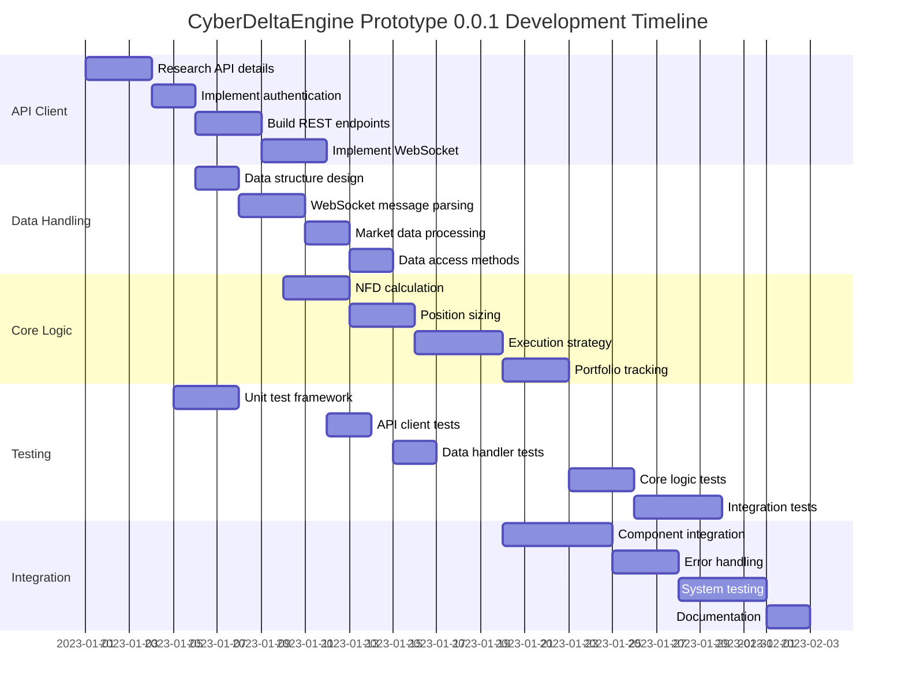
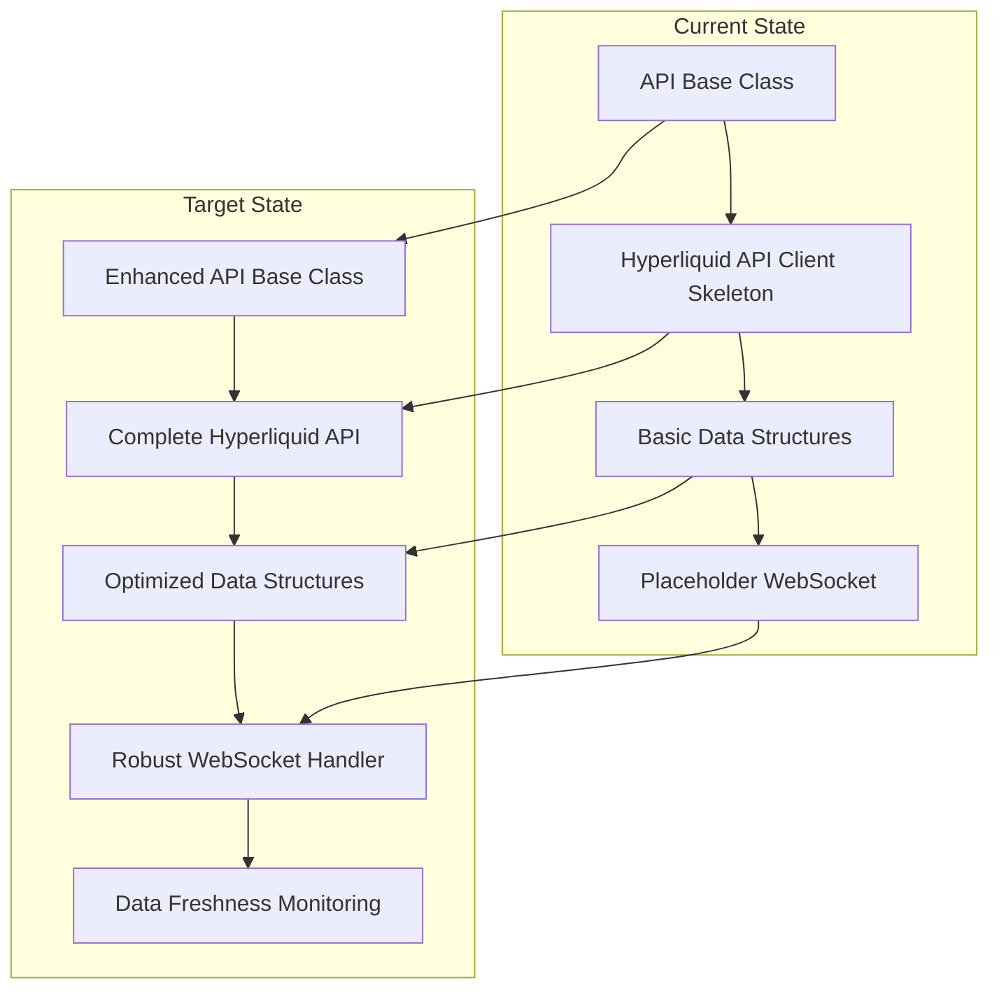
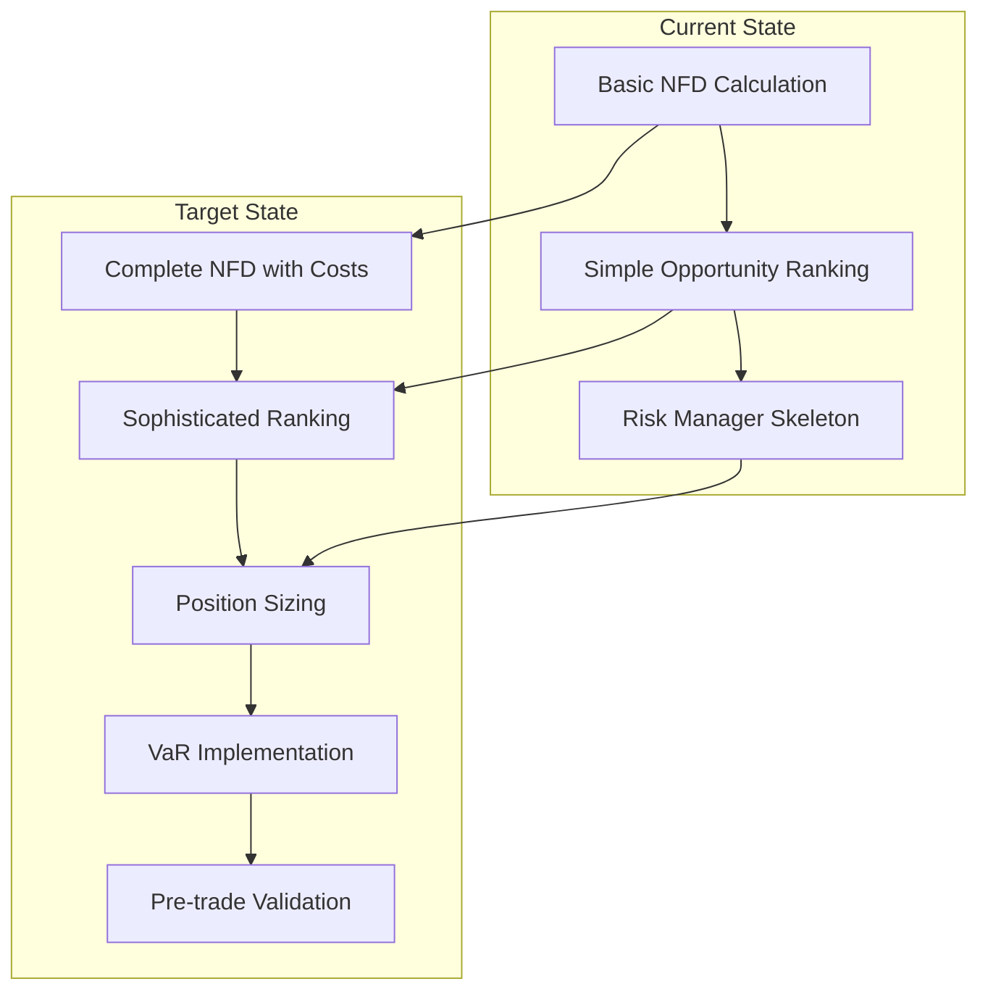
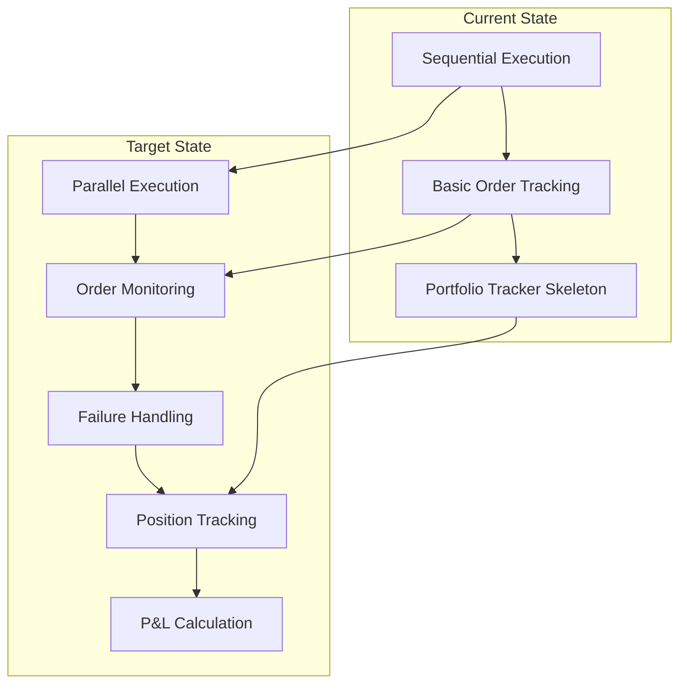
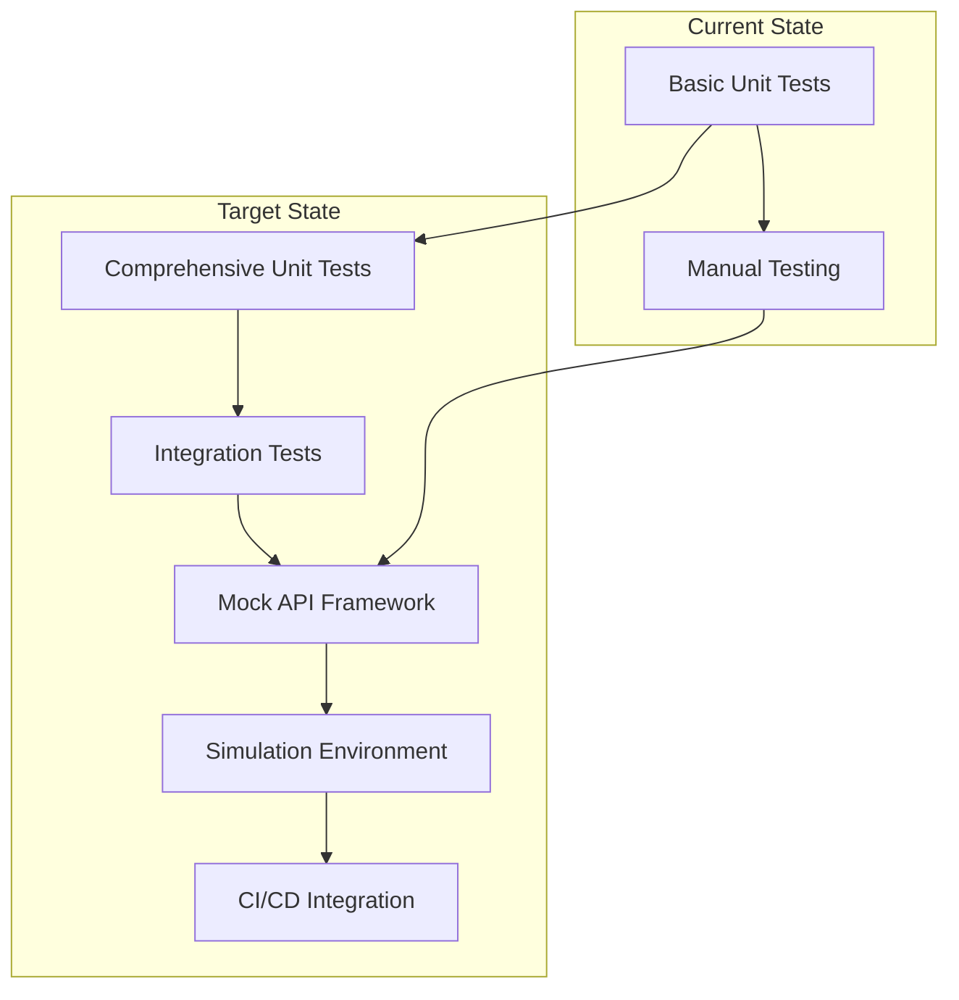
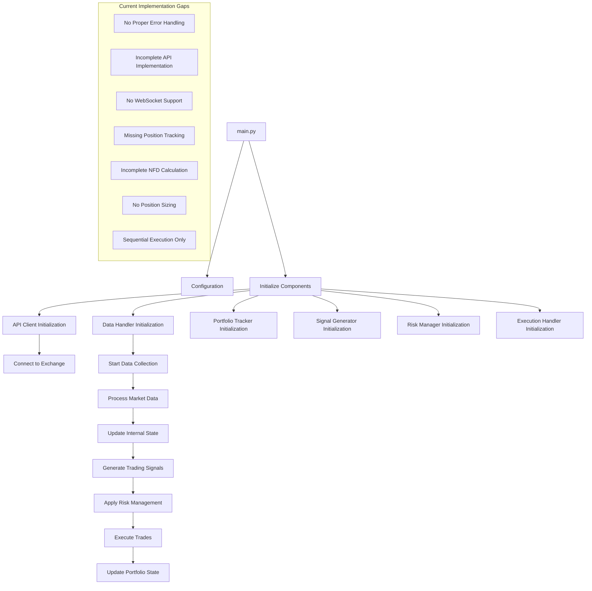

# Next Steps Workflow - Prototype 0.0.1

This document outlines the current state of development, critical gaps that need to be addressed, and the prioritized workflow for implementing CyberDeltaEngine Prototype 0.0.1.

## Current State Assessment

### Component Status

| Component | Current State | Critical Gaps |
|-----------|--------------|---------------|
| **Configuration** | Basic implementation with JSON loading | No validation, no environment variable support |
| **Logging** | Basic Python logging setup | No structured logging, no rotation |
| **Core Data Models** | Basic dataclasses defined | Missing validation, incomplete relationships |
| **API Base Class** | Abstract base class with common methods | Limited error handling, no rate limiting |
| **Hyperliquid API Client** | Basic class structure with placeholder methods | No authentication implementation, incomplete endpoints |
| **Data Handler** | Basic structure with placeholder methods | No WebSocket implementation, no proper parsing |
| **Portfolio Tracker** | Skeleton implementation | No position tracking, no P&L calculation |
| **Signal Generator** | Basic NFD calculation | Incomplete funding rate handling, no costs included |
| **Risk Manager** | Basic structure only | No position sizing, no VaR implementation |
| **Execution Handler** | Sequential execution only | No parallel execution, no failure handling |
| **Adaptation Loop** | Not implemented | Future feature for Prototype 0.0.2+ |
| **Main Application** | Basic structure with component initialization | No proper error handling, incomplete flow |

### Critical Gaps and Challenges

1. **API Client Implementation**
   - Authentication mechanism using wallet signing
   - Complete REST endpoints for market data and trading
   - WebSocket connection management and topic subscription
   - Comprehensive error handling and rate limiting

2. **WebSocket Support**
   - Reliable connection management with reconnection logic
   - Efficient message processing and routing
   - Thread safety for data structures

3. **Data Parsing and Management**
   - Proper parsing of exchange-specific data formats
   - Data structure optimization for quick access
   - Data freshness monitoring and stale data handling

4. **Collateral Management**
   - Balance tracking across wallets
   - Transfer monitoring and verification
   - Safety thresholds implementation

5. **Signal Generation**
   - Complete NFD calculation including all costs
   - Opportunity ranking and filtering
   - Strategy parameter optimization

6. **Risk Management**
   - Position sizing algorithm implementation
   - VaR calculation with proper volatility estimation
   - Pre-trade validation checks

7. **Execution**
   - Parallel execution with proper synchronization
   - Order monitoring and status tracking
   - Failure handling and compensation strategies

8. **Testing Infrastructure**
   - Mock API framework for unit testing
   - Integration testing framework
   - Simulation environment for end-to-end testing

## Open Questions and Technical Challenges

| Challenge | Description | Approach |
|-----------|-------------|----------|
| **API Details** | Specific authentication mechanism for Hyperliquid | Research API docs, implement eth_account signing |
| **Wallet Interaction** | Secure management of wallet keys for signing | Use environment variables or secure storage, isolate in separate module |
| **Data Synchronization** | Ensuring consistent state across components | Implement thread-safe data structures with proper locking mechanisms |
| **Execution Atomicity** | Ensuring all parts of a trade execute or none | Implement two-phase commit pattern with compensating transactions |
| **Error Handling** | Comprehensive error recovery strategies | Define specific error types and recovery actions for each scenario |
| **Resource Management** | Efficient management of connections and threads | Implement proper resource cleanup and monitoring |

## Prioritized Development Workflow

## Development Tracks

### Track 1: API Client and Data Handler Refinement

### Track 2: Signal Generation and Risk Management

### Track 3: Execution Handler and Portfolio Tracking

### Track 4: Testing Infrastructure

## Current Workflow Diagram

## Target Architecture Diagram

The detailed target architecture for Prototype 0.0.1 is provided in the separate file `2_target_architecture.mermaid`, which illustrates the complete system architecture with all components and their interactions.

## Implementation Milestones

### Week 1: Foundation
- Complete Hyperliquid API research and documentation
- Implement authentication mechanism with wallet signing
- Build initial REST endpoints for market data
- Set up basic WebSocket connection
- Establish unit testing framework

### Week 2: Core Components
- Complete WebSocket implementation with reconnection logic
- Implement thread-safe data structures
- Develop market data parsing and storage
- Build initial NFD calculation with basic costs
- Implement portfolio state tracking

### Week 3: Risk and Execution
- Implement position sizing algorithm
- Develop VaR calculation with volatility estimation
- Build pre-trade validation checks
- Implement parallel execution mechanism
- Develop order monitoring system

### Week 4: Integration and Testing
- Integrate all components
- Implement comprehensive error handling
- Develop failure recovery mechanisms
- Build integration tests
- Create simulation environment

### Week 5: Finalization
- Complete end-to-end testing
- Optimize performance bottlenecks
- Finalize documentation
- Prepare for deployment
- Conduct final review and validation

## Critical Path and Dependencies

The most critical dependencies in the implementation are:

1. API client implementation must be completed before data handler can be fully developed
2. Data handler must be operational before signal generator can work with real data
3. Signal generator must be completed before risk manager can be fully tested
4. Risk manager must be operational before execution handler can be fully implemented
5. All components must be completed before integration testing can be finalized

## Success Criteria Validation

Prototype 0.0.1 will be validated against the success criteria using the following approaches:

1. **API Connectivity**: Verify successful connection to Hyperliquid with proper authentication
2. **Market Data Processing**: Validate correct parsing and storage of market data
3. **Opportunity Identification**: Verify accurate NFD calculation with all costs included
4. **Risk Management**: Validate position sizing and risk limits enforcement
5. **Trade Execution**: Verify successful order placement and monitoring
6. **Portfolio Tracking**: Validate accurate position and P&L tracking
7. **Error Handling**: Test system response to various error conditions 