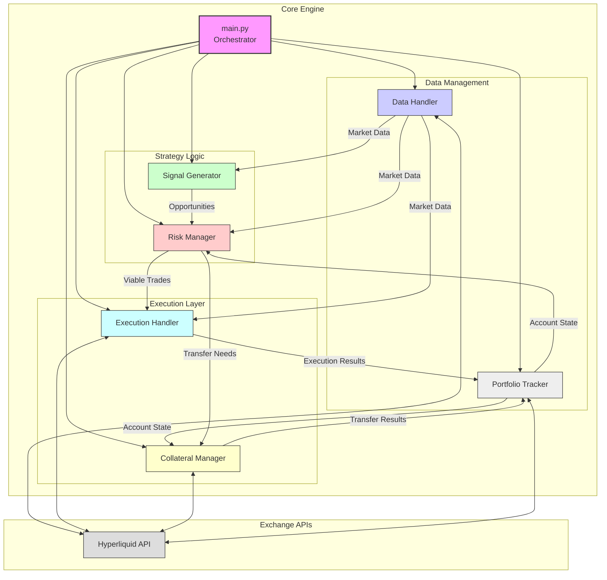

# Core Architecture - Simplified

This document outlines the streamlined architecture for the CyberDeltaEngine prototype, focusing only on essential components and their interactions. Based on critic feedback, complexity has been reduced to emphasize core functionality and reliability.

## 1. Architecture Principles

1. **Separation of Concerns**: Each component has a clear, focused responsibility
2. **Data Flow Clarity**: Explicit paths for data movement between components
3. **Failure Isolation**: Components can continue functioning if others fail
4. **Thread Safety**: All shared state is protected from concurrent access
5. **Simplicity First**: Prefer simple, reliable approaches over complex optimizations

## 2. Essential Components



## 3. Component Responsibilities

### 3.1 Main Orchestrator (main.py)

**Purpose**: Controls initialization, task management, and graceful shutdown

**Key Responsibilities**:
- Initialize all components in the correct order
- Start and monitor individual component tasks
- Handle signals (e.g., SIGINT for graceful shutdown)
- Cancel tasks and close connections on shutdown

**Simplified Implementation Approach**:
```python
class TradingBot:
    async def initialize(self):
        # Create and initialize components in order
        self.api_clients = {"hyperliquid": HyperliquidAPI(...)}
        self.data_handler = DataHandler(self.api_clients)
        self.portfolio_tracker = PortfolioTracker(self.api_clients)
        self.signal_generator = SignalGenerator(self.data_handler)
        self.risk_manager = RiskManager(self.portfolio_tracker)
        self.collateral_manager = CollateralManager(self.api_clients, self.portfolio_tracker)
        self.execution_handler = ExecutionHandler(self.api_clients, self.portfolio_tracker)
        
        # Initialize clients first, then other components
        for client in self.api_clients.values():
            await client.initialize()
        
        # Other components initialize
        await self.data_handler.initialize()
        await self.portfolio_tracker.initialize()
        
        # Create stop events
        self.stop_event = asyncio.Event()
    
    async def start(self):
        # Start all component tasks
        self.tasks = []
        self.tasks.append(asyncio.create_task(self.data_handler.run(self.stop_event)))
        self.tasks.append(asyncio.create_task(self.portfolio_tracker.run(self.stop_event)))
        self.tasks.append(asyncio.create_task(self._strategy_loop(self.stop_event)))
        
        # Wait for stop event
        await self.stop_event.wait()
    
    async def stop(self):
        # Signal stop to all components
        self.stop_event.set()
        
        # Cancel all tasks
        for task in self.tasks:
            if not task.done():
                task.cancel()
        
        # Close all connections
        for client in self.api_clients.values():
            await client.cleanup()
    
    async def _strategy_loop(self, stop_event):
        while not stop_event.is_set():
            try:
                # Get opportunities from signal generator
                opportunities = await self.signal_generator.generate_opportunities()
                
                # If opportunities found, assess with risk manager
                if opportunities:
                    viable_opportunities = await self.risk_manager.assess_opportunities(opportunities)
                    
                    # If viable opportunities, check collateral and execute
                    if viable_opportunities:
                        top_opportunity = viable_opportunities[0]
                        
                        # Check if collateral transfer needed
                        if await self.risk_manager.needs_collateral_transfer(top_opportunity):
                            await self.collateral_manager.transfer_collateral(top_opportunity)
                        
                        # Execute opportunity
                        await self.execution_handler.execute_opportunity(top_opportunity)
                
                # Wait before next cycle
                await asyncio.sleep(5)  # Configurable cycle time
                
            except Exception as e:
                self.logger.error(f"Error in strategy loop: {str(e)}")
                # For critical errors, stop the bot
                if isinstance(e, CriticalError):
                    self.stop_event.set()
                    break
                
                # For non-critical errors, wait and retry
                await asyncio.sleep(10)
```

### 3.2 Data Handler

**Purpose**: Manages real-time market data collection and provides access to other components

**Key Responsibilities**:
- Maintain WebSocket connections to exchanges
- Process and parse market data messages
- Store latest data in thread-safe structures
- Provide access methods for other components
- Monitor data freshness

**Simplified Implementation Approach**:
```python
class DataHandler:
    def __init__(self, api_clients):
        self.api_clients = api_clients
        
        # Thread-safe storage for market data
        self.tickers = {}  # Protected by lock
        self.funding_rates = {}  # Protected by lock
        self.orderbooks = {}  # Protected by lock
        
        # Locks for thread safety
        self.ticker_lock = asyncio.Lock()
        self.funding_lock = asyncio.Lock()
        self.orderbook_lock = asyncio.Lock()
        
        # Data freshness tracking
        self.last_updates = {}
    
    async def initialize(self):
        # Initialize any resources needed
        pass
    
    async def run(self, stop_event):
        # Subscribe to all needed WebSocket streams
        await self.subscribe_to_streams()
        
        # Wait for stop event
        await stop_event.wait()
        
        # Clean up
        await self.unsubscribe_from_streams()
    
    async def subscribe_to_streams(self):
        # Subscribe to ticker streams
        for exchange, client in self.api_clients.items():
            for symbol in SYMBOLS:
                # Subscribe to ticker
                await client.subscribe(
                    f"ticker:{symbol}", 
                    lambda data, ex=exchange, sym=symbol: self._handle_ticker_message(ex, sym, data)
                )
                
                # Subscribe to funding
                await client.subscribe(
                    f"funding:{symbol}", 
                    lambda data, ex=exchange, sym=symbol: self._handle_funding_message(ex, sym, data)
                )
                
                # Subscribe to orderbook
                await client.subscribe(
                    f"orderbook:{symbol}", 
                    lambda data, ex=exchange, sym=symbol: self._handle_orderbook_message(ex, sym, data)
                )
    
    async def _handle_ticker_message(self, exchange, symbol, data):
        # Extract ticker data from message
        ticker = self._parse_ticker_data(exchange, symbol, data)
        
        # Update last update time
        now = time.time()
        self.last_updates[(exchange, symbol, 'ticker')] = now
        
        # Store in thread-safe manner
        async with self.ticker_lock:
            self.tickers[(exchange, symbol)] = ticker
    
    # Similar handlers for funding and orderbook messages
    
    async def get_ticker(self, exchange, symbol, max_age_ms=500):
        """Get ticker data with freshness check."""
        key = (exchange, symbol)
        now = time.time()
        
        # Check if data exists and is fresh
        if key in self.last_updates:
            age_ms = (now - self.last_updates[key]) * 1000
            if age_ms > max_age_ms:
                self.logger.warning(f"Ticker data for {exchange}:{symbol} is stale ({age_ms:.0f}ms old)")
        
        # Get data with lock
        async with self.ticker_lock:
            if key not in self.tickers:
                return None
            return self.tickers[key]
    
    # Similar getters for funding rates and orderbooks
```

### 3.3 Portfolio Tracker

**Purpose**: Tracks account state, positions, and balances across exchanges

**Key Responsibilities**:
- Maintain current account state (balances, positions)
- Process updates from order executions
- Calculate portfolio metrics (value, PnL)
- Provide thread-safe access to state

**Simplified Implementation Approach**:
```python
class PortfolioTracker:
    def __init__(self, api_clients):
        self.api_clients = api_clients
        
        # Thread-safe storage for account state
        self.balances = {}  # Exchange -> Currency -> Amount
        self.positions = {}  # Exchange -> Symbol -> Position
        self.orders = {}  # Exchange -> OrderID -> Order
        
        # Locks for thread safety
        self.balance_lock = asyncio.Lock()
        self.position_lock = asyncio.Lock()
        self.order_lock = asyncio.Lock()
    
    async def initialize(self):
        # Initial data load
        await self.load_initial_state()
    
    async def run(self, stop_event):
        # Periodically refresh state
        while not stop_event.is_set():
            try:
                await self.refresh_state()
                await asyncio.sleep(60)  # Refresh every minute
            except Exception as e:
                self.logger.error(f"Error refreshing portfolio state: {str(e)}")
                await asyncio.sleep(10)  # Retry after error
    
    async def load_initial_state(self):
        """Load initial account state from all exchanges."""
        for exchange, client in self.api_clients.items():
            try:
                # Get balances
                balances = await client.get_balances()
                async with self.balance_lock:
                    self.balances[exchange] = balances
                
                # Get positions
                positions = await client.get_positions()
                async with self.position_lock:
                    self.positions[exchange] = {}
                    for position in positions:
                        self.positions[exchange][position['symbol']] = position
            
            except Exception as e:
                self.logger.error(f"Error loading initial state from {exchange}: {str(e)}")
    
    async def update_position(self, exchange, position):
        """Update a position after execution."""
        async with self.position_lock:
            if exchange not in self.positions:
                self.positions[exchange] = {}
            
            symbol = position['symbol']
            self.positions[exchange][symbol] = position
    
    async def get_position(self, exchange, symbol):
        """Get a position with thread safety."""
        async with self.position_lock:
            if exchange not in self.positions:
                return None
            return self.positions[exchange].get(symbol)
    
    async def calculate_portfolio_value(self):
        """Calculate total portfolio value across all exchanges."""
        total_value = 0
        
        async with self.balance_lock:
            for exchange, balances in self.balances.items():
                for currency, balance in balances.items():
                    if currency == 'USDC':  # For simplicity, only count USDC
                        total_value += balance['total']
        
        async with self.position_lock:
            for exchange, positions in self.positions.items():
                for symbol, position in positions.items():
                    # Add unrealized PnL from positions
                    total_value += position['unrealized_pnl']
        
        return total_value
```

### 3.4 Signal Generator

**Purpose**: Identifies arbitrage opportunities based on funding rate differences

**Key Responsibilities**:
- Calculate Normalized Funding Delta (NFD) between exchanges
- Estimate costs for each opportunity
- Rank opportunities by expected utility
- Filter out non-viable opportunities

**Simplified Implementation Approach**:
```python
class SignalGenerator:
    def __init__(self, data_handler):
        self.data_handler = data_handler
    
    async def generate_opportunities(self):
        """Generate arbitrage opportunities based on funding rates."""
        opportunities = []
        
        # Get tradable symbols
        symbols = SYMBOLS
        
        # For prototype 0.0.1, only consider Hyperliquid
        exchanges = ["hyperliquid"]
        
        # Check all combinations
        for symbol in symbols:
            # Calculate Normalized Funding Delta (NFD)
            funding_rate = await self.data_handler.get_funding_rate("hyperliquid", symbol)
            
            # If positive funding, it's an opportunity
            if funding_rate is not None and funding_rate != 0:
                # Calculate costs
                costs = await self._calculate_costs("hyperliquid", symbol)
                
                # Only consider opportunities where funding > costs
                if abs(funding_rate) > costs:
                    # Determine direction (long or short)
                    side = "long" if funding_rate > 0 else "short"
                    
                    # Create opportunity object
                    opportunity = {
                        "id": str(uuid.uuid4()),
                        "exchange": "hyperliquid",
                        "symbol": symbol,
                        "side": side,
                        "funding_rate": funding_rate,
                        "costs": costs,
                        "net_profit": abs(funding_rate) - costs,
                        "timestamp": time.time()
                    }
                    
                    opportunities.append(opportunity)
        
        # Sort by net profit (highest first)
        opportunities.sort(key=lambda x: x["net_profit"], reverse=True)
        
        return opportunities
    
    async def _calculate_costs(self, exchange, symbol):
        """Calculate all costs for an opportunity."""
        # Get market data
        ticker = await self.data_handler.get_ticker(exchange, symbol)
        if not ticker:
            return float('inf')  # If no data, costs are infinite
        
        # Trading fees
        trading_fee = 0.0005  # 0.05% fee
        
        # Slippage estimate (simplified)
        slippage = 0.0005  # 0.05% slippage
        
        # Bid-ask spread cost
        spread = (ticker["ask"] - ticker["bid"]) / ticker["last_price"]
        spread_cost = spread / 2  # Half the spread for entry/exit
        
        # Total costs
        total_costs = trading_fee + slippage + spread_cost
        
        return total_costs
```

### 3.5 Risk Manager

**Purpose**: Evaluates and filters opportunities based on risk constraints

**Key Responsibilities**:
- Calculate position sizes based on Kelly criterion
- Apply portfolio-level risk constraints (VaR)
- Check margin requirements and liquidity
- Filter opportunities based on risk/reward

**Simplified Implementation Approach**:
```python
class RiskManager:
    def __init__(self, portfolio_tracker):
        self.portfolio_tracker = portfolio_tracker
        self.config = self._load_config()
    
    def _load_config(self):
        """Load risk parameters from config."""
        return {
            "max_position_size": 10000,  # Maximum position size in USD
            "max_leverage": 5,  # Maximum leverage
            "kelly_fraction": 0.25,  # Kelly criterion fraction
            "var_limit": 0.05,  # VaR limit (5% of portfolio)
            "max_concentration": 0.3,  # Maximum concentration in one trade
        }
    
    async def assess_opportunities(self, opportunities):
        """Assess and filter opportunities based on risk constraints."""
        viable_opportunities = []
        
        # Get portfolio value for sizing
        portfolio_value = await self.portfolio_tracker.calculate_portfolio_value()
        
        for opportunity in opportunities:
            # Calculate position size using Kelly
            position_size = await self._calculate_position_size(opportunity, portfolio_value)
            
            # Check if size is viable
            if position_size < 100:  # Minimum viable trade size
                continue
            
            # Check portfolio concentration
            concentration = position_size / portfolio_value
            if concentration > self.config["max_concentration"]:
                position_size = portfolio_value * self.config["max_concentration"]
            
            # Apply VaR constraint
            var = await self._calculate_var(opportunity, position_size)
            if var > self.config["var_limit"] * portfolio_value:
                # Scale down position to meet VaR constraint
                scale_factor = (self.config["var_limit"] * portfolio_value) / var
                position_size *= scale_factor
            
            # Check if position is still viable after constraints
            if position_size >= 100:
                # Add size to opportunity and keep it
                opportunity["position_size"] = position_size
                viable_opportunities.append(opportunity)
        
        return viable_opportunities
    
    async def _calculate_position_size(self, opportunity, portfolio_value):
        """Calculate position size using Kelly criterion."""
        # Extract values
        win_probability = 0.95  # High probability for funding
        profit_ratio = opportunity["net_profit"]
        loss_ratio = 0.02  # Estimated adverse move
        
        # Kelly formula: f* = p - (1-p)/r
        # where p is win probability, r is profit/loss ratio
        r = profit_ratio / loss_ratio
        kelly = win_probability - (1 - win_probability) / r
        
        # Apply Kelly fraction for safety
        kelly *= self.config["kelly_fraction"]
        
        # Calculate size
        position_size = kelly * portfolio_value
        
        # Apply maximum position size constraint
        position_size = min(position_size, self.config["max_position_size"])
        
        return position_size
    
    async def _calculate_var(self, opportunity, position_size):
        """Calculate Value at Risk for an opportunity."""
        # For prototype, use simple historical volatility approach
        symbol = opportunity["symbol"]
        exchange = opportunity["exchange"]
        
        # Default volatility estimate (simplified)
        daily_volatility = 0.02  # 2% daily volatility
        
        # VaR = position_size * volatility * confidence_factor
        confidence_factor = 1.96  # 95% confidence interval
        var = position_size * daily_volatility * confidence_factor
        
        return var
    
    async def needs_collateral_transfer(self, opportunity):
        """Check if opportunity requires collateral transfer."""
        # For prototype 0.0.1, always return False since we're only on Hyperliquid
        return False
```

### 3.6 Execution Handler

**Purpose**: Executes trades with optimal efficiency and error handling

**Key Responsibilities**:
- Place orders in parallel across exchanges
- Monitor order status and handle partial fills
- Implement compensation strategies for failed legs
- Report execution results to Portfolio Tracker

**Simplified Implementation Approach**:
```python
class ExecutionHandler:
    def __init__(self, api_clients, portfolio_tracker):
        self.api_clients = api_clients
        self.portfolio_tracker = portfolio_tracker
        self.config = self._load_config()
    
    def _load_config(self):
        """Load execution parameters from config."""
        return {
            "order_type": "limit",  # "limit" or "market"
            "time_in_force": "ioc",  # "gtc", "ioc", or "fok"
            "execution_timeout": 5,  # seconds to wait for execution
            "retry_attempts": 3,  # number of retry attempts
            "retry_delay": 1,  # seconds between retries
        }
    
    async def execute_opportunity(self, opportunity):
        """Execute a trading opportunity."""
        # Extract parameters
        exchange = opportunity["exchange"]
        symbol = opportunity["symbol"]
        side = opportunity["side"]
        size = opportunity["position_size"]
        
        # Get API client
        client = self.api_clients.get(exchange)
        if not client:
            raise ExecutionError(f"No API client for exchange {exchange}")
        
        # Get market price for limit order
        ticker = await client.fetch_ticker(symbol)
        if not ticker:
            raise ExecutionError(f"Could not get ticker for {symbol}")
        
        # Calculate limit price with buffer
        price_buffer = 0.001  # 0.1% buffer
        if side == "long":
            limit_price = ticker["ask"] * (1 + price_buffer)
        else:  # short
            limit_price = ticker["bid"] * (1 - price_buffer)
        
        # Place order with timeout
        try:
            order = await asyncio.wait_for(
                client.place_order(
                    symbol=symbol,
                    side=side,
                    quantity=size,
                    order_type=self.config["order_type"],
                    price=limit_price,
                    time_in_force=self.config["time_in_force"]
                ),
                timeout=self.config["execution_timeout"]
            )
        except asyncio.TimeoutError:
            raise ExecutionError(f"Order placement timed out for {symbol}")
        except Exception as e:
            raise ExecutionError(f"Failed to place order: {str(e)}")
        
        # Monitor order status
        filled = await self._monitor_order(client, exchange, symbol, order["id"])
        
        # Update portfolio with execution results
        if filled:
            # Create position object
            position = {
                "symbol": symbol,
                "size": size if side == "long" else -size,
                "entry_price": order.get("average_price", limit_price),
                "timestamp": time.time()
            }
            
            # Update portfolio
            await self.portfolio_tracker.update_position(exchange, position)
            
            return {
                "success": True,
                "order_id": order["id"],
                "fill_price": order.get("average_price", limit_price),
                "fill_size": order.get("filled_quantity", size)
            }
        else:
            return {
                "success": False,
                "reason": "Order not filled within timeout"
            }
    
    async def _monitor_order(self, client, exchange, symbol, order_id):
        """Monitor order status until filled or timeout."""
        start_time = time.time()
        polling_interval = 0.2  # seconds
        
        while time.time() - start_time < self.config["execution_timeout"]:
            try:
                # Check order status
                order_status = await client.get_order_status(symbol, order_id)
                
                # If completely filled, return success
                if order_status["status"] == "filled":
                    return True
                
                # If partially filled, cancel and return partial success
                if order_status["status"] == "partially_filled":
                    await client.cancel_order(symbol, order_id)
                    return True
                
                # If canceled or rejected, return failure
                if order_status["status"] in ["canceled", "rejected"]:
                    return False
                
                # Wait before polling again
                await asyncio.sleep(polling_interval)
                
            except Exception as e:
                self.logger.error(f"Error monitoring order {order_id}: {str(e)}")
                # Continue monitoring despite errors
                await asyncio.sleep(polling_interval)
        
        # Timeout reached, try to cancel
        try:
            await client.cancel_order(symbol, order_id)
        except Exception as e:
            self.logger.error(f"Error canceling order {order_id}: {str(e)}")
        
        return False
```

### 3.7 Collateral Manager

**Purpose**: Manages funds across exchanges to ensure sufficient collateral

**Key Responsibilities**:
- Track collateral levels across exchanges
- Initiate and monitor transfers when needed
- Ensure safety reserves on each exchange
- Optimize collateral distribution (future)

**Simplified Implementation Approach**:
```python
class CollateralManager:
    def __init__(self, api_clients, portfolio_tracker):
        self.api_clients = api_clients
        self.portfolio_tracker = portfolio_tracker
        self.config = self._load_config()
    
    def _load_config(self):
        """Load collateral parameters from config."""
        return {
            "safe_buffer": 0.2,  # 20% safety buffer above required margin
            "min_transfer": 100,  # Minimum transfer amount in USD
            "max_transfer": 10000,  # Maximum transfer amount in USD
        }
    
    async def check_collateral(self, exchange, required_amount):
        """Check if exchange has sufficient collateral."""
        # Get current balances
        balances = await self.portfolio_tracker.get_balances(exchange)
        if not balances or "USDC" not in balances:
            return False
        
        # Check against required (with safety buffer)
        required_with_buffer = required_amount * (1 + self.config["safe_buffer"])
        available = balances["USDC"]["available"]
        
        return available >= required_with_buffer
    
    async def transfer_collateral(self, opportunity):
        """
        Transfer collateral to support an opportunity.
        
        For prototype 0.0.1, this is a placeholder since we're only 
        using Hyperliquid initially.
        """
        # Not implemented for initial prototype
        self.logger.warning("Collateral transfer not implemented in prototype 0.0.1")
        return {
            "success": False,
            "reason": "Not implemented in prototype 0.0.1"
        }
```

## 4. Thread Safety Approach

All shared state must be protected against concurrent access:

1. **Use of Locks**:
   - Each data type has its own lock (`ticker_lock`, `position_lock`, etc.)
   - Always acquire lock before reading or writing shared data
   - Use `async with lock:` pattern to ensure proper release

2. **Safe Data Structures**:
   - Use simple, immutable data structures where possible
   - Create copies of data before returning to callers

3. **Atomic Operations**:
   - Keep critical sections small and focused
   - Prioritize read consistency over performance for prototype

## 5. Error Handling Strategy

Robust error handling is essential for a trading system:

1. **Error Taxonomy**:
   - Define specific error types (`APIError`, `ExecutionError`, etc.)
   - Categorize errors as critical or non-critical

2. **Component-Level Recovery**:
   - Each component handles its own errors when possible
   - Components report but don't propagate non-critical errors

3. **System-Level Recovery**:
   - Main orchestrator monitors component health
   - Implements restart/recovery for failed components
   - Full system shutdown for critical errors

4. **Logging and Alerting**:
   - Comprehensive error logging with context
   - Critical errors trigger immediate alerts

## 6. Implementation Priority

Focus on implementing and testing components in this order:

1. HyperliquidAPI
2. DataHandler + PortfolioTracker
3. SignalGenerator
4. RiskManager
5. ExecutionHandler
6. CollateralManager
7. Main Orchestrator 