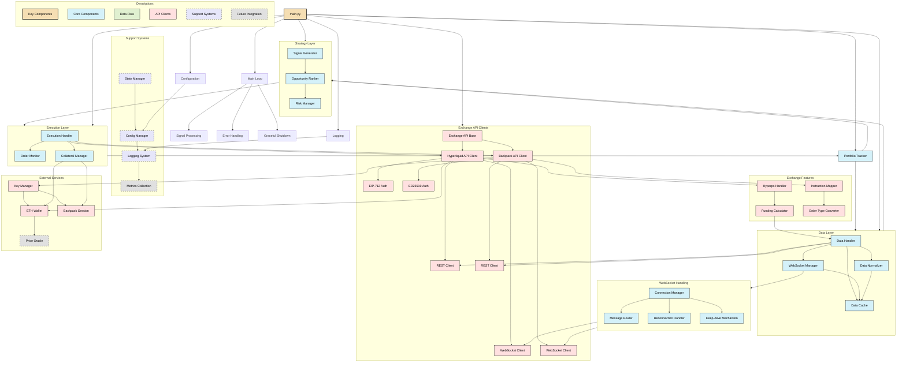

```mermaid
graph TD
    %% Main node styles with high readability colors and black text
    classDef main fill:#f5deb3,stroke:#000,stroke-width:2px,color:black
    classDef core fill:#d4f1f9,stroke:#000,stroke-width:1px,color:black
    classDef data fill:#e0f0d0,stroke:#000,stroke-width:1px,color:black
    classDef api fill:#ffe0e0,stroke:#000,stroke-width:1px,color:black
    classDef support fill:#e6e6fa,stroke:#000,stroke-width:1px,stroke-dasharray: 5 5,color:black
    classDef future fill:#e0e0e0,stroke:#000,stroke-width:1px,stroke-dasharray: 5 5,color:black
    
    %% Main Application Orchestration
    Main[main.py]:::main --> Config[Configuration]
    Main --> Logger[Logging]
    Main --> MainLoop[Main Loop]
    
    MainLoop --> SignalProcessor[Signal Processing]
    MainLoop --> ErrorHandler[Error Handling]
    MainLoop --> Shutdown[Graceful Shutdown]
    
    %% Core Components - Data Layer
    subgraph DataLayer[Data Layer]
        direction TB
        DataHandler[Data Handler]:::core
        WebSocketManager[WebSocket Manager]:::core
        DataCache[Data Cache]:::core
        DataNormalizer[Data Normalizer]:::core
        
        DataHandler --> WebSocketManager
        DataHandler --> DataCache
        WebSocketManager --> DataCache
        DataHandler --> DataNormalizer
        DataNormalizer --> DataCache
    end
    
    %% Core Components - Strategy Layer
    subgraph StrategyLayer[Strategy Layer]
        direction TB
        SignalGenerator[Signal Generator]:::core
        OpportunityRanker[Opportunity Ranker]:::core
        RiskManager[Risk Manager]:::core
        
        SignalGenerator --> OpportunityRanker
        OpportunityRanker --> RiskManager
    end
    
    %% Core Components - Execution Layer
    subgraph ExecutionLayer[Execution Layer]
        direction TB
        ExecutionHandler[Execution Handler]:::core
        OrderMonitor[Order Monitor]:::core
        CollateralManager[Collateral Manager]:::core
        
        ExecutionHandler --> OrderMonitor
        ExecutionHandler --> CollateralManager
    end
    
    %% Portfolio State
    PortfolioTracker[Portfolio Tracker]:::core
    
    %% Data Flow
    DataLayer --> StrategyLayer
    StrategyLayer --> ExecutionLayer
    ExecutionLayer --> PortfolioTracker
    PortfolioTracker --> StrategyLayer
    PortfolioTracker --> DataLayer
    
    %% External Connections - Exchange API Clients
    subgraph ExchangeAPIClients[Exchange API Clients]
        direction TB
        
        %% Base Exchange API Interface
        ExchangeAPIBase[Exchange API Base]:::api
        
        %% HyperLiquid API Components
        HyperliquidAPI[Hyperliquid API Client]:::api
        HyperliquidREST[REST Client]:::api
        HyperliquidWS[WebSocket Client]:::api
        HyperliquidAuth[EIP-712 Auth]:::api

        %% Backpack API Components
        BackpackAPI[Backpack API Client]:::api
        BackpackREST[REST Client]:::api
        BackpackWS[WebSocket Client]:::api
        BackpackAuth[ED25519 Auth]:::api
        
        %% Client Relationships
        ExchangeAPIBase --> HyperliquidAPI
        ExchangeAPIBase --> BackpackAPI
        
        HyperliquidAPI --> HyperliquidREST
        HyperliquidAPI --> HyperliquidWS
        HyperliquidAPI --> HyperliquidAuth
        
        BackpackAPI --> BackpackREST
        BackpackAPI --> BackpackWS
        BackpackAPI --> BackpackAuth
    end
    
    %% External Connections - External Services
    subgraph ExternalServices[External Services]
        direction TB
        ETHWallet[ETH Wallet]:::api
        PriceOracle[Price Oracle]:::future
        BackpackSession[Backpack Session]:::api
        KeyManager[Key Manager]:::api
        
        ETHWallet --> PriceOracle
        KeyManager --> ETHWallet
        KeyManager --> BackpackSession
    end
    
    %% External Connections - Support Systems
    subgraph SupportSystems[Support Systems]
        direction TB
        ConfigManager[Config Manager]:::support
        LoggingSystem[Logging System]:::support
        Metrics[Metrics Collection]:::future
        StateManager[State Manager]:::support
        
        ConfigManager --> LoggingSystem
        LoggingSystem --> Metrics
        StateManager --> ConfigManager
    end
    
    %% WebSocket Handling
    subgraph WebSocketHandling[WebSocket Handling]
        direction TB
        ConnectionManager[Connection Manager]:::core
        MessageRouter[Message Router]:::core
        ReconnectionHandler[Reconnection Handler]:::core
        KeepAlive[Keep-Alive Mechanism]:::core
        
        ConnectionManager --> MessageRouter
        ConnectionManager --> ReconnectionHandler
        ConnectionManager --> KeepAlive
    end
    
    WebSocketManager --> WebSocketHandling
    
    %% Support Connections
    WebSocketHandling --> HyperliquidWS
    WebSocketHandling --> BackpackWS
    DataHandler --> HyperliquidREST
    DataHandler --> BackpackREST
    ExecutionHandler --> HyperliquidAPI
    ExecutionHandler --> BackpackAPI
    CollateralManager --> ETHWallet
    CollateralManager --> BackpackSession
    HyperliquidAPI --> ETHWallet
    BackpackAPI --> KeyManager
    
    Main --> ExchangeAPIClients
    Config --> ConfigManager
    Logger --> LoggingSystem
    
    %% Main components to core components
    Main --> DataLayer
    Main --> StrategyLayer
    Main --> ExecutionLayer
    Main --> PortfolioTracker
    
    %% Exchange-Specific Features
    subgraph ExchangeFeatures[Exchange Features]
        direction TB
        HyperpsHandler[Hyperps Handler]:::api
        FundingCalculator[Funding Calculator]:::api
        BackpackInstructionMapper[Instruction Mapper]:::api
        OrderTypeConverter[Order Type Converter]:::api
        
        HyperpsHandler --> FundingCalculator
        BackpackInstructionMapper --> OrderTypeConverter
    end
    
    HyperliquidAPI --> HyperpsHandler
    BackpackAPI --> BackpackInstructionMapper
    FundingCalculator --> DataHandler
    
    %% Component Descriptions
    subgraph Descriptions
        direction TB
        D1[Key Components]:::main
        D2[Core Components]:::core
        D3[Data Flow]:::data
        D4[API Clients]:::api
        D5[Support Systems]:::support
        D6[Future Integration]:::future
    end
``` 