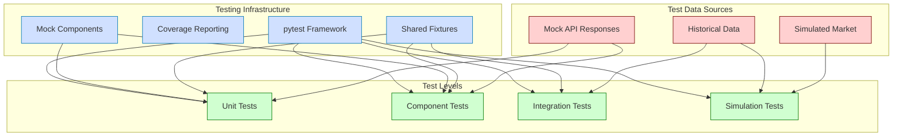

# Testing Strategy - Prototype 0.0.1

This document outlines the comprehensive testing strategy for Prototype 0.0.1 of the CyberDeltaEngine. It covers the testing goals, architecture, approaches, and implementation plan to ensure the system functions correctly, reliably, and as expected.

## Testing Goals

1. **Verify Core Logic Correctness**: Ensure that critical algorithms like NFD (Net Funding Difference) calculation, risk management, and order execution function correctly under various conditions.

2. **Validate API Integration**: Confirm proper integration with the Hyperliquid API, including authentication, data fetching, order placement, and WebSocket handling.

3. **Establish Testing Infrastructure**: Create reusable testing components including fixtures, mocks, and helper functions to support ongoing development.

4. **Enable Safe Iteration**: Provide developers with confidence to modify and enhance the codebase while preserving core functionality.

## Testing Architecture



## Testing Tools and Setup

### Core Tools
- **pytest**: Primary testing framework
- **pytest-mock**: For mocking dependencies
- **pytest-cov**: For measuring code coverage
- **pytest-asyncio**: For testing asynchronous code

### Directory Structure

```
tests/
├── unit/                      # Unit tests for isolated components
│   ├── api_client/            # Tests for API client components
│   ├── data_handler/          # Tests for data handling
│   ├── portfolio_tracker/     # Tests for portfolio tracking
│   ├── signal_generator/      # Tests for signal generation
│   ├── risk_manager/          # Tests for risk management
│   └── execution_handler/     # Tests for execution handling
├── integration/               # Integration tests for component interactions
│   ├── api_data_flow/         # Tests for API to data handler flow
│   ├── signal_risk_flow/      # Tests for signal to risk management flow
│   └── execution_flow/        # Tests for execution and portfolio updates
├── simulation/                # End-to-end simulation tests
│   ├── funding_arbitrage/     # Funding arbitrage scenarios
│   └── error_scenarios/       # Error handling scenarios
├── fixtures/                  # Shared test fixtures
│   ├── api_responses.py       # Mock API response data
│   ├── market_data.py         # Mock market data
│   └── config.py              # Test configurations
└── mocks/                     # Mock implementations
    ├── api_client.py          # Mock API client
    ├── websocket.py           # Mock WebSocket client
    └── exchange.py            # Mock exchange responses
```

## Unit Testing Approach

Unit tests focus on testing individual functions and methods in isolation, using mocks for dependencies. The goal is to verify that each piece functions correctly with well-defined inputs and outputs.

### API Client Testing

```python
def test_hyperliquid_auth_signature():
    """Test that the signature generation works correctly."""
    # Arrange
    private_key = "0x1234567890abcdef1234567890abcdef1234567890abcdef1234567890abcdef"
    auth = HyperliquidAuth(private_key)
    timestamp = 1620000000
    data = {"action": "test"}
    
    # Act
    signature = auth.get_signature(timestamp, data)
    
    # Assert
    assert isinstance(signature, str)
    assert len(signature) > 0
    # Further signature validation...

@pytest.mark.asyncio
async def test_get_funding_rates():
    """Test that funding rates are retrieved correctly."""
    # Arrange
    mock_client = MockHyperliquidAPI()
    mock_client.set_funding_response({
        "markets": [
            {"symbol": "BTC-PERP", "fundingRate": 0.0001},
            {"symbol": "ETH-PERP", "fundingRate": -0.0002}
        ]
    })
    
    # Act
    funding_rates = await mock_client.get_funding_rates()
    
    # Assert
    assert "markets" in funding_rates
    assert len(funding_rates["markets"]) == 2
    assert funding_rates["markets"][0]["symbol"] == "BTC-PERP"
    assert funding_rates["markets"][0]["fundingRate"] == 0.0001
```

### Core Logic Testing

```python
def test_nfd_calculation():
    """Test NFD calculation logic."""
    # Arrange
    funding_rates = {
        "BTC-PERP": 0.0001,
        "ETH-PERP": -0.0002
    }
    data_handler = MockDataHandler()
    data_handler.set_funding_rates(funding_rates)
    portfolio_tracker = MockPortfolioTracker()
    signal_generator = SignalGenerator(data_handler, portfolio_tracker)
    
    # Act
    opportunities = signal_generator._calculate_nfd_opportunities(funding_rates)
    
    # Assert
    assert len(opportunities) == 2
    btc_opp = next(o for o in opportunities if o['symbol'] == "BTC-PERP")
    eth_opp = next(o for o in opportunities if o['symbol'] == "ETH-PERP")
    assert btc_opp['nfd'] == 0.0001
    assert eth_opp['nfd'] == -0.0002
    assert 'estimated_cost' in btc_opp
```

## Integration Testing Approach

Integration tests verify that components work correctly together with minimal mocking. They focus on data flow, state changes, and interactions between components.

### Data Flow Testing

```python
@pytest.mark.asyncio
async def test_data_handler_to_signal_generator():
    """Test that data flows correctly from DataHandler to SignalGenerator."""
    # Arrange
    api_client = MockHyperliquidAPI()
    api_client.set_funding_response({
        "markets": [
            {"symbol": "BTC-PERP", "fundingRate": 0.0001},
            {"symbol": "ETH-PERP", "fundingRate": -0.0002}
        ]
    })
    
    data_handler = DataHandler(api_client)
    portfolio_tracker = MockPortfolioTracker()
    signal_generator = SignalGenerator(data_handler, portfolio_tracker)
    
    # Act
    await data_handler.initialize()
    opportunities = await signal_generator.generate_signals()
    
    # Assert
    assert len(opportunities) == 2
    symbols = [opp['symbol'] for opp in opportunities]
    assert "BTC-PERP" in symbols
    assert "ETH-PERP" in symbols
```

### Component Interaction Testing

```python
@pytest.mark.asyncio
async def test_opportunity_through_risk_management():
    """Test that an opportunity flows through signal generation and risk management."""
    # Arrange
    api_client = MockHyperliquidAPI()
    api_client.set_funding_response({
        "markets": [
            {"symbol": "BTC-PERP", "fundingRate": 0.0010}  # Strong positive funding
        ]
    })
    
    data_handler = DataHandler(api_client)
    portfolio_tracker = MockPortfolioTracker()
    portfolio_tracker.set_total_portfolio_value(100000)  # $100k portfolio
    signal_generator = SignalGenerator(data_handler, portfolio_tracker)
    risk_manager = RiskManager(portfolio_tracker, {
        "max_position_size": 0.1,  # 10% max position
        "max_total_exposure": 0.5   # 50% max exposure
    })
    
    # Act
    await data_handler.initialize()
    opportunities = await signal_generator.generate_signals()
    assert len(opportunities) > 0  # Ensure we have at least one opportunity
    
    trade_plan = risk_manager.evaluate_opportunity(
        opportunities[0], 
        {"price": 50000}  # Mock market data
    )
    
    # Assert
    assert trade_plan['symbol'] == "BTC-PERP"
    assert trade_plan['direction'] == 1  # Long position for positive funding
    assert trade_plan['size'] > 0  # Position size should be positive
    assert trade_plan['size'] <= 10000  # Should not exceed 10% of portfolio
```

## Simulation Testing Approach

Simulation tests create a controlled environment to test the complete system behavior, including response to market changes, order execution, and portfolio updates over time.

### Funding Arbitrage Scenario

```python
@pytest.mark.asyncio
async def test_funding_arbitrage_scenario():
    """Test a complete funding arbitrage scenario."""
    # Arrange
    config = {
        "max_position_size": 0.1,
        "max_total_exposure": 0.5
    }
    
    # Create market data source with pre-defined scenario
    market_data_source = MarketDataScenario([
        # timestamp, btc_price, btc_funding, eth_price, eth_funding
        (1000, 50000, 0.0005, 3000, -0.0003),  # Initial state
        (1060, 50050, 0.0006, 3010, -0.0004),  # 1 minute later
        (1120, 50100, 0.0007, 3020, -0.0005),  # 2 minutes later
    ])
    
    # Create simulation
    simulation = TradingSimulation(config, market_data_source)
    
    # Act
    results = await simulation.run_simulation(1000, 1120, time_step=60)
    
    # Assert
    # Verify that trades were executed
    assert len(results['trades']) > 0
    
    # Verify that portfolio value increased
    initial_value = results['portfolio_value_history'][0]['portfolio_value']
    final_value = results['portfolio_value_history'][-1]['portfolio_value']
    assert final_value > initial_value
    
    # Verify executed trades match expected opportunities
    for trade in results['trades']:
        # BTC should be long (positive funding), ETH should be short (negative funding)
        if trade['trade_plan']['symbol'] == 'BTC-PERP':
            assert trade['trade_plan']['direction'] == 1
        elif trade['trade_plan']['symbol'] == 'ETH-PERP':
            assert trade['trade_plan']['direction'] == -1
```

## Test Fixtures

### API Response Fixtures

```python
@pytest.fixture
def funding_rates_response():
    """Fixture providing mock funding rate response."""
    return {
        "markets": [
            {"symbol": "BTC-PERP", "fundingRate": 0.0001},
            {"symbol": "ETH-PERP", "fundingRate": -0.0002},
            {"symbol": "SOL-PERP", "fundingRate": 0.0003},
            {"symbol": "AVAX-PERP", "fundingRate": -0.0001}
        ]
    }

@pytest.fixture
def order_book_response():
    """Fixture providing mock order book response."""
    return {
        "symbol": "BTC-PERP",
        "bids": [
            [50000, 1.5],
            [49950, 2.0],
            [49900, 3.0]
        ],
        "asks": [
            [50050, 1.0],
            [50100, 2.5],
            [50150, 3.5]
        ]
    }
```

### Mock API Client Fixture

```python
@pytest.fixture
def mock_api_client():
    """Fixture providing a mock API client with configurable responses."""
    client = MockHyperliquidAPI()
    
    # Default responses
    client.set_funding_response({
        "markets": [
            {"symbol": "BTC-PERP", "fundingRate": 0.0001},
            {"symbol": "ETH-PERP", "fundingRate": -0.0002}
        ]
    })
    
    client.set_order_book_response("BTC-PERP", {
        "symbol": "BTC-PERP",
        "bids": [[50000, 1.0], [49900, 2.0]],
        "asks": [[50100, 1.5], [50200, 2.5]]
    })
    
    client.set_account_info_response({
        "collateral": 100000,
        "free_collateral": 80000
    })
    
    return client
```

### Market Data Fixture

```python
@pytest.fixture
def market_data():
    """Fixture providing market data for testing."""
    return {
        "BTC-PERP": {
            "price": 50000,
            "funding_rate": 0.0001,
            "volume_24h": 1000000000
        },
        "ETH-PERP": {
            "price": 3000,
            "funding_rate": -0.0002,
            "volume_24h": 500000000
        }
    }
```

## CI/CD Integration

The testing strategy will be integrated into the CI/CD pipeline using GitHub Actions to run tests automatically on each push and pull request.

```yaml
# .github/workflows/tests.yml
name: Tests

on:
  push:
    branches: [ main, develop ]
  pull_request:
    branches: [ main, develop ]

jobs:
  test:
    runs-on: ubuntu-latest
    
    steps:
    - uses: actions/checkout@v2
    
    - name: Set up Python
      uses: actions/setup-python@v2
      with:
        python-version: 3.9
    
    - name: Install dependencies
      run: |
        python -m pip install --upgrade pip
        pip install -r requirements.txt
        pip install -r requirements-dev.txt
    
    - name: Run tests
      run: |
        pytest tests/ --cov=cyberdelta_engine --cov-report=xml
    
    - name: Upload coverage report
      uses: codecov/codecov-action@v1
```

## Implementation Plan

The testing implementation will be divided into four phases:

### Phase 1: Setup (Week 1)
- Configure pytest and required plugins
- Create directory structure
- Implement basic fixtures
- Create mock API client

### Phase 2: Unit Tests (Week 1-2)
- Implement unit tests for Hyperliquid API client
- Implement unit tests for Data Handler
- Implement unit tests for Signal Generator
- Implement unit tests for basic calculations

### Phase 3: Integration Tests (Week 3-4)
- Implement integration tests for API to data flow
- Implement integration tests for signal to risk flow
- Implement integration tests for execution flow
- Create tests for error scenarios

### Phase 4: Simulation Tests (Week 4-5)
- Develop simulation framework
- Create market data scenarios
- Implement end-to-end simulation tests
- Measure and improve test coverage

## Success Criteria

The testing strategy will be considered successful if:

### Coverage Targets
- Core logic (Signal Generator, Risk Manager): 90%+ coverage
- API clients and Data Handler: 80%+ coverage
- Execution Handler: 80%+ coverage
- Overall system: 75%+ coverage

### Test Suite Performance
- Unit tests run in under 30 seconds
- Integration tests run in under 2 minutes
- Simulation tests run in under 5 minutes

### Quality Metrics
- No flaky tests (tests that fail intermittently)
- Clear test names and documentation
- Comprehensive assertions that verify correct behavior
- Tests fail clearly when behavior changes 