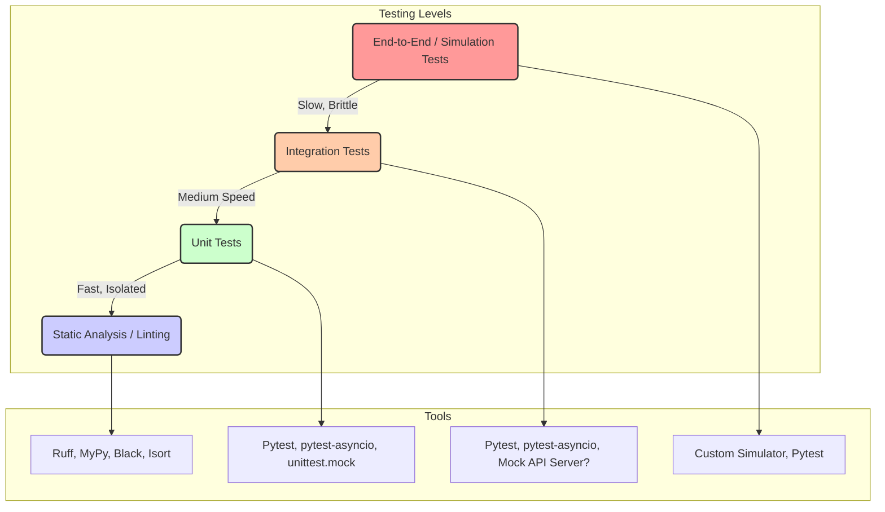

# Testing Strategy Plan (Detailed)

This document outlines the proposed testing strategy for the CyberDeltaEngine implementation, providing more detail on each level and the infrastructure.

## Goals

- **Correctness:** Ensure individual components perform calculations and state transitions accurately according to specifications.
- **Integration:** Verify seamless data flow and interaction logic between different system components.
- **Strategy Validation:** Confirm that the implemented trading logic aligns with the mathematical models and performs as expected under various market conditions.
- **Robustness:** Guarantee the system handles errors gracefully (API issues, network problems, unexpected data) and recovers where possible.
- **Reliability:** Ensure the bot can run continuously without crashes, memory leaks, or performance degradation.
- **Maintainability:** Facilitate future development and refactoring through a comprehensive test suite.

## Testing Pyramid & Tools

We adopt the testing pyramid philosophy, emphasizing a large base of fast unit tests, followed by integration tests, and fewer, slower end-to-end/simulation tests.



**1. Static Analysis & Linting:**
    *   **Tools:** `ruff`, `mypy`.
    *   **Configuration:** Defined in `pyproject.toml`.
    *   **Goals:** Enforce code style (PEP8 via Ruff), identify potential bugs (unused variables, complexity), ensure type correctness (`mypy`), sort imports.
    *   **Execution:** `pre-commit` hooks, CI pipeline step.

**2. Unit Testing:**
    *   **Framework:** `pytest` with `pytest-asyncio`.
    *   **Location:** `tests/unit/` (subdirectories mirroring `src/`).
    *   **Goal:** Test smallest units of code (functions, methods) in isolation.
    *   **Techniques & Examples:**
        *   **Mocking:** Use `unittest.mock.AsyncMock` or `pytest-mock` to replace dependencies. Ex: Mock `api_client.fetch_funding_rate` when testing `SignalGenerator._calculate_opportunities`.
        *   **Calculations:** Test `RiskManager._calculate_dynamic_var_limit` with known inputs and expected outputs. Test `SignalGenerator` NFD/Utility calculation with specific `FundingRate` inputs.
        *   **State Changes:** Test `PortfolioTracker.update_balance` updates the internal dictionary correctly. Test `PortfolioTracker.update_order` removes completed orders.
        *   **Parsing:** Test `DataHandler._handle_ticker_message` correctly creates a `Ticker` object from various sample JSON payloads (loaded from fixtures).
        *   **Edge Cases:** Test behavior with empty lists, zero values, `None` inputs, unexpected data types.

**3. Integration Testing:**
    *   **Framework:** `pytest` with `pytest-asyncio`.
    *   **Location:** `tests/integration/`.
    *   **Goal:** Verify interactions between specific groups of components.
    *   **Techniques & Examples:**
        *   **Signal -> Risk -> Execute Flow:**
            *   Use a mocked `DataHandler` or API clients feeding specific data to `SignalGenerator`.
            *   Verify `SignalGenerator` yields expected `ArbitrageOpportunity`.
            *   Pass opportunity to `RiskManager` (with mocked `PortfolioTracker` state).
            *   Verify `RiskManager` calculates expected size or filters the opportunity.
            *   Pass viable opportunity to `ExecutionHandler` (with mocked API clients).
            *   Verify `ExecutionHandler` calls the correct `place_order` methods on mocked clients.
        *   **Data Subscription & Handling:**
            *   Initialize `DataHandler` and mocked API clients.
            *   Call `DataHandler.subscribe_to_streams`.
            *   Verify `subscribe` was called on mocked clients with correct topics.
            *   Simulate WS messages via mocked client's listener and verify `DataHandler` state updates.
        *   **State Updates:**
            *   Simulate order fills via mocked API WS/REST response.
            *   Verify `PortfolioTracker` state (orders, positions, balances) is updated correctly.
        *   **Startup/Shutdown:** Test `main.py` initializes components in order and shuts down gracefully by checking logs or component states.
        *   **Mock API Server (Optional):** Consider using tools like `aioresponses` or a dedicated mock server (e.g., WireMock, mockserver) to simulate HTTP API behavior more realistically for integration tests.

**4. End-to-End (E2E) / Simulation Testing (Future):**
    *   **Framework:** Likely a custom `asyncio`-based simulator.
    *   **Location:** `tests/simulation/` or `backtest/`.
    *   **Goal:** Simulate the entire system lifecycle with realistic market dynamics.
    *   **Components:**
        *   **Market Data Simulator:** Reads historical data (CSV, database) or generates synthetic data (e.g., Geometric Brownian Motion for prices, OU process for basis). Feeds data via simulated WebSocket or queues.
        *   **Exchange Simulator:** Mimics exchange API endpoints (REST/WS). Implements an order matching engine (simple FIFO or price/time priority). Simulates fees, slippage (e.g., based on simulated order book depth and trade size), funding payments, and latency.
        *   **Bridge Simulator:** Simulates transfer times and costs between exchanges, potentially with random delays or failures.
    *   **Execution:** Run the `TradingBot` (`main.py`) connected to these simulators instead of live APIs.
    *   **Analysis:** Record trades, PnL, state changes. Calculate performance metrics (Sharpe, Sortino, Max Drawdown). Compare against theoretical strategy results. Analyze behavior under simulated stress conditions (e.g., flash crashes, API outages, large slippage).
    *   **Diagram:**
        ```mermaid
        graph TD
            TB(TradingBot Application) -- API Calls --> SimEx[Simulated Exchanges]
            SimEx -- Order Match/Fills --> TB
            SimEx -- Market Data --> SimMkt[Market Data Simulator]
            SimMkt -- Feeds Data --> TB # Via simulated WS
            TB -- Bridge Calls --> SimBridge[Simulated Bridge]
            SimBridge -- Transfer Status --> TB
            SimEx -- Balances/Positions --> SimState[Simulation State]
            TB -- Records --> Results[Test Results / Metrics]
        ```

**5. Live Paper Trading (Future):**
    *   **Goal:** Final validation step before real capital deployment.
    *   **Execution:** Configure `main.py` with testnet/paper trading API keys and endpoints.
    *   **Monitoring:** Requires robust external monitoring of logs, performance dashboard (if built), and manual cross-checking against exchange paper account statements.

## Test Infrastructure Setup (`tests/`)**

```
strategy_math/coding_strategy/
└── tests/
    ├── unit/
    │   ├── apis/
    │   │   └── test_hyperliquid_parsing.py # Example
    │   ├── core/
    │   │   ├── test_signal_generator_calc.py # Example
    │   │   └── test_risk_manager_sizing.py # Example
    │   ├── utils/
    │   └── config/
    ├── integration/
    │   ├── test_main_flow.py # Example
    │   └── test_data_handling.py # Example
    ├── simulation/ # Or ../backtest/
    │   ├── market_simulator.py # Example
    │   └── exchange_simulator.py # Example
    ├── conftest.py # Fixtures (e.g., event loop, mocked clients)
    └── fixtures/   # Sample data files (e.g., API responses)
```

- **`conftest.py`:** Will define shared `pytest` fixtures, such as:
    - An `asyncio` event loop fixture.
    - Fixtures for creating mocked instances of API clients and core components.
    - Fixtures for loading sample API response data from `tests/fixtures/`.
- **`fixtures/`:** Directory containing JSON/YAML files with sample API responses for mocking.

## Execution & CI/CD (Refined)

- **Local Execution:** `pytest tests/` (using config in `pyproject.toml`).
- **CI/CD Pipeline (GitHub Actions Example - `.github/workflows/ci.yml`):**
    ```yaml
    name: Python CI
    on: [push, pull_request]
    jobs:
      build:
        runs-on: ubuntu-latest
        strategy:
          matrix:
            python-version: ["3.13"] # Ensure this matches project requirement
        steps:
        - uses: actions/checkout@v3
        - name: Set up Python ${{ matrix.python-version }}
          uses: actions/setup-python@v4
          with:
            python-version: ${{ matrix.python-version }}
        - name: Install dependencies
          run: |
            python -m pip install --upgrade pip
            pip install -r strategy_math/coding_strategy/requirements.txt
            # Add test-specific deps if needed: pip install pytest pytest-asyncio pytest-mock
        - name: Lint with Ruff
          run: |
            pip install ruff
            ruff check strategy_math/coding_strategy/src strategy_math/coding_strategy/tests
        - name: Format Check with Ruff
          run: |
            ruff format --check strategy_math/coding_strategy/src strategy_math/coding_strategy/tests
        - name: Type Check with MyPy
          run: |
            pip install mypy
            mypy strategy_math/coding_strategy/src
        - name: Run Unit Tests
          run: |
            pip install pytest pytest-asyncio pytest-mock
            python -m pytest strategy_math/coding_strategy/tests/unit
        - name: Run Integration Tests
          run: |
            python -m pytest strategy_math/coding_strategy/tests/integration
    ```
- **Pre-commit Hooks (`.pre-commit-config.yaml`):**
    ```yaml
    repos:
    -   repo: https://github.com/astral-sh/ruff-pre-commit
        rev: v0.4.1 # Use latest stable ruff version
        hooks:
        -   id: ruff
            args: [--fix, --exit-non-zero-on-fix]
        -   id: ruff-format
    -   repo: https://github.com/pre-commit/mirrors-mypy
        rev: v1.8.0 # Use latest stable mypy version
        hooks:
        -   id: mypy
            args: [--strict]
            additional_dependencies: [] # Add types-* if needed
    # Add other hooks like check-yaml, check-toml if desired
    ```

## Key Areas for Rigorous Testing (Examples)

- **API Client Parsing:** Test with valid data, missing fields, unexpected types, error messages from `tests/fixtures/`.
- **Authentication/Signing:** Unit test the signing logic itself with known inputs/outputs. Integration tests with mock servers might verify header correctness.
- **State Management:** Test concurrent updates to `PortfolioTracker` state using `asyncio.gather` and locks.
- **Execution Logic:** Integration tests simulating partial fills, order rejections, API errors during execution, testing the compensation logic.
- **Collateral Management:** Unit tests for target calculation, path cost calculation. Integration tests simulating transfers, delays, bridge errors.
- **Risk Calculations:** Unit tests verifying VaR formula, Kelly formula. Integration tests checking pre-trade risk assessment blocks/allows trades correctly based on mocked portfolio state.
- **Concurrency:** Specifically test scenarios involving cancellations during operations (e.g., cancelling an API request, stopping a component during processing).

## Initial Test Implementation Plan (Refined)

1.  **Setup:** Initialize `pytest`, add test dependencies (`pytest-asyncio`, `pytest-mock`) to a `requirements-dev.txt`. Setup `.pre-commit-config.yaml`. Create basic `tests/conftest.py`.
2.  **CI:** Configure basic GitHub Actions workflow for linting and type checking.
3.  **Unit Tests - Utils/Config/Models:** Write tests for simple helper functions, configuration loading edge cases, and data model initialization.
4.  **Unit Tests - Core Logic:** Test pure calculation functions within `SignalGenerator` and `RiskManager` using direct inputs (mocking dependencies).
5.  **Unit Tests - API Parsing:** Create fixture files for sample API responses. Write tests in `tests/unit/apis/` to verify that client parsing methods correctly handle these responses.
6.  **Integration Tests - Data Flow:** Create tests in `tests/integration/` mocking API clients. Test `DataHandler` subscriptions and message routing. Test `SignalGenerator` receiving data from mocked `DataHandler`. Test `RiskManager` receiving opportunities.
7.  **CI Expansion:** Add test execution steps to the CI pipeline.
8.  **Coverage Expansion:** Incrementally add unit and integration tests for new features and edge cases as development progresses. Use coverage tools (`pytest-cov`) to identify gaps.
9.  **Simulation Framework:** Design and implement the simulation environment later, once core components are more stable. 