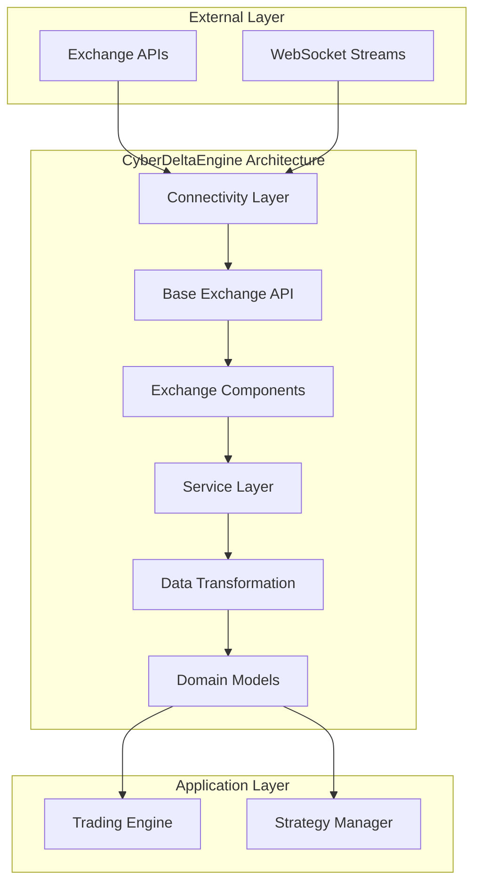
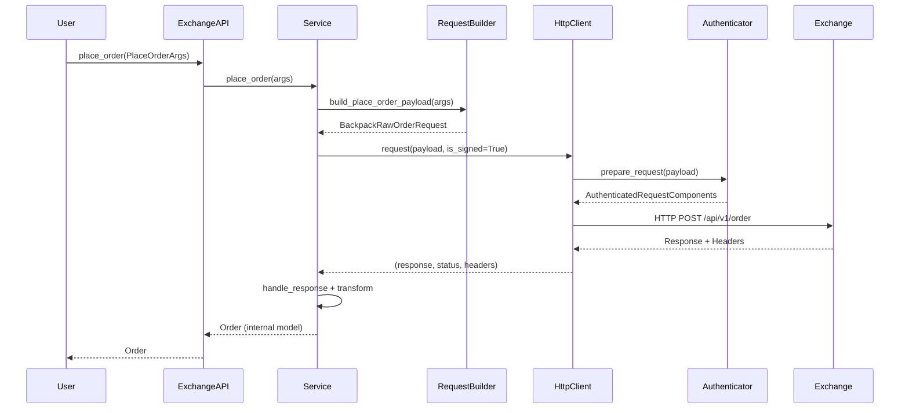
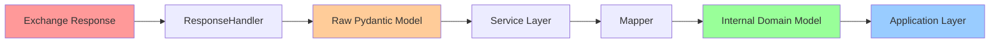
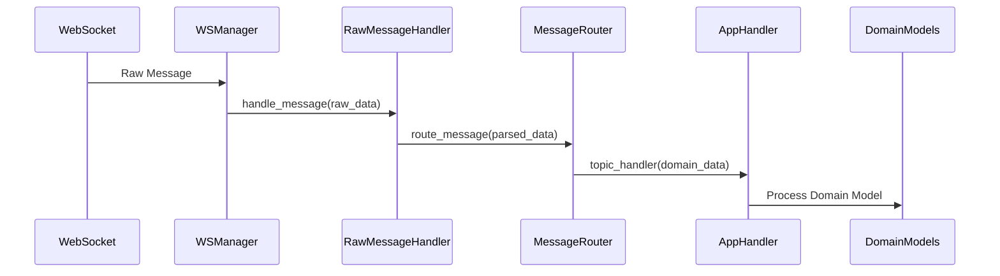
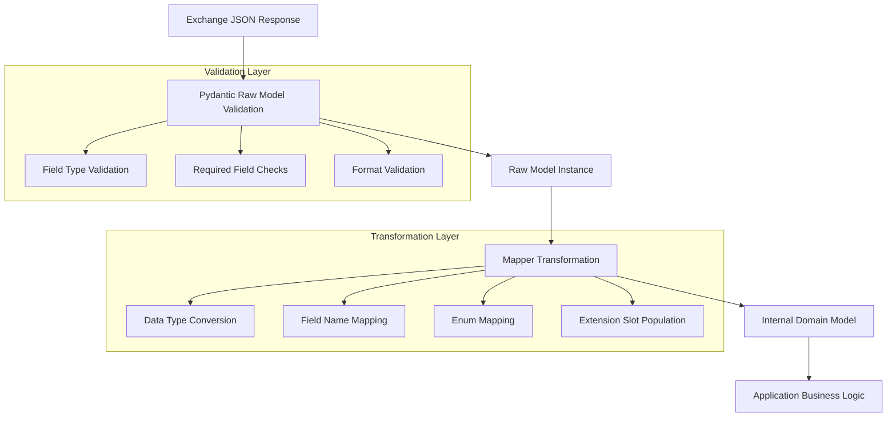
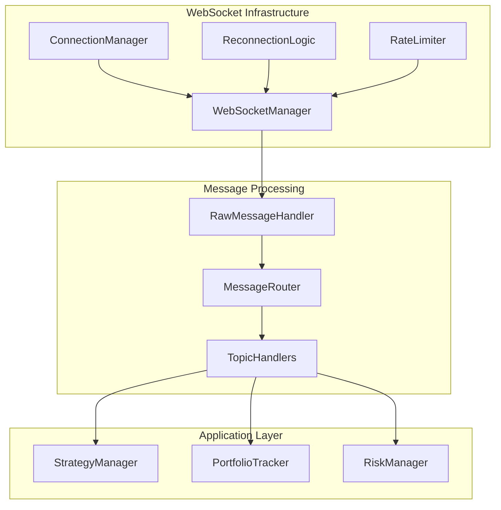
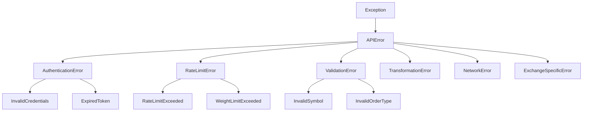
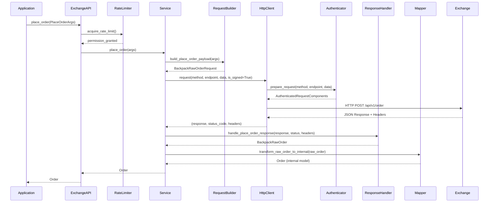
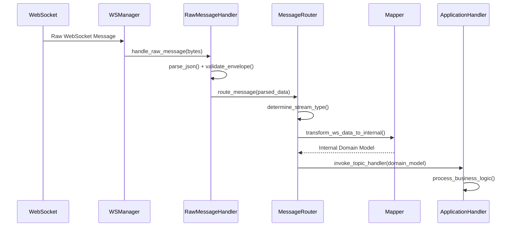
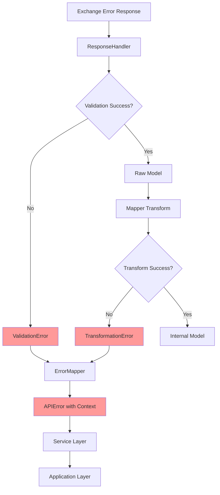

# CyberDeltaEngine API Architecture Documentation

## Table of Contents

1. [Architecture Overview](#architecture-overview)
2. [Architectural Layers](#architectural-layers)
3. [Data Flow Architecture](#data-flow-architecture)
4. [Core Design Patterns](#core-design-patterns)
5. [Service Layer Design](#service-layer-design)
6. [Data Transformation Pipeline](#data-transformation-pipeline)
7. [WebSocket Architecture](#websocket-architecture)
8. [Error Handling Strategy](#error-handling-strategy)
9. [Rate Limiting System](#rate-limiting-system)
10. [Authentication Framework](#authentication-framework)
11. [Component Interaction Diagrams](#component-interaction-diagrams)
12. [Implementation Guidelines](#implementation-guidelines)

---

## Architecture Overview

The CyberDeltaEngine implements a sophisticated **6-layer architecture** designed for high-performance cryptocurrency exchange integration. The system follows strict **domain-driven design principles** with clear separation of concerns and type safety throughout.

### Core Principles

- **Domain Model Separation**: Raw API models vs Internal business models
- **Type Safety**: Pydantic validation at all boundaries
- **Exchange Agnostic**: Unified interface for multiple exchanges
- **Extension Slots**: Exchange-specific enrichment of core models
- **Defensive Programming**: Comprehensive error handling and validation



---

## Architectural Layers

### Layer 1: Connectivity Layer
**Location**: `cyberdelta/apis/connectivity/`

#### HTTP Client (`http_client.py`)
- Async HTTP/HTTPS communication
- Connection pooling and timeout management
- Response parsing and validation
- Retry logic with exponential backoff

#### WebSocket Manager (`ws_manager.py`)
- Auto-reconnection with configurable retry logic
- Message routing and handler management
- Rate limiting for outgoing messages
- Connection lifecycle management

```python
# Example HTTP Client usage
response, status, headers = await http_client.request(
    method="GET",
    endpoint_path="/api/v1/ticker",
    params={"symbol": "BTC_USDC"},
    authenticator=authenticator,
    is_signed=False
)
```

### Layer 2: Base Exchange API
**Location**: `cyberdelta/apis/base/`

#### ExchangeAPI (`exchange_api.py`)
Abstract base class defining the unified interface for all exchanges:

```python
@abstractmethod
async def get_market(self, args: GetMarketArgs) -> Market:
    """Retrieve market metadata for a specific symbol."""
    raise NotImplementedError

@abstractmethod
async def place_order(self, args: PlaceOrderArgs) -> Order:
    """Place a new order on the exchange."""
    raise NotImplementedError
```

#### Core Interfaces
- `IAuthenticator`: Authentication strategy interface
- `IErrorMapper`: Exchange-specific error mapping
- `RateLimitStrategy`: Rate limiting strategy interface

### Layer 3: Exchange-Specific Components
**Location**: `cyberdelta/apis/{exchange}/`

#### Request Builder Pattern
Constructs type-safe, validated request payloads:

```python
class BackpackRequestBuilder:
    @staticmethod
    def build_place_order_payload(args: PlaceOrderArgs) -> BackpackRawOrderRequest:
        """Build validated order request for Backpack API."""
        return BackpackRawOrderRequest(
            symbol=BackpackRequestBuilder.format_symbol(args.symbol),
            side=args.side.value,
            orderType=args.order_type.value,
            quantity=str(args.quantity),
            price=str(args.price) if args.price else None
        )
```

#### Response Handler Pattern
Validates and parses exchange responses into Raw Pydantic models:

```python
class BackpackResponseHandler:
    @staticmethod
    def handle_place_order_response(
        raw_response: RawJsonResponse,
        status_code: int,
        headers: Mapping[str, str]
    ) -> BackpackRawOrder:
        """Validate and parse order placement response."""
        return BackpackRawOrder.model_validate(raw_response)
```

### Layer 4: Service Layer
**Location**: `cyberdelta/apis/{exchange}/services/`

#### Service Architecture
Each exchange implements three specialized services:

| Service | Responsibility | Key Methods |
|---------|---------------|-------------|
| **AccountService** | Account management, balances, positions | `get_balances()`, `get_positions()`, `get_account_summary()` |
| **MarketDataService** | Market data, tickers, order books | `get_ticker()`, `get_order_book()`, `get_funding_rates()` |
| **TradingService** | Order management, trade execution | `place_order()`, `cancel_order()`, `get_order_history()` |

#### Service Method Pattern
```python
async def place_order(self, args: PlaceOrderArgs) -> Order:
    """Place order with complete error handling and validation."""

    # 1. Input validation (handled by Pydantic)
    # 2. Build request payload
    request_payload = self._request_builder.build_place_order_payload(args)

    # 3. Execute HTTP request
    response, status, headers = await self._http_requester(
        method="POST",
        endpoint="/api/v1/order",
        data=request_payload,
        is_signed=True
    )

    # 4. Handle response
    raw_order = self._response_handler.handle_place_order_response(
        response, status, headers
    )

    # 5. Transform to internal model
    return self._trading_mapper.transform_raw_order_to_internal(raw_order)
```

### Layer 5: Data Transformation
**Location**: `cyberdelta/apis/{exchange}/mappers/`

#### Mapper Classes
Specialized classes for transforming Raw API models to Internal domain models:

- **AccountDataMapper**: Account, balance, position transformations
- **MarketDataMapper**: Ticker, order book, funding rate transformations
- **TradingDataMapper**: Order, trade, fill transformations

#### Transformation Pattern
```python
class BackpackMarketDataMapper:
    @staticmethod
    def transform_raw_order_book_to_internal(
        symbol: str,
        raw_book: BackpackRawOrderBook
    ) -> OrderBook:
        """Transform Backpack order book to internal model."""

        # Parse and validate bid/ask levels
        bids = [(Decimal(level[0]), Decimal(level[1])) for level in raw_book.bids]
        asks = [(Decimal(level[0]), Decimal(level[1])) for level in raw_book.asks]

        return OrderBook(
            symbol=symbol,
            bids=sorted(bids, key=lambda x: x[0], reverse=True),
            asks=sorted(asks, key=lambda x: x[0]),
            timestamp=parse_datetime_utc(raw_book.timestamp)
        )
```

### Layer 6: Domain Models
**Location**: `cyberdelta/core/models/` and `cyberdelta/apis/{exchange}/models/`

#### Raw Models (Exchange-Specific)
Exact representations of exchange API responses:
```python
class BackpackRawOrderBook(BaseModel):
    """Raw order book response from Backpack API."""
    bids: list[list[str]]  # [price, size] pairs
    asks: list[list[str]]  # [price, size] pairs
    timestamp: int

    model_config = ConfigDict(extra="forbid", frozen=True)
```

#### Internal Models (Business Domain)
Unified business concepts with exchange-agnostic core fields:
```python
class OrderBook(BaseModel):
    """Internal order book model with unified structure."""
    symbol: str
    bids: list[tuple[Decimal, Decimal]]
    asks: list[tuple[Decimal, Decimal]]
    timestamp: datetime

    # Extension slots for exchange-specific data
    bp_details: BackpackOrderBookDetails | None = None
    hl_details: HyperliquidOrderBookDetails | None = None
```

---

## Data Flow Architecture

### Request Flow Diagram



### Response Transformation Pipeline



### WebSocket Message Flow



---

## Core Design Patterns

### 1. Raw/Internal Model Separation (RULE-ARCH-MODEL-DESIGN-V2)

**Problem**: Exchange APIs have different response formats and field names.
**Solution**: Two-tier model system with strict separation.

```python
# Raw Model (Exchange-specific)
class BackpackRawOrder(BaseModel):
    orderId: str  # Backpack field name
    clientId: str | None
    symbol: str
    side: str
    orderType: str
    quantity: str  # Backpack returns strings

# Internal Model (Business domain)
class Order(BaseModel):
    id: str  # Unified field name
    client_order_id: str | None
    symbol: str
    side: OrderSide  # Enum
    order_type: OrderType  # Enum
    quantity: Decimal  # Financial precision

    # Extension slots
    bp_details: BackpackOrderDetails | None = None
    hl_details: HyperliquidOrderDetails | None = None
```

### 2. Core + Typed Extension Slots Pattern

**Problem**: Exchanges provide different metadata for the same business concept.
**Solution**: Core fields + optional typed extension slots.

```python
class Market(BaseModel):
    """Core market metadata common to all exchanges."""
    symbol: str
    base_symbol: str
    quote_symbol: str
    tick_size: Decimal
    step_size: Decimal
    status: str

    # Exchange-specific extension slots
    bp_details: BackpackMarketDetails | None = None
    hl_details: HyperliquidMarketDetails | None = None

class HyperliquidMarketDetails(BaseModel):
    """Hyperliquid-specific market enrichment."""
    max_leverage: int = Field(ge=1, le=1000)
    only_isolated: bool
    sz_decimals: int = Field(ge=0, le=18)
    mark_price: Decimal | None = None
    funding_rate: Decimal | None = None
```

### 3. Args Model Pattern

**Problem**: Method signatures become complex with many optional parameters.
**Solution**: Centralized validation using Pydantic args models.

```python
class PlaceOrderArgs(BaseModel):
    """Centralized validation for order placement."""
    symbol: str
    side: OrderSide
    order_type: OrderType
    quantity: Decimal = Field(gt=Decimal("0"))
    price: Decimal | None = Field(default=None, gt=Decimal("0"))
    time_in_force: TimeInForce

    @model_validator(mode="after")
    def validate_order_requirements(self) -> "PlaceOrderArgs":
        """Validate inter-parameter dependencies."""
        if self.order_type == OrderType.LIMIT and self.price is None:
            raise ValueError("LIMIT orders require a price")
        return self

# Usage
async def place_order(self, args: PlaceOrderArgs) -> Order:
    # Input validation handled by Pydantic
    # Type safety guaranteed
```

### 4. Factory Pattern for Component Creation

**Problem**: Complex dependency injection and component initialization.
**Solution**: Exchange-specific component factories.

```python
class BackpackAPIComponentsFactory:
    """Factory for creating Backpack API components."""

    def create_authenticator(self) -> BackpackEd25519Authenticator:
        return BackpackEd25519Authenticator(self._exchange_secrets)

    def create_market_data_service(
        self,
        http_client_requester: HttpClientRequesterSig,
        market_data_mapper: BackpackMarketDataMapper,
        request_builder: BackpackRequestBuilder,
        response_handler: BackpackResponseHandler,
        exchange_name: str
    ) -> BackpackMarketDataService:
        return BackpackMarketDataService(
            http_client_requester=http_client_requester,
            market_data_mapper=market_data_mapper,
            request_builder=request_builder,
            response_handler=response_handler,
            exchange_name=exchange_name
        )
```

---

## Service Layer Design

### Service Responsibilities Matrix

| Service | REST Endpoints | WebSocket Streams | Domain Models |
|---------|---------------|-------------------|---------------|
| **AccountService** | `/account`, `/balances`, `/positions` | `account.*` streams | `SpotBalance`, `DerivativePosition`, `MarginAccountSummary` |
| **MarketDataService** | `/ticker`, `/depth`, `/trades`, `/klines` | `ticker.*`, `depth.*`, `trades.*` | `Ticker`, `OrderBook`, `Trade`, `Candle`, `FundingRate` |
| **TradingService** | `/order`, `/orders`, `/fills` | `orders.*`, `fills.*` | `Order`, `Trade`, `CancelOrderResult` |

### Service Error Handling Pattern

```python
async def get_ticker(self, symbol: str) -> Ticker:
    """Get ticker with comprehensive error handling."""
    current_method = "get_ticker"
    status_code = 0
    raw_response_content = None

    try:
        # Step 1: Build request
        params = self._request_builder.build_get_ticker_params(symbol)

        # Step 2: Execute HTTP request
        raw_response_content, status_code, headers = await self._http_requester(
            method="GET",
            endpoint="/api/v1/ticker",
            params=params.model_dump(by_alias=True),
            is_signed=False
        )

        # Step 3: Handle response
        raw_ticker = self._response_handler.handle_get_ticker_response(
            raw_response_content, symbol, status_code, headers
        )

        # Step 4: Transform to internal model
        return self._market_data_mapper.transform_raw_ticker_to_internal(raw_ticker)

    except TransformationError as e:
        logger.error(f"[{self._exchange_name}] {current_method}: Transform failed: {e}")
        raise APIError(
            code=APIErrorCode.INVALID_RESPONSE.value,
            message="Failed to process exchange data",
            original_exception=e,
            http_status=status_code,
            exchange_message=raw_response_content
        ) from e
    except ValidationError as e:
        logger.error(f"[{self._exchange_name}] {current_method}: Validation failed: {e}")
        raise APIError(
            code=APIErrorCode.INVALID_RESPONSE.value,
            message="Internal data validation failed",
            original_exception=e,
            http_status=status_code,
            exchange_message=raw_response_content
        ) from e
```

---

## Data Transformation Pipeline

### Transformation Layers



### Mapper Implementation Pattern

```python
class BackpackMarketDataMapper:
    """Market data transformations for Backpack exchange."""

    @staticmethod
    def transform_raw_ticker_to_internal(
        raw_ticker: BackpackRawTicker,
        symbol_override: str | None = None
    ) -> Ticker:
        """Transform Backpack ticker to internal model."""

        try:
            # Core field transformations
            symbol = symbol_override or raw_ticker.symbol
            last_price = parse_decimal_value(raw_ticker.last_price, allow_none=False)
            volume_24h = parse_decimal_value(raw_ticker.volume, allow_none=False)

            # Extension field transformations
            bp_details = BackpackTickerDetails(
                first_price=parse_decimal_value(raw_ticker.first_price),
                high=parse_decimal_value(raw_ticker.high),
                low=parse_decimal_value(raw_ticker.low),
                price_change=parse_decimal_value(raw_ticker.price_change),
                price_change_percent=parse_decimal_value(raw_ticker.price_change_percent),
                quote_volume=parse_decimal_value(raw_ticker.quote_volume),
                trades=int(raw_ticker.trades) if raw_ticker.trades else None
            )

            return Ticker(
                symbol=symbol,
                timestamp=datetime.now(UTC),
                price=last_price,
                volume=volume_24h,
                bp_details=bp_details  # Extension slot
            )

        except Exception as e:
            raise TransformationError(
                f"Failed to transform BackpackRawTicker to Ticker: {e}"
            ) from e
```

### Validation Utilities

The system uses centralized validation utilities in `cyberdelta/utils/parsing.py`:

```python
def parse_decimal_value(
    value: str | int | float | Decimal | None,
    allow_none: bool = True,
    field_name: str = "field"
) -> Decimal | None:
    """Parse and validate decimal values with financial precision."""

def parse_datetime_utc(
    value: str | int | float | datetime | None,
    field_name: str = "field"
) -> datetime | None:
    """Parse timestamps to UTC datetime objects."""

def validate_str_field(
    value: object,
    field_name: str,
    max_length: int = 256,
    allow_empty: bool = False
) -> str:
    """Validate string fields with length and content checks."""
```

---

## WebSocket Architecture

### WebSocket Component Overview



### WebSocket Message Routing

```python
class BackpackWsMessageRouter:
    """Routes WebSocket messages to appropriate handlers."""

    async def route_message(
        self,
        message: dict[str, Any],
        handlers: dict[str, MessageHandler]
    ) -> None:
        """Route message based on stream type."""

        # Parse message envelope
        stream = message.get("stream", "")
        data = message.get("data", {})

        # Route to appropriate handler
        if stream.startswith("ticker"):
            await self._handle_ticker_update(stream, data, handlers)
        elif stream.startswith("depth"):
            await self._handle_depth_update(stream, data, handlers)
        elif stream.startswith("trades"):
            await self._handle_trade_update(stream, data, handlers)
        elif stream.startswith("account"):
            await self._handle_account_update(stream, data, handlers)
```

### Subscription Management

```python
async def subscribe_to_order_book(self, symbol: str) -> None:
    """Subscribe to order book updates."""
    topic = f"depth.{symbol}"

    def order_book_handler(data: dict[str, Any], full_message: dict[str, Any]) -> None:
        """Handle order book updates."""
        # Transform raw data to internal OrderBook model
        order_book = self._market_data_mapper.transform_ws_depth_event_to_internal(
            symbol, data
        )
        # Process in application layer
        await self._portfolio_tracker.update_order_book(order_book)

    await self.subscribe(topic, order_book_handler)
```

---

## Error Handling Strategy

### Error Hierarchy



### Error Mapping Pattern

```python
class BackpackErrorMapper(IErrorMapper):
    """Maps Backpack-specific errors to standard APIError codes."""

    def map_exchange_error(
        self,
        status_code: int,
        error_body: str,
        error_data: dict[str, Any] | None = None,
        request_path: str | None = None,
        original_exception: Exception | None = None
    ) -> APIError:
        """Map Backpack error to standardized APIError."""

        if status_code == 401:
            return APIError(
                code=APIErrorCode.AUTHENTICATION_FAILED.value,
                message="Invalid API credentials",
                http_status=status_code,
                exchange_message=error_body,
                original_exception=original_exception
            )
        elif status_code == 429:
            # Parse retry_after from response headers
            retry_after = self._parse_retry_after(error_body)
            return APIError(
                code=APIErrorCode.RATE_LIMIT_EXCEEDED.value,
                message="Rate limit exceeded",
                http_status=status_code,
                exchange_message=error_body,
                retry_after=retry_after,
                original_exception=original_exception
            )
        # ... additional error mappings
```

### Error Context Preservation

```python
try:
    response = await self._execute_request(request)
except APIError as e:
    # Add contextual information
    e.request_context = {
        "method": "place_order",
        "symbol": args.symbol,
        "side": args.side.value,
        "order_type": args.order_type.value,
        "timestamp": datetime.now(UTC).isoformat()
    }
    logger.error(f"Order placement failed: {e}", extra=e.request_context)
    raise
```

---

## Rate Limiting System

### Rate Limiting Strategy Interface

```python
class RateLimitStrategy(ABC):
    """Abstract base for rate limiting strategies."""

    @abstractmethod
    async def prepare_and_acquire(self, request_context: dict[str, Any]) -> None:
        """Prepare and acquire rate limit permission."""
        pass

    @abstractmethod
    def update_from_response(self, response_headers: dict[str, str]) -> None:
        """Update limits based on response headers."""
        pass
```

### Exchange-Specific Rate Limiting

#### Hyperliquid Weight-Based Limiting
```python
class HyperliquidRateLimitStrategy(RateLimitStrategy):
    """Weight-based rate limiting for Hyperliquid."""

    def __init__(self, request_weighter: HyperliquidRequestWeighter):
        self._request_weighter = request_weighter
        self._weight_limiter = TokenBucketRateLimiterRuntime(
            rate=1200.0 / 60.0,  # 1200 weight per minute
            bucket_size=1200
        )

    async def prepare_and_acquire(self, request_context: dict[str, Any]) -> None:
        """Calculate request weight and acquire tokens."""
        weight = self._request_weighter.calculate_weight(
            request_context["endpoint"],
            request_context.get("action_payload", {})
        )
        await self._weight_limiter.acquire(weight)
```

#### Backpack Simple Token Bucket
```python
class BackpackRateLimitStrategy(SimpleTokenBucketStrategy):
    """Simple token bucket for Backpack."""

    def __init__(self, rate_per_minute: int):
        rate_per_second = rate_per_minute / 60.0
        bucket_size = max(1, int(rate_per_second * 2))

        limiter = TokenBucketRateLimiterRuntime(
            rate=rate_per_second,
            bucket_size=bucket_size
        )

        super().__init__(
            limiter=limiter,
            default_request_weight=1
        )
```

### Rate Limit Weight Calculation

```python
class HyperliquidRequestWeighter:
    """Calculates request weights for Hyperliquid API calls."""

    def calculate_weight(self, endpoint: str, payload: dict[str, Any]) -> int:
        """Calculate weight based on endpoint and payload."""

        if endpoint == "/exchange":
            action_type = payload.get("type", "")
            if action_type == "order":
                return 1  # Single order
            elif action_type == "batchOrder":
                orders = payload.get("orders", [])
                return len(orders)  # Weight per order
            elif action_type == "cancel":
                return 1
            elif action_type == "cancelByCloid":
                return 1
        elif endpoint == "/info":
            info_type = payload.get("type", "")
            if info_type == "allMids":
                return 2
            elif info_type == "userState":
                return 2
            elif info_type == "openOrders":
                return 1

        return 1  # Default weight
```

---

## Authentication Framework

### Authentication Strategy Interface

```python
class IAuthenticator(ABC):
    """Interface for exchange authentication strategies."""

    @abstractmethod
    async def prepare_request(
        self,
        method: str,
        endpoint_path: str,
        params: dict[str, Any] | None = None,
        data: dict[str, Any] | None = None,
        headers: dict[str, Any] | None = None
    ) -> AuthenticatedRequestComponents:
        """Prepare authenticated request components."""
        pass
```

### Hyperliquid EIP-712 Authentication

```python
class HyperliquidEip712Authenticator(IAuthenticator):
    """EIP-712 signature authentication for Hyperliquid."""

    async def prepare_request(
        self,
        method: str,
        endpoint_path: str,
        params: dict[str, Any] | None = None,
        data: dict[str, Any] | None = None,
        headers: dict[str, Any] | None = None
    ) -> AuthenticatedRequestComponents:
        """Sign request using EIP-712."""

        # Determine if signing is required
        if not self._requires_signing(endpoint_path, data):
            return AuthenticatedRequestComponents(
                headers=headers or {},
                params=params,
                data=data
            )

        # Sign the action using EIP-712
        action_hash = self._hash_action(data)
        signature = self._sign_hash(action_hash)

        # Add signature to request
        signed_data = data.copy() if data else {}
        signed_data["signature"] = {
            "r": signature.r,
            "s": signature.s,
            "v": signature.v
        }

        return AuthenticatedRequestComponents(
            headers=headers or {},
            params=params,
            data=signed_data
        )
```

### Backpack Ed25519 Authentication

```python
class BackpackEd25519Authenticator(IAuthenticator):
    """Ed25519 signature authentication for Backpack."""

    async def prepare_request(
        self,
        method: str,
        endpoint_path: str,
        params: dict[str, Any] | None = None,
        data: dict[str, Any] | None = None,
        headers: dict[str, Any] | None = None
    ) -> AuthenticatedRequestComponents:
        """Sign request using Ed25519."""

        timestamp = str(int(time.time() * 1000))
        instruction = self._build_instruction(method, endpoint_path, data)
        message = f"{instruction}{timestamp}"

        signature = self._private_key.sign(message.encode()).signature
        signature_b64 = base64.b64encode(signature).decode()

        auth_headers = {
            "X-API-Key": self._api_key,
            "X-Timestamp": timestamp,
            "X-Signature": signature_b64,
            **(headers or {})
        }

        return AuthenticatedRequestComponents(
            headers=auth_headers,
            params=params,
            data=data
        )
```

---

## Component Interaction Diagrams

### Complete Request/Response Flow



### WebSocket Message Processing



### Error Propagation Flow



---

## Implementation Guidelines

### Adding a New Exchange

1. **Create Exchange Directory Structure**
   ```
   cyberdelta/apis/new_exchange/
   ├── __init__.py
   ├── ne_api.py                    # Main API class
   ├── ne_auth.py                   # Authenticator
   ├── ne_error_mapper.py           # Error mapper
   ├── ne_rate_limit_strategy.py    # Rate limiter
   ├── ne_request_builder.py        # Request builder
   ├── ne_response_handler.py       # Response handler
   ├── models/                      # Raw API models
   ├── services/                    # Service layer
   └── mappers/                     # Data transformers
   ```

2. **Implement Base Interfaces**
   ```python
   class NewExchangeAPI(ExchangeAPI):
       """New exchange implementation."""

       async def get_market(self, args: GetMarketArgs) -> Market:
           return await self.market_data_service.get_market(args)

       # Implement all abstract methods...
   ```

3. **Create Raw Models**
   ```python
   class NewExchangeRawOrder(BaseModel):
       """Raw order response from NewExchange API."""
       order_id: str
       symbol: str
       side: str
       # ... exchange-specific fields

       model_config = ConfigDict(extra="forbid", frozen=True)
   ```

4. **Implement Mappers**
   ```python
   class NewExchangeTradingDataMapper:
       @staticmethod
       def transform_raw_order_to_internal(
           raw_order: NewExchangeRawOrder
       ) -> Order:
           # Transform to internal Order model
           pass
   ```

### Adding New Endpoints

1. **Define Args Model**
   ```python
   class GetNewDataArgs(BaseModel):
       symbol: str
       start_time: datetime | None = None
       limit: int = Field(default=100, gt=0)

       model_config = ConfigDict(extra="forbid", validate_assignment=True)
   ```

2. **Add to Service Interface**
   ```python
   # In base/exchange_api.py
   @abstractmethod
   async def get_new_data(self, args: GetNewDataArgs) -> list[NewData]:
       raise NotImplementedError
   ```

3. **Implement Service Method**
   ```python
   async def get_new_data(self, args: GetNewDataArgs) -> list[NewData]:
       # Follow established service pattern
       request_payload = self._request_builder.build_get_new_data_params(args)
       # ... rest of implementation
   ```

### Best Practices

#### Type Safety
- Use Pydantic models for all data validation
- Leverage `Decimal` for financial calculations
- Use enums for categorical data
- Add comprehensive field validators

#### Error Handling
- Always preserve error context
- Map exchange errors to standard codes
- Include retry information where available
- Log errors with structured data

#### Performance
- Use async/await throughout
- Implement connection pooling
- Cache frequently accessed data
- Monitor rate limit consumption

#### Testing
- Unit test all mapper transformations
- Integration test service methods
- Mock external dependencies
- Test error conditions

### Configuration Example

```python
# Example exchange configuration
exchange_config = ExchangeSpecificConfig(
    exchange_name=ExchangeName.NEW_EXCHANGE,
    is_mainnet_environment=True,
    api_base_url_mainnet="https://api.newexchange.com",
    ws_url_mainnet="wss://ws.newexchange.com",
    rate_limit_per_minute=1200,
    request_timeout_seconds=30.0,
    max_retries=3,
    retry_delay_seconds=1.0
)

# Example secrets configuration
exchange_secrets = ApiKeyAuthSecrets(
    auth_type=AuthType.API_KEY,
    api_key=SecretStr("your_api_key"),
    api_secret=SecretStr("your_api_secret")
)

# Initialize API
api = NewExchangeAPI(exchange_config, exchange_secrets)
```

---

## Conclusion

The CyberDeltaEngine API architecture provides a robust, scalable, and maintainable foundation for cryptocurrency exchange integration. The layered design ensures clean separation of concerns, while the extension slot pattern allows for exchange-specific customization without compromising the unified interface.

Key architectural strengths:
- **Type Safety**: Comprehensive Pydantic validation
- **Extensibility**: Clean patterns for adding exchanges and endpoints
- **Error Resilience**: Sophisticated error handling and recovery
- **Performance**: Async/await with intelligent rate limiting
- **Maintainability**: Clear separation of concerns and consistent patterns

This architecture successfully abstracts the complexity of multiple exchange APIs while preserving the rich feature sets that each exchange provides.
