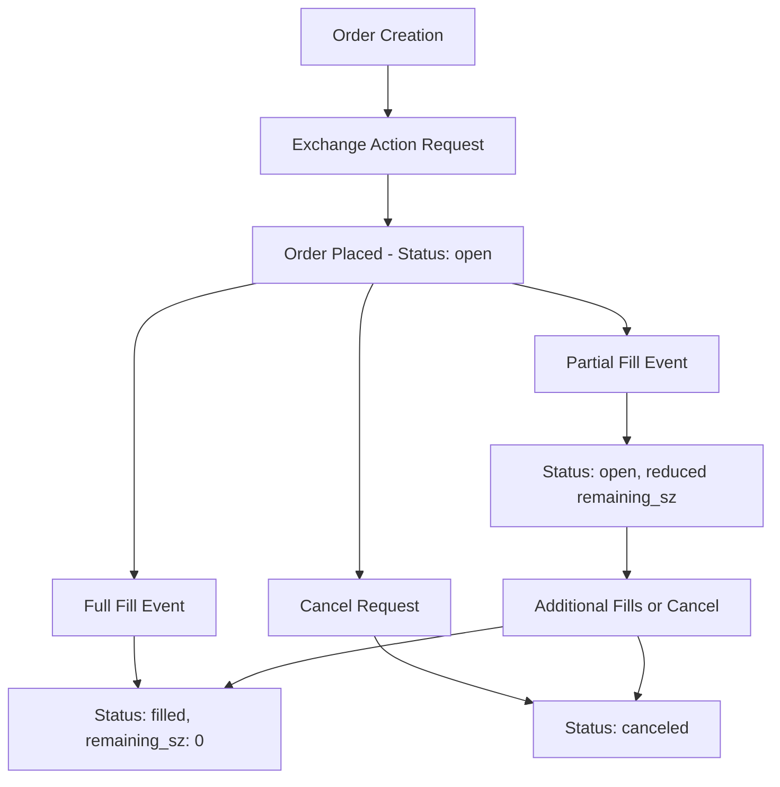
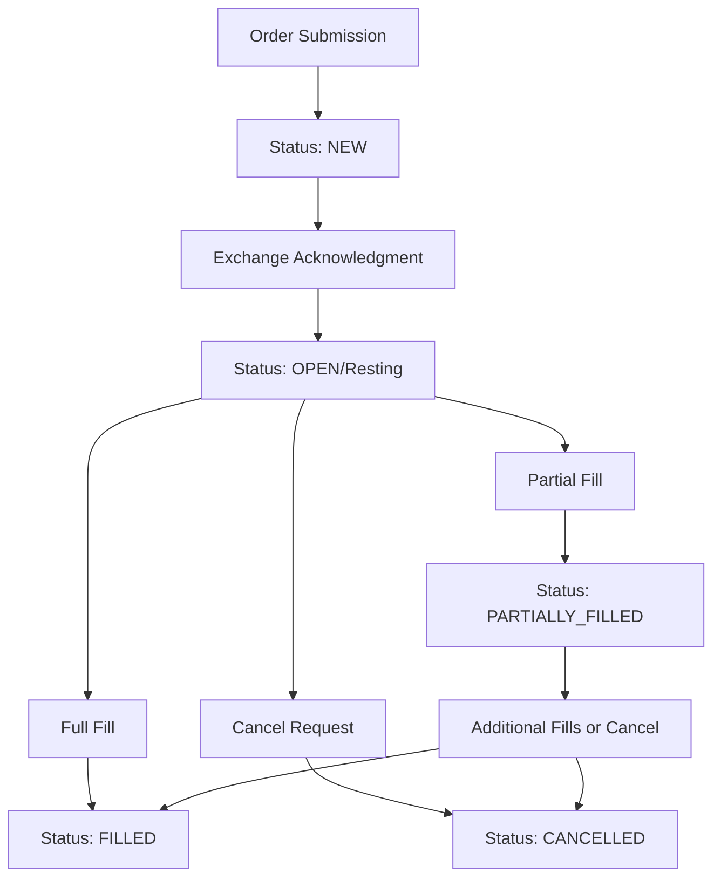
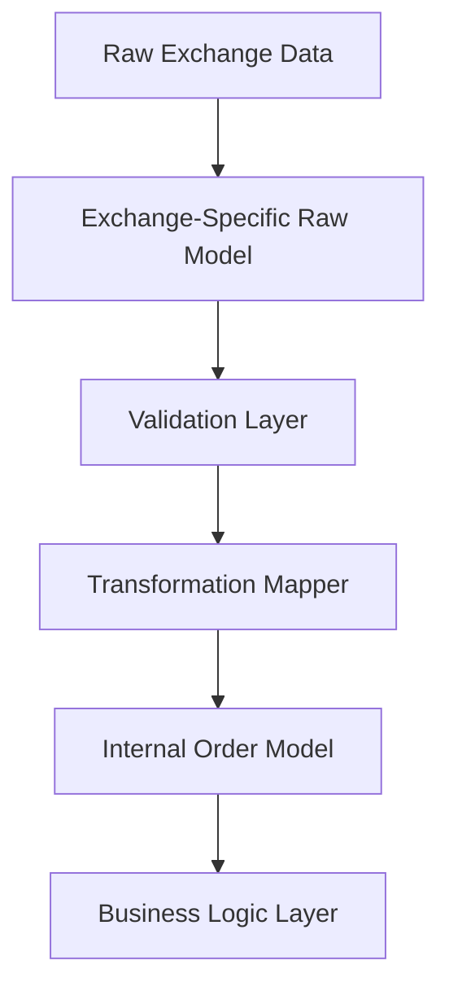
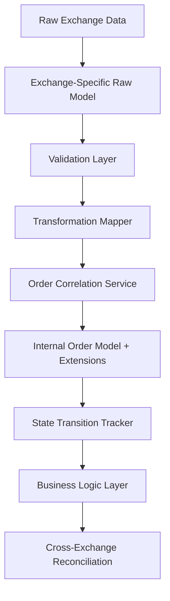
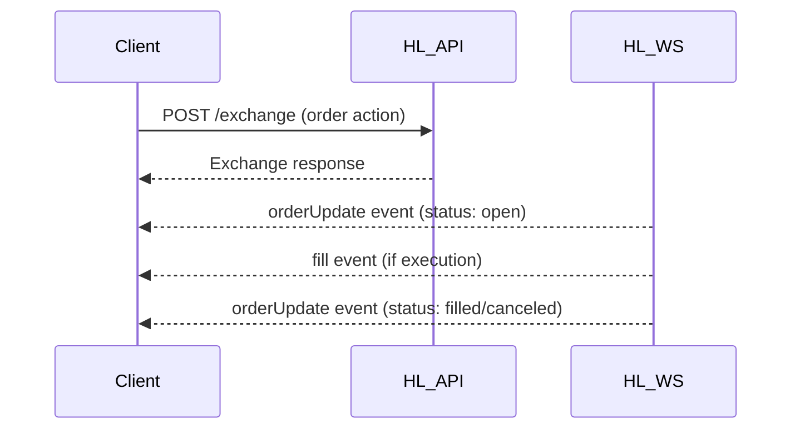
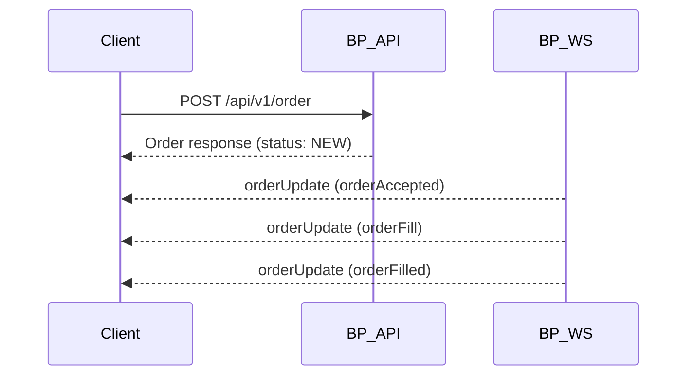

# Comprehensive Order Implementation Analysis: Hyperliquid vs Backpack

## Executive Summary

This comprehensive analysis examines order management implementations across Hyperliquid and Backpack exchanges, building upon the ticker analysis patterns. The research reveals both architectural consistency and critical differences in order handling, WebSocket patterns, and lifecycle management.

## 1. Hyperliquid Order Implementation

### 1.1 Order Endpoints & Architecture

**REST Endpoints:**
- **Order Placement:** `/exchange` (POST) - Exchange actions with order payloads
- **Order Cancellation:** `/exchange` (POST) - Cancel actions by order ID or client ID
- **Order Status:** `/info` (POST) - Query individual order status
- **Open Orders:** `/info` (POST) - Query all open orders for user
- **Order History:** `/info` (POST) - Historical order queries

**WebSocket Channels:**
- **User Channel:** Real-time order updates, fills, position changes
- **Order Book:** L2 book updates (separate from individual order updates)

### 1.2 Order Data Structure

**HyperliquidRawOrder Model:**
```python
class HyperliquidRawOrder(BaseModel):
    oid: RawNonNegativeInt                     # Order ID
    cloid: RawOptionalNonEmptyString64HL       # Client Order ID
    asset: RawAssetString64HL                  # Asset symbol
    side: RawSideStr                           # "B" or "A" 
    limit_px: RawFiniteDecimalStr              # Limit price
    sz: RawNonNegativeFiniteDecimalStr         # Size
    timestamp: RawTimestampMsInt               # Creation timestamp
    order_type: dict[str, object]              # Complex nested structure
    reduce_only: RawStrictBool                 # Reduce-only flag
    remaining_sz: RawNonNegativeFiniteDecimalStr # Remaining size
    status: RawOrderStatusHL                   # Order status
    status_timestamp: RawTimestampMsInt        # Last update timestamp
```

**Order Type Structure:**
- **Nested Design:** `{"limit": {"tif": "Gtc"}}` or `{"market": {}}`
- **Trigger Support:** Conditional orders via `trigger` field
- **Complex Mapping:** Requires recursive validation

### 1.3 Order Lifecycle Management

**Order States:**
- **"open"** → `OrderStatus.OPEN`
- **"filled"** → `OrderStatus.FILLED` 
- **"canceled"** → `OrderStatus.CANCELED`
- **"rejected"** → `OrderStatus.REJECTED`

**Lifecycle Flow:**


### 1.4 Real-time Order Data

**WebSocket Implementation:**
- **User Stream:** `HyperliquidRawWsOrderUpdate` events
- **Fill Events:** `HyperliquidRawWsFillEvent` for executions
- **Real-time Nature:** Live order status and fill notifications
- **Event Structure:** 
  ```python
  {
    "eventType": "orderUpdate",
    "data": { /* order update payload */ }
  }
  ```

## 2. Backpack Order Implementation

### 2.1 Order Endpoints & Architecture

**REST Endpoints:**
- **Order Placement:** `/api/v1/order` (POST) - Direct order execution
- **Order Cancellation:** `/api/v1/order` (DELETE) - Cancel by ID or client ID
- **Cancel All Orders:** `/api/v1/orders` (DELETE) - Bulk cancellation
- **Open Orders:** `/api/v1/orders` (GET) - Query open orders
- **Order History:** `/api/v1/order/history` (GET) - Historical orders

**WebSocket Channels:**
- **orderUpdate Stream:** Real-time order state changes
- **Order Book Stream:** Separate depth updates

### 2.2 Order Data Structure

**BackpackRawOrder Model:**
```python
class BackpackRawOrder(BaseModel):
    clientId: RawBpOptionalNonEmptyStringMax64     # Client Order ID
    id: RawBpNonEmptyStringMax64                   # Exchange Order ID
    relatedOrderId: RawBpOptionalNonEmptyStringMax64 # Related order
    symbol: RawBpNonEmptyStringMax64               # Trading symbol
    side: RawBpExtendedOrderSideString             # "buy"/"sell"/"Bid"/"Ask"
    orderType: RawBpOrderTypeString                # "LIMIT"/"MARKET"
    status: RawBpOrderStatusString                 # Order status
    quantity: RawBpParsableFiniteDecimalString     # Requested quantity
    executedQuantity: RawBpOptionalParsableFiniteDecimalString
    executedQuoteQuantity: RawBpOptionalParsableFiniteDecimalString
    price: RawBpOptionalParsableFiniteDecimalString
    triggerPrice: RawBpOptionalParsableFiniteDecimalString
    avgFillPrice: RawBpOptionalParsableFiniteDecimalString
    triggerBy: RawBpOptionalNonEmptyStringMax32    # Price reference
    timeInForce: RawBpOptionalNonEmptyStringMax32
    reduceOnly: RawBpOptionalStrictBool
    postOnly: RawBpOptionalStrictBool
    selfTradePrevention: RawBpOptionalNonEmptyStringMax32
    createdAt: RawBpFlexibleTimestamp
    updatedAt: RawBpOptionalFlexibleTimestamp
    triggeredAt: RawBpOptionalFlexibleTimestamp
    expiryReason: RawBpOptionalNonEmptyStringMax64
    origin: RawBpOptionalNonEmptyStringMax64
```

**Alias Support:**
- **Extensive Aliasing:** REST vs WebSocket field name differences
- **Flexible Mapping:** Single model handles multiple formats
- **Backward Compatibility:** Supports legacy field names

### 2.3 Order Lifecycle Management

**Order States:**
- **"NEW"** → `OrderStatus.NEW`
- **"FILLED"** → `OrderStatus.FILLED`
- **"CANCELLED"** → `OrderStatus.CANCELED`
- **"REJECTED"** → `OrderStatus.REJECTED`
- **"PARTIALLY_FILLED"** → `OrderStatus.PARTIALLY_FILLED`

**Lifecycle Flow:**


### 2.4 Real-time Order Data

**WebSocket Implementation:**
- **orderUpdate Channel:** `BackpackRawOrderUpdate` events
- **Event Types:** orderAccepted, orderFill, orderCancelled, etc.
- **Real-time Nature:** Live order lifecycle notifications
- **Update Structure:**
  ```python
  {
    "e": "orderAccepted",
    "E": timestamp,
    "s": "BTC_USDC",
    # ... order details
  }
  ```

## 3. Detailed Comparison Analysis

### 3.1 Order Model Structure Comparison

| Aspect | Hyperliquid | Backpack |
|--------|-------------|----------|
| **Order ID Type** | Integer (`oid`) | String (`id`) |
| **Client ID** | Optional string (`cloid`) | Optional string (`clientId`) |
| **Side Format** | "B"/"A" | "buy"/"sell"/"Bid"/"Ask" |
| **Status Format** | lowercase strings | UPPERCASE strings |
| **Price Fields** | `limit_px` | `price` |
| **Size Fields** | `sz`, `remaining_sz` | `quantity`, `executedQuantity` |
| **Timestamp Fields** | `timestamp`, `status_timestamp` | `createdAt`, `updatedAt`, `triggeredAt` |
| **Order Type** | Nested dict structure | Simple string |
| **Aliases** | None (consistent naming) | Extensive (REST vs WS) |

### 3.2 API Endpoint Patterns

| Operation | Hyperliquid | Backpack |
|-----------|-------------|----------|
| **Place Order** | `/exchange` POST + action array | `/api/v1/order` POST |
| **Cancel Order** | `/exchange` POST + cancel action | `/api/v1/order` DELETE |
| **Order Status** | `/info` POST + orderStatus type | No dedicated endpoint |
| **Open Orders** | `/info` POST + openOrders type | `/api/v1/orders` GET |
| **Order History** | `/info` POST + queryOrderHistory | `/api/v1/order/history` GET |
| **Cancel All** | Not implemented | `/api/v1/orders` DELETE |

### 3.3 WebSocket vs REST Patterns

| Exchange | Real-time Orders | Order Book | Pattern |
|----------|------------------|------------|---------|
| **Hyperliquid** | User channel (`orderUpdate`) | L2Book channel | Separated streams |
| **Backpack** | `orderUpdate` stream | Depth stream | Separated streams |

**Real-time Capabilities:**
- **Both exchanges** provide real-time order updates
- **Hyperliquid:** Event-driven with structured payloads
- **Backpack:** Direct order state updates with event types

### 3.4 Order State Management Differences

**State Granularity:**
- **Hyperliquid:** Simpler state model (open/filled/canceled)
- **Backpack:** More granular states (NEW, PARTIALLY_FILLED, etc.)

**Fill Tracking:**
- **Hyperliquid:** `remaining_sz` field for partial fills
- **Backpack:** Separate `executedQuantity` and `executedQuoteQuantity`

**Update Mechanisms:**
- **Hyperliquid:** Status + timestamp updates
- **Backpack:** Multiple timestamp fields (created, updated, triggered)

## 4. Root Cause Analysis

### 4.1 Architectural Consistency Issues

**Similar to Ticker Analysis:**
1. **Field Naming Inconsistency:** Different conventions across exchanges
2. **Data Type Variations:** String vs integer IDs, nested vs flat structures
3. **Timestamp Handling:** Different field names and formats
4. **Status Mapping Complexity:** Varying granularity and conventions

**Order-Specific Issues:**
1. **Order Type Complexity:** Hyperliquid's nested structure vs Backpack's flat strings
2. **Alias Proliferation:** Backpack's REST/WS field name differences
3. **Lifecycle Granularity:** Different state models requiring careful mapping
4. **Client ID Handling:** Optional vs required, different validation rules

### 4.2 Transformation Pipeline Stress Points

**Data Loss Risks:**
- **Field Availability:** Not all fields map cleanly between exchanges
- **Precision Loss:** Different decimal handling approaches
- **Status Ambiguity:** Multiple source states mapping to single internal state

**Validation Complexity:**
- **Hyperliquid:** Complex nested validation for order types
- **Backpack:** Extensive alias resolution logic
- **Both:** Multiple timestamp field coordination

## 5. Strategic Recommendations

### 5.1 Order Management Consistency

**1. Unified Order Model Enhancement:**
```python
# Enhanced internal Order model
class Order(BaseModel):
    # Core fields remain the same
    
    # Enhanced extension slots
    hl_details: HyperliquidOrderDetails | None = Field(default=None)
    bp_details: BackpackOrderDetails | None = Field(default=None)
    
    # Standardized lifecycle tracking
    state_transitions: list[OrderStateTransition] = Field(default_factory=list)
    
    # Cross-exchange order correlation
    correlation_id: str | None = Field(default=None)
```

**2. State Transition Tracking:**
```python
class OrderStateTransition(BaseModel):
    """Track order state changes across exchanges."""
    timestamp: datetime
    from_status: OrderStatus | None
    to_status: OrderStatus
    trigger_event: str  # "fill", "cancel", "reject", etc.
    exchange_data: dict[str, Any] | None = None
```

### 5.2 Error Handling and Retry Strategies

**1. Order Placement Resilience:**
```python
class OrderPlacementStrategy:
    """Handle order placement failures and retries."""
    
    async def place_with_fallback(
        self, 
        primary_exchange: str,
        fallback_exchange: str,
        order_args: PlaceOrderArgs
    ) -> OrderPlacementResult
```

**2. Status Reconciliation:**
```python
class OrderStatusReconciler:
    """Reconcile order status across exchanges."""
    
    async def reconcile_order_status(
        self, 
        order_id: str,
        expected_status: OrderStatus
    ) -> ReconciliationResult
```

### 5.3 Architecture Patterns Analysis

**Current Transformation Pattern:**


**Enhanced Pattern with Order Correlation:**


## 6. Order Lifecycle Comparison

### 6.1 Order Creation → Placement → Execution → Completion

**Hyperliquid Flow:**


**Backpack Flow:**


### 6.2 Partial Fill Handling

**Key Differences:**
- **Hyperliquid:** Uses `remaining_sz` field, simple status model
- **Backpack:** Uses `executedQuantity` + `PARTIALLY_FILLED` status
- **Both:** Support incremental fill notifications via WebSocket

### 6.3 Order Modification Capabilities

| Feature | Hyperliquid | Backpack |
|---------|-------------|----------|
| **Modify Price** | Via modify action | Not supported |
| **Modify Quantity** | Via modify action | Not supported |
| **Cancel & Replace** | Manual implementation | Manual implementation |
| **Partial Cancellation** | Not supported | Not supported |

## 7. Missing Field Handling

### 7.1 Hyperliquid → Internal Mapping Gaps

**Missing Internal Fields:**
- `quote_quantity_requested` (not provided by Hyperliquid)
- `self_trade_prevention` (not applicable)
- `expiry_reason` (not provided)
- `origin` (not provided)

**Extension Slot Usage:**
```python
hl_details: HyperliquidOrderDetails | None = Field(default=None)

class HyperliquidOrderDetails(BaseModel):
    remaining_sz: Decimal | None = None
    asset_index: int | None = None
    trigger_info: dict[str, Any] | None = None
```

### 7.2 Backpack → Internal Mapping Gaps

**Missing Internal Fields:**
- Asset-specific indexing (Backpack uses string symbols)
- Nested order type information (flattened in Backpack)

**Extension Slot Usage:**
```python
bp_details: BackpackOrderDetails | None = Field(default=None)

class BackpackOrderDetails(BaseModel):
    executed_quote_quantity: Decimal | None = None
    self_trade_prevention: SelfTradePrevention | None = None
    expiry_reason: OrderExpiryReason | None = None
    origin: OrderUpdateOrigin | None = None
    # Additional trigger fields...
```

## 8. Critical Findings & Implications

### 8.1 Consistency Assessment

**Strong Points:**
1. **Both exchanges** provide comprehensive order management APIs
2. **Real-time capabilities** are well-implemented on both platforms
3. **Core order lifecycle** concepts are similar across exchanges
4. **Extension slot pattern** successfully accommodates differences

**Weak Points:**
1. **Field naming inconsistencies** create mapping complexity
2. **Order type representations** require complex transformation logic
3. **Status granularity differences** may cause information loss
4. **Client ID handling** varies significantly between exchanges

### 8.2 Risk Mitigation Strategies

**1. Data Integrity Risks:**
- Implement comprehensive order status reconciliation
- Add validation checkpoints for critical state transitions
- Maintain audit trails for all order modifications

**2. Performance Risks:**
- Cache frequently accessed order data
- Optimize transformation pipelines for high-frequency updates
- Implement circuit breakers for order placement failures

**3. Operational Risks:**
- Monitor order lifecycle completeness across exchanges
- Alert on status mapping failures or inconsistencies
- Implement fallback mechanisms for critical operations

## 9. Conclusion

The order implementation analysis reveals a more complex landscape than the ticker analysis, with significant architectural challenges around state management, real-time updates, and lifecycle tracking. While both exchanges provide robust order management capabilities, the differences in data structures, lifecycle granularity, and field availability require careful design consideration.

The current "Core + Typed Extension Slots" pattern proves essential for accommodating exchange-specific features while maintaining a consistent internal interface. However, additional work is needed around state transition tracking, cross-exchange correlation, and comprehensive error handling to ensure robust order management in a multi-exchange environment.

The analysis recommends implementing enhanced order correlation services, state transition tracking, and comprehensive reconciliation mechanisms to address the identified architectural challenges and ensure reliable order management across both exchanges.