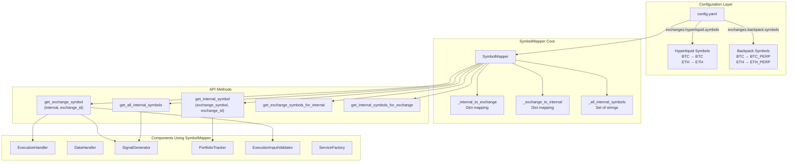
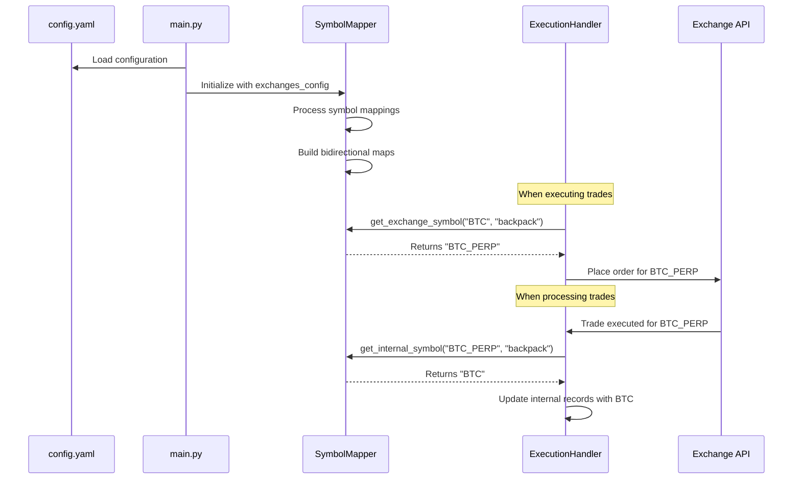
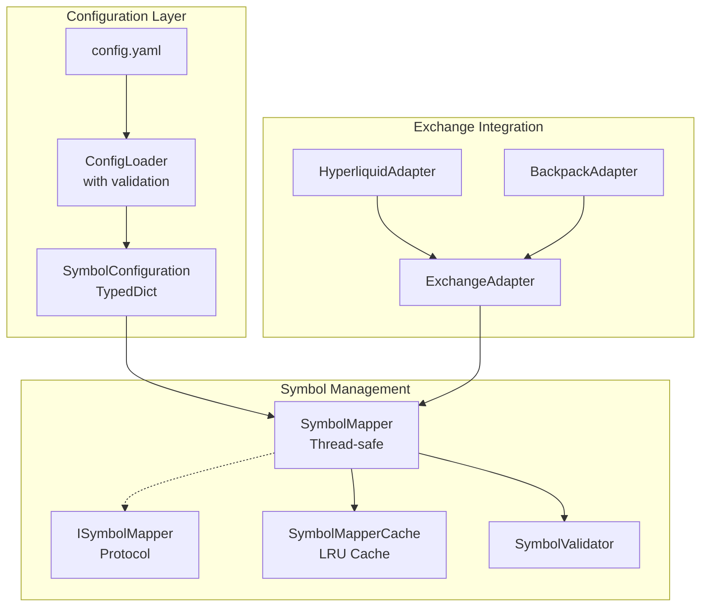

# SymbolMapper Analysis and Refactoring Report

## Executive Summary

This document provides a comprehensive analysis of the `SymbolMapper` class in the CyberDeltaEngine codebase. The SymbolMapper is a critical component responsible for translating between internal trading symbols and exchange-specific symbol formats across Hyperliquid and Backpack exchanges.

## 1. Current Architecture Overview

### 1.1 Symbol Mapping Flow



### 1.2 Symbol Translation Sequence



## 2. Current Usage Analysis

### 2.1 Component Dependencies

| Component | Usage | Critical? |
|-----------|-------|-----------|
| ExecutionHandler | Converts internal symbols to exchange-specific for order placement | ✅ Yes |
| DataHandler | Holds reference but minimal direct usage | ❌ No |
| SignalGenerator | Gets all internal symbols, converts for funding rate checks | ✅ Yes |
| PortfolioTracker | Converts exchange symbols back to internal (with bug) | ✅ Yes |
| ExecutionInputValidator | Validates symbols exist for both exchanges | ✅ Yes |
| ServiceFactory | Stores reference for dependency injection | ✅ Yes |

### 2.2 Configuration Structure

**Production Config (config.yaml)**:
```yaml
exchanges:
  hyperliquid:
    symbols:
      BTC: "BTC"
      ETH: "ETH"
      SOL: "SOL"
      # ... more symbols
  backpack:
    symbols:
      BTC: "BTC_PERP"
      ETH: "ETH_PERP"
      SOL: "SOL_PERP"
      # ... more symbols
```

## 3. Critical Issues Found

### 3.1 🚨 Critical Bug: Wrong Parameter Order

**Location**: `cyberdelta/core/portfolio_tracker.py:878`

```python
# INCORRECT (current code):
self.symbol_mapper.get_internal_symbol(exchange_id, trade.symbol)

# CORRECT:
self.symbol_mapper.get_internal_symbol(trade.symbol, exchange_id)
```

**Impact**: This will cause incorrect symbol lookups, potentially leading to:
- Wrong position tracking
- Incorrect PnL calculations
- Failed trade reconciliation

### 3.2 Type Safety Issues

1. **Excessive use of `Any` type**:
   ```python
   def __init__(self, exchanges_config: dict[str, Any]) -> None:
   ```

2. **Multiple `cast()` operations**:
   ```python
   exchange_data: dict[str, Any] = cast("dict[str, Any]", exchange_data_any)
   ```

3. **No runtime validation for None values**

### 3.3 Thread Safety Concerns

- No locking mechanism during initialization
- Mutable internal state without synchronization
- Potential race conditions if accessed during initialization

### 3.4 Inconsistent Error Handling

- Some errors raise exceptions:
  ```python
  raise InvalidConfigurationError(expected_type="a dictionary", actual_type=type(exchanges_config))
  ```

- Others only log warnings:
  ```python
  logger.warning("skipping_exchange_missing_symbols", ...)
  ```

### 3.5 Silent Data Overwriting

Duplicate mappings only log warnings but continue:
```python
if exchange_id in self._internal_to_exchange[internal_symbol]:
    logger.warning("duplicate_internal_symbol", ...)
# Continues to overwrite without error
```

## 4. Improvement Recommendations

### 4.1 Immediate Fixes (High Priority)

1. **Fix parameter order bug in portfolio_tracker.py**
2. **Add None value validation**:
   ```python
   def get_exchange_symbol(self, internal_symbol: str, exchange_id: str) -> str | None:
       if not internal_symbol or not exchange_id:
           return None
       return self._internal_to_exchange.get(internal_symbol, {}).get(exchange_id)
   ```

3. **Make configuration errors fail fast**:
   - Convert all warnings to exceptions for invalid config
   - Validate all symbols at initialization time

### 4.2 Architecture Improvements

1. **Introduce proper type definitions**:
   ```python
   from typing import TypedDict

   class ExchangeConfig(TypedDict):
       symbols: dict[str, str]
       # other fields...
   ```

2. **Add thread safety**:
   ```python
   from threading import RLock

   class SymbolMapper:
       def __init__(self):
           self._lock = RLock()
   ```

3. **Create immutable configuration**:
   - Load all mappings at init
   - Prevent modifications after initialization
   - Use frozen dataclasses for internal storage

### 4.3 Enhanced Features

1. **Add validation methods**:
   ```python
   def is_symbol_supported(self, internal_symbol: str, exchange_id: str) -> bool:
       """Check if a symbol is supported on an exchange."""

   def validate_symbol_pair(self, internal_symbol: str,
                           long_exchange: str, short_exchange: str) -> tuple[bool, str]:
       """Validate symbol is available on both exchanges."""
   ```

2. **Add bulk operations**:
   ```python
   def get_all_exchange_symbols(self, internal_symbols: list[str],
                               exchange_id: str) -> dict[str, str | None]:
       """Get multiple symbol mappings at once."""
   ```

3. **Add reverse lookup capabilities**:
   ```python
   def get_exchanges_supporting_symbol(self, internal_symbol: str) -> list[str]:
       """Find all exchanges that support a given internal symbol."""
   ```

### 4.4 Testing Improvements

1. **Add edge case tests**:
   - None/empty string handling
   - Invalid exchange IDs
   - Circular mappings
   - Thread safety tests

2. **Add integration tests**:
   - Full workflow from config to execution
   - Symbol mapping with real exchange responses

## 5. Proposed Refactored Architecture



## 6. Migration Path

### Phase 1: Critical Fixes (Immediate)
- Fix portfolio_tracker.py parameter order bug
- Add input validation for None values
- Add comprehensive test coverage

### Phase 2: Type Safety (Week 1)
- Introduce TypedDict for configuration
- Remove all `Any` types and `cast()` usage
- Add mypy strict checking

### Phase 3: Thread Safety (Week 2)
- Add proper locking mechanisms
- Make internal state immutable after init
- Add concurrent access tests

### Phase 4: Enhanced Features (Week 3-4)
- Add validation methods
- Add bulk operations
- Add caching layer
- Implement exchange adapters

## 7. Conclusion

The SymbolMapper is a critical component with a simple but important responsibility. While the current implementation works for basic use cases, it has several issues that could lead to production failures:

1. **Critical bug** in portfolio_tracker.py needs immediate fixing
2. **Type safety** issues reduce confidence in correctness
3. **Thread safety** concerns could cause issues under load
4. **Limited features** make it harder to use correctly

The proposed improvements would make the system more robust, easier to test, and safer for production use while maintaining backward compatibility during migration.
