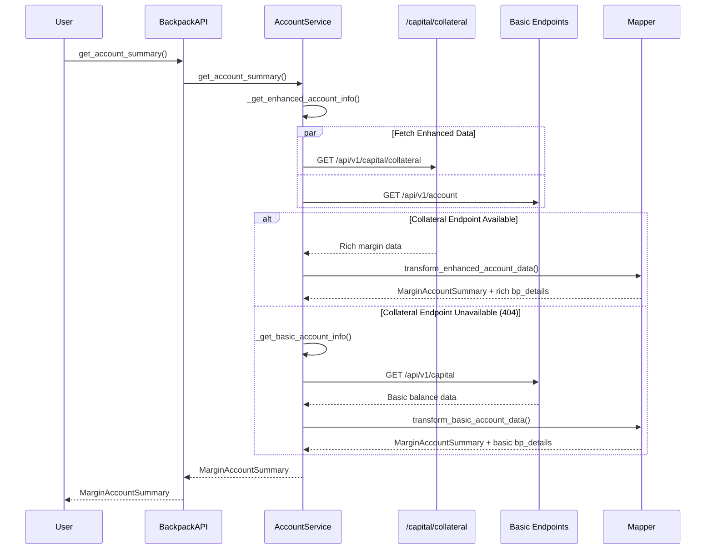
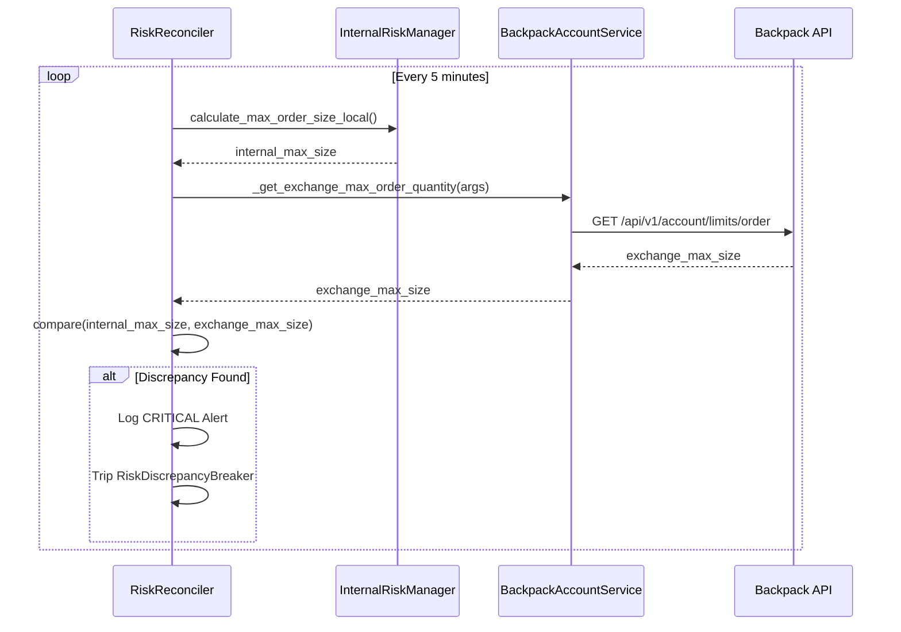

### **Revised Plan 1: Backpack Collateral and Margin (Public API Enhancement)**

This is the primary plan for enhancing Backpack's capabilities. The revisions emphasize its role as the authoritative source for our client-side calculations.

````markdown
# Backpack Collateral and Margin Implementation Plan - FINAL REVISED (Full)

## 1. Executive Summary

This document outlines an **architecturally compliant** implementation plan for enhancing the Backpack Exchange integration with comprehensive collateral and margin functionality. The plan strictly adheres to CyberDeltaEngine's exchange-agnostic architecture by enhancing the existing `get_account_summary()` method internally without adding new public methods or violating architectural boundaries.

**[REVISED]** This enhancement is now **the primary and authoritative source of account state** for Backpack. The rich data from the `/api/v1/capital/collateral` endpoint will be used not only for providing a detailed `MarginAccountSummary` but also as the foundation for all **client-side risk calculations**, including maximum order, borrow, and withdrawal quantities.

## 2. Architecture Compliance Principles

### 2.1. Core Principle: Exchange Agnosticism (CORE-ARCH-PRINCIPLE)

The implementation MUST maintain complete exchange agnosticism at the public API layer:

1.  **NO new public methods** on `BackpackAPI` that are exchange-specific.
2.  **NO modifications** to the base `ExchangeAPI` interface.
3.  **NO changes** to core domain models (only enrichment of extension slots).
4.  **ALL enhancements** must be internal to the service layer, surfacing through the existing `get_account_summary` method.

### 2.2. Key Architectural Rules Applied

-   **RULE-ARCH-MODEL-DESIGN-V2**: Strict Raw/Internal model separation.
-   **Core + Typed Extension Slots**: Exchange-specific data via `bp_details` in `MarginAccountSummary`.
-   **Service Encapsulation**: All complex multi-endpoint logic is hidden within `BackpackAccountService`.
-   **Progressive Enhancement**: Graceful fallback to the basic implementation if the `/capital/collateral` endpoint is unavailable, ensuring no breaking changes.

## 3. Implementation Plan

### 3.1. Phase 1: Raw Models (Exchange Boundary) - OpenAPI Compliant

**File**: `cyberdelta/apis/backpack/models/bp_raw_collateral.py`

**Action**: Create a new file to define the Pydantic models that strictly validate the JSON response from the `/api/v1/capital/collateral` endpoint, based on the OpenAPI specification.

```python
# cyberdelta/apis/backpack/models/bp_raw_collateral.py

from __future__ import annotations
from pydantic import BaseModel, ConfigDict, Field
from .bp_common_raw_types import RawBpNonEmptyStringMax64, RawBpStringToFiniteDecimal, RawBpOptionalStringToFiniteDecimal

class BackpackRawCollateralAsset(BaseModel):
    """Maps to the Collateral schema in the OpenAPI spec."""
    symbol: RawBpNonEmptyStringMax64 = Field(..., alias="symbol")
    asset_mark_price: RawBpStringToFiniteDecimal = Field(..., alias="assetMarkPrice")
    total_quantity: RawBpStringToFiniteDecimal = Field(..., alias="totalQuantity")
    balance_notional: RawBpStringToFiniteDecimal = Field(..., alias="balanceNotional")
    collateral_weight: RawBpStringToFiniteDecimal = Field(..., alias="collateralWeight")
    collateral_value: RawBpStringToFiniteDecimal = Field(..., alias="collateralValue")
    open_order_quantity: RawBpStringToFiniteDecimal = Field(..., alias="openOrderQuantity")
    lend_quantity: RawBpStringToFiniteDecimal = Field(..., alias="lendQuantity")
    available_quantity: RawBpStringToFiniteDecimal = Field(..., alias="availableQuantity")
    model_config = ConfigDict(extra="forbid", frozen=True, populate_by_name=True)

class BackpackRawCollateralResponse(BaseModel):
    """Maps to the MarginAccountSummary schema from the OpenAPI spec."""
    net_equity: RawBpStringToFiniteDecimal = Field(..., alias="netEquity")
    net_equity_available: RawBpStringToFiniteDecimal = Field(..., alias="netEquityAvailable")
    net_equity_locked: RawBpStringToFiniteDecimal = Field(..., alias="netEquityLocked")
    assets_value: RawBpStringToFiniteDecimal = Field(..., alias="assetsValue")
    liabilities_value: RawBpStringToFiniteDecimal = Field(..., alias="liabilitiesValue")
    imf: RawBpStringToFiniteDecimal = Field(..., alias="imf")
    mmf: RawBpStringToFiniteDecimal = Field(..., alias="mmf")
    margin_fraction: RawBpOptionalStringToFiniteDecimal = Field(None, alias="marginFraction")
    borrow_liability: RawBpStringToFiniteDecimal = Field(..., alias="borrowLiability")
    pnl_unrealized: RawBpStringToFiniteDecimal = Field(..., alias="pnlUnrealized")
    unsettled_equity: RawBpStringToFiniteDecimal = Field(..., alias="unsettledEquity")
    net_exposure_futures: RawBpStringToFiniteDecimal = Field(..., alias="netExposureFutures")
    collateral: list[BackpackRawCollateralAsset] = Field(..., alias="collateral")
    model_config = ConfigDict(extra="forbid", frozen=True, populate_by_name=True)

class BackpackRawCollateralQueryParams(BaseModel):
    """Query parameters for the collateral endpoint."""
    subaccount_id: int | None = Field(None, alias="subaccountId", ge=0, le=65535)
    model_config = ConfigDict(extra="forbid", populate_by_name=True)
```

### 3.2. Phase 2: Enhance Internal Domain Model

**File**: `cyberdelta/core/models/margin_account.py`

**Action**: Add new fields to the `BackpackMarginDetails` model to store the enriched data from the collateral endpoint.

```python
# In cyberdelta/core/models/margin_account.py
class BackpackMarginDetails(BaseModel):
    assets_value: Decimal | None = Field(default=None, ge=Decimal("0"))
    liabilities_value: Decimal | None = Field(default=None, ge=Decimal("0"))
    locked_equity: Decimal | None = Field(default=None, ge=Decimal("0"))
    borrow_liability: Decimal | None = Field(default=None, ge=Decimal("0"))
    unsettled_equity: Decimal | None = Field(default=None)
    margin_fraction: Decimal | None = Field(default=None, ge=Decimal("0"))
    net_exposure_futures: Decimal | None = Field(default=None)
    imf_raw: str | None = Field(default=None)
    mmf_raw: str | None = Field(default=None)
    subaccount_id: int | None = Field(default=None, ge=0, le=65535)
    _source_endpoint: str | None = Field(default=None, exclude=True)
    _collateral_assets: list[dict[str, Any]] | None = Field(default=None, exclude=True)
    model_config = ConfigDict(extra="forbid", frozen=True, validate_assignment=True)
    # ... pydantic field validators for new fields ...
```

### 3.3. Phase 3: Enhance Component Layers

**File**: `cyberdelta/apis/backpack/bp_request_builder.py`

**Action**: Add a method to build the query parameters for the collateral endpoint.

```python
# In BackpackRequestBuilder
@staticmethod
def build_collateral_query_params(subaccount_id: int | None) -> BackpackRawCollateralQueryParams:
    """Builds query parameters for the /api/v1/capital/collateral endpoint."""
    return BackpackRawCollateralQueryParams(subaccount_id=subaccount_id)
```

**File**: `cyberdelta/apis/backpack/bp_response_handler.py`

**Action**: Add a method to validate the collateral endpoint's response.

```python
# In BackpackResponseHandler
@staticmethod
def handle_collateral_response(raw_data: ParsedJsonResponse) -> BackpackRawCollateralResponse:
    """Handles collateral endpoint response validation."""
    try:
        return BackpackRawCollateralResponse.model_validate(raw_data)
    except ValidationError as e:
        logger.error(f"Collateral response validation failed: {e}. Raw data keys: {list(raw_data.keys()) if isinstance(raw_data, dict) else 'not dict'}")
        raise APIError(
            message="Invalid collateral response format from exchange",
            code=APIErrorCode.INVALID_RESPONSE.value,
            original_exception=e,
            exchange_message=str(raw_data)[:500]
        ) from e
```

### 3.4. Phase 4: Enhance Service & Mapper Layers

**File**: `cyberdelta/apis/backpack/mappers/bp_account_data_mapper.py`

**Action**: Implement the transformation logic for the enhanced data.

1.  **Rename** existing `transform_raw_account_summary_to_internal` to `transform_basic_account_data_to_margin_summary`.
2.  **Add** new method `transform_enhanced_account_data_to_margin_summary` that takes `raw_collateral: BackpackRawCollateralResponse`, `raw_settings: BackpackRawAccountSummary`, and `raw_positions: list[BackpackRawPosition]` to create a `MarginAccountSummary` with a richly populated `bp_details` slot. This method will include margin calculation helpers `_calculate_enhanced_initial_margin` and `_calculate_enhanced_maintenance_margin`.

**File**: `cyberdelta/apis/backpack/services/bp_account_service.py`

**Action**: Refactor the service to use the new collateral endpoint with a fallback.

1.  **Refactor** `get_account_info` to `get_account_summary(self, subaccount_id: int | None = None) -> MarginAccountSummary`.
2.  **Implement Fallback Logic**: The `get_account_summary` method will now orchestrate the flow:
    ```python
    try:
        # Attempt to get data from the enhanced endpoint first.
        return await self._get_enhanced_account_info(subaccount_id)
    except APIError as e:
        # If collateral endpoint is not found, gracefully fall back.
        if e.http_status == 404:
            logger.warning("Collateral endpoint not found (404), falling back to basic account info.")
            return await self._get_basic_account_info() # Basic info does not support subaccount_id
        raise
    ```
3.  **Create Private Helpers**:
    *   `_get_enhanced_account_info`: Uses `asyncio.gather` to fetch from `/capital/collateral` and other necessary endpoints, then calls the enhanced mapper.
    *   `_fetch_collateral_data`: A dedicated method to call `GET /api/v1/capital/collateral`.
    *   `_get_basic_account_info`: The original account info logic, now serving as the fallback.

### 3.5. Phase 5: Update Public API Interface

**File**: `cyberdelta/apis/backpack/bp_api.py`

**Action**: Update the public `get_account_summary` method to pass the optional `subaccount_id`. The signature must remain consistent with the base `ExchangeAPI` where possible.

```python
# In BackpackAPI
async def get_account_summary(self, subaccount_id: int | None = None) -> MarginAccountSummary:
    """
    Gets comprehensive account margin information. Subaccount ID is a 
    Backpack-specific enhancement not present in the base ExchangeAPI interface.
    """
    return await self.account_service.get_account_summary(subaccount_id=subaccount_id)
```

## 4. Data Flow Architecture

### Enhanced Account Summary Flow



## 5. Conclusion

This plan delivers comprehensive Backpack margin functionality by enriching the existing, exchange-agnostic `get_account_summary` method. It fully aligns with our architecture, ensures backward compatibility through a graceful fallback, and provides the rich data necessary for our primary client-side risk calculations and future reconciliation checks.
````

---
### **Revised Plan 2: Backpack Account Limits (Internal Verification Service)**

This plan is now reframed to implement the limits endpoints as a private, internal capability for validation, not as public API methods. The changes from the original are clearly marked.

````markdown
# Backpack Account Limits Implementation Plan (Internal Verification Service) - FINAL REVISED (Full)

## 1. Executive Summary

**[REVISED]** This document outlines the implementation plan for the three Backpack account limits endpoints (`/api/v1/account/limits/*`). This functionality will be implemented as a **private, internal-only verification and reconciliation service**. Its sole purpose is to serve as an exchange-authoritative "source of truth" for periodically validating the engine's internal, client-side risk calculations. **No new public methods will be added to the `BackpackAPI` or base `ExchangeAPI` interface**, preserving our core architectural principles of exchange agnosticism and a lean, unified public interface.

## 2. Architecture Compliance Principles

**[REVISED]** This revised plan is **fully compliant** with the CyberDeltaEngine architecture:

-   **✅ Exchange Agnosticism**: The public `ExchangeAPI` interface remains untouched. The application layer has no awareness of these Backpack-specific endpoints.
-   **✅ Service Encapsulation**: The new functionality is implemented as **private `_` prefixed methods** within `BackpackAccountService`, strictly for internal use by a future `RiskReconciler` component.
-   **✅ Separation of Concerns**: Real-time trade sizing is performed client-side for performance, using data from the enhanced `get_account_summary` method. These API calls are for out-of-band validation, not for the trading hot path.
-   **✅ Robustness through Reconciliation**: Provides a vital mechanism to check our internal risk model against the exchange's authoritative calculations, preventing silent failures and model drift.

## 3. Implementation Plan

### 3.1. Phase 1: Raw Models (Exchange Boundary)

**File**: `cyberdelta/apis/backpack/models/bp_raw_limits.py`

**Action**: Create a new file to define the Pydantic models that strictly validate the JSON responses from the `/api/v1/account/limits/*` endpoints.

```python
# cyberdelta/apis/backpack/models/bp_raw_limits.py
from __future__ import annotations
from pydantic import BaseModel, ConfigDict, Field
from .bp_common_raw_types import RawBpNonEmptyStringMax64, RawBpOptionalStrictBool, RawBpStringToFiniteDecimal, RawBpOptionalStringToFiniteDecimal

class BackpackRawMaxBorrowQuantity(BaseModel):
    max_borrow_quantity: RawBpStringToFiniteDecimal = Field(..., alias="maxBorrowQuantity")
    symbol: RawBpNonEmptyStringMax64 = Field(..., alias="symbol")
    model_config = ConfigDict(extra="forbid", frozen=True, populate_by_name=True)

class BackpackRawMaxOrderQuantity(BaseModel):
    auto_borrow: RawBpOptionalStrictBool = Field(None, alias="autoBorrow")
    auto_borrow_repay: RawBpOptionalStrictBool = Field(None, alias="autoBorrowRepay")
    auto_lend_redeem: RawBpOptionalStrictBool = Field(None, alias="autoLendRedeem")
    max_order_quantity: RawBpStringToFiniteDecimal = Field(..., alias="maxOrderQuantity")
    price: RawBpOptionalStringToFiniteDecimal = Field(None, alias="price")
    reduce_only: RawBpOptionalStrictBool = Field(None, alias="reduceOnly")
    side: RawBpNonEmptyStringMax64 = Field(..., alias="side")
    symbol: RawBpNonEmptyStringMax64 = Field(..., alias="symbol")
    model_config = ConfigDict(extra="forbid", frozen=True, populate_by_name=True)

class BackpackRawMaxWithdrawalQuantity(BaseModel):
    auto_borrow: RawBpOptionalStrictBool = Field(None, alias="autoBorrow")
    auto_lend_redeem: RawBpOptionalStrictBool = Field(None, alias="autoLendRedeem")
    max_withdrawal_quantity: RawBpStringToFiniteDecimal = Field(..., alias="maxWithdrawalQuantity")
    symbol: RawBpNonEmptyStringMax64 = Field(..., alias="symbol")
    model_config = ConfigDict(extra="forbid", frozen=True, populate_by_name=True)
```

### 3.2. Phase 2: Request & Service Args Models

**File**: `cyberdelta/apis/backpack/models/bp_raw_query_params.py` (Additions)

**Action**: Add Pydantic models for the query parameters of the limits endpoints.

```python
# In bp_raw_query_params.py
class BackpackRawMaxBorrowQuantityParams(BaseModel):
    symbol: str = Field(..., alias="symbol")
    model_config = ConfigDict(extra="forbid", populate_by_name=True)

class BackpackRawMaxOrderQuantityParams(BaseModel):
    symbol: str = Field(..., alias="symbol")
    side: str = Field(..., alias="side")
    price: str | None = Field(default=None, alias="price")
    reduce_only: bool | None = Field(default=None, alias="reduceOnly")
    auto_borrow: bool | None = Field(default=None, alias="autoBorrow")
    auto_borrow_repay: bool | None = Field(default=None, alias="autoBorrowRepay")
    auto_lend_redeem: bool | None = Field(default=None, alias="autoLendRedeem")
    model_config = ConfigDict(extra="forbid", populate_by_name=True)

class BackpackRawMaxWithdrawalQuantityParams(BaseModel):
    symbol: str = Field(..., alias="symbol")
    auto_borrow: bool | None = Field(default=None, alias="autoBorrow")
    auto_lend_redeem: bool | None = Field(default=None, alias="autoLendRedeem")
    model_config = ConfigDict(extra="forbid", populate_by_name=True)
```

**File**: `cyberdelta/apis/models/service_args_models.py` (Additions)

**Action**: Add Pydantic models for the arguments passed to the new internal service methods.

```python
# In service_args_models.py
from cyberdelta.core.models.enums import OrderSide
from cyberdelta.utils.parsing import validate_str_field

class GetMaxBorrowQuantityArgs(BaseModel):
    symbol: str = Field(..., min_length=1, max_length=64)
    model_config = ConfigDict(extra="forbid", validate_assignment=True)

class GetMaxOrderQuantityArgs(BaseModel):
    symbol: str = Field(..., min_length=1, max_length=64)
    side: OrderSide
    price: Decimal | None = Field(default=None, gt=Decimal("0"))
    reduce_only: bool | None = Field(default=None)
    auto_borrow: bool | None = Field(default=None)
    auto_borrow_repay: bool | None = Field(default=None)
    auto_lend_redeem: bool | None = Field(default=None)
    model_config = ConfigDict(extra="forbid", validate_assignment=True)

class GetMaxWithdrawalQuantityArgs(BaseModel):
    symbol: str = Field(..., min_length=1, max_length=64)
    auto_borrow: bool | None = Field(default=None)
    auto_lend_redeem: bool | None = Field(default=None)
    model_config = ConfigDict(extra="forbid", validate_assignment=True)
```

### 3.3. Phase 3: Enhance Component Layers

**File**: `cyberdelta/apis/backpack/bp_request_builder.py` (Additions)

**Action**: Add methods to build the query parameters for the three limits endpoints.

```python
# In BackpackRequestBuilder
@staticmethod
def build_max_borrow_quantity_params(args: GetMaxBorrowQuantityArgs) -> BackpackRawMaxBorrowQuantityParams: ...
@staticmethod
def build_max_order_quantity_params(args: GetMaxOrderQuantityArgs) -> BackpackRawMaxOrderQuantityParams: ...
@staticmethod
def build_max_withdrawal_quantity_params(args: GetMaxWithdrawalQuantityArgs) -> BackpackRawMaxWithdrawalQuantityParams: ...
```

**File**: `cyberdelta/apis/backpack/bp_response_handler.py` (Additions)

**Action**: Add methods to validate the responses from the three limits endpoints.

```python
# In BackpackResponseHandler
@staticmethod
def handle_max_borrow_quantity_response(raw_data: ParsedJsonResponse) -> BackpackRawMaxBorrowQuantity: ...
@staticmethod
def handle_max_order_quantity_response(raw_data: ParsedJsonResponse) -> BackpackRawMaxOrderQuantity: ...
@staticmethod
def handle_max_withdrawal_quantity_response(raw_data: ParsedJsonResponse) -> BackpackRawMaxWithdrawalQuantity: ...
```

### 3.4. Phase 4: Service Layer Implementation (Internal Methods)

**File**: `cyberdelta/apis/backpack/services/bp_account_service.py` (Additions)

**Action**: Add **private** methods to `BackpackAccountService`. These are for internal use only and must not be exposed publicly on `BackpackAPI`. Their names must start with a leading underscore `_`.

```python
# In BackpackAccountService
async def _get_exchange_max_borrow_quantity(self, args: GetMaxBorrowQuantityArgs) -> Decimal:
    """PRIVATE: Fetches max borrow quantity from the exchange for validation."""
    # Standard service method implementation: build, request, handle, transform
    # Returns a Decimal, no internal model transformation needed for this simple value.

async def _get_exchange_max_order_quantity(self, args: GetMaxOrderQuantityArgs) -> Decimal:
    """PRIVATE: Fetches max order quantity from the exchange for validation."""
    # Standard service method implementation
    
async def _get_exchange_max_withdrawal_quantity(self, args: GetMaxWithdrawalQuantityArgs) -> Decimal:
    """PRIVATE: Fetches max withdrawal quantity from the exchange for validation."""
    # Standard service method implementation
```

### 3.5. Phase 5: No Public API Changes

**Files**: `cyberdelta/apis/backpack/bp_api.py` and `cyberdelta/apis/base/exchange_api.py`

**Action**: **[REVISED] No changes will be made.** The new functionality is purely internal to the `BackpackAccountService` and will not be exposed on the public API interface. The original plan to add public methods is **rescinded** to maintain architectural purity.

## 4. Data Flow Architecture

### **[REVISED]** Internal Reconciliation Flow

The new private methods will be used by a future `RiskReconciler` component, **not** by the real-time trading path.



## 5. Conclusion

**[REVISED]** This plan provides an essential safety and validation layer by implementing the account limits endpoints as an internal-only service capability. It delivers on the "trust but verify" principle by enabling reconciliation between our internal risk model and the exchange's authoritative calculations, all while perfectly preserving the architectural integrity and exchange-agnostic nature of our public API.
