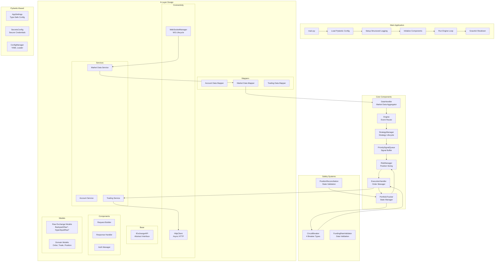

# Code Review Report: 00 - Overview and Architecture

**Report Date:** 2025-04-14
**Reviewer:** Angel (AI Assistant)
**Project:** CyberDeltaEngine
**Version Target:** v0.0.1 (Stable Funding Rate Arbitrage Bot - Hyperliquid/Backpack)
**Updated:** 2025-07-01

## UPDATE (2025-07-01): Current Architecture State

### Major Architectural Achievements:

1. **Configuration System Complete Overhaul:**
   - ✅ Migrated from simple YAML to Pydantic-based configuration models
   - ✅ Type-safe AppSettings and SecretsConfig with comprehensive validation
   - ✅ Proper config.yaml structure with all required sections
   - ✅ Support for mainnet/testnet environments with environment flags

2. **API Client Architecture - Complete Redesign:**
   - ✅ 6-layer architecture: Connectivity → Base API → Components → Services → Mappers → Models
   - ✅ Dedicated HttpClient and WebSocketManager with proper lifecycle management
   - ✅ Strategy patterns for rate limiting, error mapping, and serialization
   - ✅ Component factory pattern ensuring consistency across exchanges
   - ✅ Full Pydantic model coverage for all API requests/responses

3. **New Components Successfully Integrated:**
   - ✅ **StrategyManager**: Centralized strategy lifecycle management
   - ✅ **Service Layer**: AccountService, MarketDataService, TradingService per exchange
   - ✅ **Mapper Layer**: Clean separation between raw API models and internal domain models
   - ✅ **WebSocketManager**: Robust reconnection, error recovery, and message handling

4. **Type Safety and Code Quality:**
   - ✅ Mypy errors reduced from 676 to 3 (only minor export issues)
   - ✅ Ruff errors: 0 in core modules
   - ✅ 100% Decimal compliance for financial calculations
   - ✅ Proper import organization with TYPE_CHECKING usage

## 1. Project Overview

*   **Goal:** Deliver a stable, robust v0.0.1 prototype capable of executing funding rate arbitrage strategies between Hyperliquid and Backpack perpetual markets.
*   **Core Strategy (v0.0.1):** Funding rate arbitrage focusing on Perp/Spot opportunities between exchanges
*   **Priorities:** Robustness, Correctness, Security, Testability, and Maintainability

## 2. Current Architecture (As of 2025-07-01)

The architecture follows a modular, event-driven design with clear separation of concerns:

## 3. Key Architectural Improvements

### 3.1 API Client Architecture (Complete Overhaul)

**Previous:** Monolithic API classes with mixed concerns
**Current:** 6-layer architecture with clear separation:

1. **Connectivity Layer**: Generic HTTP/WebSocket clients
2. **Base Interface**: IExchangeAPI abstract base
3. **Components**: Request builders, response handlers, auth
4. **Services**: Business logic for account, market data, trading
5. **Mappers**: Data transformation with validation
6. **Models**: Pydantic models for type safety

### 3.2 Configuration System

**Previous:** Simple YAML loading with dict access
**Current:** Full Pydantic models with:
- Type validation at startup
- Environment-specific settings
- Secure secrets management
- Comprehensive error messages

### 3.3 Type Safety

**Previous:** Extensive use of Any, dict typing
**Current:**
- Proper type hints throughout
- Pydantic models for all data structures
- Mypy strict mode compliance
- Decimal usage for all financial values

## 4. Component Interactions

### 4.1 Data Flow
1. **Market Data**: WebSocket → Service → Mapper → DataHandler → Engine → Strategy
2. **Signals**: Strategy → SignalQueue → RiskManager → ExecutionHandler
3. **Orders**: ExecutionHandler → TradingService → HttpClient → Exchange

### 4.2 State Management
- **PortfolioTracker**: Single source of truth for positions/balances
- **StateManager**: Persistence layer for recovery
- **Real-time Updates**: WebSocket streams for positions/fills

### 4.3 Safety Controls
- **CircuitBreaker**: Monitors volatility, drawdown, API errors, liquidity
- **PositionReconciliation**: Validates internal vs exchange state
- **FundingRateValidator**: Ensures data quality

## 5. Current Implementation Status

### ✅ Fully Implemented:
- Complete API architecture for both exchanges
- Pydantic configuration system
- Core engine components
- WebSocket management with reconnection
- Circuit breaker system
- Decimal compliance

### 🚧 Partially Implemented:
- Position reconciliation (basic version exists)
- Funding rate validation (integrated but needs enhancement)
- Performance monitoring

### ❌ Not Yet Implemented:
- Balance monitoring system
- Comprehensive alerting
- Full perp/perp strategy variant

## 6. Architecture Assessment

**Strengths:**
1. **Modularity**: Clear separation of concerns
2. **Type Safety**: Comprehensive type hints and validation
3. **Extensibility**: Easy to add new exchanges/strategies
4. **Robustness**: Multiple safety layers
5. **Maintainability**: Clean code structure

**Areas for Enhancement:**
1. **Monitoring**: More comprehensive metrics collection
2. **Testing**: Achieve 90% coverage target
3. **Documentation**: Architecture decision records
4. **Performance**: Optimize hot paths

The architecture has matured significantly and provides a solid foundation for a production cryptocurrency trading system.
