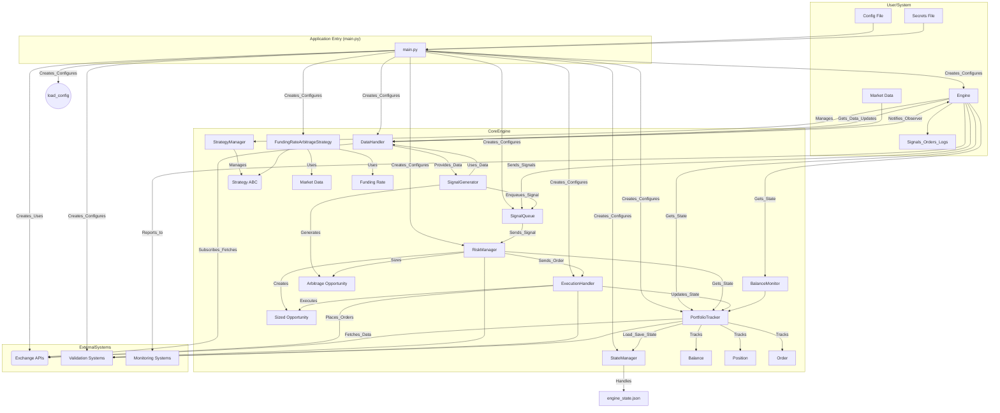
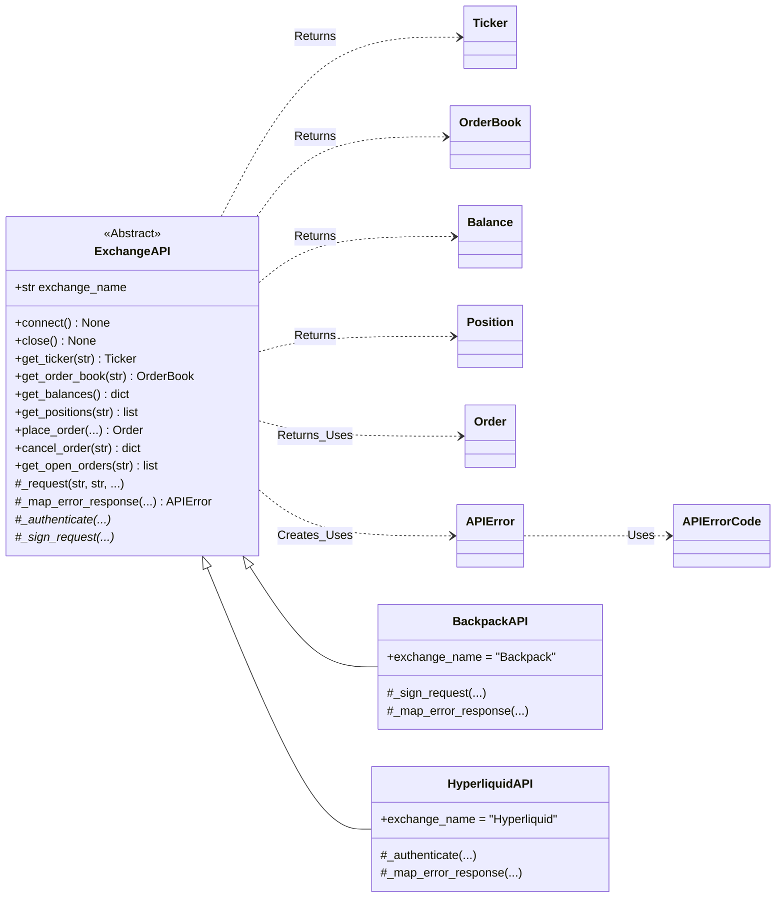
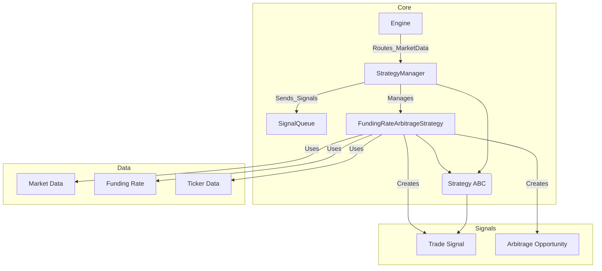
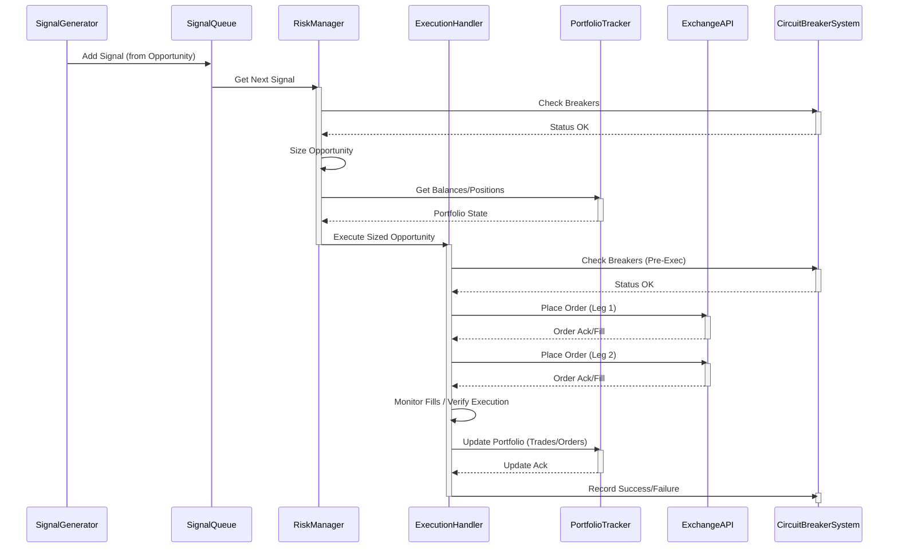
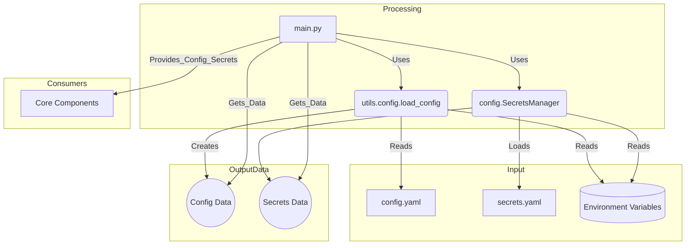
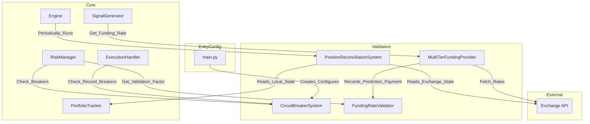

# Code Relationships

## Core Components Overview

## API Class Hierarchy

## Strategy Management

## Opportunity Execution Data Flow (Simplified Sequence)

## Configuration Management

## Validation Systems

