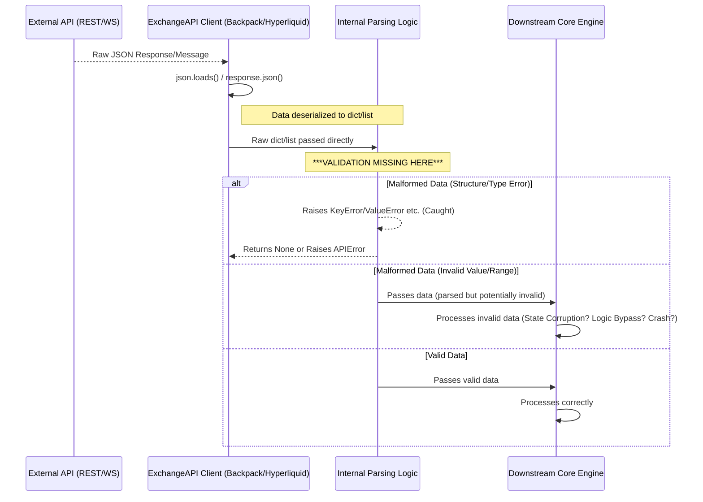

# Security Report: Input Validation (CyberDeltaEngine v0.0.1)

**Rule Reference:** `.claude/rules/security.md` - "Assume Hostile Input" principle

**Assessment Summary:** Critical Gaps (Partially Addressed)

**Last Updated:** 2025-06-15

**Detailed Findings:**

The most significant security weakness identified across the audited components (`config_manager.py`, `apis/base.py`, `apis/backpack.py`, `apis/hyperliquid.py`) is the systemic lack of rigorous runtime input validation for data crossing trust boundaries.

**UPDATE (2025-06-15):** Recent improvements have been made to the Backpack trading data mapper with enhanced defensive programming patterns, though the core issue of missing schema validation at API boundaries remains.

1.  **Configuration Loading (`config_manager.py`):**
    *   Uses `yaml.safe_load`, preventing arbitrary code execution (Good).
    *   Validation (`_validate_config`) only checks for the *presence* of top-level sections and specific boolean flags (`exchanges.*.enabled`).
    *   **Vulnerability:** It **does not validate the types, formats, ranges, or constraints** of the actual configuration *values* (e.g., URLs, timeouts, numerical limits, strategy parameters). Malformed or malicious values in `config.yaml` can be loaded without error and cause downstream crashes, unexpected behavior, or exploitation when used by other components. Config files are a trust boundary.
    *   **Severity:** High.

2.  **API Response Handling (REST & WS - `apis/base.py`, `apis/backpack.py`, `apis/hyperliquid.py`):**
    *   Both Backpack and Hyperliquid clients receive JSON data via REST (`aiohttp`) or WebSockets.
    *   Data is deserialized using standard `json.loads` or `response.json()`.
    *   **Vulnerability:** Parsed dictionaries/lists are passed directly to internal parsing methods (`parse_ticker`, `parse_order`, `parse_trade_message`, etc.) or accessed directly *without any intermediate schema validation*.
    *   These parsing methods rely on direct key access (`data['key']`), `.get('key')`, and type casting (`Decimal(str(value))`, `int(value)`). They are protected only by basic `try...except` blocks catching `KeyError`, `ValueError`, `TypeError`, `IndexError`.
    *   This approach fails to protect against:
        *   Unexpected data types that might still be parsable (e.g., float instead of string for Decimal conversion).
        *   Values outside expected ranges (e.g., negative prices/quantities, invalid status strings).
        *   Missing optional fields leading to `None` values where objects expect concrete types.
        *   Additional unexpected fields being present.
    *   `TypedDict` usage in `hyperliquid.py` provides *compile-time* checks only, offering **no runtime protection**.
    *   **Severity:** Critical. This allows malformed or malicious data from external exchange APIs (a primary trust boundary) to penetrate deep into the application logic, leading to potential state corruption, logic bypasses, crashes (DoS), and financial loss.

**Code Snippets (Illustrative Examples):**

*   **ConfigManager Weak Validation:**
    ```python
    # cyberdelta/config/config_manager.py
    def _validate_config(self) -> bool:
        # ... only checks for section presence and exchange enabled flags ...
        # --- NO CHECKS for type/format/range of values within sections ---
        return True # Returns True even if values are malformed
    ```

*   **Backpack Ticker Parsing (No Validation):**
    ```python
    # cyberdelta/apis/backpack.py
    async def get_ticker(self, symbol: str) -> Ticker:
        # ...
        response = await self._request("GET", request_path)
        # --- NO VALIDATION of 'response' structure/types ---
        ticker = Ticker(
            symbol=response["symbol"], # Potential KeyError
            bid=Decimal(str(response["bidPrice"])), # Potential KeyError/ValueError
            # ... etc ...
        )
        return ticker
    ```

*   **Hyperliquid WS Trade Parsing (No Runtime Validation):**
    ```python
    # cyberdelta/apis/hyperliquid.py
    def parse_trade_message(self, message: dict[str, Any]) -> Trade | None:
        # --- TypedDict provides no runtime guarantee message["data"] matches TradeData ---
        try:
            trade_data_list = message["data"] # Potential KeyError
            trade_data = trade_data_list[0] # Potential IndexError
            trade = Trade(
                id=str(trade_data.get("tid")), # No validation 'tid' is correct format
                price=Decimal(str(trade_data.get("px", "0"))), # No validation 'px' is numeric string >= 0
                quantity=Decimal(str(trade_data.get("sz", "0"))), # No validation 'sz' is numeric string >= 0
                # ... etc ...
            )
            return trade
        # ... Exception handling catches basic parse errors but not subtle data issues ...
    ```

**Mermaid Snippet (Generic API Data Flow Issue):**



**Recent Improvements (2025-06-15):**

*   **Enhanced Trading Data Mapper (`bp_trading_data_mapper.py`):**
    *   Added defensive null checks and proper error handling for quantity parsing
    *   Implemented comprehensive price validation that treats zero prices as null
    *   Added calculation methods for average fill prices with fallback logic
    *   Enhanced timestamp parsing with proper error handling
    *   Introduced helper methods for parsing order quantities, prices, and timestamps
    *   Better handling of optional fields with appropriate defaults

*   **Improved Error Handling:**
    *   All parsing operations now use `parse_decimal_value()` and `parse_datetime_utc()` utilities
    *   Explicit field name tracking in error messages for better debugging
    *   Defensive checks after parsing operations to ensure non-None values where required

**Example of Improved Defensive Code:**
```python
# New defensive parsing pattern in bp_trading_data_mapper.py
def _parse_order_price(price_value: str | None, field_name: str) -> Decimal | None:
    """Parse order price field, returning None for zero or invalid values."""
    if not price_value or price_value == "0":
        return None
    
    parsed_price = parse_decimal_value(
        price_value,
        allow_none=True,
        field_name=field_name,
    )
    return parsed_price if parsed_price is not None and parsed_price > 0 else None
```

**Recommendations (Updated):**

1.  **Implement Runtime Schema Validation:** While defensive parsing has improved, the core recommendation remains - introduce Pydantic models for API boundaries.
2.  **Define Strict Schemas:** Define explicit Pydantic models for:
    *   The entire `config.yaml` structure
    *   Every expected REST API response payload for each endpoint used (including new autolending, collateral, and RFQ endpoints)
    *   Every expected WebSocket message structure for each subscription type
3.  **Validate at Boundaries:**
    *   In `ConfigManager.load`, validate the loaded `self.config` dictionary against the Pydantic config schema *before* setting `self.loaded = True`
    *   In `ExchangeAPI._request` (or just before calling specific parsers in subclasses), validate the raw response dictionary against the corresponding Pydantic response model *before* any parsing attempt
    *   In `ExchangeAPI._route_ws_message` (or equivalent entry point for WS messages), validate the incoming message dictionary against the corresponding Pydantic message model *before* dispatching to handlers or specific parsers
4.  **Fail Fast:** If validation fails at any boundary, log a detailed error and reject the data (e.g., raise an `APIError`, return `None`, skip processing the config/message). Do not allow invalid data to proceed.
5.  **Leverage Existing Architecture:** The codebase already has a separation between Raw API Models and Internal Domain Models - extend this pattern to include validation at the Raw model level.

**Severity Assessment:**

*   **API Response Validation:** Critical (partially mitigated through defensive parsing)
*   **Configuration Validation:** High (unchanged)
*   **New Endpoint Support:** Medium (autolending, collateral, RFQ endpoints need validation)

While recent improvements in defensive parsing reduce the immediate risk, the lack of schema validation at trust boundaries remains a critical vulnerability. The addition of new endpoints (autolending, collateral management, RFQ) increases the attack surface that requires proper validation.

**Progress Summary:**
- ✅ Improved defensive parsing patterns in trading data mappers
- ✅ Better error handling with field-specific error messages  
- ✅ Zero-value handling for prices and quantities
- ❌ Still missing schema validation at API boundaries
- ❌ Configuration validation remains weak
- ❌ New endpoints lack comprehensive validation