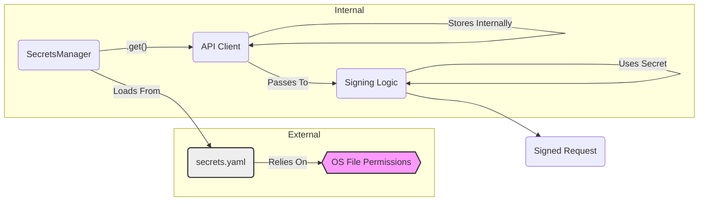

# Security Report: Secrets Management Lifecycle (CyberDeltaEngine v0.0.1)

**Rule Reference:** `.claude/rules/security.md` - "Secrets Management" section

**Assessment Summary:** Improved but Critical Gaps Remain

**Last Updated:** 2025-06-15

**Detailed Findings:**

The `SecretsManager` has been significantly enhanced with Pydantic `SecretStr` integration, providing better protection against accidental exposure. However, critical security gaps around file permissions and memory handling remain unaddressed.

**UPDATE (2025-06-15):** Major improvements include comprehensive Pydantic validation and SecretStr usage throughout the codebase, but file permission checking and memory security still need attention.

1.  **Loading Mechanism:**
    *   Secrets are loaded from a dedicated YAML file (`secrets.yaml`).
    *   Uses `yaml.safe_load` (Good), preventing arbitrary code execution vulnerabilities during parsing.

2.  **Secrets File Location:**
    *   The manager searches for the `secrets.yaml` file using an environment variable (`CYBERDELTA_SECRETS_PATH`) or checks standard secure locations (`~/.cyberdelta/secrets.yaml`, `/etc/cyberdelta/secrets.yaml`, etc.) (Good). This enforces separation from the codebase.

3.  **File Permissions:**
    *   **Weakness:** The `SecretsManager` *assumes* the `secrets.yaml` file has appropriate, restrictive operating system file permissions (e.g., readable only by the user running the application, not world-readable). It **does not programmatically check or enforce** these permissions upon loading.
    *   **Risk:** If deployment procedures are inadequate and the `secrets.yaml` file is left with overly permissive access rights, unauthorized users or processes on the same system could potentially read the secrets.
    *   **Severity:** Medium (Operational Dependency). The code itself is okay, but security hinges on external configuration.

4.  **In-Memory Storage (Enhanced with SecretStr):**
    *   Secrets are now wrapped in Pydantic `SecretStr` objects throughout the application
    *   All secret fields use `SecretStr` type in configuration models:
        - `ApiKeyAuthSecrets`: `api_key: SecretStr`, `api_secret: SecretStr`
        - `PrivateKeyAuthSecrets`: `private_key: SecretStr`, `passphrase: SecretStr | None`
    *   **Improvement:** SecretStr prevents accidental exposure in logs, error messages, and string representations (shows as `**********`)
    *   **Remaining Risk:** Secrets still remain decrypted in memory for the application lifetime. SecretStr only prevents display, not memory access. No explicit memory clearing mechanism exists.
    *   **Severity:** Medium (Improved from Low due to SecretStr protection, but memory lifecycle issues remain)

5.  **Access and Distribution (Type-Safe with Validation):**
    *   Comprehensive Pydantic models ensure type safety and validation:
        - Exchange-specific validation (e.g., Hyperliquid requires private_key auth)
        - Non-empty validation for all secret fields
        - Discriminated unions for different authentication types
    *   Authenticators now accept `SecretStr` parameters directly:
        - `BackpackEd25519Authenticator(api_key_b64_secret: SecretStr, private_key_b64_secret: SecretStr)`
        - Secrets extracted using `get_secret_value()` only when needed for cryptographic operations
    *   **Improvement:** Much stronger type safety and validation prevents misconfiguration

6.  **Hardcoding and Logging:**
    *   No secrets appear to be hardcoded within `SecretsManager`.
    *   The manager logs file paths and success/failure messages but does not log the secret values themselves (Good).

**Code Snippets (Updated Implementation):**

*   **SecretStr Usage in Models:**
    ```python
    # cyberdelta/config/secrets_models.py
    class ApiKeyAuthSecrets(BaseExchangeSecrets):
        auth_type: Literal["api_key"] = "api_key"
        api_key: SecretStr = Field(..., description="API key for authentication")
        api_secret: SecretStr = Field(..., description="API secret for signing")
        
        @field_validator("api_key", "api_secret")
        @classmethod
        def validate_not_empty(cls, v: SecretStr) -> SecretStr:
            if not v.get_secret_value().strip():
                raise ValueError("Secret cannot be empty")
            return v
    ```

*   **Loading Secrets (Still Missing Permission Check):**
    ```python
    # cyberdelta/config/secrets_manager.py
    def load_secrets(self) -> bool:
        secrets_path = self._get_secrets_path()
        if not secrets_path.exists():
            logger.warning(f"Secrets file not found at {secrets_path}")
            return False
        # --- STILL ASSUMES secrets_path has correct OS permissions ---
        # --- NO PERMISSION CHECK IMPLEMENTED ---
        try:
            with open(secrets_path) as f:
                self.secrets = yaml.safe_load(f) # Safe loading
            # Now validates with Pydantic models
            self._secrets_config = SecretsConfig.model_validate(self.secrets)
            return True
        # ...
    ```

*   **Finding Secrets Path:**
    ```python
    # cyberdelta/config/secrets_manager.py
    def _get_secrets_path(self) -> Path:
        env_path = os.environ.get("CYBERDELTA_SECRETS_PATH")
        if env_path: return Path(env_path)
        home_dir = Path.home()
        default_paths = [
            home_dir / ".cyberdelta" / "secrets.yaml", # User-specific
            Path("/etc/cyberdelta/secrets.yaml"),     # System-wide
            Path("/opt/cyberdelta/secrets.yaml"),    # System-wide (alternative)
        ]
        # ... searches paths ...
        return default_paths[0] # Fallback
    ```

**Mermaid Snippet (Secrets Lifecycle Flow):**



**Recent Improvements (2025-06-15):**

*   **Pydantic SecretStr Integration:**
    *   All sensitive fields now use `SecretStr` type
    *   Prevents accidental exposure in logs and error messages
    *   Comprehensive validation with custom validators
    
*   **Type-Safe Configuration:**
    *   Exchange-specific secret models with validation
    *   Discriminated unions for different auth types
    *   Non-empty validation for all secret fields
    
*   **Enhanced Authentication:**
    *   Authenticators accept `SecretStr` parameters
    *   Secrets extracted only when needed for crypto operations

**Recommendations (Updated):**

1.  **Implement File Permission Check (CRITICAL):** Add mandatory permission checking in `load_secrets`:
    ```python
    import stat
    
    def load_secrets(self) -> bool:
        secrets_path = self._get_secrets_path()
        
        # Check file permissions
        file_stat = secrets_path.stat()
        if file_stat.st_mode & 0o077:  # Check for any group/other permissions
            logger.error(f"SECURITY: Secrets file {secrets_path} has insecure permissions!")
            logger.error(f"Current: {oct(file_stat.st_mode)}, Required: 0o600 or stricter")
            raise SecurityError("Secrets file has insecure permissions")
    ```

2.  **Add Memory Security (Medium Priority):**
    *   Investigate secure memory handling libraries
    *   Implement explicit zeroing of secret values after use
    *   Consider memory locking to prevent swap
    
3.  **Enhance Monitoring (Low Priority):**
    *   Add audit logging for secret access
    *   Monitor for potential secret exposure in logs
    *   Implement rate limiting for secret retrieval
    
4.  **Consider External Secret Providers (Future):**
    *   Evaluate integration with cloud secret managers
    *   Implement rotation capabilities
    *   Add support for hardware security modules (HSMs)

**Severity Assessment:**

*   **Lack of File Permission Checks:** High (Critical security gap)
*   **In-Memory Secret Storage:** Medium (Improved with SecretStr but lifecycle issues remain)
*   **No Encryption at Rest:** Medium (Secrets stored as plaintext)
*   **Overall SecretStr Implementation:** Low (Well-implemented protection against accidental exposure)

While the SecretStr implementation significantly reduces the risk of accidental exposure, the lack of file permission checking remains a critical vulnerability that could allow unauthorized access to all secrets.

**Progress Summary:**
- ✅ Comprehensive Pydantic validation
- ✅ SecretStr prevents accidental logging
- ✅ Type-safe secret handling
- ✅ Support for different auth types
- ❌ File permissions still not checked
- ❌ No secure memory handling
- ❌ No encryption at rest