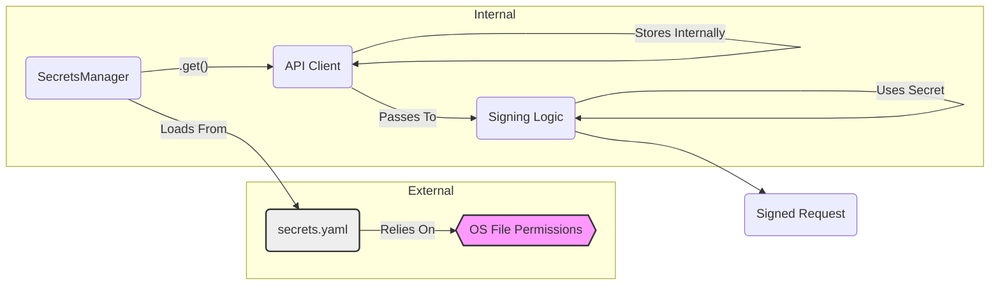

# Security Report: Secrets Management Lifecycle (CyberDeltaEngine v0.0.1)

**Rule Reference:** `Secrets_Management_Lifecycle.mdc` (Implicitly, based on user prompt's focus) / `.roo/rules-toly/security_boundary_validation.md` (Secrets handling is crucial boundary control)

**Assessment Summary:** Looks Solid (with Operational Caveats)

**Detailed Findings:**

The `SecretsManager` provides a reasonable approach for handling sensitive credentials, keeping them out of the source repository. However, its security relies heavily on correct operational practices regarding file permissions.

1.  **Loading Mechanism:**
    *   Secrets are loaded from a dedicated YAML file (`secrets.yaml`).
    *   Uses `yaml.safe_load` (Good), preventing arbitrary code execution vulnerabilities during parsing.

2.  **Secrets File Location:**
    *   The manager searches for the `secrets.yaml` file using an environment variable (`CYBERDELTA_SECRETS_PATH`) or checks standard secure locations (`~/.cyberdelta/secrets.yaml`, `/etc/cyberdelta/secrets.yaml`, etc.) (Good). This enforces separation from the codebase.

3.  **File Permissions:**
    *   **Weakness:** The `SecretsManager` *assumes* the `secrets.yaml` file has appropriate, restrictive operating system file permissions (e.g., readable only by the user running the application, not world-readable). It **does not programmatically check or enforce** these permissions upon loading.
    *   **Risk:** If deployment procedures are inadequate and the `secrets.yaml` file is left with overly permissive access rights, unauthorized users or processes on the same system could potentially read the secrets.
    *   **Severity:** Medium (Operational Dependency). The code itself is okay, but security hinges on external configuration.

4.  **In-Memory Storage:**
    *   Secrets are loaded into the `self.secrets` dictionary within the `SecretsManager` instance.
    *   When retrieved via `get()`, secrets are passed to the requesting components (e.g., API Clients).
    *   As observed in `backpack.py` and `hyperliquid.py`, the relevant secrets (`api_key`, `api_secret`, `private_key` loaded into an `Account` object) are stored in memory within those client instances for their operational lifetime.
    *   **Risk:** This is standard practice, but secrets remain decrypted in the application's memory space. If the application's memory is compromised (e.g., via another vulnerability, kernel exploit, or direct memory access), these secrets could be exposed. There is no mechanism for explicitly clearing secrets from memory after use (often impractical in Python).
    *   **Severity:** Low (Standard inherent risk of holding secrets in memory).

5.  **Access and Distribution:**
    *   The `get()` method provides controlled access to secrets.
    *   Based on API client analysis, secrets seem appropriately contained within the clients and used only for their intended purpose (signing). Further auditing would be needed to track if secrets retrieved via `get()` are passed elsewhere unnecessarily.

6.  **Hardcoding and Logging:**
    *   No secrets appear to be hardcoded within `SecretsManager`.
    *   The manager logs file paths and success/failure messages but does not log the secret values themselves (Good).

**Code Snippets:**

*   **Loading Secrets:**
    ```python
    # cyberdelta/config/secrets_manager.py
    def load_secrets(self) -> bool:
        secrets_path = self._get_secrets_path()
        if not secrets_path.exists():
            logger.warning(f"Secrets file not found at {secrets_path}") # Path logged, not secrets
            return False
        # --- Assumes secrets_path has correct OS permissions ---
        try:
            with open(secrets_path) as f:
                self.secrets = yaml.safe_load(f) # Safe loading
            # ...
            return True
        # ...
    ```

*   **Finding Secrets Path:**
    ```python
    # cyberdelta/config/secrets_manager.py
    def _get_secrets_path(self) -> Path:
        env_path = os.environ.get("CYBERDELTA_SECRETS_PATH")
        if env_path: return Path(env_path)
        home_dir = Path.home()
        default_paths = [
            home_dir / ".cyberdelta" / "secrets.yaml", # User-specific
            Path("/etc/cyberdelta/secrets.yaml"),     # System-wide
            Path("/opt/cyberdelta/secrets.yaml"),    # System-wide (alternative)
        ]
        # ... searches paths ...
        return default_paths[0] # Fallback
    ```

**Mermaid Snippet (Secrets Lifecycle Flow):**



**Recommendations:**

1.  **Enforce File Permissions (Operational):** Clearly document and enforce strict file permissions (e.g., `chmod 600` or `400`) for the `secrets.yaml` file during deployment and operation. This is the most critical mitigation for the identified permissions weakness.
2.  **Consider Startup Permission Check (Optional):** Add an optional check within `load_secrets` to verify the permissions of the `secrets.yaml` file using `os.stat` and log a loud warning or even refuse to start if permissions are too permissive. This adds robustness but increases platform dependency and complexity.
3.  **Minimize Secret Scope:** Continue the practice of only passing necessary secrets to the components that directly require them. Avoid passing the entire `SecretsManager` instance or secrets dictionary broadly.
4.  **Audit `get()` Usage:** Perform a codebase search for `SecretsManager.get()` to ensure retrieved secrets aren't inadvertently logged or stored insecurely elsewhere in the application.
5.  **Runtime Secret Providers (Advanced):** For higher security environments, consider integrating with external secret management systems (like HashiCorp Vault, AWS Secrets Manager, GCP Secret Manager) instead of relying solely on a local file. This is a significant architectural change.

**Severity Assessment:**

*   **Reliance on OS File Permissions:** Medium (Requires operational diligence)
*   **In-Memory Secret Storage:** Low (Standard practice, inherent risk)

Overall, the secrets management approach is conventional and acceptable for many scenarios, provided that operational security (file permissions) is handled correctly.