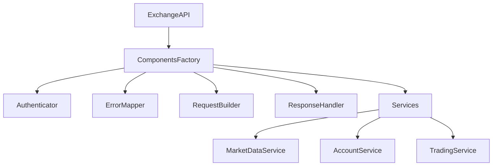
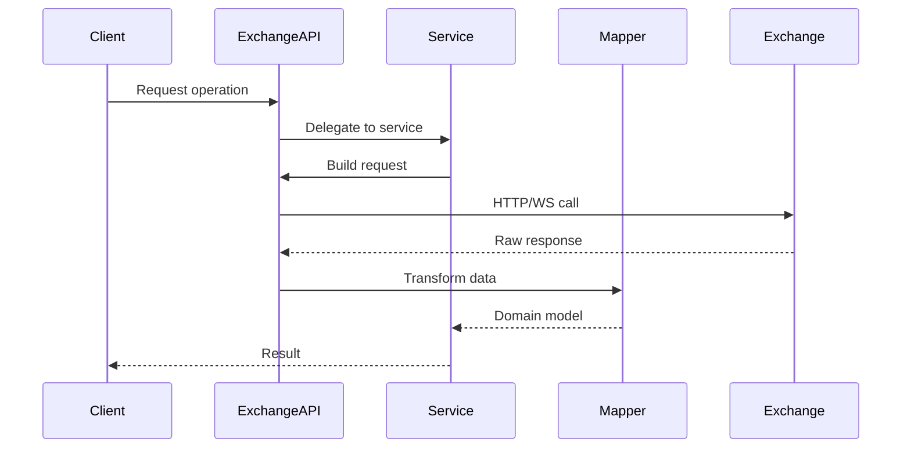
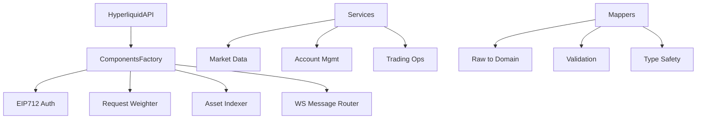
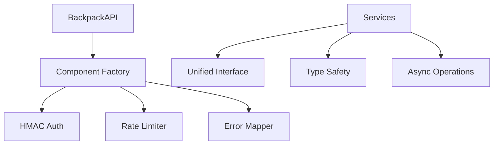
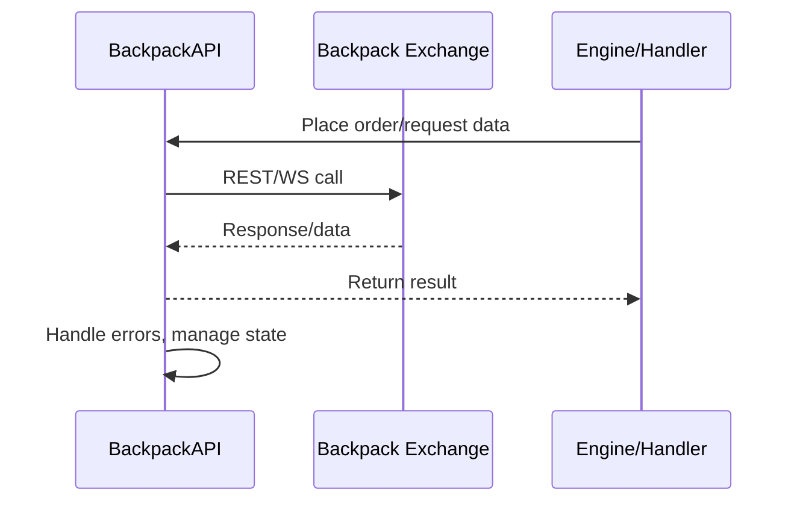

# cyberdelta/apis/ — Per-Folder Analysis (Updated June 2025)

## Overview
The APIs module has undergone significant architectural improvements since April 2025, implementing a component-based architecture with enhanced type safety, better separation of concerns, and comprehensive Pydantic V2 migration.

---

## Architecture Evolution

### Component-Based Design (New)
The APIs module now follows a component-based architecture:
- **Factory Pattern**: Each exchange has a dedicated `ComponentsFactory` for creating components
- **Service Layer**: Dedicated services for market data, account management, and trading
- **Data Mappers**: Type-safe transformation between raw exchange data and internal models
- **Decorators**: Enhanced functionality for rate limiting, security, and typed responses

### Key Improvements Since April 2025:
1. **Pydantic V2 Migration**: All models now use Pydantic V2 with `ConfigDict` and modern validators
2. **Enhanced Type Safety**: Comprehensive type hints with runtime validation
3. **Component Isolation**: Clear separation between connectivity, authentication, and business logic
4. **Better Error Handling**: Structured error models with detailed error codes and context

---

## Core Components

### base/exchange_api.py
**Purpose:**
Abstract base class providing common functionality for all exchange implementations with enhanced component integration.





**Key Features:**
- **Component Factory**: Creates all necessary components with proper configuration
- **Service Layer**: Encapsulates business logic for different API domains
- **Type-Safe Mappers**: Ensures data integrity during transformation
- **Async/Await**: Full async support for concurrent operations
- **Rate Limiting**: Sophisticated rate limiting with request weighting

---

## Hyperliquid API Implementation

### hyperliquid/hl_api.py
**Purpose:**
Main Hyperliquid API client leveraging component-based architecture for enhanced modularity and maintainability.

**Key Components:**
- `HyperliquidAPIComponentsFactory`: Creates and configures all Hyperliquid-specific components
- `HyperliquidEip712Authenticator`: Handles EIP-712 signature-based authentication
- `HyperliquidRequestBuilder`: Constructs properly formatted API requests
- `HyperliquidResponseHandler`: Processes and validates API responses
- `HyperliquidErrorMapper`: Maps exchange errors to standardized error types

### Service Layer (New)
The Hyperliquid implementation now includes dedicated services:
- **HyperliquidMarketDataService**: Handles orderbook, trades, and market data
- **HyperliquidAccountService**: Manages account state and balances
- **HyperliquidTradingService**: Executes orders and manages positions

### Data Mappers (New)
Type-safe transformation layers:
- **HyperliquidMarketDataMapper**: Converts raw market data to domain models
- **HyperliquidAccountDataMapper**: Transforms account data with validation
- **HyperliquidTradingDataMapper**: Maps order and trade data



**Hyperliquid-Specific Features:**
- **Asset Indexer**: Maps asset symbols to indices for API calls
- **Request Weighter**: Calculates request weights for rate limiting
- **EIP-712 Signing**: Cryptographic signature generation for orders
- **WebSocket Routing**: Intelligent message routing and subscription management

**Summary:**
- **Inputs**: Typed service arguments (PlaceOrderArgs, GetMarketDataArgs, etc.)
- **Outputs**: Domain models with full type safety and validation
- **Dependencies**: Component factory, service layer, data mappers
- **Critical Path**: Async operations with proper error handling and rate limiting
- **Type Safety**: Full Pydantic V2 validation at every data boundary

---

## Backpack API Implementation

### backpack/bp_api.py
**Purpose:**
Main Backpack API client following the same component-based architecture as Hyperliquid for consistency.

**Key Components:**
- `BackpackAPIComponentsFactory`: Creates Backpack-specific components
- `BackpackHmacAuthenticator`: HMAC-based authentication
- `BackpackRequestBuilder`: Constructs API requests with proper formatting
- `BackpackResponseHandler`: Processes responses with validation
- `BackpackErrorMapper`: Maps Backpack errors to standard error codes

### Service Layer
Backpack services mirror Hyperliquid's structure:
- **BackpackMarketDataService**: Market data operations
- **BackpackAccountService**: Account management
- **BackpackTradingService**: Order execution and management

### Enhanced Features (New)
- **Unified Error Handling**: Consistent error mapping across exchanges
- **Rate Limit Strategy**: Exchange-specific rate limiting rules
- **WebSocket Management**: Robust connection handling with auto-reconnect





**Summary:**
- Inputs: API requests/orders, authentication/configuration data.
- Outputs: Data, order status, error reports.
- Dependencies: Backpack exchange APIs, engine/handlers for requests.
- Critical Path: Reliable and secure Backpack connectivity is essential for trading and data operations.

---

## Connectivity Layer (New)

### connectivity/http_client.py
**Purpose:**
Provides a robust HTTP client with enhanced features for API communication.

**Key Features:**
- **ParsedJsonResponse**: Type-safe response handling with validation
- **Retry Logic**: Configurable retry strategies for failed requests
- **Connection Pooling**: Efficient connection management
- **Timeout Handling**: Comprehensive timeout configuration

### connectivity/ws_manager.py
**Purpose:**
Manages WebSocket connections with auto-reconnection and message routing.

**Features:**
- **Auto-Reconnection**: Automatic reconnection with exponential backoff
- **Message Routing**: Route messages to appropriate handlers
- **Subscription Management**: Track and manage active subscriptions
- **Health Monitoring**: Connection health checks and metrics

---

## Enhanced Components (New)

### decorators/
**Purpose:**
Provides decorator-based enhancements for API methods.

**Key Decorators:**
- **@rate_limited**: Automatic rate limiting enforcement
- **@authenticated**: Ensures proper authentication
- **@typed_response**: Type-safe response validation
- **@retry_on_error**: Configurable retry logic

### models/
**Purpose:**
Shared models for API operations with Pydantic V2.

**Key Models:**
- **APIError**: Structured error representation
- **APIErrorCode**: Comprehensive error code enumeration
- **ServiceArgs**: Type-safe service method arguments
- **ExchangeAPIConfig**: Unified configuration model

### utils/
**Purpose:**
Utility functions for API operations.

**Key Utilities:**
- **Response Validation**: Runtime validation of API responses
- **Data Transformation**: Safe data type conversions
- **Serialization**: Consistent JSON serialization

---

## Architectural Patterns

### 1. Component Factory Pattern
```python
# Each exchange has a dedicated factory
factory = HyperliquidAPIComponentsFactory(
    config=exchange_config,
    secrets=exchange_secrets
)

# Factory creates all components with proper dependencies
auth = factory.create_authenticator()
services = factory.create_services(requester)
```

### 2. Service-Oriented Architecture
```python
# Services encapsulate domain logic
market_service = exchange.market_data_service
orderbook = await market_service.get_orderbook(symbol)

# Clean separation of concerns
account_service = exchange.account_service
balances = await account_service.get_balances()
```

### 3. Type-Safe Data Flow
```python
# Raw data → Mapper → Domain model
raw_response = await self._request(...)
mapper = self._factory.create_market_data_mapper()
domain_model = mapper.map_orderbook(raw_response)
```

---

## Best Practices and Recommendations

### 1. Always Use Service Layer
- Don't call `_request()` directly from external code
- Use appropriate service methods for all operations
- Services handle validation, transformation, and error handling

### 2. Leverage Type Safety
- Use typed service arguments (e.g., `PlaceOrderArgs`)
- Let Pydantic handle validation at boundaries
- Trust the type system for compile-time safety

### 3. Component Isolation
- Each component has a single responsibility
- Dependencies are injected via factory
- Components are easily testable in isolation

### 4. Error Handling
- Use structured error types (`APIError`, `APIErrorCode`)
- Map exchange-specific errors to common codes
- Provide context in error messages

### 5. Future Enhancements
- Consider adding circuit breaker patterns
- Implement request/response interceptors
- Add metrics collection for observability
- Enhanced caching strategies for market data
