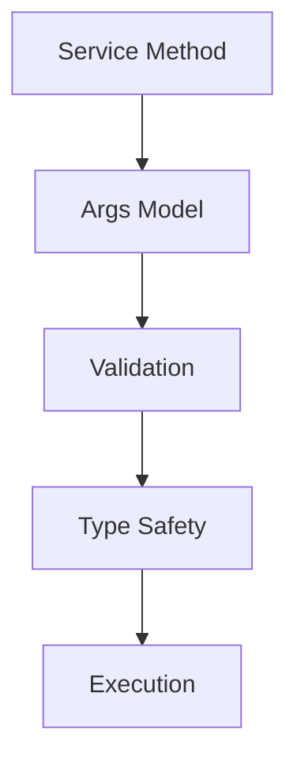
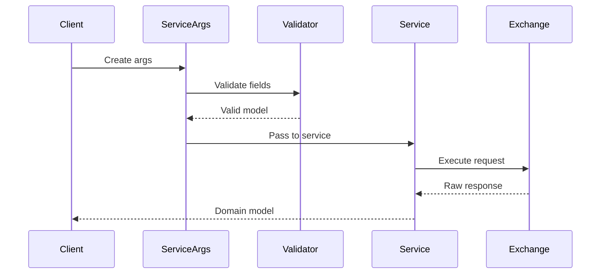

# cyberdelta/apis/models/ — Per-Folder Analysis (Updated June 2025)

## Overview
The API models package has been completely restructured and migrated to Pydantic V2, providing a robust foundation for type-safe API interactions across all exchanges. This represents a major improvement in data validation, error handling, and developer experience.

---

## Architecture Evolution

### Key Changes Since April 2025:
1. **Full Pydantic V2 Migration**: All models now use modern Pydantic features
2. **Structured Error Handling**: Comprehensive error modeling with detailed error codes
3. **Service Arguments Pattern**: Type-safe argument models for all service methods
4. **Enhanced Validation**: Runtime validation with descriptive error messages
5. **Better Separation**: Clear distinction between API errors, configuration, and service models

---

## Core Components

### api_error.py
**Purpose:**
Defines the core error types for API operations with rich context and type safety.

```python
class APIError(BaseException):
    """Base exception for all API-related errors"""

class TransformationError(APIError):
    """Raised when data transformation between raw and domain models fails"""
```

**Key Features:**
- **Contextual Information**: Errors include exchange, operation, and details
- **Type Safety**: Strongly typed error attributes
- **Inheritance Hierarchy**: Clear error categorization

### api_error_codes.py
**Purpose:**
Comprehensive enumeration of all possible API error codes across exchanges.

```python
class APIErrorCode(str, Enum):
    """Standardized error codes for consistent error handling"""

    # Authentication errors
    AUTHENTICATION_FAILED = "AUTHENTICATION_FAILED"
    INVALID_SIGNATURE = "INVALID_SIGNATURE"

    # Rate limiting
    RATE_LIMIT_EXCEEDED = "RATE_LIMIT_EXCEEDED"

    # Market errors
    INVALID_SYMBOL = "INVALID_SYMBOL"
    INSUFFICIENT_BALANCE = "INSUFFICIENT_BALANCE"
```

**Benefits:**
- **Consistency**: Same error codes across all exchanges
- **Mapping**: Exchange-specific errors map to standard codes
- **Documentation**: Self-documenting error conditions

### api_error_response.py
**Purpose:**
Structured response model for API errors with full context.

```python
class APIErrorResponse(BaseModel):
    """Standardized error response structure"""

    error_code: APIErrorCode
    message: str
    details: dict[str, Any] | None = None
    exchange: str
    timestamp: datetime
```

### exchange_api_config.py
**Purpose:**
Unified configuration model for all exchange APIs.

```python
class ExchangeAPIConfig(BaseModel):
    """Configuration for exchange API connections"""

    model_config = ConfigDict(
        validate_assignment=True,
        use_enum_values=True
    )

    base_url: str
    ws_url: str | None = None
    timeout: int = 30
    max_retries: int = 3
```

---

## Service Arguments Models

### service_args_models.py
**Purpose:**
Type-safe argument models for all service methods, ensuring consistent API across exchanges.



**Key Models:**

#### PlaceOrderArgs
```python
class PlaceOrderArgs(BaseModel):
    """Arguments for placing an order"""

    symbol: str
    side: OrderSide
    order_type: OrderType
    quantity: Decimal
    price: Decimal | None = None

    @field_validator('quantity')
    def validate_positive_quantity(cls, v: Decimal) -> Decimal:
        if v <= 0:
            raise ValueError("Quantity must be positive")
        return v
```

#### GetMarketDataArgs
```python
class GetMarketDataArgs(BaseModel):
    """Arguments for market data requests"""

    symbol: str
    depth: int = Field(default=20, gt=0, le=100)
    include_trades: bool = True
```

#### CancelOrderArgs
```python
class CancelOrderArgs(BaseModel):
    """Arguments for canceling orders"""

    order_id: str | None = None
    client_order_id: str | None = None
    symbol: str | None = None

    @model_validator(mode='after')
    def validate_identifier(self) -> Self:
        if not (self.order_id or self.client_order_id):
            raise ValueError("Either order_id or client_order_id required")
        return self
```

---

## Exchange-Specific Models

### Hyperliquid Models
Located in `hyperliquid/models/`:
- **Raw Models**: Direct API response representations with minimal processing
- **EIP-712 Models**: Cryptographic signing structures
- **Processed Models**: Validated and transformed responses

### Backpack Models
Located in `backpack/models/`:
- **Raw Types**: Exchange-specific type definitions
- **Query Parameters**: Typed query parameter models
- **WebSocket Payloads**: Real-time data structures

---

## Data Flow and Validation



---

## Best Practices and Patterns

### 1. Always Use Service Arguments
```python
# Good
args = PlaceOrderArgs(
    symbol="BTC-USD",
    side=OrderSide.BUY,
    order_type=OrderType.LIMIT,
    quantity=Decimal("0.1"),
    price=Decimal("50000")
)
order = await trading_service.place_order(args)

# Bad - Don't use raw parameters
order = await trading_service.place_order(
    "BTC-USD", "buy", "limit", 0.1, 50000
)
```

### 2. Leverage Pydantic Validation
```python
class CustomArgs(BaseModel):
    amount: Decimal = Field(gt=0, decimal_places=8)

    @field_validator('amount')
    def validate_amount_precision(cls, v: Decimal) -> Decimal:
        # Custom validation logic
        return v
```

### 3. Use Error Codes for Handling
```python
try:
    result = await api.place_order(args)
except APIError as e:
    if e.error_code == APIErrorCode.INSUFFICIENT_BALANCE:
        # Handle insufficient balance
    elif e.error_code == APIErrorCode.RATE_LIMIT_EXCEEDED:
        # Handle rate limit
```

### 4. Model Configuration
```python
class MyModel(BaseModel):
    model_config = ConfigDict(
        # Pydantic V2 configuration
        validate_assignment=True,
        use_enum_values=True,
        str_strip_whitespace=True
    )
```

---

## Migration Guidelines

### From Pydantic V1 to V2:
1. Replace `Config` class with `model_config = ConfigDict(...)`
2. Update validators to use `@field_validator` and `@model_validator`
3. Use `Field` for all field definitions
4. Replace `.dict()` with `.model_dump()`
5. Replace `.json()` with `.model_dump_json()`

### Adding New Models:
1. Extend appropriate base class
2. Add comprehensive field validation
3. Include docstrings and type hints
4. Add to `__all__` exports
5. Create corresponding tests

---

## Future Enhancements

### 1. Response Caching
- Add cache keys to service arguments
- Implement cache-aware response models

### 2. Model Versioning
- Support multiple API versions
- Backward compatibility layer

### 3. Enhanced Validation
- Cross-field validation rules
- Business logic validation

### 4. Performance Optimization
- Lazy validation for large responses
- Streaming response models
