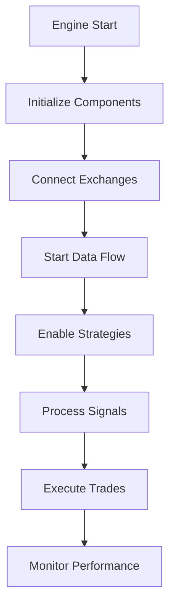
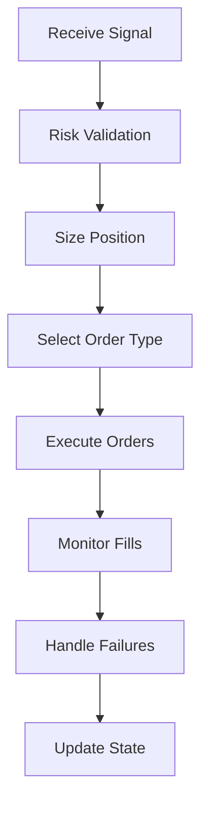
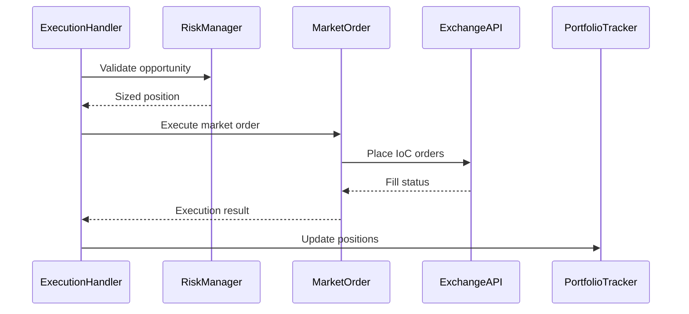
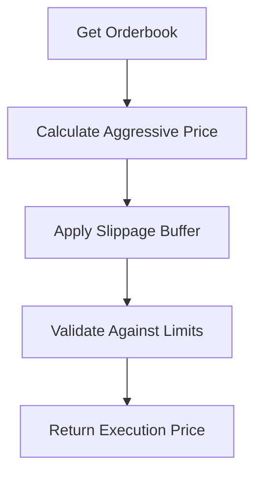
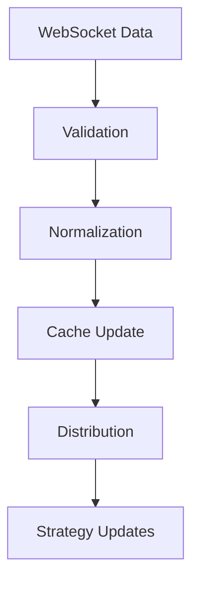
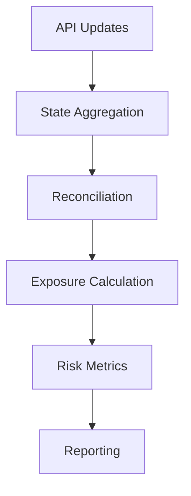
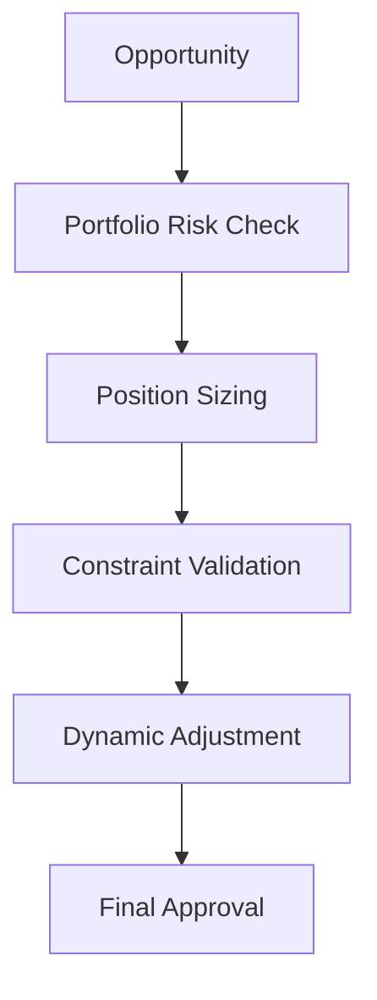
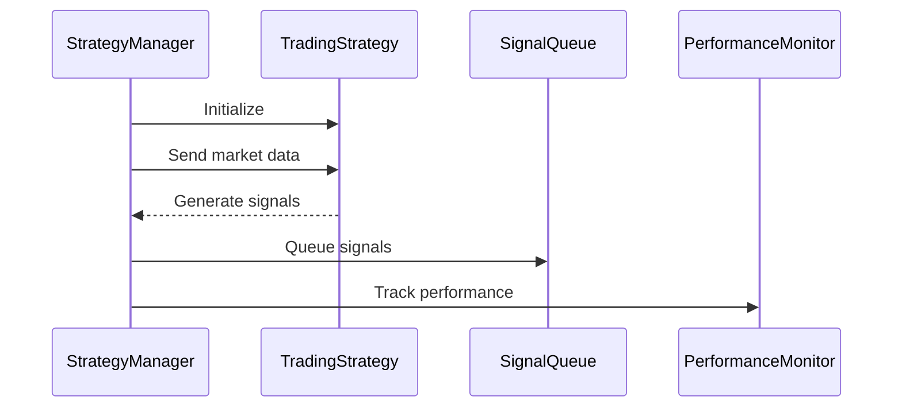

# cyberdelta/core/ — Per-Folder Analysis (Updated June 2025)

## Overview
The core module has evolved significantly since April 2025, with enhanced modularity, improved execution capabilities including market order support, better state management, and comprehensive type safety throughout.

---

## Architecture Evolution

### Key Improvements Since April 2025:
1. **Market Order Support**: New execution subsystem for aggressive market orders
2. **Enhanced Data Management**: Improved data flow and caching mechanisms
3. **Better Component Isolation**: Clear separation of concerns
4. **Improved Type Safety**: Comprehensive typing with runtime validation
5. **Modular Execution**: Dedicated execution package with specialized components

---

## Core Components

### engine.py
**Purpose:**
Main orchestration engine that coordinates all trading components, managing the lifecycle of strategies, data flow, and execution.



**Key Features:**
- **Component Orchestration**: Manages all subsystems
- **Error Recovery**: Graceful handling of component failures
- **State Management**: Maintains system-wide state
- **Performance Monitoring**: Real-time metrics collection

### execution_handler.py
**Purpose:**
Central execution coordinator that manages order placement, monitoring, and lifecycle across multiple exchanges with enhanced safety features.





**Enhanced Features:**
- **Market Order Integration**: Seamless integration with new market order system
- **Multi-Exchange Coordination**: Synchronized order submission
- **Partial Fill Handling**: Sophisticated partial fill management
- **Circuit Breaker Integration**: Safety mechanisms for risk control

---

## Market Order Execution (New)

### execution/orders/market_order.py
**Purpose:**
Implements market order functionality using aggressive IoC (Immediate-or-Cancel) limit orders for exchanges without native market order support.

```python
class MarketOrder:
    """Executes market orders using aggressive IoC limit orders"""

    async def execute_market_order(
        self,
        symbol: str,
        side: OrderSide,
        quantity: Decimal,
    ) -> Order:
        # Calculate aggressive price
        # Submit IoC order
        # Handle execution result
```

### execution/orders/market_order_service.py
**Purpose:**
Service layer for market order operations with price calculation and slippage management.



**Key Features:**
- **Dynamic Pricing**: Real-time aggressive price calculation
- **Slippage Control**: Configurable slippage tolerance
- **Price Validation**: Ensures prices within acceptable bounds
- **Metrics Collection**: Performance and slippage tracking

### execution/synchronized_order_submission.py
**Purpose:**
Coordinates simultaneous order submission across multiple exchanges for arbitrage strategies.

```python
async def submit_synchronized_orders(
    orders: list[OrderSubmission]
) -> list[OrderResult]:
    """Submit orders to multiple exchanges simultaneously"""
    # Prepare all orders
    # Submit concurrently
    # Handle partial success
    # Rollback on failure
```

---

## Data Management

### data_manager.py
**Purpose:**
Centralized data management with improved caching, validation, and distribution mechanisms.



**Improvements:**
- **Smart Caching**: LRU cache with time-based expiration
- **Data Validation**: Comprehensive validation at ingestion
- **Efficient Distribution**: Pub/sub pattern for data updates
- **Conflict Resolution**: Handles data discrepancies between sources

### data_handler.py
**Purpose:**
Handles real-time data processing and transformation with enhanced performance.

**Key Features:**
- **Stream Processing**: Efficient processing of high-frequency data
- **Data Enrichment**: Adds calculated fields and metadata
- **Error Recovery**: Graceful handling of malformed data
- **Performance Optimization**: Minimal latency processing

---

## Portfolio Management

### portfolio_tracker.py
**Purpose:**
Enhanced portfolio tracking with real-time reconciliation and multi-exchange support.



**New Features:**
- **Real-time Reconciliation**: Continuous validation against exchange data
- **Cross-Exchange Netting**: Accurate position aggregation
- **Performance Attribution**: Detailed P&L breakdown
- **Historical Tracking**: Time-series portfolio metrics

### balance_monitor.py
**Purpose:**
Monitors account balances with alerting and automated responses.

**Features:**
- **Threshold Monitoring**: Configurable balance alerts
- **Auto-Rebalancing**: Trigger rebalancing on thresholds
- **Multi-Asset Support**: Handles spot and derivatives
- **Integration**: Works with risk management system

---

## Risk Management

### risk_manager.py
**Purpose:**
Enhanced risk management with dynamic sizing and real-time risk metrics.



**Enhancements:**
- **Dynamic Risk Limits**: Adjusts based on market conditions
- **Kelly Criterion**: Optimal position sizing
- **Correlation Analysis**: Multi-asset risk assessment
- **Stress Testing**: Real-time scenario analysis

---

## Signal Processing

### signal_generator.py
**Purpose:**
Generates trading signals with enhanced filtering and validation.

**Features:**
- **Multi-Source Signals**: Combines multiple data sources
- **Signal Validation**: Quality and consistency checks
- **Performance Tracking**: Signal accuracy metrics
- **Machine Learning Ready**: Standardized signal format

### signal_queue.py
**Purpose:**
Priority queue with expiration and advanced filtering capabilities.

```python
class PrioritySignalQueue:
    """Enhanced signal queue with smart prioritization"""

    def add_signal(self, signal: TradeSignal) -> None:
        # Validate signal
        # Calculate priority score
        # Check circuit breakers
        # Add to queue with expiration
```

---

## Strategy Management

### strategy_manager.py
**Purpose:**
Lifecycle management for multiple strategies with performance monitoring.



**Key Features:**
- **Hot Reload**: Update strategies without restart
- **Performance Monitoring**: Real-time strategy metrics
- **Resource Management**: CPU and memory optimization
- **A/B Testing**: Parallel strategy comparison

### strategy.py
**Purpose:**
Base strategy class with standardized interface and utilities.

```python
class Strategy(ABC):
    """Base class for all trading strategies"""

    @abstractmethod
    async def on_market_data(self, data: MarketData) -> list[TradeSignal]:
        """Process market data and generate signals"""

    @abstractmethod
    async def on_position_update(self, position: Position) -> None:
        """Handle position updates"""
```

---

## Utility Components

### symbol_mapper.py
**Purpose:**
Maps symbols between different exchange formats with caching.

**Features:**
- **Bidirectional Mapping**: Exchange ↔ Internal symbols
- **Cache Layer**: Fast lookups for common pairs
- **Validation**: Ensures symbol validity
- **Auto-Discovery**: Learns new mappings

### order_manager.py
**Purpose:**
Centralized order lifecycle management with state tracking.

**Features:**
- **Order Registry**: Tracks all orders across exchanges
- **State Machine**: Consistent order state transitions
- **Event System**: Order lifecycle events
- **Analytics**: Order execution metrics

---

## Best Practices and Patterns

### 1. Component Communication
```python
# Use dependency injection
class ExecutionHandler:
    def __init__(
        self,
        risk_manager: RiskManager,
        portfolio_tracker: PortfolioTracker,
        market_order_service: MarketOrderService,
    ):
        self._risk = risk_manager
        self._portfolio = portfolio_tracker
        self._market_order = market_order_service
```

### 2. Error Handling
```python
# Comprehensive error handling with context
try:
    result = await self._execute_order(order)
except ExecutionError as e:
    logger.error(
        "Order execution failed",
        order_id=order.id,
        symbol=order.symbol,
        error=str(e)
    )
    await self._handle_execution_failure(order, e)
```

### 3. State Management
```python
# Use immutable state updates
@dataclass(frozen=True)
class PortfolioState:
    positions: dict[str, Position]
    balances: dict[str, Balance]
    timestamp: datetime

    def with_updated_position(self, position: Position) -> PortfolioState:
        new_positions = {**self.positions, position.symbol: position}
        return PortfolioState(new_positions, self.balances, datetime.now())
```

### 4. Async Patterns
```python
# Proper async context management
async with self._lock:
    # Critical section
    await self._update_state()

# Concurrent operations
results = await asyncio.gather(
    self._fetch_orderbook(symbol),
    self._fetch_trades(symbol),
    return_exceptions=True
)
```

---

## Future Enhancements

### 1. Machine Learning Integration
- Signal generation using ML models
- Adaptive risk management
- Performance prediction

### 2. Advanced Execution Algorithms
- TWAP/VWAP execution
- Smart order routing
- Liquidity seeking algorithms

### 3. Enhanced Monitoring
- Real-time dashboards
- Anomaly detection
- Automated alerts

### 4. Strategy Marketplace
- Plugin architecture for strategies
- Strategy performance ranking
- Backtesting infrastructure
