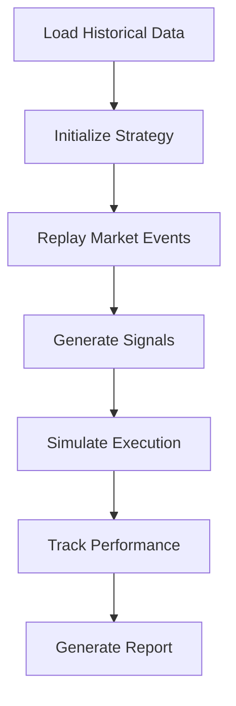
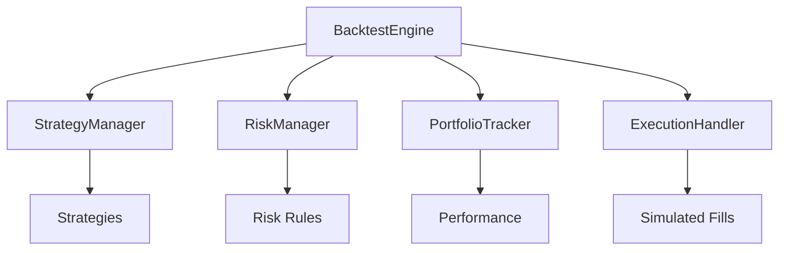

# cyberdelta/core/backtesting/ — Per-Folder Analysis (Updated June 2025)

## Overview
As of June 2025, the backtesting module is planned but not yet implemented. This document outlines the intended architecture and features based on the system design.

---

## Planned Architecture

### Core Components (Planned)

#### BacktestEngine
**Purpose:**
Main backtesting engine to simulate trading strategies on historical data.



**Planned Features:**
- **Event-Driven Architecture**: Replay market events in chronological order
- **Multi-Exchange Support**: Backtest across Hyperliquid and Backpack
- **Realistic Execution**: Model slippage, fees, and latency
- **Performance Metrics**: Comprehensive analytics and reporting

#### BacktestDataLoader
**Purpose:**
Load and prepare historical data for backtesting.

**Planned Features:**
- **Multiple Data Sources**: Support for various data formats
- **Data Validation**: Ensure data quality and completeness
- **Efficient Storage**: Optimized data structures for fast access
- **Time Range Selection**: Flexible period selection

#### BacktestExecutor
**Purpose:**
Simulate order execution with realistic market conditions.

**Planned Features:**
- **Order Book Simulation**: Realistic fill modeling
- **Latency Simulation**: Model network and processing delays
- **Fee Calculation**: Accurate fee modeling per exchange
- **Partial Fill Handling**: Realistic order filling

---

## Planned Features

### 1. Strategy Testing Framework
```python
class BacktestStrategy(Protocol):
    """Interface for backtest-compatible strategies"""

    async def on_market_data(
        self,
        data: MarketData,
        portfolio: PortfolioState
    ) -> list[TradeSignal]:
        """Process data and generate signals"""

    async def on_fill(
        self,
        fill: Fill,
        portfolio: PortfolioState
    ) -> None:
        """Handle fill notifications"""
```

### 2. Performance Analytics
```python
class BacktestResults:
    """Comprehensive backtest results"""

    # Returns metrics
    total_return: Decimal
    annualized_return: Decimal
    sharpe_ratio: Decimal
    sortino_ratio: Decimal

    # Risk metrics
    max_drawdown: Decimal
    value_at_risk: Decimal
    beta: Decimal

    # Trading metrics
    win_rate: Decimal
    profit_factor: Decimal
    average_trade_duration: timedelta
```

### 3. Visualization
- **Equity Curve**: Portfolio value over time
- **Drawdown Chart**: Underwater equity chart
- **Trade Analysis**: Entry/exit points on price charts
- **Performance Attribution**: Breakdown by strategy/asset

---

## Integration Points

### With Core Components


### Data Requirements
- **Historical Market Data**: OHLCV, order books, trades
- **Funding Rates**: Historical funding data
- **Exchange Fees**: Historical fee schedules
- **System Latency**: Network delay profiles

---

## Planned Implementation Timeline

### Phase 1: Core Framework
- Basic event-driven engine
- Simple execution simulation
- Basic performance metrics

### Phase 2: Advanced Features
- Realistic order book simulation
- Multi-exchange backtesting
- Advanced analytics

### Phase 3: Optimization
- Parallel backtesting
- Walk-forward analysis
- Parameter optimization

---

## Best Practices (Planned)

### 1. Avoid Look-Ahead Bias
```python
# Ensure data is only available when it would be in real trading
async def get_available_data(timestamp: datetime) -> MarketData:
    # Return only data available before timestamp
    # Account for data delays
```

### 2. Realistic Execution
```python
# Model realistic fills based on order book depth
def simulate_fill(
    order: Order,
    orderbook: OrderBook,
    latency_ms: int
) -> Fill:
    # Account for:
    # - Order book impact
    # - Latency
    # - Partial fills
```

### 3. Comprehensive Validation
```python
# Validate backtest results
def validate_results(results: BacktestResults) -> None:
    # Check for:
    # - Impossible fills
    # - Negative balances
    # - Data gaps
```

---

## Future Enhancements

### 1. Machine Learning Integration
- Feature engineering pipeline
- Model training on backtest data
- Walk-forward validation

### 2. Monte Carlo Simulation
- Random parameter sampling
- Confidence intervals
- Risk analysis

### 3. Multi-Strategy Optimization
- Portfolio optimization
- Strategy correlation analysis
- Dynamic allocation

### 4. Cloud-Based Backtesting
- Distributed processing
- Large-scale parameter sweeps
- Result storage and sharing

---

## Notes
This module is currently in the planning phase. Implementation will follow the architecture and patterns established in the core trading engine, ensuring consistency and reusability of components.
