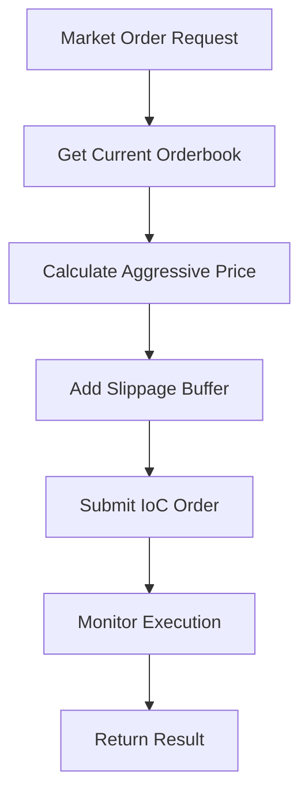
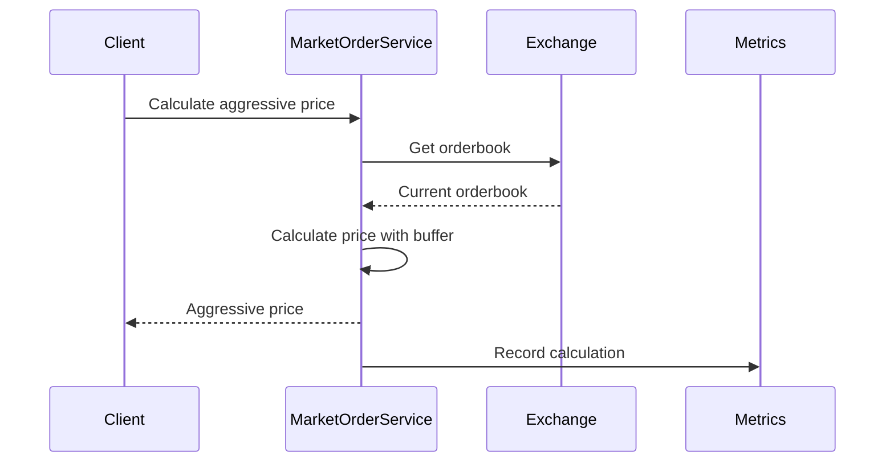
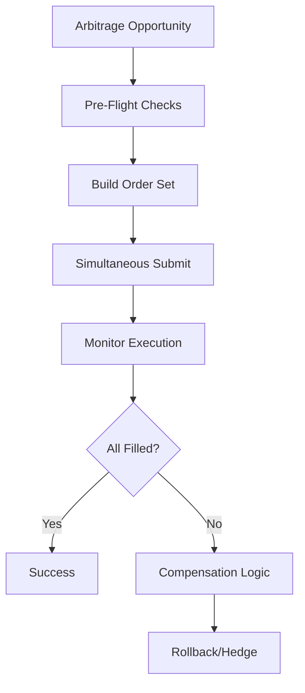
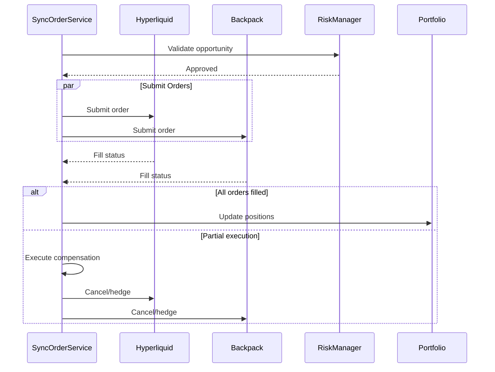

# cyberdelta/core/execution/ — Per-Folder Analysis (Updated June 2025)

## Overview
The execution package has been significantly enhanced since April 2025 with the addition of market order support, improved synchronization mechanisms, and better error handling. This module is critical for safe and reliable trade execution across multiple exchanges.

---

## Architecture Evolution

### Key Improvements Since April 2025:
1. **Market Order Support**: New subsystem for aggressive market orders using IoC limits
2. **Enhanced Synchronization**: Improved multi-exchange order coordination
3. **Better Error Recovery**: Comprehensive compensation mechanisms
4. **Performance Metrics**: Detailed execution analytics
5. **Modular Design**: Clear separation of order types and services

---

## Core Components

### orders/market_order.py
**Purpose:**
Implements market order functionality for exchanges without native market order support, using aggressive IoC (Immediate-or-Cancel) limit orders.



```python
class MarketOrder:
    """Executes market orders using aggressive IoC limit orders"""

    async def execute_market_order(
        self,
        symbol: str,
        side: OrderSide,
        quantity: Decimal,
        max_slippage_bps: int = 50,
    ) -> Order:
        """Execute a market order with slippage protection"""
        # Get current orderbook
        # Calculate aggressive price
        # Submit IoC order
        # Handle partial fills
```

**Key Features:**
- **Dynamic Pricing**: Real-time aggressive price calculation
- **Slippage Protection**: Configurable maximum slippage
- **Partial Fill Handling**: Manages incomplete executions
- **Performance Tracking**: Monitors execution quality

### orders/market_order_service.py
**Purpose:**
Service layer providing price calculation and order management for market orders.



```python
class MarketOrderService:
    """Service for market order operations"""

    async def calculate_aggressive_price(
        self,
        orderbook: OrderBook,
        side: OrderSide,
        quantity: Decimal,
        slippage_buffer_bps: int,
    ) -> Decimal:
        """Calculate price for aggressive execution"""
        # Analyze orderbook depth
        # Calculate weighted average price
        # Add slippage buffer
        # Validate against limits
```

**Features:**
- **Orderbook Analysis**: Depth-based price calculation
- **Weighted Pricing**: Considers order book liquidity
- **Price Validation**: Ensures reasonable execution prices
- **Metrics Collection**: Tracks pricing accuracy

### orders/market_order_config.py
**Purpose:**
Configuration for market order behavior and limits.

```python
@dataclass
class MarketOrderConfig:
    """Market order configuration"""

    # Slippage settings
    default_slippage_bps: int = 50
    max_slippage_bps: int = 200

    # Price buffer settings
    buy_buffer_bps: int = 10
    sell_buffer_bps: int = 10

    # Execution settings
    max_retries: int = 3
    retry_delay_ms: int = 100
```

### orders/market_order_errors.py
**Purpose:**
Specialized error types for market order operations.

```python
class MarketOrderError(Exception):
    """Base exception for market order errors"""

class InsufficientLiquidityError(MarketOrderError):
    """Raised when orderbook lacks liquidity"""

class ExcessiveSlippageError(MarketOrderError):
    """Raised when slippage exceeds limits"""
```

### orders/market_order_metrics.py
**Purpose:**
Metrics collection for market order performance.

```python
@dataclass
class MarketOrderMetrics:
    """Metrics for market order execution"""

    execution_time_ms: int
    slippage_bps: Decimal
    fill_rate: Decimal
    aggressive_price: Decimal
    executed_price: Decimal
```

---

## Synchronized Execution

### synchronized_order_submission.py
**Purpose:**
Coordinates simultaneous order submission across multiple exchanges for arbitrage strategies with atomic execution guarantees.





**Enhanced Features:**
- **Atomic Execution**: All-or-nothing order sets
- **Pre-Flight Validation**: Comprehensive checks before execution
- **Smart Compensation**: Intelligent unwinding of partial fills
- **Circuit Breaker Integration**: Safety mechanisms
- **Detailed Tracking**: Execution audit trail

```python
class SynchronizedOrderSubmissionService:
    """Manages synchronized multi-exchange orders"""

    async def submit_arbitrage_orders(
        self,
        opportunity: ArbitrageOpportunity,
        mode: ExecutionMode = ExecutionMode.SIMULTANEOUS,
    ) -> ExecutionResult:
        """Submit orders for arbitrage opportunity"""

        # Pre-flight checks
        await self._validate_opportunity(opportunity)

        # Build order set
        orders = self._build_order_set(opportunity)

        # Submit simultaneously
        results = await self._submit_orders_atomic(orders)

        # Handle partial execution
        if not self._all_orders_filled(results):
            await self._compensate_partial_execution(results)

        return self._build_execution_result(results)
```

**Execution Modes:**
```python
class ExecutionMode(Enum):
    """Order submission modes"""

    SIMULTANEOUS = "simultaneous"  # Parallel submission
    SEQUENTIAL = "sequential"      # Order-by-order
    STAGED = "staged"             # Phased execution
```

**Compensation Strategies:**
```python
class CompensationStrategy(Enum):
    """Strategies for handling partial fills"""

    CANCEL_UNFILLED = "cancel_unfilled"     # Cancel remaining orders
    MARKET_CLOSE = "market_close"           # Close at market
    HEDGE_POSITION = "hedge_position"       # Create offsetting position
    ACCEPT_RISK = "accept_risk"             # Keep partial position
```

---

## Error Handling and Recovery

### Execution Error Hierarchy
```python
class ExecutionError(Exception):
    """Base execution error"""

class PartialExecutionError(ExecutionError):
    """Partial fill across exchanges"""
    filled_orders: list[Order]
    failed_orders: list[Order]

class CompensationFailedError(ExecutionError):
    """Failed to compensate partial execution"""
    original_error: ExecutionError
    compensation_attempts: list[CompensationAttempt]
```

### Recovery Mechanisms
```python
async def handle_execution_failure(
    self,
    error: ExecutionError,
    opportunity: ArbitrageOpportunity,
) -> RecoveryResult:
    """Handle execution failures with recovery"""

    if isinstance(error, PartialExecutionError):
        # Attempt compensation
        return await self._compensate_partial(error)

    elif isinstance(error, OrderRejectedError):
        # Retry with adjusted parameters
        return await self._retry_with_adjustment(error)

    else:
        # Log and alert
        await self._alert_critical_failure(error)
        raise
```

---

## Performance and Metrics

### Execution Analytics
```python
@dataclass
class ExecutionAnalytics:
    """Comprehensive execution metrics"""

    # Timing metrics
    total_latency_ms: int
    order_latency_ms: dict[str, int]

    # Execution quality
    slippage_bps: Decimal
    fill_rate: Decimal

    # Cost analysis
    fees_paid: Decimal
    market_impact: Decimal

    # Success metrics
    success_rate: Decimal
    compensation_rate: Decimal
```

### Real-time Monitoring
```python
class ExecutionMonitor:
    """Real-time execution monitoring"""

    async def track_execution(
        self,
        execution_id: str,
        orders: list[Order],
    ) -> None:
        """Monitor execution in real-time"""

        # Track order status
        # Calculate metrics
        # Alert on anomalies
        # Update dashboards
```

---

## Best Practices and Patterns

### 1. Always Use Type-Safe Execution
```python
# Good - Type-safe with validation
result = await executor.submit_orders(
    orders=validated_orders,
    mode=ExecutionMode.SIMULTANEOUS,
    timeout_ms=5000
)

# Bad - Raw parameters without validation
result = await executor.submit_orders(orders, "simultaneous", 5000)
```

### 2. Handle All Execution Scenarios
```python
try:
    result = await submit_arbitrage_orders(opportunity)

    if result.is_partial:
        # Handle partial execution
        compensation = await compensate_partial(result)

    elif result.is_complete:
        # Update portfolio
        await update_positions(result)

except ExecutionError as e:
    # Structured error handling
    recovery = await handle_execution_error(e)
```

### 3. Monitor Execution Quality
```python
# Track execution metrics
metrics = ExecutionMetrics()
metrics.record_execution(
    latency_ms=execution_time,
    slippage_bps=calculate_slippage(expected, actual),
    success=result.is_complete
)

# Alert on degradation
if metrics.rolling_success_rate < 0.95:
    await alert_execution_degradation(metrics)
```

### 4. Use Circuit Breakers
```python
# Integrate with circuit breakers
if circuit_breaker.is_open("execution"):
    raise CircuitBreakerOpenError("Execution circuit breaker is open")

try:
    result = await execute_with_breaker(orders)
except ExecutionError:
    circuit_breaker.record_failure("execution")
    raise
```

---

## Future Enhancements

### 1. Advanced Order Types
- **Iceberg Orders**: Hidden quantity execution
- **TWAP/VWAP**: Time/Volume weighted execution
- **Adaptive Orders**: Dynamic parameter adjustment

### 2. Smart Order Routing
- **Liquidity Aggregation**: Route to best liquidity
- **Cross-Exchange Arbitrage**: Optimize routing
- **Dynamic Venue Selection**: Real-time venue choice

### 3. Machine Learning Integration
- **Execution Prediction**: ML-based timing
- **Slippage Prediction**: Optimize aggressiveness
- **Anomaly Detection**: Identify unusual patterns

### 4. Enhanced Analytics
- **Real-time Dashboards**: Execution monitoring
- **Historical Analysis**: Performance trends
- **A/B Testing**: Strategy comparison
