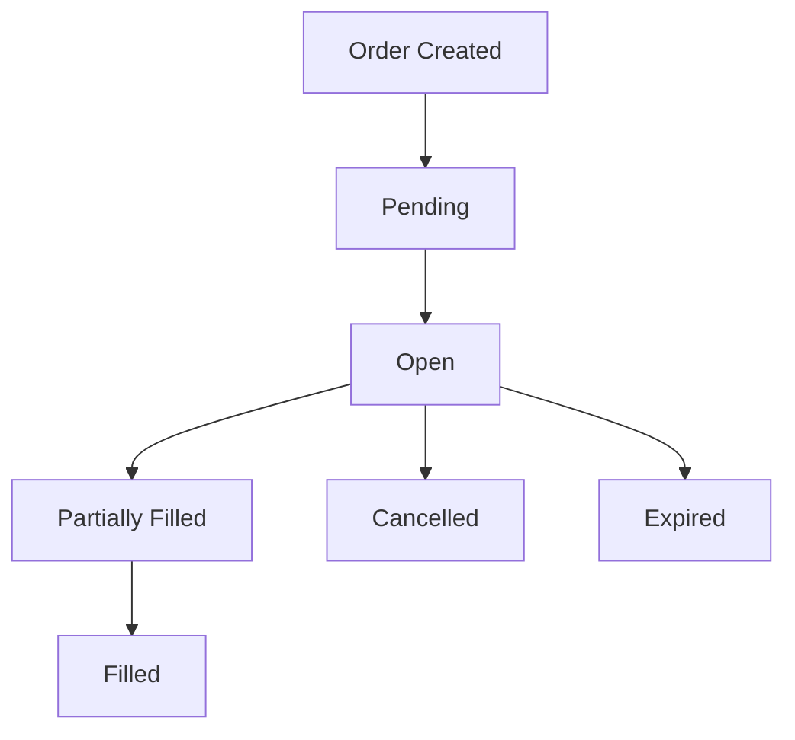

# cyberdelta/core/models/ — Per-Folder Analysis (Updated June 2025)

## Overview
The core models package has undergone a complete transformation since April 2025, migrating to Pydantic V2 and implementing the "Core + Typed Extension Slots" pattern for exchange-specific data while maintaining universal fields across all exchanges.

---

## Architecture Evolution

### Key Changes Since April 2025:
1. **Full Pydantic V2 Migration**: All models now use `ConfigDict` and modern validators
2. **Core + Extension Pattern**: Universal fields with exchange-specific slots
3. **Enhanced Type Safety**: Comprehensive validation with custom parsers
4. **Modular Structure**: Organized into logical subpackages (market/, operations/)
5. **Immutable by Default**: Most models are frozen for data integrity

---

## Core Design Pattern

### Core + Typed Extension Slots
```python
class Order(BaseModel):
    """Core order model with universal fields"""
    # Universal fields
    id: str
    symbol: str
    side: OrderSide
    quantity: Decimal

    # Exchange-specific extension slots
    hyperliquid_details: HyperliquidOrderDetails | None = None
    backpack_details: BackpackOrderDetails | None = None
```

This pattern provides:
- **Type Safety**: Strongly typed exchange-specific data
- **Flexibility**: Easy to add new exchanges
- **Validation**: Exchange-specific validation rules
- **Performance**: No runtime type checking overhead

---

## Enumerations

### enums.py
**Purpose:**
Comprehensive enumerations for all trading concepts with clear semantics.

```python
class OrderSide(str, Enum):
    """Order side enumeration"""
    BUY = "buy"
    SELL = "sell"

class OrderType(str, Enum):
    """Order type enumeration"""
    LIMIT = "limit"
    MARKET = "market"
    STOP = "stop"
    STOP_LIMIT = "stop_limit"

class OrderStatus(str, Enum):
    """Order status enumeration"""
    PENDING = "pending"
    OPEN = "open"
    PARTIALLY_FILLED = "partially_filled"
    FILLED = "filled"
    CANCELLED = "cancelled"
    EXPIRED = "expired"
    REJECTED = "rejected"
```

**New Enums Since April 2025:**
- `OrderExpiryReason`: Why an order expired
- `OrderUpdateOrigin`: Source of order updates
- `SelfTradePrevention`: STP modes
- `TriggerType`: Order trigger types
- `CancelOrderResultStatus`: Cancellation results

---

## Market Data Models

### market/order_book.py
**Purpose:**
Immutable orderbook representation with efficient access patterns.

```python
class OrderBook(BaseModel):
    """Immutable orderbook snapshot"""
    model_config = ConfigDict(frozen=True)

    symbol: str
    bids: list[tuple[Decimal, Decimal]]  # (price, quantity)
    asks: list[tuple[Decimal, Decimal]]
    timestamp: datetime
    exchange: str

    @property
    def best_bid(self) -> tuple[Decimal, Decimal] | None:
        """Get best bid (price, quantity)"""
        return self.bids[0] if self.bids else None
```

### market/trade.py
**Purpose:**
Immutable trade representation with comprehensive metadata.

```python
class Trade(BaseModel):
    """Immutable trade record"""
    model_config = ConfigDict(frozen=True)

    id: str
    symbol: str
    price: Decimal
    quantity: Decimal
    side: OrderSide
    timestamp: datetime
    is_buyer_maker: bool
```

### market/ticker.py
**Purpose:**
24-hour rolling statistics for trading pairs.

```python
class Ticker(BaseModel):
    """24-hour ticker data"""
    model_config = ConfigDict(frozen=True)

    symbol: str
    last_price: Decimal
    bid_price: Decimal
    ask_price: Decimal
    volume_24h: Decimal
    high_24h: Decimal
    low_24h: Decimal
```

### market/funding_rate.py
**Purpose:**
Funding rate data for perpetual contracts.

```python
class FundingRate(BaseModel):
    """Funding rate information"""
    model_config = ConfigDict(frozen=True)

    symbol: str
    funding_rate: Decimal
    next_funding_time: datetime
    predicted_rate: Decimal | None = None
```

---

## Order Management

### market/order.py
**Purpose:**
Mutable order model supporting lifecycle updates with exchange-specific details.



```python
class Order(BaseModel):
    """Core order model (mutable for lifecycle updates)"""

    # Core fields
    id: str
    client_order_id: str | None = None
    symbol: str
    side: OrderSide
    order_type: OrderType
    quantity: Decimal
    price: Decimal | None = None

    # Status tracking
    status: OrderStatus = OrderStatus.PENDING
    filled_quantity: Decimal = Decimal("0")
    average_fill_price: Decimal | None = None

    # Exchange-specific slots
    hyperliquid_details: HyperliquidOrderDetails | None = None
    backpack_details: BackpackOrderDetails | None = None

    def update_fill(self, fill_qty: Decimal, fill_price: Decimal) -> None:
        """Update order with fill information"""
        # Update filled quantity and average price
        # Handle status transitions
```

### Exchange-Specific Order Details
```python
class HyperliquidOrderDetails(BaseModel):
    """Hyperliquid-specific order fields"""
    model_config = ConfigDict(frozen=True)

    order_type_wire: str
    reduce_only: bool
    cloid: str | None = None

class BackpackOrderDetails(BaseModel):
    """Backpack-specific order fields"""
    model_config = ConfigDict(frozen=True)

    order_type_raw: str
    self_trade_prevention: SelfTradePrevention
    post_only: bool
```

---

## Account Models

### spot_balance.py
**Purpose:**
Spot balance tracking with exchange-specific details.

```python
class SpotBalance(BaseModel):
    """Core spot balance model"""

    asset: str
    free: Decimal
    locked: Decimal
    exchange: str

    # Exchange-specific slots
    hyperliquid_details: HyperliquidSpotBalanceDetails | None = None
    backpack_details: BackpackSpotBalanceDetails | None = None

    @property
    def total(self) -> Decimal:
        """Total balance (free + locked)"""
        return self.free + self.locked
```

### derivative_position.py
**Purpose:**
Derivatives position tracking with P&L calculation.

```python
class DerivativePosition(BaseModel):
    """Core derivative position model"""

    symbol: str
    side: PositionSide
    contracts: Decimal
    entry_price: Decimal
    mark_price: Decimal
    unrealized_pnl: Decimal

    # Exchange-specific slots
    hyperliquid_details: HyperliquidPositionDetails | None = None
    backpack_details: BackpackPositionDetails | None = None
```

### margin_account.py
**Purpose:**
Margin account summary with risk metrics.

```python
class MarginAccountSummary(BaseModel):
    """Margin account overview"""

    total_balance: Decimal
    available_balance: Decimal
    margin_used: Decimal
    unrealized_pnl: Decimal

    @property
    def margin_ratio(self) -> Decimal:
        """Current margin utilization ratio"""
        if self.total_balance == 0:
            return Decimal("0")
        return self.margin_used / self.total_balance
```

---

## Trading Signals

### trade_signal.py
**Purpose:**
Strategy-generated trading signals with metadata.

```python
class TradeSignal(BaseModel):
    """Trading signal from strategies"""
    model_config = ConfigDict(frozen=True)

    id: str = Field(default_factory=lambda: str(uuid.uuid4()))
    strategy_id: str
    signal_type: SignalType
    symbol: str
    side: OrderSide
    quantity: Decimal
    price: Decimal | None = None
    confidence: Decimal = Field(ge=0, le=1)
    timestamp: datetime = Field(default_factory=lambda: datetime.now(UTC))
    expires_at: datetime
    metadata: dict[str, Any] = Field(default_factory=dict)
```

---

## Operations Models

### operations.py
**Purpose:**
Non-trading operations like transfers and withdrawals.

```python
class Transfer(BaseModel):
    """Asset transfer between accounts"""

    id: str
    asset: str
    amount: Decimal
    from_account: str
    to_account: str
    status: TransferStatus

    # Exchange-specific slots
    hyperliquid_details: HyperliquidTransferDetails | None = None
    backpack_details: BackpackTransferDetails | None = None

class Withdrawal(BaseModel):
    """Asset withdrawal from exchange"""

    id: str
    asset: str
    amount: Decimal
    destination: str
    status: WithdrawalStatus

    # Exchange-specific slots
    hyperliquid_details: HyperliquidWithdrawalDetails | None = None
    backpack_details: BackpackWithdrawalDetails | None = None
```

---

## Validation and Parsing

### Custom Validators
```python
# Field validators with Pydantic V2
@field_validator('quantity')
def validate_positive_quantity(cls, v: Decimal) -> Decimal:
    if v <= 0:
        raise ValueError("Quantity must be positive")
    return v

# Model validators
@model_validator(mode='after')
def validate_order_consistency(self) -> Self:
    if self.order_type == OrderType.MARKET and self.price is not None:
        raise ValueError("Market orders cannot have a price")
    return self
```

### Parsing Utilities
```python
# Type-safe parsing functions
def parse_decimal_value(value: Any) -> Decimal:
    """Parse any numeric value to Decimal safely"""
    if isinstance(value, Decimal):
        return value
    if isinstance(value, (int, float)):
        return Decimal(str(value))
    if isinstance(value, str):
        return Decimal(value.strip())
    raise ValueError(f"Cannot parse {type(value)} to Decimal")

def parse_datetime_utc(value: Any) -> datetime:
    """Parse datetime ensuring UTC timezone"""
    # Handle various datetime formats
    # Always return UTC-aware datetime
```

---

## Best Practices and Patterns

### 1. Immutability by Default
```python
# Immutable for data integrity
class MarketData(BaseModel):
    model_config = ConfigDict(frozen=True)

# Mutable only when necessary (e.g., Order lifecycle)
class Order(BaseModel):
    # No frozen=True, allows updates
```

### 2. Exchange-Specific Extensions
```python
# Always use typed slots pattern
class Position(BaseModel):
    # Core fields
    symbol: str
    quantity: Decimal

    # Typed extension slots
    hyperliquid_details: HyperliquidPositionDetails | None = None
    backpack_details: BackpackPositionDetails | None = None
```

### 3. Decimal for Financial Values
```python
# Always use Decimal for money
price: Decimal = Field(decimal_places=8)
quantity: Decimal = Field(gt=0)

# Never use float for financial calculations
# BAD: price: float
# GOOD: price: Decimal
```

### 4. Comprehensive Validation
```python
class OrderRequest(BaseModel):
    symbol: str = Field(min_length=1, max_length=20)
    quantity: Decimal = Field(gt=0, decimal_places=8)

    @field_validator('symbol')
    def validate_symbol_format(cls, v: str) -> str:
        if not v.replace('-', '').replace('/', '').isalnum():
            raise ValueError("Invalid symbol format")
        return v.upper()
```

---

## Migration Guidelines

### From Old Models to New:
1. Replace `Config` class with `model_config = ConfigDict(...)`
2. Add exchange-specific detail slots
3. Ensure all financial fields use `Decimal`
4. Add comprehensive validation
5. Make models immutable where appropriate

### Adding New Exchange:
1. Create exchange-specific detail models
2. Add slots to core models
3. Implement mappers in APIs
4. Add validation rules
5. Update tests

---

## Future Enhancements

### 1. Event Sourcing
- Track all model state changes
- Enable audit trail
- Support replay/recovery

### 2. Performance Optimization
- Implement `__slots__` for memory efficiency
- Add caching for computed properties
- Optimize validation for hot paths

### 3. Advanced Validation
- Cross-model validation rules
- Business logic constraints
- Market-specific validations

### 4. Serialization Improvements
- Custom JSON encoders for Decimal
- Binary serialization for performance
- Schema evolution support
