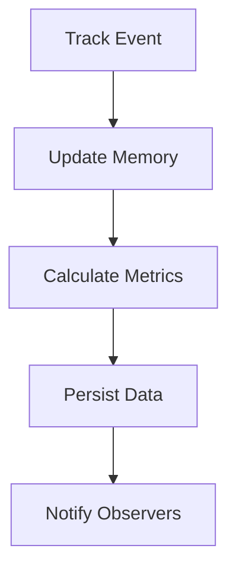
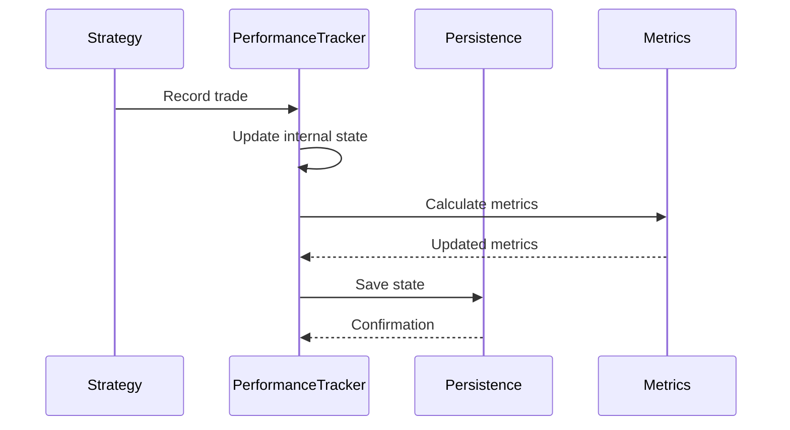
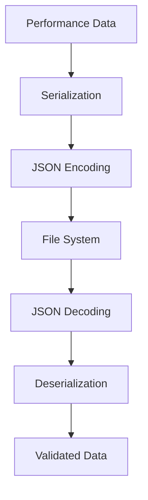
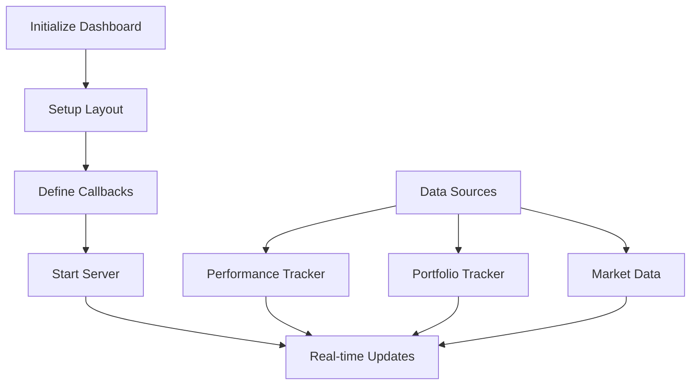

# cyberdelta/monitoring/ — Per-Folder Analysis (Updated June 2025)

## Overview
The monitoring module has evolved since April 2025 to provide comprehensive performance tracking, real-time analytics, and sophisticated metrics calculation. While the core functionality remains focused on performance monitoring, improvements have been made in data persistence and metric calculations.

---

## Architecture Evolution

### Key Improvements Since April 2025:
1. **Enhanced Metrics**: More sophisticated performance calculations
2. **Better Type Safety**: Migration towards Decimal for financial calculations
3. **Improved Persistence**: Thread-safe data storage mechanisms
4. **Real-time Capabilities**: Enhanced dashboard integration
5. **Simplified Options**: Lightweight tracker for testing/development

### Critical Issues Identified:
- **Float Usage**: Some components still use float for financial calculations (must be migrated to Decimal)
- **Data Integrity**: Need for better validation in persistence layer

---

## Core Components

### performance_tracker.py
**Purpose:**
Central hub for tracking all strategy performance data including returns, trades, signals, and funding rates with in-memory storage and persistence delegation.





**Key Features:**
- **Thread-Safe Operations**: Concurrent access handling
- **Event Tracking**: Trades, signals, returns, funding rates
- **Metric Calculation**: Real-time performance metrics
- **Data Persistence**: Automatic saving and recovery

**Critical Migration Required:**
```python
# Current (INCORRECT)
self.returns: dict[str, float] = {}  # Must use Decimal

# Required (CORRECT)
self.returns: dict[str, Decimal] = {}
```

### performance_metrics.py
**Purpose:**
Provides static methods for calculating comprehensive financial performance metrics with proper handling of edge cases and data validation.

```python
class PerformanceMetricsCalculator:
    """Calculate financial performance metrics"""

    @staticmethod
    def calculate_sharpe_ratio(
        returns: pd.Series[float],  # Should be Decimal
        risk_free_rate: Decimal = Decimal("0.0"),
        periods_per_year: int = 252,
    ) -> Decimal:
        """Calculate annualized Sharpe ratio"""

    @staticmethod
    def calculate_sortino_ratio(
        returns: pd.Series[float],  # Should be Decimal
        risk_free_rate: Decimal = Decimal("0.0"),
        periods_per_year: int = 252,
    ) -> Decimal:
        """Calculate Sortino ratio (downside deviation)"""

    @staticmethod
    def calculate_max_drawdown(
        returns: pd.Series[float]  # Should be Decimal
    ) -> tuple[Decimal, int, int]:
        """Calculate maximum drawdown and duration"""
```

**Metrics Provided:**
- **Risk-Adjusted Returns**: Sharpe, Sortino, Calmar ratios
- **Drawdown Analysis**: Maximum drawdown, duration, recovery
- **Trade Statistics**: Win rate, profit factor, average trade
- **Return Analysis**: Annualized returns, volatility

### persistence.py
**Purpose:**
Thread-safe persistence layer for all performance data with JSON serialization and type-safe loading.



**Key Features:**
- **Thread Safety**: Locking for concurrent access
- **Custom Serialization**: Handles Decimal, datetime, complex types
- **Atomic Writes**: Prevents corruption during saves
- **Data Validation**: Type checking on load

```python
class PerformanceDataPersistence:
    """Thread-safe data persistence"""

    def save_all_data(self) -> None:
        """Atomically save all performance data"""
        with self._lock:
            # Prepare data
            # Custom JSON encoding
            # Atomic file write

    def load_all_data(self) -> dict[str, Any]:
        """Load and validate persisted data"""
        with self._lock:
            # Read file
            # Decode JSON
            # Validate types
            # Return data
```

---

## Dashboard and Visualization

### real_time_dashboard.py (Planned Enhancement)
**Purpose:**
Web-based real-time dashboard for monitoring live trading performance using Dash and Plotly.



**Planned Features:**
- **Live Charts**: P&L, drawdown, positions
- **Trade Analysis**: Entry/exit visualization
- **Risk Metrics**: Real-time risk exposure
- **Strategy Comparison**: Multi-strategy performance

### dashboard_integration.py
**Purpose:**
Bridge between trading components and dashboard visualization.

```python
class DashboardIntegration:
    """Integrate dashboard with trading system"""

    def __init__(
        self,
        performance_tracker: PerformanceTracker,
        portfolio_tracker: PortfolioTracker,
    ):
        self._performance = performance_tracker
        self._portfolio = portfolio_tracker

    async def start_dashboard(self) -> None:
        """Start dashboard server"""

    async def update_dashboard(self) -> None:
        """Push updates to dashboard"""
```

---

## Simplified Alternative

### simplified_performance_tracker.py
**Purpose:**
Lightweight performance tracking for testing and development with minimal dependencies.

```python
@dataclass
class SimpleSignal:
    """Lightweight signal representation"""
    timestamp: datetime
    strategy_id: str
    symbol: str
    side: str
    confidence: Decimal

class SimplePerformanceTracker:
    """Minimal performance tracking"""

    def track_signal(self, signal: SimpleSignal) -> None:
        """Track trading signal"""

    def export_to_csv(self, filepath: str) -> None:
        """Export data to CSV"""
```

**Use Cases:**
- **Unit Testing**: Minimal overhead for tests
- **Development**: Quick prototyping
- **Analysis**: Simple data export

---

## Best Practices and Patterns

### 1. Always Use Decimal for Financial Values
```python
# CORRECT
returns: dict[str, Decimal] = {}
pnl = Decimal("100.50")
sharpe_ratio = Decimal("1.5")

# INCORRECT - Never use float
returns: dict[str, float] = {}  # NO!
pnl = 100.50  # NO!
```

### 2. Thread-Safe Operations
```python
class PerformanceTracker:
    def __init__(self):
        self._lock = threading.Lock()

    def track_trade(self, trade: Trade) -> None:
        with self._lock:
            # Thread-safe update
            self._trades.append(trade)
            self._update_metrics()
```

### 3. Atomic Persistence
```python
def save_data(self, data: dict[str, Any]) -> None:
    """Save data atomically"""
    temp_file = f"{self.filepath}.tmp"

    # Write to temp file
    with open(temp_file, 'w') as f:
        json.dump(data, f, cls=CustomJSONEncoder)

    # Atomic rename
    os.replace(temp_file, self.filepath)
```

### 4. Metric Calculation with Validation
```python
def calculate_metric(returns: pd.Series) -> Decimal:
    """Calculate metric with validation"""

    # Validate input
    if returns.empty:
        return Decimal("0")

    if returns.std() == 0:
        logger.warning("Zero variance in returns")
        return Decimal("0")

    # Calculate metric
    # ...
```

---

## Migration Requirements

### 1. Float to Decimal Migration
All financial calculations must use Decimal:
```python
# Files requiring migration:
# - performance_tracker.py: returns, pnl calculations
# - performance_metrics.py: metric calculations
# - persistence.py: ensure Decimal serialization

# Migration pattern:
# Before
value: float = 100.0

# After
value: Decimal = Decimal("100.0")
```

### 2. Enhanced Type Safety
```python
# Use TypedDict for structured data
class TradeRecord(TypedDict):
    timestamp: datetime
    symbol: str
    side: OrderSide
    quantity: Decimal
    price: Decimal
    pnl: Decimal
```

### 3. Improved Validation
```python
def validate_performance_data(data: dict) -> None:
    """Validate loaded performance data"""

    # Check required fields
    required = ["trades", "returns", "metrics"]
    for field in required:
        if field not in data:
            raise ValueError(f"Missing required field: {field}")

    # Validate types
    # Validate ranges
    # Check consistency
```

---

## Future Enhancements

### 1. Advanced Analytics
- **Factor Analysis**: Attribute returns to factors
- **Risk Decomposition**: Break down risk by source
- **Correlation Analysis**: Strategy correlation matrix
- **Performance Attribution**: Detailed P&L breakdown

### 2. Real-time Dashboard
- **WebSocket Updates**: Live data streaming
- **Interactive Charts**: Zoom, pan, filter
- **Custom Indicators**: User-defined metrics
- **Mobile Support**: Responsive design

### 3. Machine Learning Integration
- **Anomaly Detection**: Identify unusual patterns
- **Performance Prediction**: Forecast metrics
- **Strategy Classification**: Cluster similar strategies
- **Adaptive Monitoring**: Dynamic thresholds

### 4. Enhanced Persistence
- **Database Backend**: PostgreSQL/MongoDB support
- **Time-Series Storage**: Optimized for metrics
- **Compression**: Efficient storage
- **Replication**: Data redundancy
