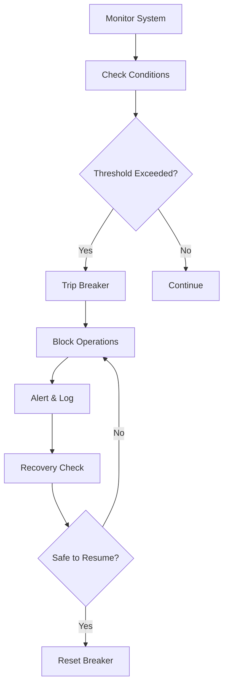
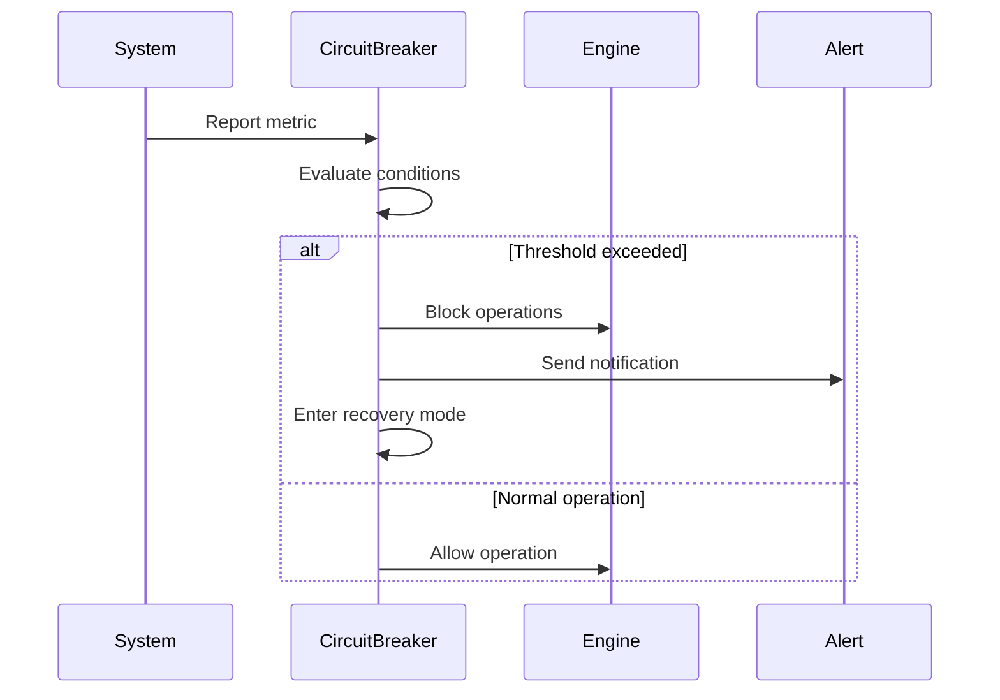
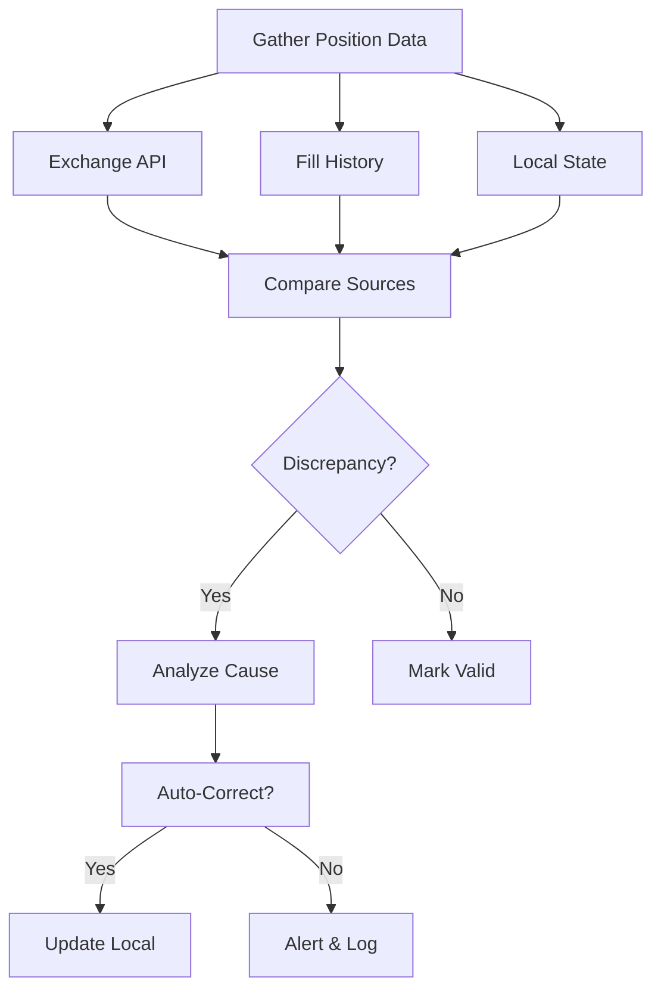
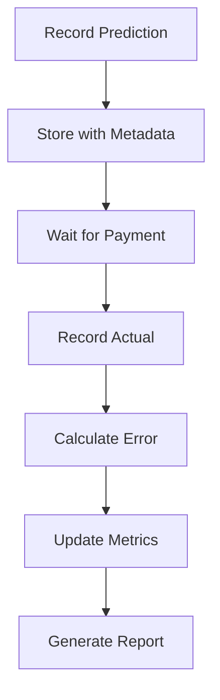
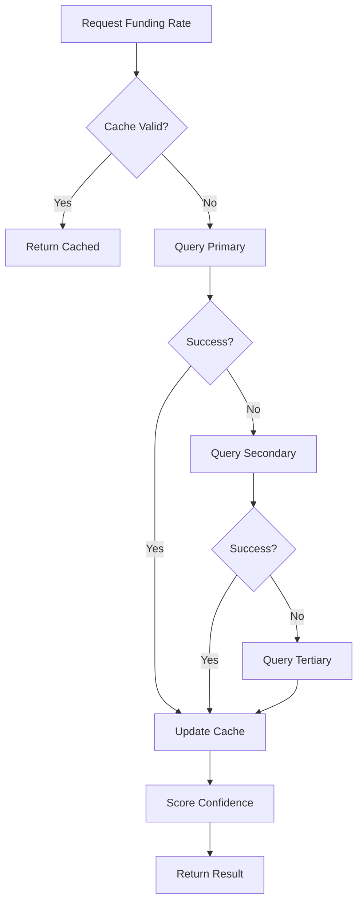

# cyberdelta/validation/ — Per-Folder Analysis (Updated June 2025)

## Overview
The validation module has evolved since April 2025 to provide comprehensive safety mechanisms, data validation, and system integrity checks. This critical module ensures trading operations remain within safe parameters and data quality is maintained throughout the system.

---

## Architecture Evolution

### Key Improvements Since April 2025:
1. **Enhanced Circuit Breakers**: More sophisticated safety conditions
2. **Better Position Reconciliation**: Multi-source validation
3. **Improved Funding Validation**: Advanced metrics and reporting
4. **Type Safety**: Consistent use of Decimal for financial values
5. **Modular Design**: Clear separation of validation concerns

---

## Core Components

### circuit_breaker.py
**Purpose:**
Comprehensive circuit breaker system that monitors system health and halts operations under dangerous conditions, preventing catastrophic losses.





**Breaker Types:**
```python
class CircuitBreakerType(Enum):
    """Types of circuit breakers"""

    DRAWDOWN = "drawdown"              # Max portfolio drawdown
    VOLATILITY = "volatility"          # Market volatility spike
    API_ERRORS = "api_errors"          # Exchange API failures
    LIQUIDITY = "liquidity"            # Insufficient market liquidity
    POSITION_MISMATCH = "position"     # Position reconciliation failure
    EXECUTION_FAILURE = "execution"    # Order execution issues
    FUNDING_RATE = "funding_rate"      # Abnormal funding rates
```

**Configuration:**
```python
@dataclass
class CircuitBreakerConfig:
    """Circuit breaker configuration"""

    # Drawdown breaker
    max_drawdown_pct: Decimal = Decimal("10.0")

    # Volatility breaker
    max_volatility_spike: Decimal = Decimal("5.0")

    # API error breaker
    max_api_errors_per_minute: int = 10

    # Recovery settings
    recovery_cooldown_seconds: int = 300
    test_mode_duration_seconds: int = 60
```

**Key Features:**
- **Multi-Condition Monitoring**: Tracks various risk factors
- **State Management**: Open, closed, half-open states
- **Recovery Testing**: Gradual resumption of operations
- **Custom Breakers**: Extensible for new conditions
- **Integration**: Works with all system components

### position_reconciliation.py
**Purpose:**
Validates position consistency across multiple data sources, detecting and correcting discrepancies to maintain accurate portfolio state.



**Reconciliation Process:**
```python
class PositionReconciliationSystem:
    """Multi-source position validation"""

    async def reconcile_positions(self) -> ReconciliationResult:
        """Reconcile positions across sources"""

        # Gather data from all sources
        api_positions = await self._get_api_positions()
        fill_positions = await self._calculate_from_fills()
        local_positions = self._portfolio_tracker.get_positions()

        # Compare and detect discrepancies
        discrepancies = self._compare_positions(
            api_positions,
            fill_positions,
            local_positions
        )

        # Handle discrepancies
        if discrepancies:
            await self._handle_discrepancies(discrepancies)

        return ReconciliationResult(
            discrepancies=discrepancies,
            corrected=self._corrections_made
        )
```

**Discrepancy Types:**
```python
class DiscrepancyType(Enum):
    """Types of position discrepancies"""

    QUANTITY_MISMATCH = "quantity_mismatch"
    MISSING_POSITION = "missing_position"
    EXTRA_POSITION = "extra_position"
    SIDE_MISMATCH = "side_mismatch"
    PRICE_MISMATCH = "price_mismatch"
```

### funding_rate_validator.py
**Purpose:**
Validates funding rate predictions against actual payments, tracking model accuracy and providing feedback for improvement.



**Validation Metrics:**
```python
class ValidationMetrics:
    """Funding rate validation metrics"""

    def calculate_rmse(self) -> Decimal:
        """Root Mean Square Error"""

    def calculate_mae(self) -> Decimal:
        """Mean Absolute Error"""

    def calculate_bias(self) -> Decimal:
        """Systematic bias in predictions"""

    def calculate_hit_rate(self, threshold: Decimal) -> Decimal:
        """Percentage within threshold"""
```

**Tracking System:**
```python
class FundingRateValidator:
    """Validate funding predictions"""

    def record_prediction(
        self,
        symbol: str,
        predicted_rate: Decimal,
        confidence: Decimal,
        method: str,
    ) -> None:
        """Record a funding rate prediction"""

    def record_payment(
        self,
        symbol: str,
        actual_rate: Decimal,
        payment_time: datetime,
    ) -> None:
        """Record actual funding payment"""

    def get_validation_report(
        self,
        period: timedelta,
    ) -> ValidationReport:
        """Generate validation report"""
```

### multi_tier_funding_provider.py
**Purpose:**
Aggregates funding rate data from multiple sources with confidence scoring and fallback mechanisms.



**Multi-Tier Architecture:**
```python
class MultiTierFundingProvider:
    """Multi-source funding rate provider"""

    def __init__(self):
        self._tiers = {
            "primary": PrimarySource(),
            "secondary": SecondarySource(),
            "tertiary": TertiarySource(),
        }
        self._cache = FundingCache()

    async def get_funding_rate(
        self,
        symbol: str,
    ) -> IntegratedFundingData:
        """Get funding rate with confidence"""

        # Check cache first
        if cached := self._cache.get(symbol):
            return cached

        # Query sources in order
        for tier_name, source in self._tiers.items():
            try:
                data = await source.get_rate(symbol)
                confidence = self._score_confidence(
                    data, tier_name
                )
                return IntegratedFundingData(
                    rate=data.rate,
                    confidence=confidence,
                    source=tier_name
                )
            except SourceError:
                continue

        raise NoDataAvailableError(f"No funding data for {symbol}")
```

### funding_data.py
**Purpose:**
Data models for funding rate information with comprehensive validation and type safety.

```python
@dataclass
class FundingData:
    """Core funding rate data"""

    symbol: str
    funding_rate: Decimal
    next_funding_time: datetime
    source: DataSource
    timestamp: datetime = field(default_factory=lambda: datetime.now(UTC))

    def __post_init__(self) -> None:
        """Validate funding data"""
        if abs(self.funding_rate) > Decimal("1.0"):
            raise ValueError("Funding rate exceeds 100%")

@dataclass
class IntegratedFundingData:
    """Funding data with confidence scoring"""

    data: FundingData
    confidence_score: Decimal = field(ge=Decimal("0"), le=Decimal("1"))
    sources_consulted: list[DataSource]
    integration_method: str

@dataclass
class ArbitrageOpportunity:
    """Funding arbitrage opportunity"""

    symbol: str
    long_exchange: str
    short_exchange: str
    funding_spread: Decimal
    expected_pnl: Decimal
    confidence: Decimal
    expires_at: datetime
```

### models/discrepancy_detail.py
**Purpose:**
Detailed models for position discrepancies with full context.

```python
@dataclass
class DiscrepancyDetail:
    """Detailed discrepancy information"""

    discrepancy_type: DiscrepancyType
    symbol: str
    source1_name: str
    source1_value: Any
    source2_name: str
    source2_value: Any
    magnitude: Decimal
    timestamp: datetime

    @property
    def is_critical(self) -> bool:
        """Check if discrepancy is critical"""
        return self.magnitude > CRITICAL_THRESHOLD
```

---

## Best Practices and Patterns

### 1. Fail-Safe Defaults
```python
# Always default to safe state
class CircuitBreaker:
    def __init__(self):
        self._state = BreakerState.OPEN  # Start closed
        self._default_action = Action.BLOCK  # Block by default
```

### 2. Comprehensive Validation
```python
def validate_position(position: Position) -> ValidationResult:
    """Validate position data"""

    errors = []

    # Check required fields
    if not position.symbol:
        errors.append("Missing symbol")

    # Check value ranges
    if position.quantity <= 0:
        errors.append("Invalid quantity")

    # Check consistency
    if position.mark_price <= 0:
        errors.append("Invalid mark price")

    return ValidationResult(
        is_valid=len(errors) == 0,
        errors=errors
    )
```

### 3. Gradual Recovery
```python
async def recover_from_breaker(self) -> None:
    """Gradual recovery from tripped breaker"""

    # Enter test mode
    self._state = BreakerState.HALF_OPEN

    # Allow limited operations
    await self._test_recovery()

    # Check results
    if self._test_successful():
        self._state = BreakerState.CLOSED
    else:
        self._state = BreakerState.OPEN
```

### 4. Multi-Source Validation
```python
def validate_across_sources(
    data: dict[str, Any]
) -> ConsensusResult:
    """Validate data across multiple sources"""

    # Get data from all sources
    results = {}
    for source in self._sources:
        results[source.name] = source.get_data()

    # Find consensus
    consensus = self._find_consensus(results)

    # Flag outliers
    outliers = self._identify_outliers(results, consensus)

    return ConsensusResult(
        consensus=consensus,
        outliers=outliers,
        confidence=self._calculate_confidence(results)
    )
```

---

## Integration Examples

### With Trading Engine
```python
class TradingEngine:
    def __init__(self):
        self._circuit_breaker = CircuitBreakerSystem()
        self._reconciler = PositionReconciliationSystem()

    async def execute_trade(self, signal: TradeSignal) -> None:
        # Check circuit breakers
        if self._circuit_breaker.is_tripped():
            raise TradingHaltedError("Circuit breaker active")

        # Validate positions before trade
        reconciliation = await self._reconciler.reconcile()
        if reconciliation.has_critical_discrepancies():
            raise PositionMismatchError("Critical position mismatch")

        # Execute trade
        await self._executor.execute(signal)
```

### With Risk Management
```python
class RiskManager:
    def __init__(self):
        self._funding_validator = FundingRateValidator()

    def assess_funding_risk(
        self,
        position: Position
    ) -> RiskAssessment:
        # Get validated funding rate
        funding = self._funding_validator.get_validated_rate(
            position.symbol
        )

        # Calculate risk based on confidence
        if funding.confidence < Decimal("0.8"):
            return RiskAssessment(
                level=RiskLevel.HIGH,
                reason="Low funding confidence"
            )
```

---

## Future Enhancements

### 1. Machine Learning Validation
- **Anomaly Detection**: ML-based unusual pattern detection
- **Predictive Breakers**: Anticipate issues before they occur
- **Adaptive Thresholds**: Dynamic threshold adjustment

### 2. Advanced Reconciliation
- **Blockchain Verification**: On-chain position verification
- **Multi-Exchange Netting**: Cross-exchange position netting
- **Historical Analysis**: Pattern detection in discrepancies

### 3. Enhanced Circuit Breakers
- **Cascading Breakers**: Hierarchical breaker system
- **Market-Wide Halts**: Coordinate with market conditions
- **Intelligent Recovery**: ML-based recovery strategies

### 4. Real-time Monitoring
- **Dashboard Integration**: Visual breaker status
- **Alert System**: Multi-channel notifications
- **Audit Trail**: Complete validation history
