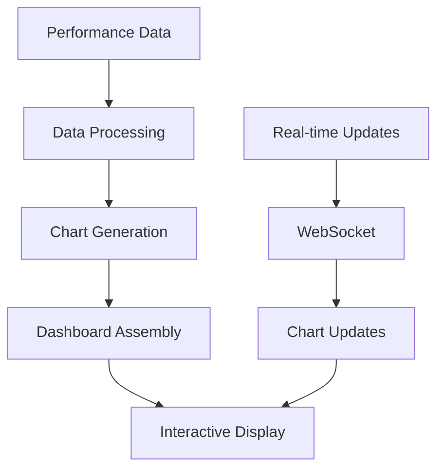

# cyberdelta/visualization/ — Per-Folder Analysis (Updated June 2025)

## Overview
As of June 2025, the visualization functionality has been moved to the `frontend/visualization/` directory, reflecting a clearer separation between backend trading logic and frontend presentation. This document outlines the current state and planned enhancements.

---

## Architecture Evolution

### Key Changes Since April 2025:
1. **Module Relocation**: Visualization moved from `cyberdelta/` to `frontend/`
2. **Clear Separation**: Frontend concerns separated from core trading logic
3. **Enhanced Integration**: Better integration with monitoring module
4. **Type Safety**: Improved type hints and validation
5. **Performance**: Optimized for real-time updates

---

## Current Implementation

### frontend/visualization/performance_visualizer.py
**Purpose:**
Provides comprehensive visualization tools for strategy performance, supporting both real-time dashboards and historical analysis.



**Key Features:**
- **Interactive Charts**: Plotly-based interactive visualizations
- **Real-time Updates**: WebSocket integration for live data
- **Multiple Views**: Returns, drawdown, positions, funding rates
- **Performance Metrics**: Comprehensive metric displays

```python
class PerformanceVisualizer:
    """Advanced performance visualization"""

    def __init__(
        self,
        performance_tracker: PerformanceTracker,
        portfolio_tracker: PortfolioTracker,
    ):
        self._performance = performance_tracker
        self._portfolio = portfolio_tracker

    def create_returns_chart(self) -> go.Figure:
        """Create cumulative returns chart"""

    def create_drawdown_chart(self) -> go.Figure:
        """Create drawdown visualization"""

    def create_position_chart(self) -> go.Figure:
        """Create position overview"""

    def create_dashboard(self) -> dash.Dash:
        """Assemble complete dashboard"""
```

---

## Chart Types and Visualizations

### 1. Returns Analysis
```python
def create_returns_chart(
    returns_data: pd.Series,
    benchmark: pd.Series | None = None,
) -> go.Figure:
    """Create returns comparison chart"""

    fig = go.Figure()

    # Strategy returns
    fig.add_trace(go.Scatter(
        x=returns_data.index,
        y=(1 + returns_data).cumprod(),
        name="Strategy",
        line=dict(color="blue", width=2)
    ))

    # Benchmark comparison
    if benchmark is not None:
        fig.add_trace(go.Scatter(
            x=benchmark.index,
            y=(1 + benchmark).cumprod(),
            name="Benchmark",
            line=dict(color="gray", dash="dash")
        ))

    return fig
```

### 2. Drawdown Visualization
```python
def create_drawdown_chart(
    equity_curve: pd.Series
) -> go.Figure:
    """Create underwater equity chart"""

    # Calculate drawdown
    rolling_max = equity_curve.expanding().max()
    drawdown = (equity_curve - rolling_max) / rolling_max

    fig = go.Figure()

    # Drawdown area
    fig.add_trace(go.Scatter(
        x=drawdown.index,
        y=drawdown.values,
        fill='tozeroy',
        fillcolor='rgba(255, 0, 0, 0.3)',
        line=dict(color='red'),
        name='Drawdown'
    ))

    return fig
```

### 3. Position Overview
```python
def create_position_chart(
    positions: list[DerivativePosition]
) -> go.Figure:
    """Create position summary chart"""

    # Aggregate by symbol
    position_data = defaultdict(Decimal)
    for pos in positions:
        position_data[pos.symbol] += pos.notional_value

    fig = go.Figure(data=[
        go.Bar(
            x=list(position_data.keys()),
            y=[float(v) for v in position_data.values()],
            marker_color=['green' if v > 0 else 'red'
                         for v in position_data.values()]
        )
    ])

    return fig
```

### 4. Funding Rate Analysis
```python
def create_funding_chart(
    funding_data: pd.DataFrame
) -> go.Figure:
    """Create funding rate comparison chart"""

    fig = make_subplots(
        rows=2, cols=1,
        subplot_titles=('Funding Rates', 'Spread')
    )

    # Individual rates
    for exchange in funding_data.columns:
        fig.add_trace(
            go.Scatter(
                x=funding_data.index,
                y=funding_data[exchange],
                name=exchange
            ),
            row=1, col=1
        )

    # Spread
    if len(funding_data.columns) >= 2:
        spread = funding_data.iloc[:, 0] - funding_data.iloc[:, 1]
        fig.add_trace(
            go.Scatter(
                x=spread.index,
                y=spread.values,
                name='Spread',
                line=dict(color='purple')
            ),
            row=2, col=1
        )

    return fig
```

---

## Dashboard Integration

### Real-time Dashboard
```python
class RealTimeDashboard:
    """Web-based real-time dashboard"""

    def __init__(self, visualizer: PerformanceVisualizer):
        self._visualizer = visualizer
        self._app = dash.Dash(__name__)
        self._setup_layout()
        self._setup_callbacks()

    def _setup_layout(self) -> None:
        """Define dashboard layout"""

        self._app.layout = html.Div([
            # Header
            html.H1("CyberDelta Trading Dashboard"),

            # Metrics row
            html.Div([
                self._create_metric_card("Total Return"),
                self._create_metric_card("Sharpe Ratio"),
                self._create_metric_card("Max Drawdown"),
                self._create_metric_card("Win Rate"),
            ], className="metrics-row"),

            # Charts
            dcc.Graph(id="returns-chart"),
            dcc.Graph(id="drawdown-chart"),
            dcc.Graph(id="positions-chart"),
            dcc.Graph(id="funding-chart"),

            # Update interval
            dcc.Interval(
                id='interval-component',
                interval=1000,  # 1 second
                n_intervals=0
            )
        ])
```

### WebSocket Integration
```python
class WebSocketUpdater:
    """Real-time data updates via WebSocket"""

    def __init__(self, dashboard: RealTimeDashboard):
        self._dashboard = dashboard
        self._ws = None

    async def connect(self, ws_url: str) -> None:
        """Connect to WebSocket for updates"""

        self._ws = await websockets.connect(ws_url)

        async for message in self._ws:
            data = json.loads(message)
            await self._update_dashboard(data)

    async def _update_dashboard(self, data: dict) -> None:
        """Update dashboard with new data"""

        if data['type'] == 'trade':
            self._dashboard.update_trade(data['trade'])
        elif data['type'] == 'position':
            self._dashboard.update_position(data['position'])
        elif data['type'] == 'metrics':
            self._dashboard.update_metrics(data['metrics'])
```

---

## Performance Optimization

### 1. Data Decimation
```python
def decimate_data(
    data: pd.Series,
    max_points: int = 1000
) -> pd.Series:
    """Reduce data points for performance"""

    if len(data) <= max_points:
        return data

    # Use LTTB algorithm for intelligent decimation
    return lttb_downsample(data, max_points)
```

### 2. Incremental Updates
```python
def update_chart_incrementally(
    fig: go.Figure,
    new_data: pd.Series
) -> None:
    """Update chart without full redraw"""

    # Extend existing trace
    fig.data[0].x = np.append(fig.data[0].x, new_data.index)
    fig.data[0].y = np.append(fig.data[0].y, new_data.values)

    # Update layout for new range
    fig.update_xaxes(range=[new_data.index[-100], new_data.index[-1]])
```

### 3. Caching
```python
class ChartCache:
    """Cache generated charts"""

    def __init__(self, ttl: int = 60):
        self._cache = {}
        self._ttl = ttl

    def get_or_create(
        self,
        key: str,
        creator: Callable
    ) -> go.Figure:
        """Get cached chart or create new"""

        if key in self._cache:
            chart, timestamp = self._cache[key]
            if time.time() - timestamp < self._ttl:
                return chart

        chart = creator()
        self._cache[key] = (chart, time.time())
        return chart
```

---

## Best Practices and Patterns

### 1. Type Safety with Decimal
```python
# Always convert Decimal to float for plotting
def prepare_data_for_plot(
    values: list[Decimal]
) -> list[float]:
    """Convert Decimal values for plotting"""
    return [float(v) for v in values]
```

### 2. Responsive Design
```python
# Make charts responsive
fig.update_layout(
    autosize=True,
    margin=dict(l=0, r=0, t=30, b=0),
    height=400,
    hovermode='x unified'
)
```

### 3. Error Handling
```python
def safe_chart_creation(
    data: pd.Series
) -> go.Figure | None:
    """Create chart with error handling"""

    try:
        if data.empty:
            return create_empty_chart("No data available")

        return create_chart(data)

    except Exception as e:
        logger.error(f"Chart creation failed: {e}")
        return create_error_chart(str(e))
```

---

## Future Enhancements

### 1. Advanced Analytics
- **Factor Attribution**: Visualize return sources
- **Risk Decomposition**: Interactive risk breakdown
- **Correlation Matrix**: Dynamic correlation heatmaps
- **Monte Carlo Simulations**: Probabilistic visualizations

### 2. Mobile Support
- **Responsive Layouts**: Mobile-optimized views
- **Touch Interactions**: Gesture-based navigation
- **Progressive Web App**: Offline capability
- **Push Notifications**: Real-time alerts

### 3. 3D Visualizations
- **Surface Plots**: Volatility surfaces
- **3D Scatter**: Multi-dimensional analysis
- **Network Graphs**: Strategy relationships
- **VR Support**: Immersive data exploration

### 4. Export and Reporting
- **PDF Reports**: Automated report generation
- **Interactive Notebooks**: Jupyter integration
- **Data Export**: CSV/Excel/JSON formats
- **API Access**: Programmatic chart access

---

## Migration Notes

### From cyberdelta/ to frontend/
The visualization module has been moved to better organize the codebase:

1. **Import Updates**:
   ```python
   # Old
   from cyberdelta.visualization import PerformanceVisualizer

   # New
   from frontend.visualization import PerformanceVisualizer
   ```

2. **Integration Points**:
   - Still integrates with `cyberdelta.monitoring`
   - Uses same data models from `cyberdelta.core.models`
   - Maintains backward compatibility

3. **Future Plans**:
   - Separate frontend repository
   - Microservice architecture
   - GraphQL API for data access
