# cyberdelta/apis/ — Per-Folder Analysis

---

## __init__.py
**Purpose:**
Initializes the apis package and exposes key API model classes for external use.

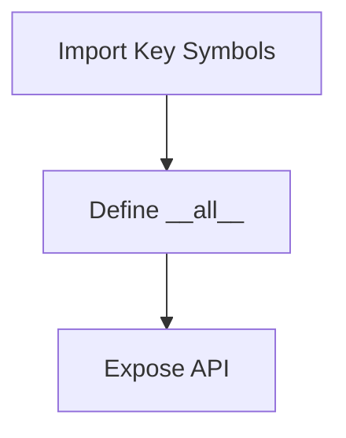

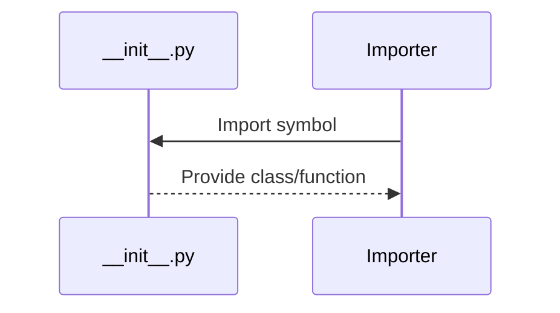

**Summary:**
- Inputs: None (package init).
- Outputs: Exposed API symbols.
- Dependencies: Internal API model modules.
- Critical Path: Not runtime critical, but important for package structure.

---

## base.py
**Purpose:**
Defines the abstract base class for all exchange API clients, including connection management, authentication, request/response handling, rate limiting, and error management. All concrete API clients inherit from this base class.

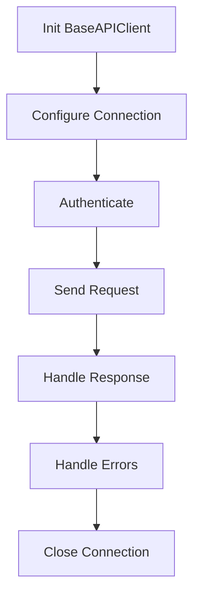

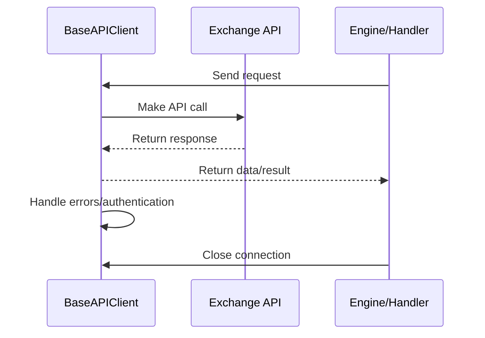

**Summary:**
- Inputs: API requests, authentication/configuration data.
- Outputs: API responses, error reports, connection management.
- Dependencies: Exchange APIs, callers for requests.
- Critical Path: Reliable and secure API communication is essential for all trading and data operations.

---

## hyperliquid.py
**Purpose:**
Implements the Hyperliquid exchange API client, supporting authentication (EIP-712), REST/WebSocket communication, order management, and data retrieval. Handles all trading, data, and account operations for Hyperliquid.

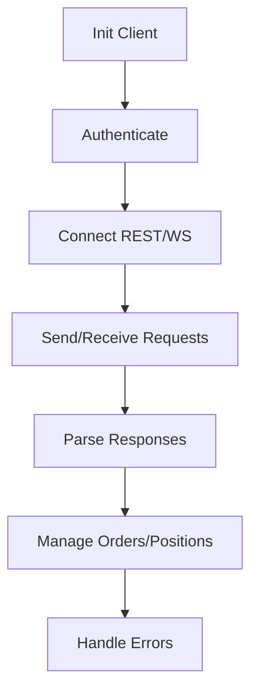

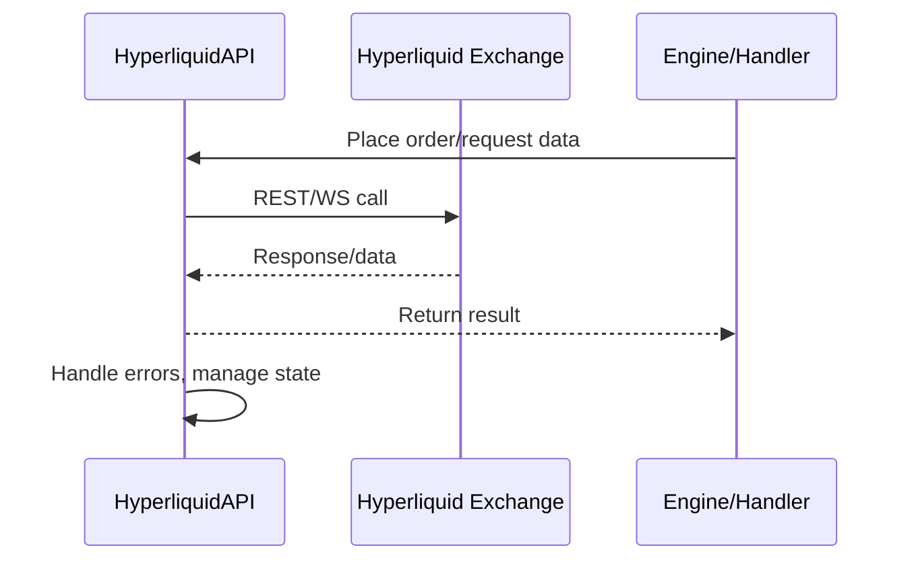

**Summary:**
- Inputs: API requests/orders, authentication/configuration data.
- Outputs: Data, order status, error reports.
- Dependencies: Hyperliquid exchange APIs, engine/handlers for requests.
- Critical Path: Reliable and secure Hyperliquid connectivity is essential for trading and data operations.

---

## backpack.py
**Purpose:**
Implements the Backpack exchange API client, supporting authentication (HMAC), REST/WebSocket communication, order management, and data retrieval. Handles all trading, data, and account operations for Backpack.

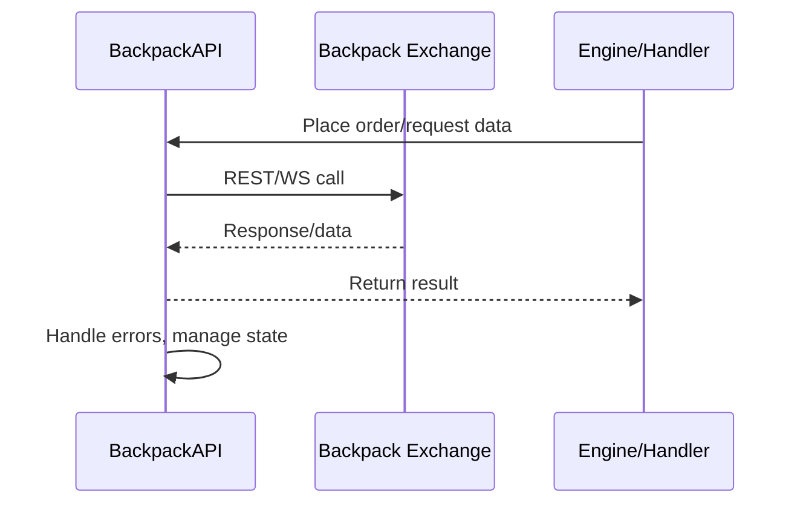

**Summary:**
- Inputs: API requests/orders, authentication/configuration data.
- Outputs: Data, order status, error reports.
- Dependencies: Backpack exchange APIs, engine/handlers for requests.
- Critical Path: Reliable and secure Backpack connectivity is essential for trading and data operations.

---

## backpack_old.py
**Purpose:**
Implements a legacy or deprecated version of the BackpackAPI client for backward compatibility, migration, or reference. Similar logic to backpack.py but may use older protocols or data structures.

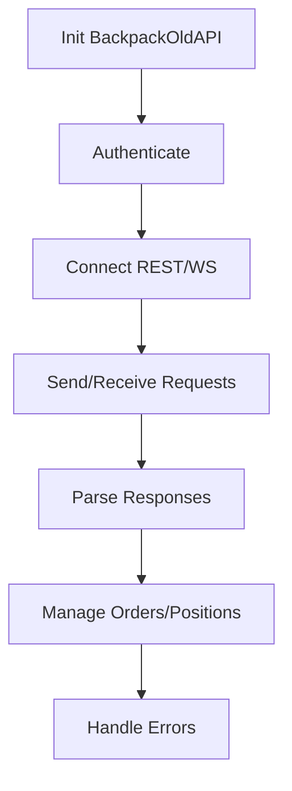

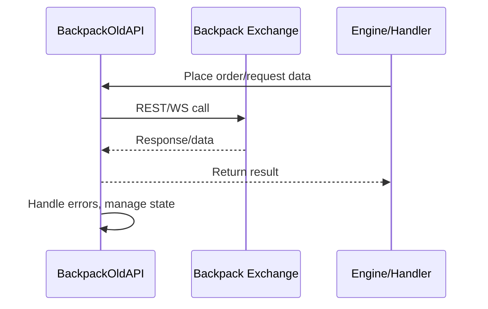

**Summary:**
- Inputs: API requests/orders, authentication/configuration data.
- Outputs: Data, order status, error reports.
- Dependencies: Backpack exchange APIs, engine/handlers for requests.
- Critical Path: Reliable and secure Backpack connectivity is essential for trading and data operations.

---

## rate_limiter.py
**Purpose:**
Implements a token bucket rate limiter for API clients, enforcing rate limits on outgoing requests to exchanges. Tracks request counts, enforces cooldowns, and provides async/sync interfaces for use by API clients.

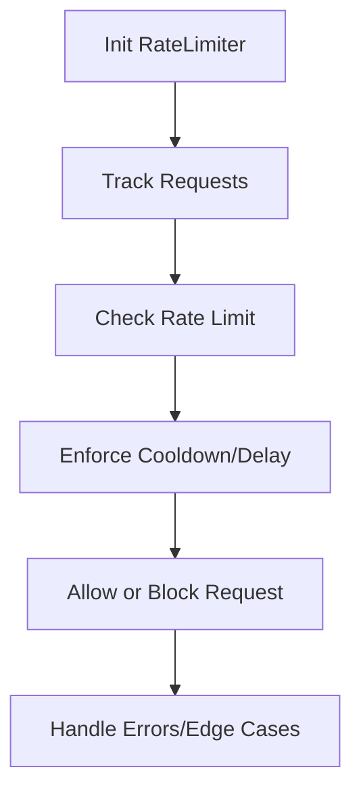

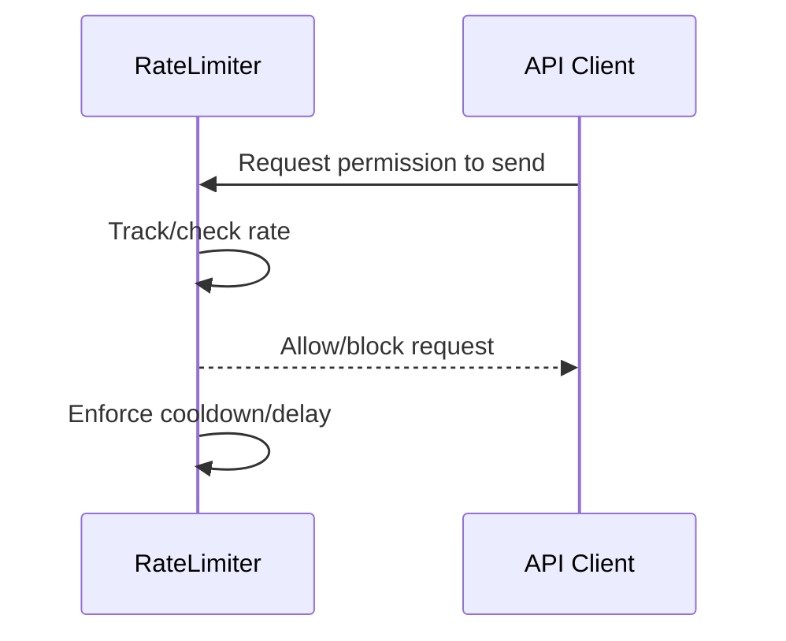

**Summary:**
- Inputs: Request permission calls from API clients.
- Outputs: Allow/block signals, enforced delays.
- Dependencies: API clients for integration, internal state for tracking.
- Critical Path: Proper rate limiting is essential to avoid API bans and ensure reliable operation.

---

## errors.py
**Purpose:**
Currently empty. Placeholder for future custom error classes or constants for use by API clients. Centralizes error definitions for consistent exception handling and reporting.
