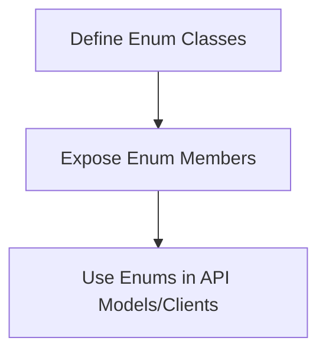
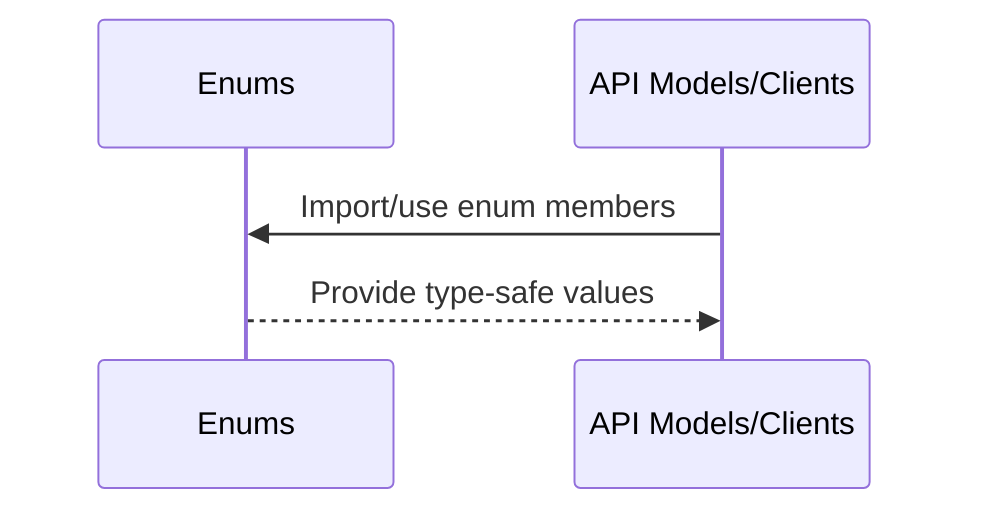
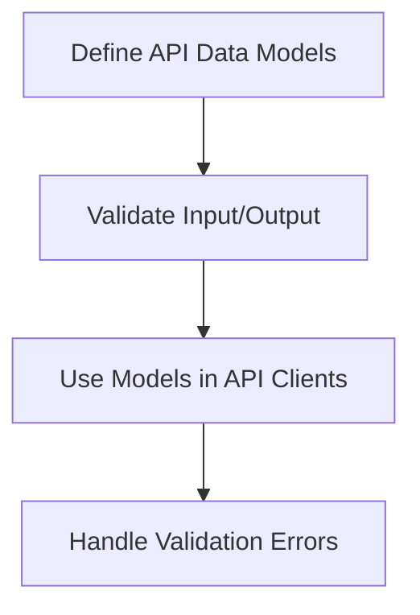
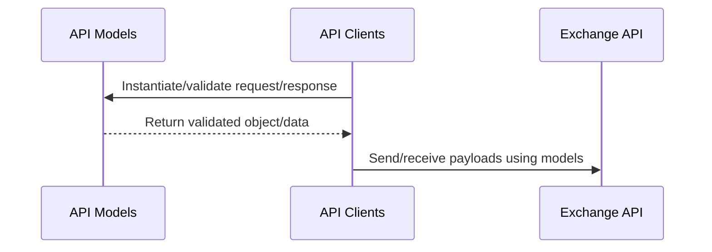

# cyberdelta/apis/models/ — Per-Folder Analysis

---

## enums.py
**Purpose:**
Defines enumerations (enums) used by API models and clients. Enums provide type-safe, self-documenting representations of fixed sets of values (e.g., order types, status codes) for use throughout the codebase.

**Summary:**
- Inputs: Enum definitions.
- Outputs: Enum members for use in API models and clients.
- Dependencies: API models and clients for usage.
- Critical Path: Type-safe enums help prevent bugs and improve code clarity, but this file is not on the runtime critical path.

---

## api.py
**Purpose:**
Defines data models and schemas for API requests and responses. Provides type-safe, validated representations of API payloads, often using Pydantic or similar libraries, to ensure correctness and safety in API communication.

**Summary:**
- Inputs: API request/response data for model instantiation/validation.
- Outputs: Validated model objects/data for use in API clients.
- Dependencies: API clients for usage, exchange APIs for payloads.
- Critical Path: Correct data modeling and validation is essential for safe and reliable API communication. Errors here can result in malformed requests or unhandled responses. 