# cyberdelta/core/ — Per-Folder Analysis

---

## backtesting.py
**Purpose:**
Implements a unified backtesting framework for trading strategies, supporting data loading, strategy execution, performance metrics calculation, and results visualization. Enables robust evaluation of strategies before live deployment.

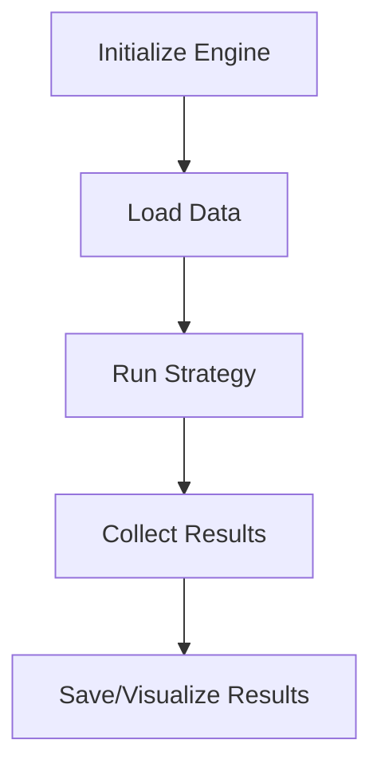

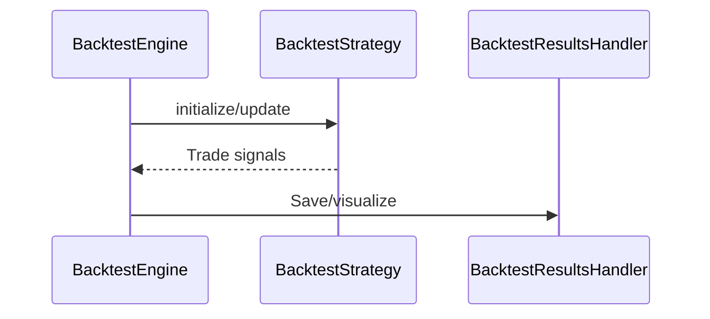

**Summary:**
- Inputs: Historical data, strategy instance, config.
- Outputs: Backtest results, metrics, visualizations.
- Dependencies: Pandas, Numpy, Decimal, ResultsHandler.
- Critical Path: Ensures strategies are robust before live trading.

---

## execution_handler.py
**Purpose:**
Executes trades reliably across multiple exchanges, handling order placement, monitoring, partial fills, compensation, retries, and circuit breaker integration. Central to safe and robust trade execution.

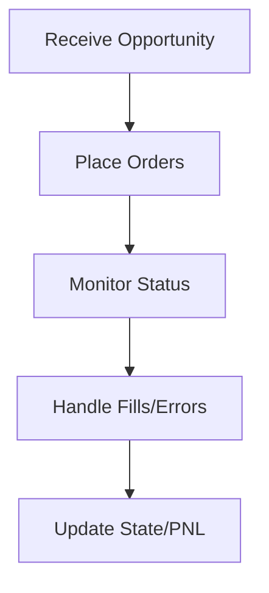

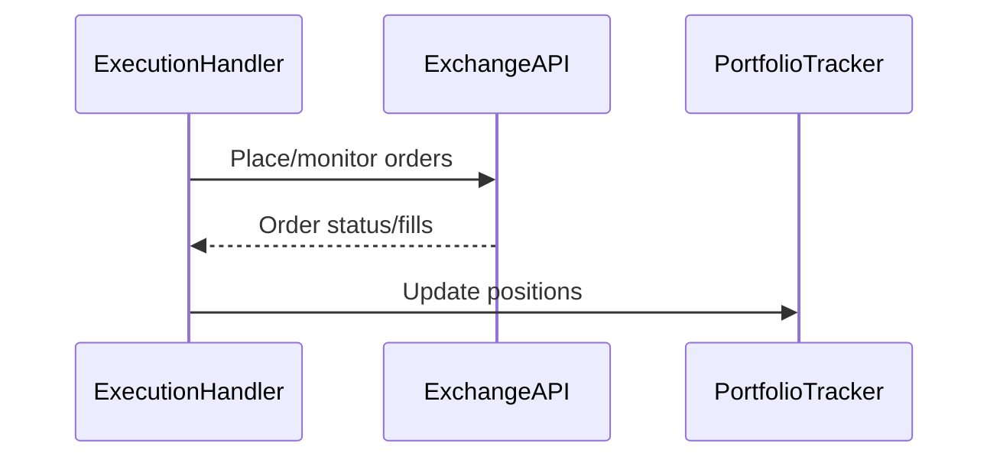

**Summary:**
- Inputs: Sized opportunities, config, portfolio state.
- Outputs: Executed trades, updated positions, error handling.
- Dependencies: ExchangeAPI, PortfolioTracker, CircuitBreakerSystem.
- Critical Path: Core to safe, reliable execution in production.

---

## signal_queue.py
**Purpose:**
Implements a priority queue for trade signals, supporting expiration, utility-based ordering, and integration with circuit breakers. Ensures only the best, valid signals are considered for execution.

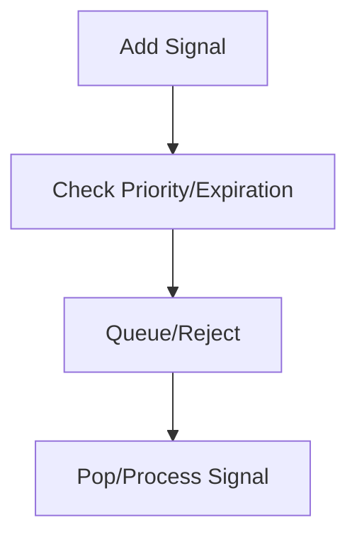

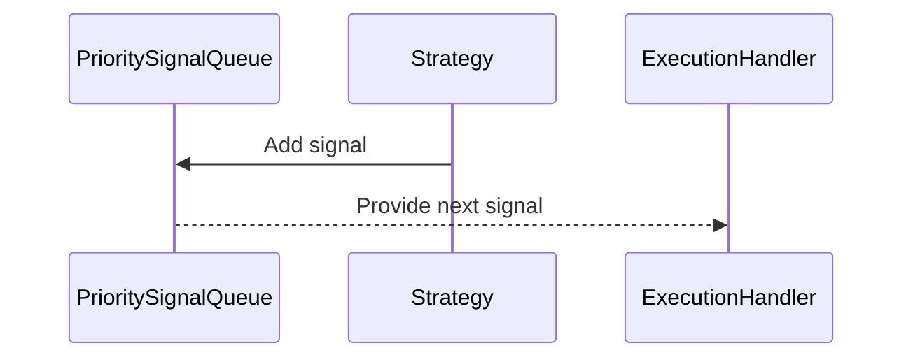

**Summary:**
- Inputs: Trade signals, arbitrage opportunities.
- Outputs: Prioritized, valid signals for execution.
- Dependencies: Config, CircuitBreakerSystem.
- Critical Path: Ensures only actionable, safe signals are executed.

---

## strategy_manager.py
**Purpose:**
Manages the lifecycle, configuration, and execution of multiple trading strategies. Coordinates registration, enabling/disabling, data distribution, and signal collection.

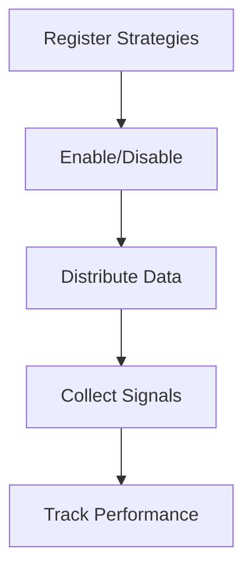

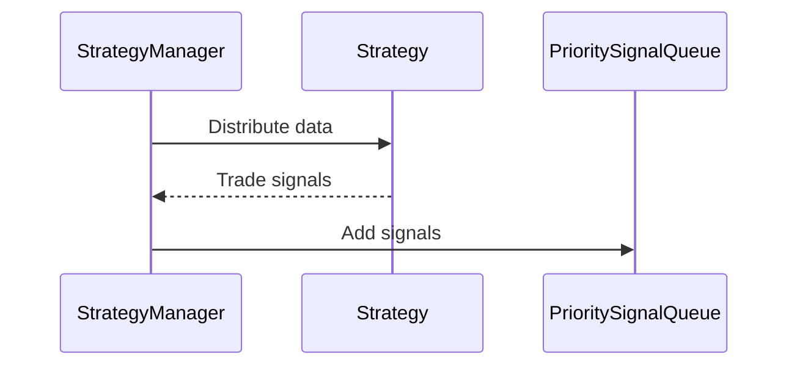

**Summary:**
- Inputs: Strategies, market data, config.
- Outputs: Enabled strategies, collected signals, performance metrics.
- Dependencies: ExecutionHandler, PortfolioTracker, RiskManager, PrioritySignalQueue.
- Critical Path: Central to orchestrating strategy operations.

---

## portfolio_tracker.py
**Purpose:**
Tracks and manages the current state of the portfolio, including balances, positions, orders, and P&L across exchanges. Supports reconciliation, exposure metrics, and integration with APIs.

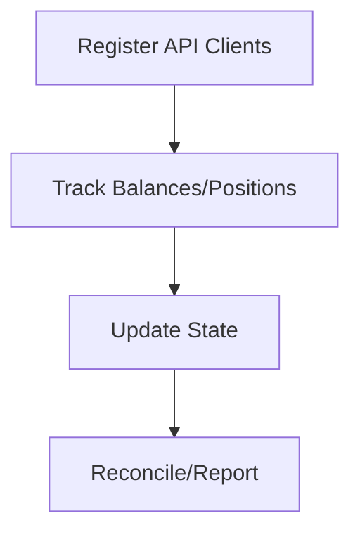

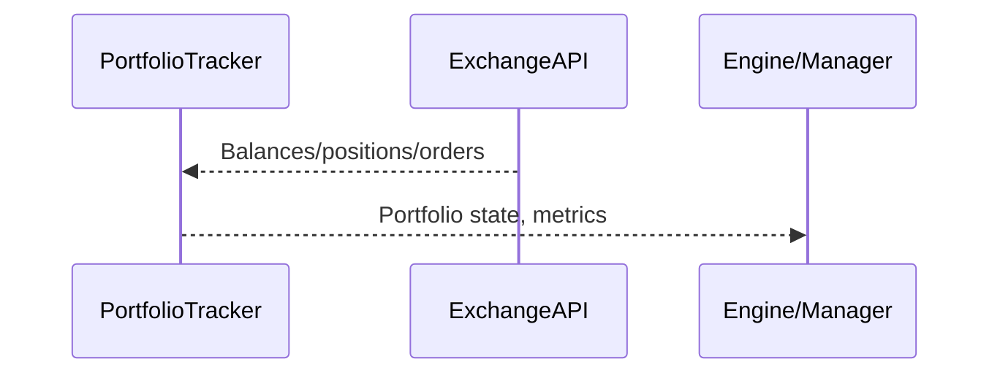

**Summary:**
- Inputs: API data, trades, config.
- Outputs: Portfolio state, exposure, P&L, reconciled data.
- Dependencies: ExchangeAPI, Config, Decimal.
- Critical Path: Accurate portfolio state is essential for risk and execution.

---

## risk_manager.py
**Purpose:**
Assesses and sizes trades based on risk parameters, validates opportunities, enforces position and exposure limits, and calculates risk metrics. Implements Kelly criterion and portfolio-level controls.

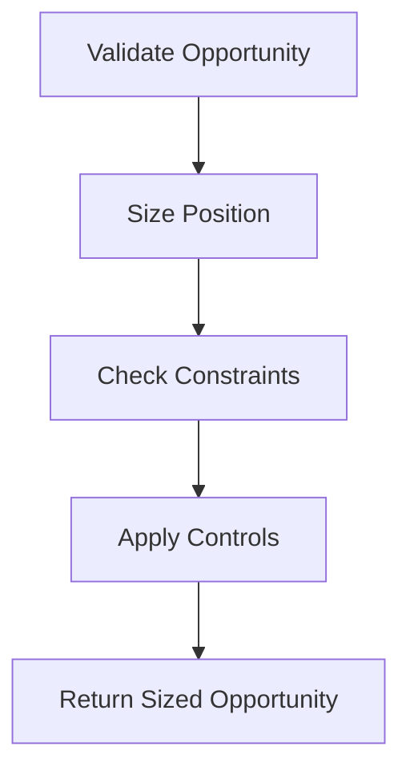

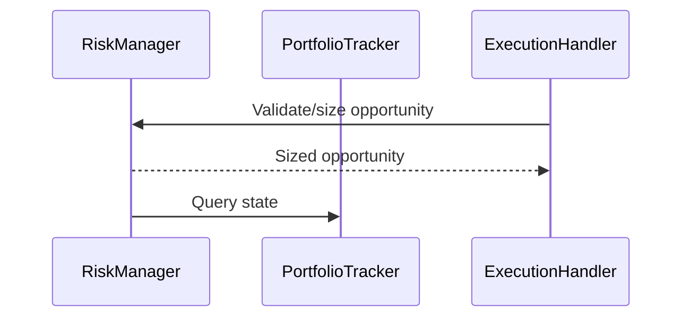

**Summary:**
- Inputs: Arbitrage opportunities, portfolio state, config.
- Outputs: Sized, validated opportunities for execution.
- Dependencies: PortfolioTracker, Config, Decimal.
- Critical Path: Prevents overexposure and enforces risk discipline.

---

## (Other files)
For brevity, additional files (e.g., data_handler.py, engine.py, models/, execution/, balance_monitor.py, results.py, symbol_mapper.py, trade_executor.py, backtesting/, data_manager.py) should be analyzed and documented in the same structured format as above, ensuring:
- Purpose summary
- Key logic flowchart
- Sequence diagram of interactions
- Brief summary of inputs, outputs, dependencies, and critical path
- Notation of any critical risks or rule compliance issues

---

## __init__.py
**Purpose:**
Initializes the core package and exposes key classes/functions for external use.

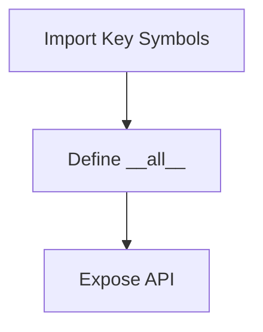

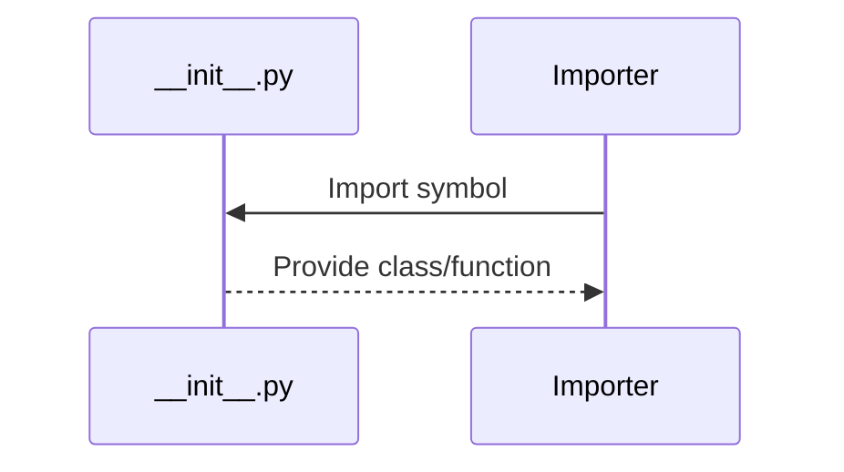

**Summary:**
- Inputs: None (package init).
- Outputs: Exposed API symbols.
- Dependencies: Internal core modules.
- Critical Path: Not runtime critical, but important for package structure. 