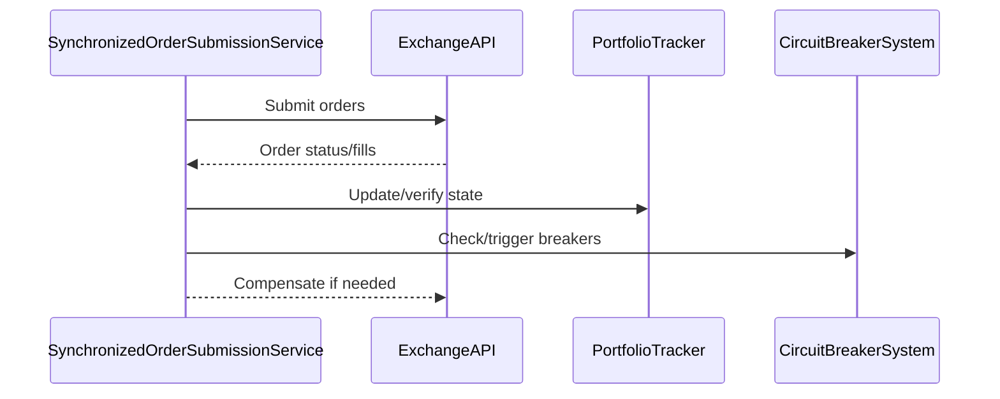
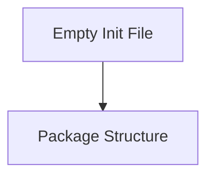
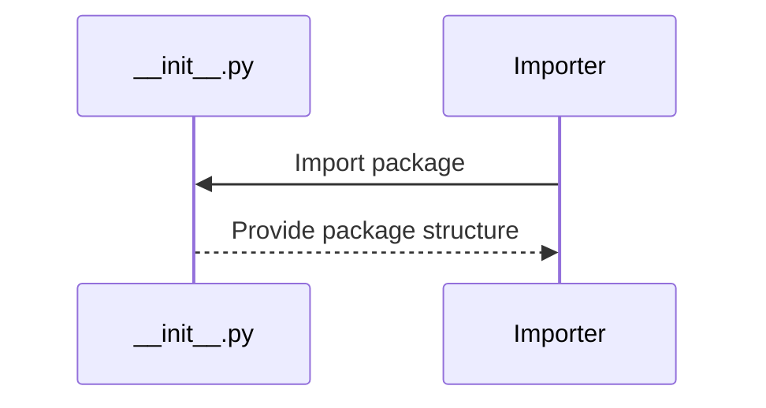

# cyberdelta/core/execution/ — Per-Folder Analysis

---

## synchronized_order_submission.py
**Purpose:**
Implements synchronized order submission across exchanges with comprehensive verification, compensation, and circuit breaker integration. Ensures robust, atomic execution of multi-leg arbitrage or hedged trades, with detailed tracking and error handling.

```mermaid
flowchart TD
    A[Prepare Opportunity] --> B[Pre-Execution Verification]
    B --> C[Submit Orders (Sequential/Simultaneous)]
    C --> D[Verify Execution]
    D --> E[Compensate on Failure]
    E --> F[Finalize/Report]
```



**Summary:**
- Inputs: Arbitrage opportunities, config, portfolio state.
- Outputs: Execution results, verification reports, compensation actions.
- Dependencies: ExchangeAPI, PortfolioTracker, CircuitBreakerSystem, PositionReconciliationSystem.
- Critical Path: Ensures atomic, safe execution of complex trades; prevents partial fills and unhedged risk.
- **Note:** All financial fields use `Decimal` for accuracy, in compliance with project rules.

---

## __init__.py
**Purpose:**
Initializes the execution package (empty file, placeholder for package structure).





**Summary:**
- Inputs: None (empty init).
- Outputs: Package structure.
- Dependencies: None.
- Critical Path: Not runtime critical, but important for package structure. 