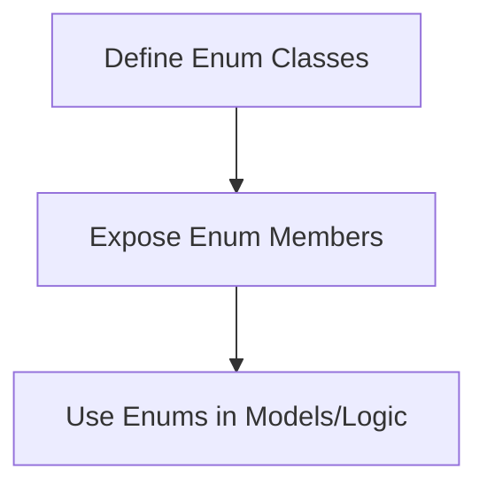
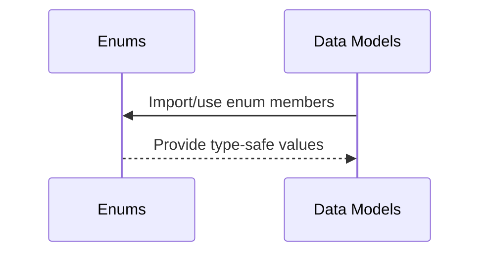
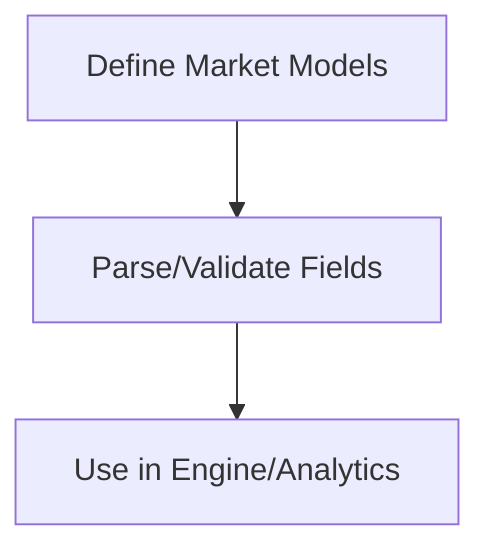
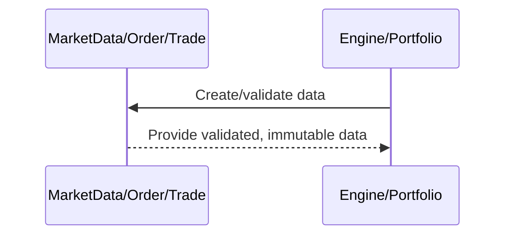
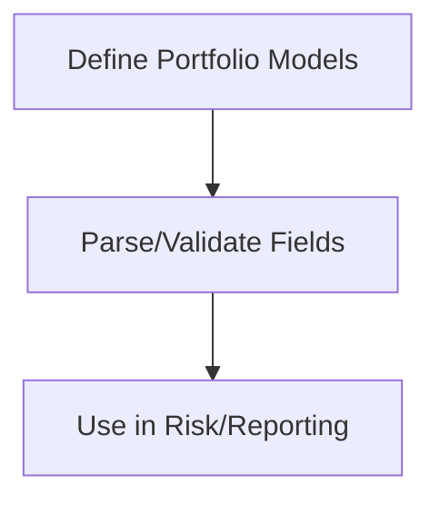
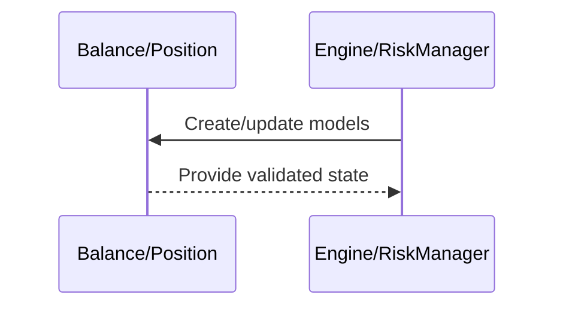
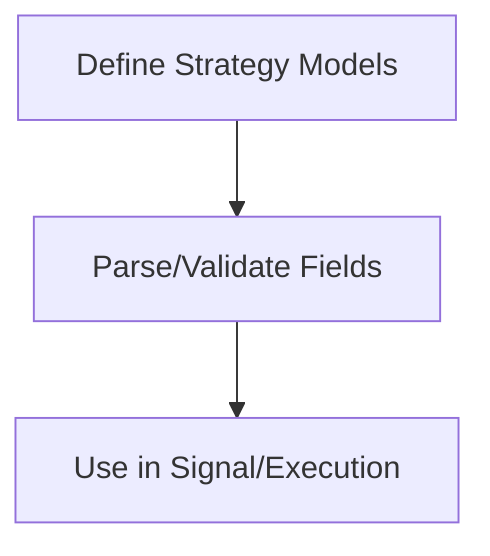
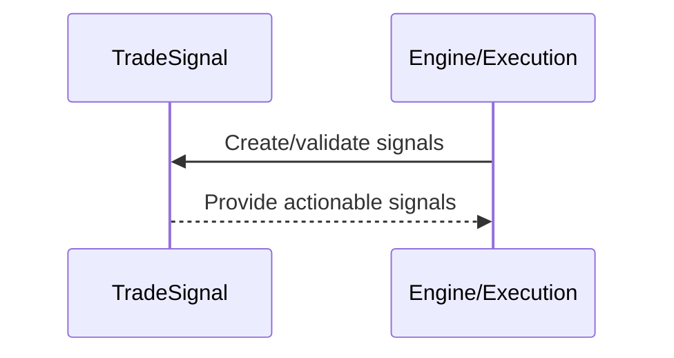
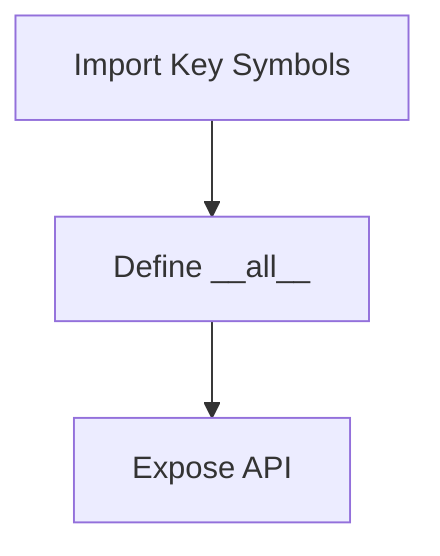
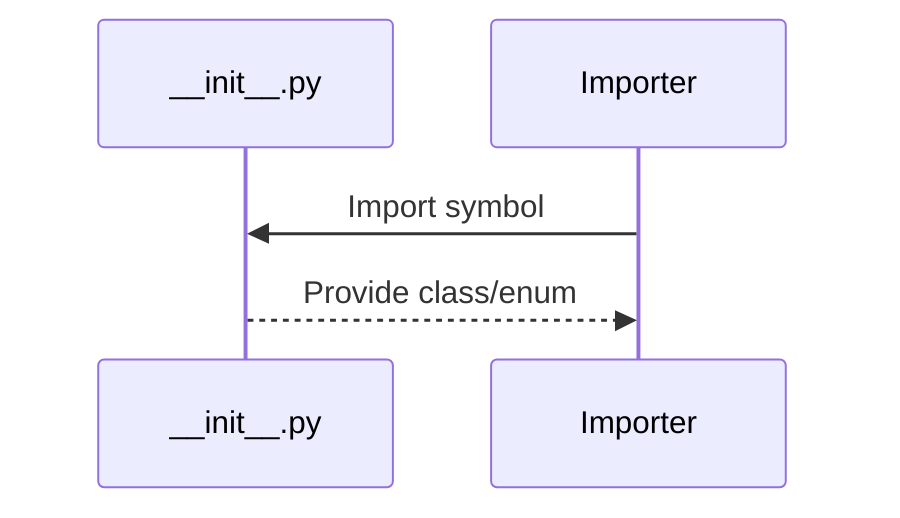

# cyberdelta/core/models/ — Per-Folder Analysis

---

## enums.py
**Purpose:**
Defines core enumerations for order sides, types, statuses, signal types, and time-in-force. Provides type-safe, self-documenting representations for use throughout the engine.

**Summary:**
- Inputs: Enum definitions.
- Outputs: Enum members for use in models and logic.
- Dependencies: Used throughout core models and engine logic.
- Critical Path: Ensures type safety and code clarity.

---

## market.py
**Purpose:**
Defines immutable data models for exchange state, market data, order books, funding rates, trades, and orders. Ensures precise, auditable, and type-safe representation of all market-facing data.

**Summary:**
- Inputs: Exchange data, trading events.
- Outputs: Validated, immutable models for use in engine and analytics.
- Dependencies: Pydantic, Decimal, datetime, enums.
- Critical Path: Data integrity and auditability for all market-facing operations.
- **Note:** All financial fields use `Decimal` for accuracy, in compliance with project rules.

---

## portfolio.py
**Purpose:**
Defines models for portfolio state, including balances and positions. Used for risk management, PnL tracking, and reporting. Ensures all financial fields use `Decimal` for precision.

**Summary:**
- Inputs: Exchange/account data, trading events.
- Outputs: Validated, immutable/mutable models for portfolio state.
- Dependencies: Pydantic, Decimal, datetime, enums.
- Critical Path: Accurate portfolio state is essential for risk and reporting.
- **Note:** All financial fields use `Decimal` for accuracy, in compliance with project rules.

---

## strategy.py
**Purpose:**
Defines models for trading strategy intent, signals, and arbitrage opportunities. Used by the strategy layer to communicate actionable ideas and instructions to execution and portfolio layers.

**Summary:**
- Inputs: Strategy logic, market data.
- Outputs: Validated, actionable signals for execution.
- Dependencies: Pydantic, Decimal, datetime, enums.
- Critical Path: Ensures only valid, precise signals are executed.
- **Note:** All financial fields use `Decimal` for accuracy, in compliance with project rules.

---

## __init__.py
**Purpose:**
Initializes the models package and exposes key classes/enums for external use.

**Summary:**
- Inputs: None (package init).
- Outputs: Exposed API symbols.
- Dependencies: Internal model modules.
- Critical Path: Not runtime critical, but important for package structure. 