# cyberdelta/monitoring/ — Per-Folder Analysis

---

## real_time_dashboard.py
**Purpose:**
Implements a real-time, web-based dashboard for monitoring strategy performance in CyberDeltaEngine. Uses Dash and Plotly for interactive visualization of live trading metrics, drawdown, PnL, trades, and funding rates.

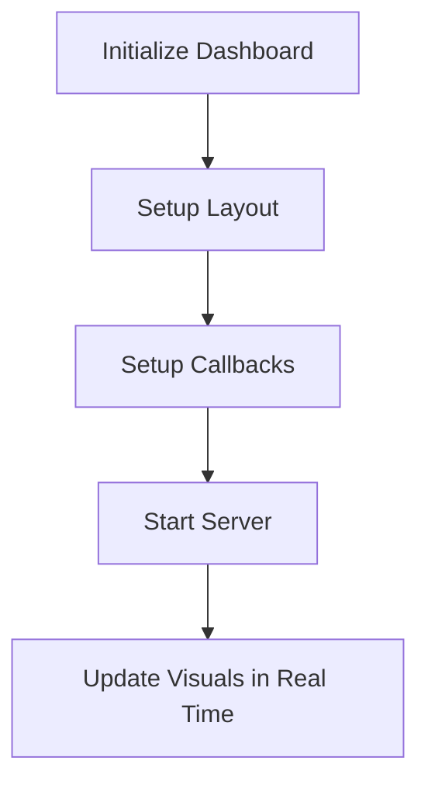

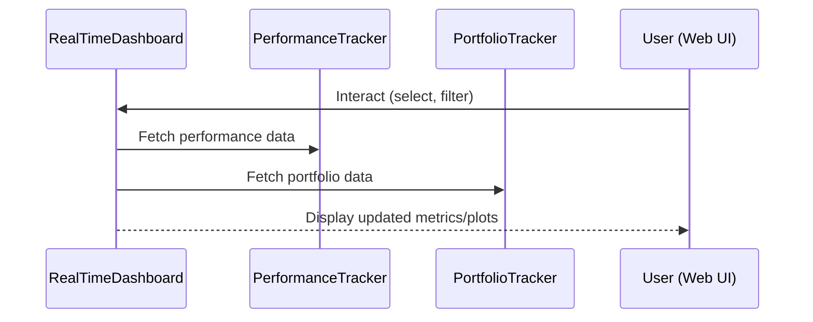

**Summary:**
- Inputs: Performance and portfolio data, user selections.
- Outputs: Real-time visualizations and metrics.
- Dependencies: PerformanceTracker, PortfolioTracker, Dash, Plotly.
- Critical Path: Essential for live monitoring and operational awareness.

---

## persistence.py
**Purpose:**
Provides thread-safe persistence for all performance tracking data. Handles saving/loading of returns, trades, signals, and funding rates to JSON files, ensuring data integrity and type safety.

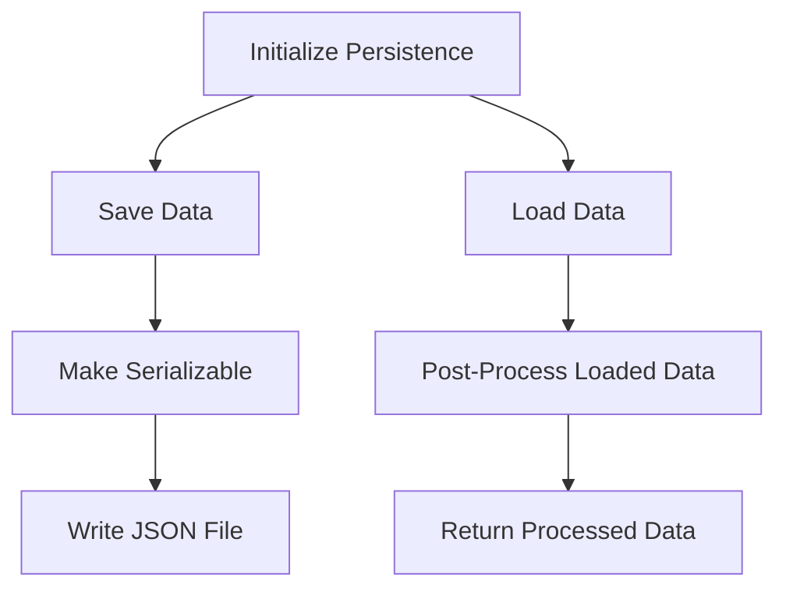

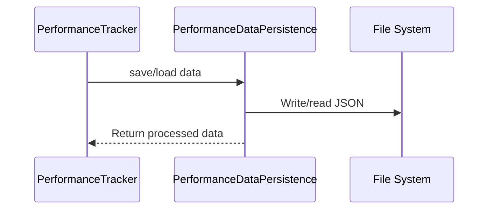

**Summary:**
- Inputs: In-memory performance data.
- Outputs: Persisted JSON files, loaded data structures.
- Dependencies: File system, custom JSON encoder.
- Critical Path: Data integrity and recoverability.
- **Critical Risk:** Financial values must use `Decimal` throughout; current use of `float` is a violation and must be refactored for correctness and compliance.

---

## performance_metrics.py
**Purpose:**
Calculates key financial performance metrics (Sharpe, Sortino, Calmar ratios, max drawdown, win rate, profit factor) for trading strategies, using Pandas and Numpy for computation and `Decimal` for precision.

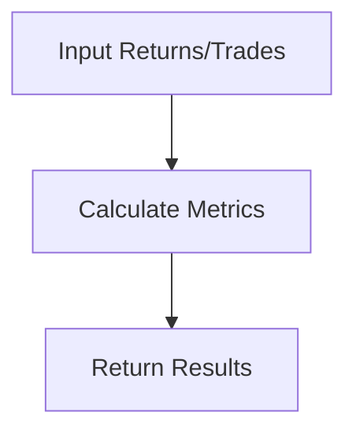

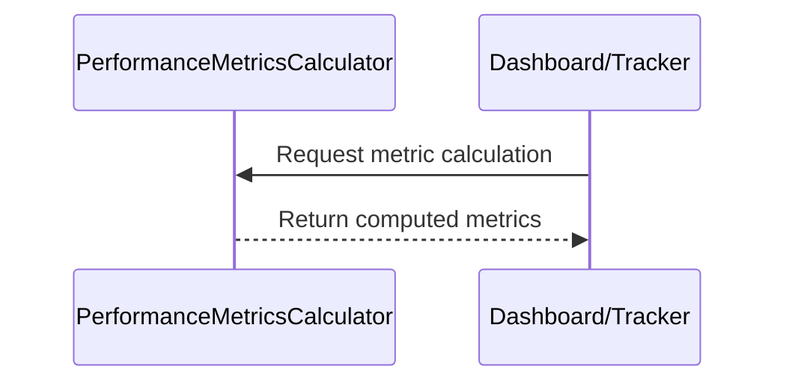

**Summary:**
- Inputs: Returns series, trades DataFrame, risk-free rate.
- Outputs: Computed financial metrics as `Decimal`.
- Dependencies: Pandas, Numpy, Decimal.
- Critical Path: Accurate performance analysis.

---

## performance_tracker.py
**Purpose:**
Tracks and manages all in-memory strategy performance data (returns, trades, signals, funding rates). Provides methods for tracking, updating, and retrieving data, and delegates persistence to `PerformanceDataPersistence`.

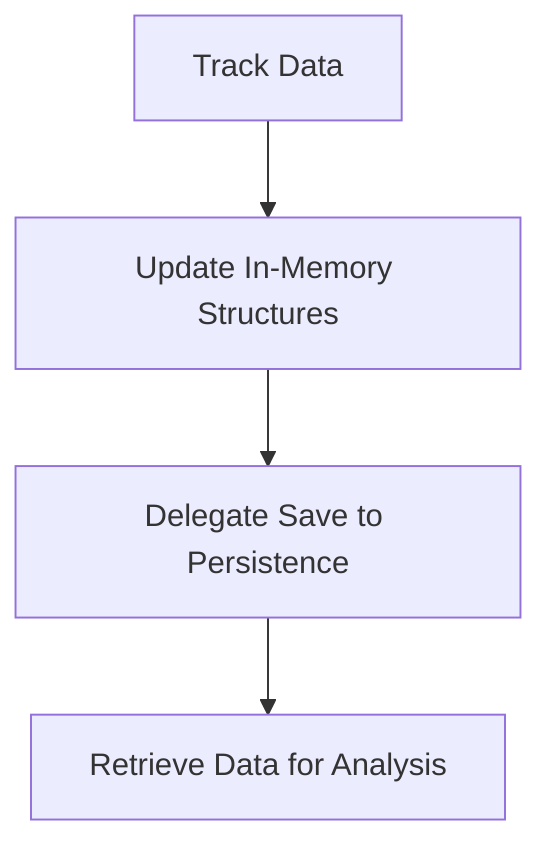

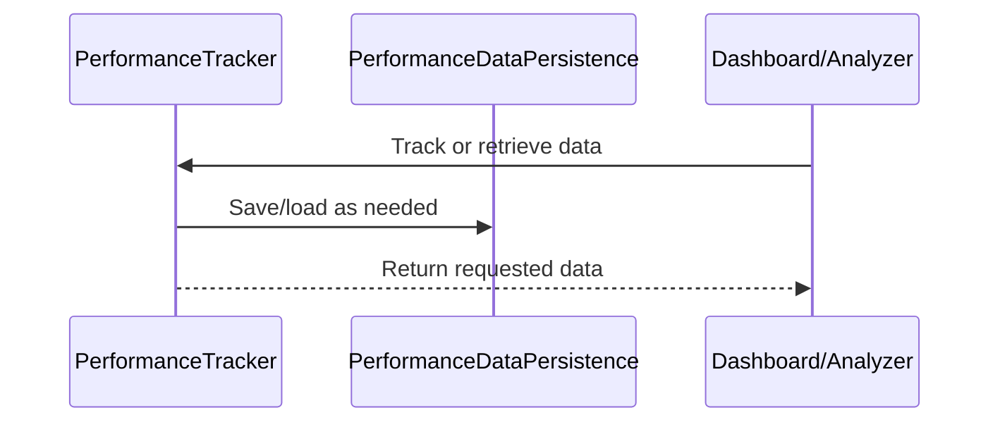

**Summary:**
- Inputs: Trade, signal, return, and funding rate events.
- Outputs: In-memory and persisted data for analysis/visualization.
- Dependencies: Persistence, Pandas.
- Critical Path: Central to all monitoring and reporting.
- **Critical Risk:** All financial values must use `Decimal`; current use of `float` is a violation and must be refactored.

---

## simplified_performance_tracker.py
**Purpose:**
Provides a lightweight, dependency-minimized alternative for tracking and analyzing strategy performance. Uses dataclasses and CSV for persistence, suitable for simple or resource-constrained environments.

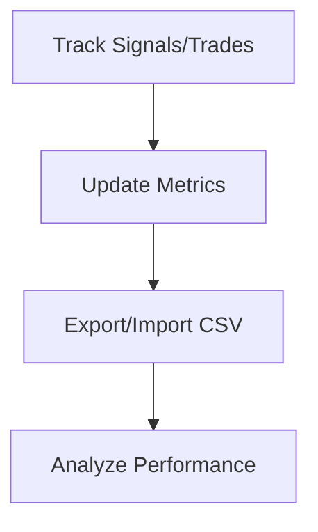

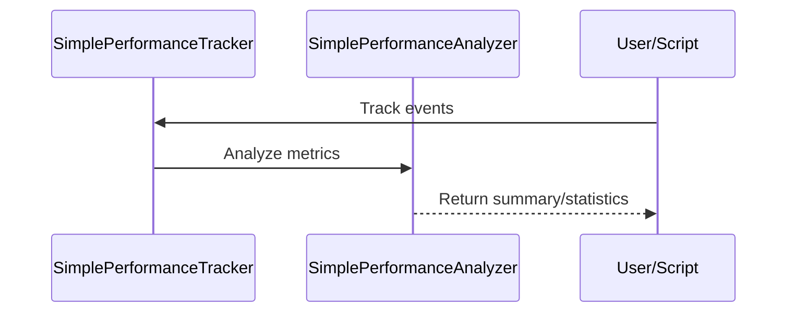

**Summary:**
- Inputs: Signals, trades, opportunities.
- Outputs: Metrics, CSV exports, analysis results.
- Dependencies: Dataclasses, Pandas, CSV, Decimal.
- Critical Path: Useful for prototyping and environments without full stack.

---

## dashboard_integration.py
**Purpose:**
Integrates the real-time dashboard with the rest of the trading system. Provides an interface for strategies and other components to send data to the dashboard and performance tracker.

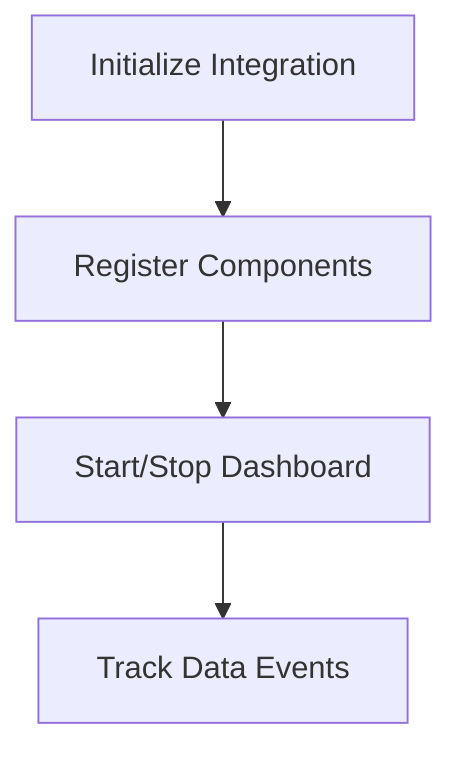

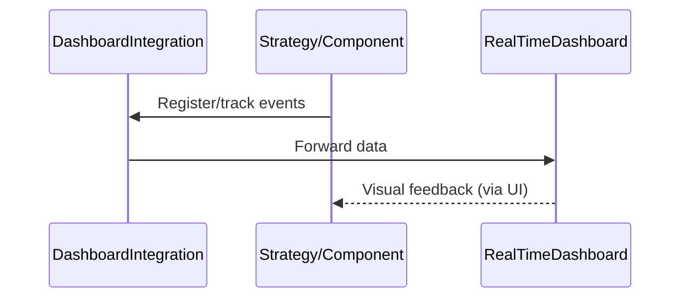

**Summary:**
- Inputs: Strategy, portfolio, and trade data.
- Outputs: Dashboard updates, tracked events.
- Dependencies: PerformanceTracker, PortfolioTracker, Strategy, Dash.
- Critical Path: Ensures seamless data flow to monitoring UI.

---

## __init__.py
**Purpose:**
Initializes the monitoring package and exposes key classes/functions for external use.

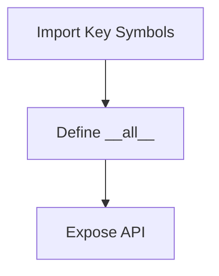

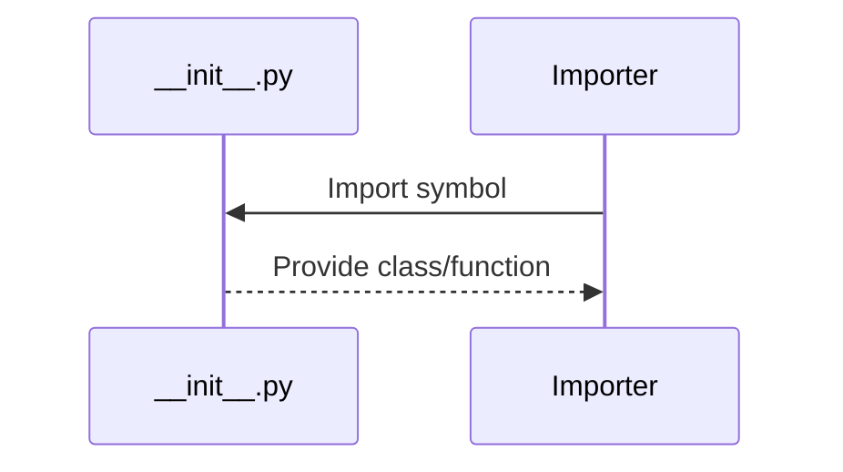

**Summary:**
- Inputs: None (package init).
- Outputs: Exposed API symbols.
- Dependencies: Internal monitoring modules.
- Critical Path: Not runtime critical, but important for package structure. 