# cyberdelta/validation/ — Per-Folder Analysis

---

## multi_tier_funding_provider.py
**Purpose:**
Implements a multi-tier funding rate provider that integrates data from multiple sources, applies confidence scoring, and exposes funding rates for use in trading and risk management. Supports source registration, caching, and fallback logic.

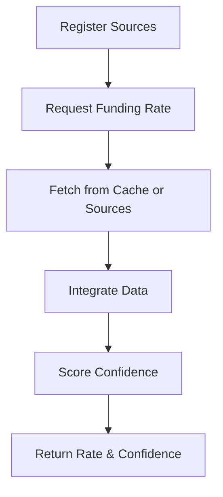

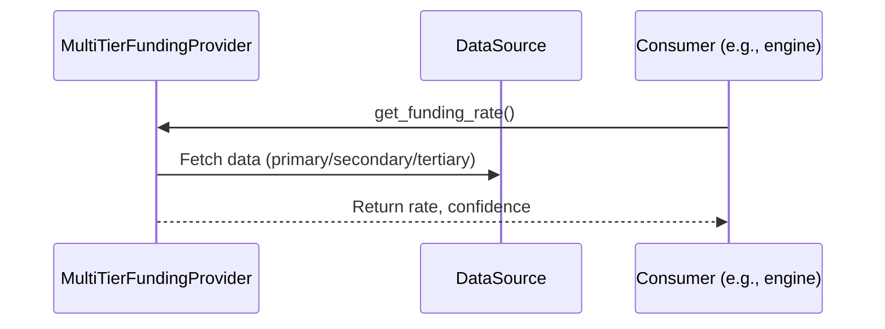

**Summary:**
- Inputs: Source registration, funding rate requests.
- Outputs: Funding rate and confidence score.
- Dependencies: FundingData, IntegratedFundingData, ConfidenceFactors.
- Critical Path: Reliable funding data is essential for risk management and arbitrage.

---

## funding_data.py
**Purpose:**
Defines data structures and models for funding rate data, including source types, reliability, integrated data, validation metrics, and arbitrage opportunities. Ensures type safety and validation for all funding-related data.

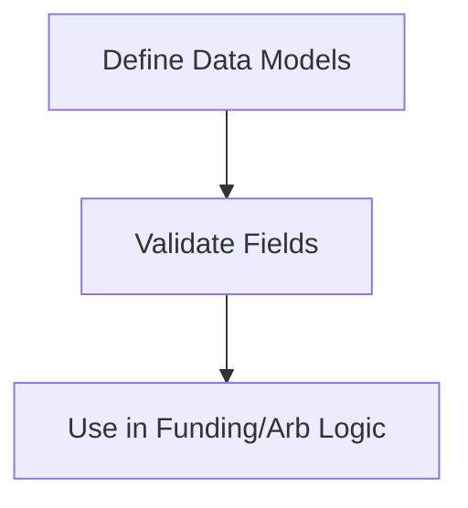

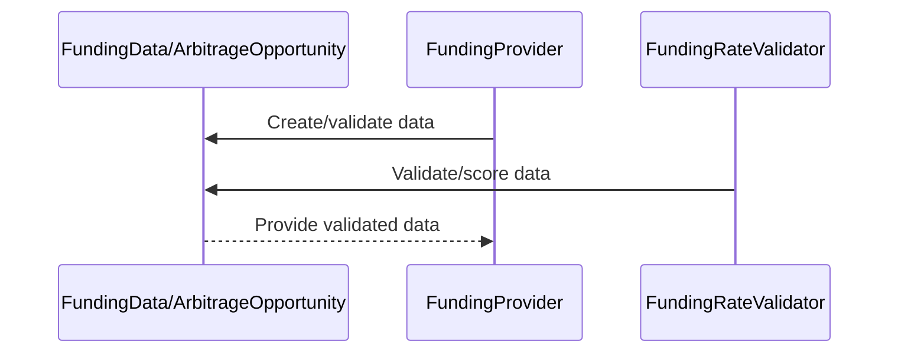

**Summary:**
- Inputs: Funding rate data from sources, arbitrage detection events.
- Outputs: Validated, structured data for use in trading and analytics.
- Dependencies: Pydantic, Decimal, datetime.
- Critical Path: Data integrity and validation for all funding-related operations.
- **Note:** All financial fields use `Decimal` for accuracy, in compliance with project rules.

---

## funding_rate_validator.py
**Purpose:**
Implements the system for validating funding rate predictions against actual payments, tracking accuracy metrics (RMSE, MAE, bias) and providing reports for model improvement.

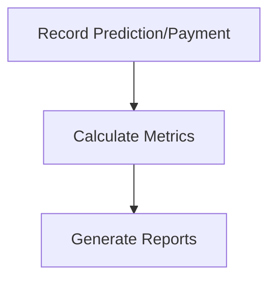

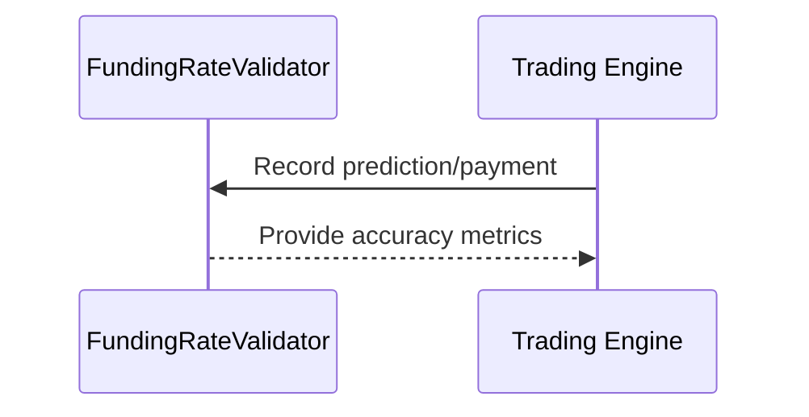

**Summary:**
- Inputs: Funding rate predictions, actual payment data.
- Outputs: Accuracy metrics, validation reports.
- Dependencies: Config, datetime, math.
- Critical Path: Ensures funding models are accurate and reliable.

---

## position_reconciliation.py
**Purpose:**
Validates and reconciles trading positions between exchange APIs, fill history, and local state. Detects discrepancies, provides alerts, and can auto-correct local state to match authoritative sources.

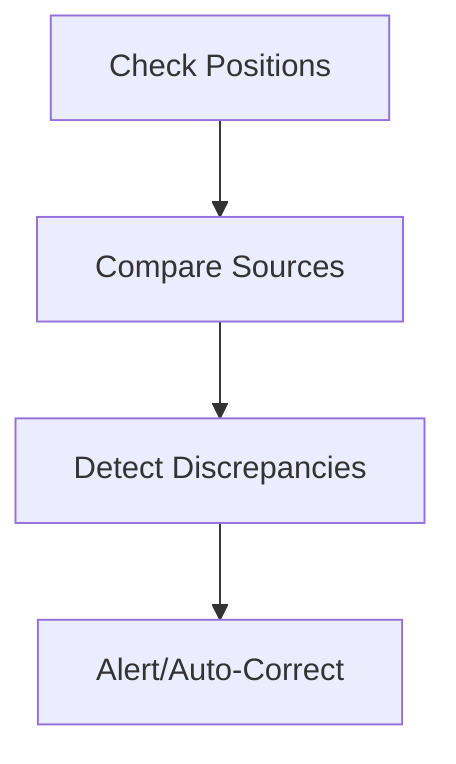

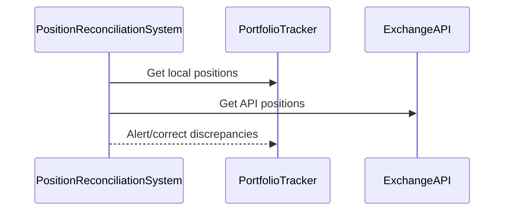

**Summary:**
- Inputs: Position data from multiple sources.
- Outputs: Discrepancy alerts, corrections, reconciliation reports.
- Dependencies: PortfolioTracker, Config, Decimal.
- Critical Path: Prevents undetected position mismatches and risk.

---

## circuit_breaker.py
**Purpose:**
Implements a comprehensive circuit breaker system to halt trading operations under abnormal or dangerous conditions (e.g., excessive volatility, drawdown, API errors, liquidity issues). Supports custom breakers, state management, and recovery logic.

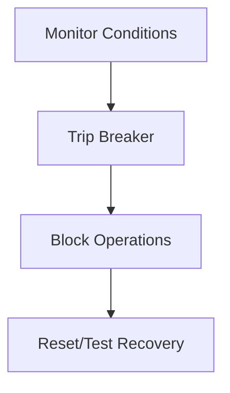

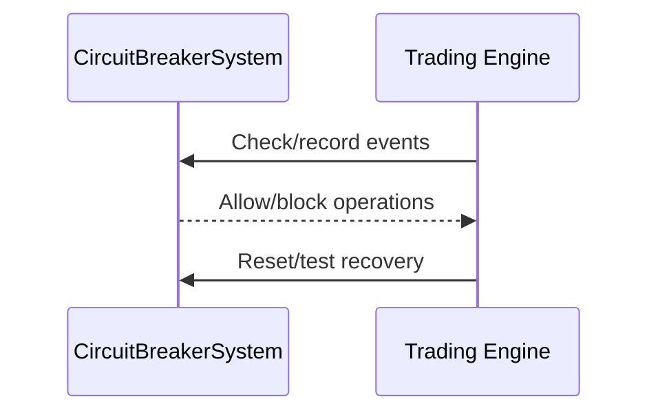

**Summary:**
- Inputs: Trading events, market data, error signals.
- Outputs: Blocked operations, alerts, breaker status.
- Dependencies: Config, logging, datetime.
- Critical Path: Essential for system safety and loss prevention.

---

## __init__.py
**Purpose:**
Initializes the validation package and exposes key classes, data models, and systems for external use.

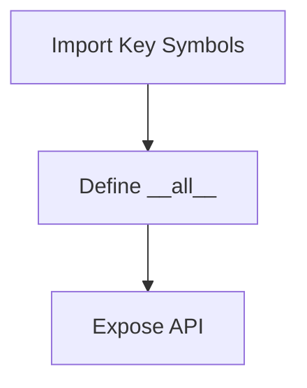

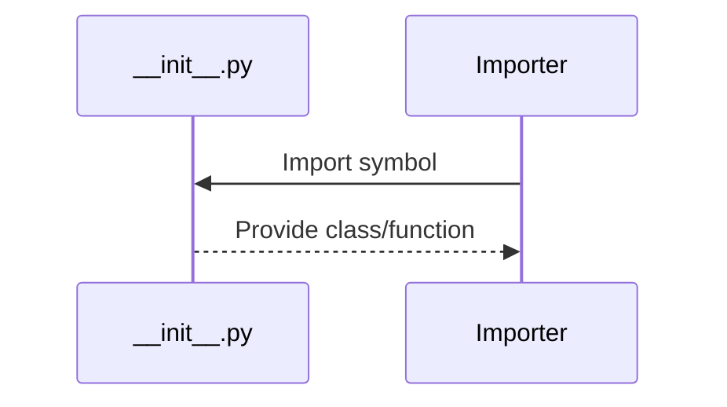

**Summary:**
- Inputs: None (package init).
- Outputs: Exposed API symbols.
- Dependencies: Internal validation modules.
- Critical Path: Not runtime critical, but important for package structure. 